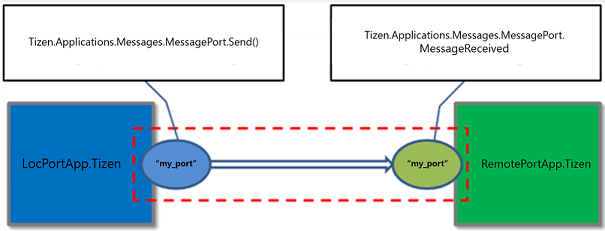

# Message Port

Tizen applications can communicate with each other using message ports. Applications can send and receive messages through message port communication. The message data type for communication is a map data which consists of a bundle (key and value pair).

The main features of the [Tizen.Applications.Messages.MessagePort](https://developer.tizen.org/dev-guide/csapi/api/Tizen.Applications.Messages.MessagePort.html) and [Tizen.Applications.Messages.RemotePort](https://developer.tizen.org/dev-guide/csapi/api/Tizen.Applications.Messages.RemotePort.html) classes include:

-   Managing a message port

    You can set up message ports to [send and receive messages](#local) between applications with the `Tizen.Applications.Messages.MessagePort` class.

    An application needs to register its own local port to receive messages from remote applications.

-   Managing a remote port

    You can verify that a remote port is running with the `Tizen.Applications.Messages.RemotePort` class and to [receive events](#remote) about the registration status of the remote port.

-   Using trusted communication

    You can [set message ports or remote ports as trusted](#trusted_use), which restricts communication through them to applications that share a signing certificate.

## Prerequisites

To enable your application to use the message port functionality:

1.  You need 2 applications to communicate with each other through the message port.
2.  To use trusted message port communication, both applications must have the same certificate. To create and register an author certificate, go to the Visual Studio menu and select **Tools &gt; Tizen &gt; Certificate Manager**. For more information, see [Certificate Manager](../../../vstools/tools/certificate-manager.md).
3.  To use the methods and properties of the [Tizen.Applications.Messages.MessagePort](https://developer.tizen.org/dev-guide/csapi/api/Tizen.Applications.Messages.MessagePort.html) and [Tizen.Applications.Messages.RemotePort](https://developer.tizen.org/dev-guide/csapi/api/Tizen.Applications.Messages.RemotePort.html) classes, include the [Tizen.Applications.Messages](https://developer.tizen.org/dev-guide/csapi/api/Tizen.Applications.Messages.html) namespace in your application:

    ```
    using Tizen.Applications.Messages;
    ```

<a name="local"></a>
## Managing a Message Port

To send a message from one application (`LocPortApp.Tizen`) to another (`RmtPortApp.Tizen`) using the [Tizen.Applications.Messages.MessagePort](https://developer.tizen.org/dev-guide/csapi/api/Tizen.Applications.Messages.MessagePort.html) class:

1.  Create a message port instance in each application.

    In the sending application (`LocPortApp.Tizen`):

    ```
    namespace LocPortApp.Tizen
    {
        class App : CoreUIApplication
        {
            private static MessagePort _remotePort;
            private string TAG;

            protected override void OnTerminate()
            {
                base.OnTerminate();
                Log.Debug(TAG, "@@@@@@@ Terminate");
            }
            protected override void OnCreate()
            {
                base.OnCreate();

                TAG = "LOCALMSGPORTAPP";

                Log.Debug(TAG, "@@@@@@@ Create");
                _remotePort = new MessagePort("my_port", false);
                Log.Debug(TAG, "@@@@@@@ MessagePort Create: " + _remotePort.PortName + "Trusted: " + _remotePort.Trusted);
            }
    }
    ```

    In the receiving application (`RmtPortApp.Tizen`):

    ```
    namespace RmtPortApp.Tizen
    {
        class App : CoreUIApplication
        {
            private static MessagePort _myPort;
            private string TAG;

            protected override void OnTerminate()
            {
                base.OnTerminate();
                Log.Debug(TAG, "@@@@@@@ Terminate");
            }
            protected override void OnCreate()
            {
                base.OnCreate();
                Initialize();

                _confirmMsg = new Bundle();
                _confirmMsg.AddItem("ConfirmMessage", "Message is received");
                TAG = "REMOTEMSGPORTAPP";

                Log.Debug(TAG, "@@@@@@@ Create");
                _myPort = new MessagePort("my_port", false);
                Log.Debug(TAG, "@@@@@@@ MessagePort Create: " + _myPort.PortName + "Trusted: " + _myPort.Trusted);
            }
    }
    ```

2.  Set up the receiving application.

    To have the receiving application listen for incoming messages, call the `Listen()` method of the `Tizen.Applications.Messages.MessagePort` class.

    To handle the received message, define and register an event handler for the `MessageReceived` event of the `Tizen.Applications.Messages.MessagePort` class.

    ```
    {
        _myPort.MessageReceived += MessageReceived_Callback;
        _myPort.Listen();
    }

    private void MessageReceived_Callback(object sender, MessageReceivedEventArgs e)
    {
        Log.Debug(TAG, "@@@@@@@ Message Received");
        Log.Debug(TAG, "@@@@@@@ App ID: " + e.Remote.AppId);
        Log.Debug(TAG, "@@@@@@@ PortName: " + e.Remote.PortName);
        Log.Debug(TAG, "@@@@@@@ Trusted: " + e.Remote.Trusted);
        Log.Debug(TAG, "@@@@@@@ message: " + e.Message.GetItem <string> ("message"));

        _remotePort.Send(_confirmMsg, "Tizen.Applications.Tests", "LocalPort");
    }
    ```

3.  In the sending application, send the message with the `Send()` method of the `Tizen.Applications.Messages.MessagePort` class, providing the message to be sent as an instance of the [Tizen.Applications.Bundle](https://developer.tizen.org/dev-guide/csapi/api/Tizen.Applications.Bundle.html) class:

    ```
    string remoteAppId = "RmtPortApp.Tizen";
    string remotePort = "my_port";

    var msg = new Bundle();
    msg.AddItem("message", "Send_A_MESSAGE_TO_A_REMOTE_APP");
    _messagePort.Send(msg, remoteAppId, remotePort);

    Log.Debug(LogTag, "send !! ");
    ```

**Figure: Message port communication**



<a name="remote"></a>
## Managing a Remote Port

By using [Tizen.Applications.Messages.RemotePort](https://developer.tizen.org/dev-guide/csapi/api/Tizen.Applications.Messages.RemotePort.html) class, an application can check whether the message port in another application is running and be notified if the state changes.

To check whether the receiving application (`RmtPortApp.Tizen`) is running and receive notifications about the registration status of the remote port:

1.  Create the remote port instance in the sending application (`LocPortApp.Tizen`):

    ```
    namespace LocPortApp.Tizen
    {
        class App : CoreUIApplication
        {
            private static RemotePort _remotePort;

            private const string PortName = "my_port";
            private const string MyRemoteAppId = "RmtPortApp.Tizen";

            private string TAG;

            protected override void OnTerminate()
            {
                base.OnTerminate();
                Log.Debug(TAG, "@@@@@@@ Terminate");
            }
            protected override void OnCreate()
            {
                base.OnCreate();

                TAG = "LOCALMSGPORTAPP";

                Log.Debug(TAG, "@@@@@@@ Create");
                _remotePort = new RemotePort(MyRemoteAppId, PortName, false);
                Log.Debug(TAG, "@@@@@@@ RemotePort Create: " + _remotePort.AppId + _remotePort.PortName + "Trusted: " + _remotePort.Trusted);
            }
        }
    }
    ```

2.  To check whether a remote port is running, use the `IsRunning` property of the `Tizen.Applications.Messages.RemotePort` instance:

    ```
    bool isRunning = false;
    isRunning = _remotePort.IsRunning();

    Log.Debug(TAG, "@@@@@@@ RmtPortApp.Tizen is running: " + isRunning);
    ```

3.  To receive events about the registration status of the remote port, register an event handler for the `RemotePortStateChanged` event of the `Tizen.Applications.Messages.RemotePort` class.

    When the `RmtPortApp.Tizen` application is registered, it triggers the event handler in the `LocPortApp.Tizen` application.

    ```
    _remotePort.RemotePortStateChanged += RemotePortStateChanged;

    static void RemotePortStateChanged(object sender, RemotePortStateChangedEventArgs e)
    {
        switch (e.Status)
        {
            case State.Registered:
                Log.Debug(LogTag, "remote port is registered");
                _flag_registered = true;
                break;
            case State.Unregistered:
                Log.Debug(LogTag, "remote port is unregistered");
                _flag_unregistered = true;
                break;
            default:
                break;
        }
    }
    ```

<a name="trusted_use"></a>
## Using Trusted Communication
You can set an instance of the [Tizen.Applications.Messages.MessagePort](https://developer.tizen.org/dev-guide/csapi/api/Tizen.Applications.Messages.MessagePort.html) or [Tizen.Applications.Messages.RemotePort](https://developer.tizen.org/dev-guide/csapi/api/Tizen.Applications.Messages.RemotePort.html) class as a trusted message port by setting its `Trusted` property as `true`. Communication is only allowed over a trusted message port if both applications are signed with a certificate that is uniquely assigned to its developer.


## Related Information
* Dependencies
  -   Tizen 4.0 and Higher
