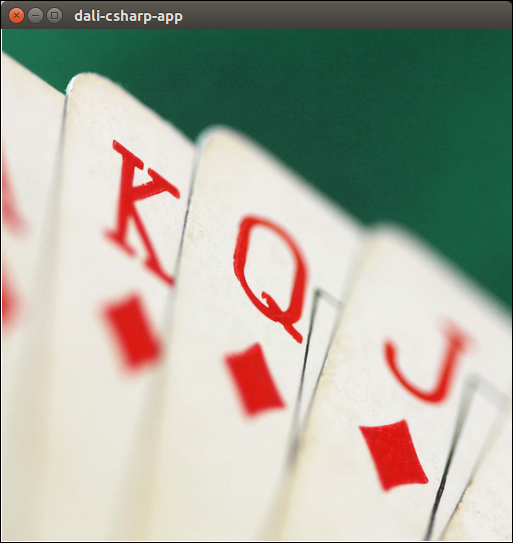

# ImageView

An `ImageView` is a NUI control that displays an image. The following figure shows an image displayed with an ImageView.

**Figure: ImageView example**



<a name="usage"></a>
## Creating an ImageView 

To create an `ImageView`:

1.  Create an `ImageView` instance with a file path:

    ```
    imageView = new ImageView(DirectoryInfo.Resource + "media/gallery-3.jpg");
    ```

    You can also create an `ImageView` instance with the `ResourceUrl` property:

    ```
    imageView = new ImageView();
    imageView.ResourceUrl = DirectoryInfo.Resource + "media/gallery-3.jpg";
    ```

2. To change the image later, use the `SetImage()` method:

    ```
    imageView.SetImage(DirectoryInfo.Resource + "media/gallery-4.jpg");
    ```
<a name="properties"></a>
## Image View Properties


The following table defines the `ImageView` control properties.

| Property             | Type        | Description                              |
| -------------------- | ----------- | ---------------------------------------- |
| `ResourceUrl`        | `string`    | Path to image file.                      |
| `ImageMap`           | `Map`       | Map of properties associated with a given image. |
| `PreMultipliedAlpha` | `bool`      | Opacity-adjusted image.<br>  **Note**   If `PreMultipliedAlpha` equals `true`, the RGB components represent the color of the object or pixel adjusted for its opacity by multiplication. If `false`, the opacity is disregarded. |
| `PixelArea`          | `Vector4`   | Subarea of the image.<br> **Note**  `PixelArea` is a relative value, with the whole image area as [0.0, 0.0, 1.0, 1.0]. The `Vector4` area values are (`x`, `y`, `width`, `height`).For example, on a 200 x 200 pixel image, the [0.25, 0.5, 0.5, 0.5] value represents a subarea of that image with the following coordinates:Top left: 50,100Top right: 150,100Bottom left: 50,200Bottom right: 150,200 |
| `Border`             | `Rectangle` | Border of the image in the order of left, right, bottom, and top. For N-Patch images only. |
| `BorderOnly`         | `bool`      | Gets/sets whether to draw only the borders. For N-Patch images only. |
| `SynchronousLoading` | `bool`      | Gets/sets whether the image is synchronous. For N-Patch images only. |


## Related Information
* Dependencies
  -   Tizen 4.0 and Higher
