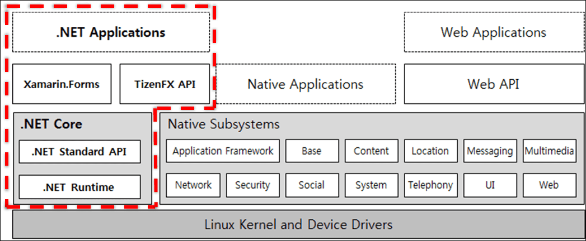

# Introduction to Tizen .NET Application

Tizen .NET is an exciting new way to develop applications for the Tizen operating system, running on 50 million Samsung devices, including TVs,
wearables, mobile phones, and many other IoT devices around the world.
The existing Tizen frameworks are either C-based with no advantages of a managed runtime, or HTML5-based with fewer features and lower performance than the C-based solution. With Tizen .NET, you can use the C\# programming language and the Common Language Infrastructure standards, and benefit from a managed runtime for faster application
development and code execution that is efficient and secure.

To start developing Tizen applications using .NET, see [Creating Your First Tizen .NET Application with Visual Studio](getting-started/first-app.md).

## Managed Runtime Advantages

A managed runtime offers the following advantages to your application development:

-   **Faster development**

    Application development is accelerated since the managed runtime handles many functions that otherwise have to be coded into the application. The Tizen Native API and Tizen Web API already provide this benefit.

- **Safer code**

    Managed runtimes can handle, for example, bound checking, type safety, garbage collection, memory protection services, and objects being invoked directly. The Tizen Web API already provides some of these benefits, but not type safety, as JavaScript is not a strongly typed language.

- **Lower deployment costs**

    Component-based architecture makes it easier and faster to deploy applications in an enterprise environment characterized by multiple platforms, devices, and legacy systems.

- **Better quality software**

    Managed runtimes free you to focus on the business logic and code specific to the application, while reducing the number of coding errors.

- **Cross-platform support**

    The managed code is portable. Tizen .NET applications can have large portions of their logic applied to other systems supported by the .NET Core and Xamarin.Forms portions of the runtime.

## Tizen .NET Features and Components

Tizen .NET enables you to build .NET applications with Xamarin.Forms and the Tizen .NET framework. Xamarin.Forms allows you to easily create a user interface, and the TizenFX API provides numerous interfaces to much of the hardware that is found in modern TV, mobile, wearable, and IoT devices.

**Figure: Tizen .NET architecture**

Tizen .NET consists of the following main components:

- **.NET Core**

    .NET Core is a general-purpose development platform maintained by Microsoft and the .NET community on [GitHub](https://github.com/dotnet/core). It is cross-platform, supporting Windows&reg;, macOS, and Linux, and can be used in device, cloud, and embedded/IoT scenarios.

    .NET Core is composed of the following parts:

    -   The [.NET runtime](https://github.com/dotnet/coreclr), which provides basic services, such as a type system, assembly loading, a garbage collector, and native interop.
    -   A set of [framework libraries](https://github.com/dotnet/corefx), which provide primitive data types, application composition types, and fundamental utilities.
    -   A [set of SDK tools](https://github.com/dotnet/cli) and [language compilers](https://github.com/dotnet/roslyn) that enable the base developer experience, available in the [.NET Core SDK](https://docs.microsoft.com/en-us/dotnet/articles/core/sdk).
    -   The dotnet application host, which is used to launch .NET Core applications. It selects and hosts the runtime, provides an assembly loading policy, and launches the application. The application host is also used to launch SDK tools similarly.

- **Xamarin.Forms as a UI framework**

    Xamarin.Forms is a cross-platform UI toolkit that allows you to efficiently create native user interface layouts that can be shared across iOS, Android&trade; Windows Phone, and Universal Windows Platform applications.

- **TizenFX API**

    Tizen .NET supports C\# APIs, which expose Tizen-specific features:

    -   **Tizen.Account** provides CRUD (Create, Read, Update, Delete) account management functionality and the OAuth Core RFC 6749 protocol.
    -   **Tizen.Applications** provides the Tizen application framework, including application state change events, inter-application messaging, and notification services.
    -   **Tizen.Common** provides predefined color names.
    -   **Tizen.Content** provides content management services, such as file and media downloading, storing and indexing audio and video content, and associating content types with helper applications.
    -   **Tizen.Location** manages geographical location services and geofencing.
    -   **Tizen.Maps** provides methods to create map-aware applications.
    -   **Tizen.Messaging** provides methods to receive push notifications.
    -   **Tizen.Multimedia** interacts with media services, including audio playback, recording, and device policy.
    -   **Tizen.Network** controls connectivity devices and retrieves network information.
    -   **Tizen.NUI** (Natural User Interface) is a toolkit for creating applications with a rich GUI. The applications can run on a range of Tizen devices.
    -   **Tizen.Security** provides access to secure storage for passwords, keys, certificates, and other sensitive data.
    -   **Tizen.Sensor** provides sensor types and sensor information.
    -   **Tizen.System** provides device-specific services, including status, system information and settings, feedback, and sensor control and access.
    -   **Tizen.Telephony** provides call, modem, network, and SIM information.
    -   **Tizen.Uix** provides methods to recognize speech, synthesize voice from text, and play synthesized sound data.
    -   **Tizen.Log** provides methods to print log messages to the Tizen logging system.
    -   **Tizen.Tracer** provides methods to write trace messages to the system trace buffer.

## Tizen .NET Release Summary

The following table describes the latest changes, additions, and fixes for Tizen .NET.

### Visual Studio Tools for Tizen 

[Learn more &gt;](../vstools/index.md)
