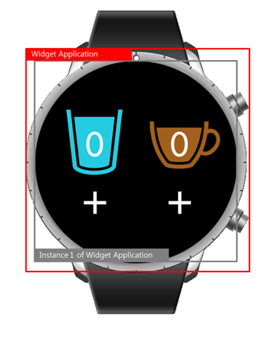
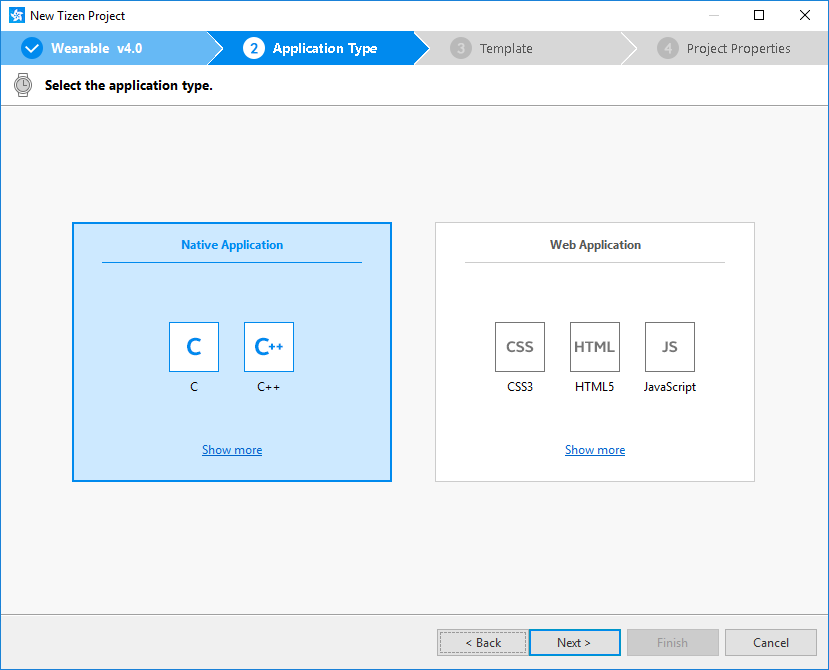
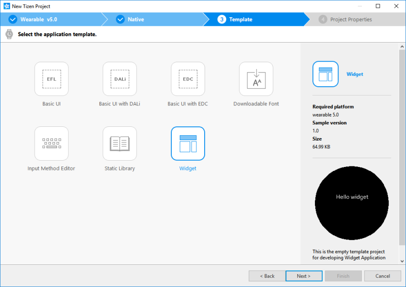
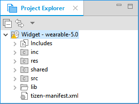
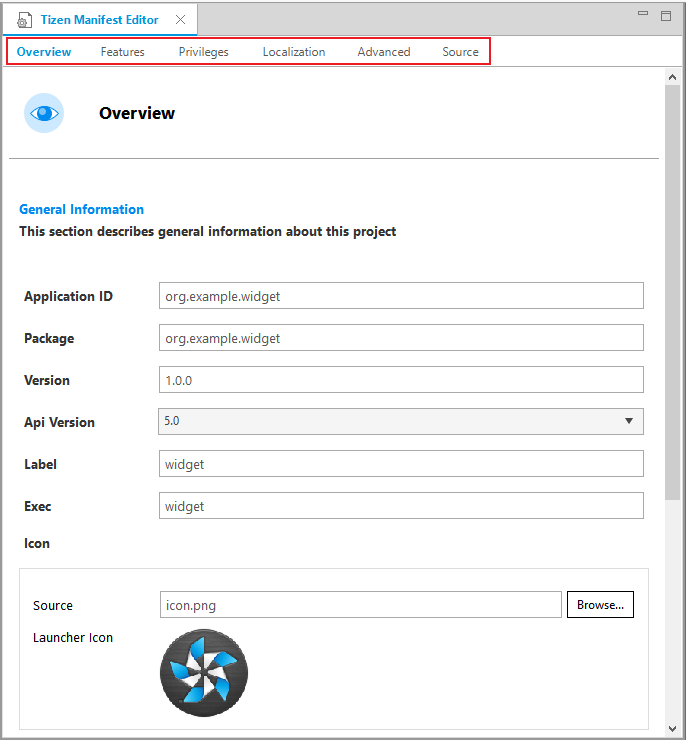
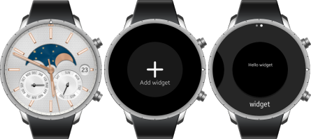
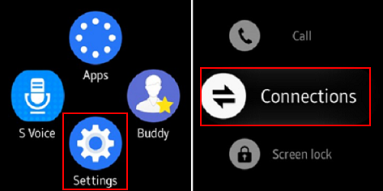
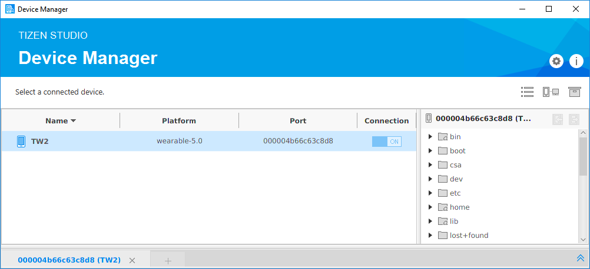
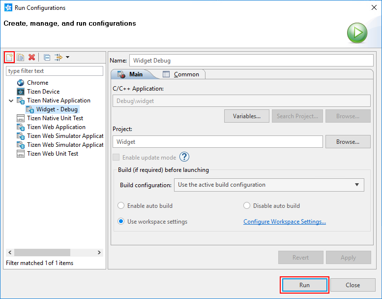
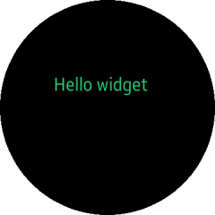

# Creating Your First Tizen Wearable Native Widget Application

**Welcome to Tizen wearable native widget application development!**

A wearable native widget application is created using the C language, and can be run on Tizen wearable devices. The application uses the native API, which provides various interfaces to the device hardware allowing you to take advantage of numerous capabilities tailored to run with limited device resources.

A widget application is one of the Tizen application types. It can be shown by specific UI applications (such as the home screen and lock screen) that can contain widget applications.

**Figure: Widget application on a wearable device**



Study the following instructions to help familiarize yourself with the Tizen [native application development process](../../tutorials/process/app-dev-process.md) as well as using the Tizen Studio and installing the created application on the emulator or target device. With the instructions, you can create and run a basic wearable native widget application, which displays some text on the screen with no user interaction:

1.  Before you get started with developing Tizen applications, download and install the [Tizen Studio](../../../tizen-studio/setup/install-sdk.md).

    For more information on the installation process, see the [installation guide](../../../tizen-studio/setup/install-sdk.md).

2.  [Create a wearable native widget project](#create) using the Tizen Studio.

    This step shows how you can use a predesigned project template that creates all the basic files and folders required for your project.

3.  [Build the application](#build).

    After you have implemented code for the features you want, this step shows how you can build the application to validate and compile the code.

4.  [Run the application](#run).

    This step shows how you can run the application on the emulator or a real target device.

5.  [Design a UI](#ui).

    This step shows how you can create the application UI and make small alterations to it to improve the usability of your application.

When you are developing a more complex application, you can take advantage of the [native tools included in the Tizen Studio](../../../tizen-studio/native-tools/index.md) to ease the tasks of creating functionality and designing the application UI.

<a name="create"></a>
## Creating a Project

The following example shows you how to create and configure a basic wearable native widget application project in the Tizen Studio. An application project contains all the files that make up an application.

> **Note**
>
> Standalone widget application packages are not allowed in the Tizen Store.
>
> For user convenience, you can use a standalone widget application for testing purposes in the Tizen Studio. If you want to publish the application in the Tizen Store, combine it with at least 1 UI application in the same package.  
> For more information, see [Developing Multiple Projects as a Combined Package](../../tutorials/process/app-dev-process.md#develop).

The following figure illustrates the application to be created. The application screen displays the **Hello widget** text and no user interaction is provided.

**Figure: Wearable native Widget application**


To create the application project:

1.  Launch the Tizen Studio.

2.  Make sure the **Native** perspective is selected in the upper-right corner of the Tizen Studio window.

    

    If not, select it. If the perspective is not visible, in the Tizen Studio menu, select **Window &gt; Perspective &gt; Open Perspective &gt; Other &gt; Native**, and click **OK**.

3.  In the Tizen Studio menu, select **File &gt; New &gt; Tizen Project**.

    

    The Project Wizard opens.

4.  In the Project Wizard, define the project details.

    The Project Wizard is used to create the basic application skeleton with the required folder structure and mandatory files. You can easily create different applications by selecting an applicable template or sample for the Project Wizard to use.

    1.  Select the **Template** project type and click **Next**.

        

    2.  Select the profile (**Wearable**) and version from a drop-down list and click **Next**.

        The version depends on the platform version you have installed and with which you are developing the application.

        

    3.  Select the **Native Application** application type and click **Next**.

        

    4.  Select the **Widget** template and click **Next**.

        

    5.  Define the project properties and click **Finish**.

        You can enter the project name (3-50 characters) and the unique package ID. You can also select the location and working sets by clicking **More properties**.

        

        The Project Wizard sets up the project, creates the application files using the default content from the template, and closes. For more information on the Project Wizard and the available templates, see [Creating Tizen Projects with Tizen Project Wizard](../../../tizen-studio/native-tools/project-wizard.md).

You can see the created project in the **Project Explorer** view. The most important files and folders include:

-   `inc`: Default folder for included source files

-   `res`: Folder for resource files used by the application only

-   `shared`: Folder for resource files to be shared with other applications

-   `src`: Folder for source code files

-   `lib`: Folder for external library files

-   `tizen-manifest.xml`: Manifest file used by the platform to install and launch the application

**Figure: Application in the Project Explorer**



> **Note**
>
> You can [view and modify the application configuration](#configuration) in the manifest editor. In this example, no configuration changes are required.

Your application project is now ready for further actions. Next, build the application.

<a name="configuration"></a>
### Managing the Application Configuration

To view and modify the application configuration:

1.  In the **Project Explorer** view, double-click the `tizen-manifest.xml` file of the application. The Tizen Studio opens the file in the manifest editor.

2.  In the manifest editor, view and modify the configuration details using the various tabs:

    

    -   **Overview**: Define general information, such as the package, label, and icon of the application.

    -   **Features**: Define required software and hardware features. This information is used for application filtering in the Tizen Store.

    -   **Privileges**: Define the security-sensitive APIs or API groups accessed and used by the application.

    -   **Localization**: Define localized values for the application label, description, and icon.

    -   **Advanced**: Define advanced features, such as application metadata, [widget](../../../tizen-studio/native-tools/manifest-text-editor.md#widget_app) (preview image and supported size), and miscellaneous options.

    -   **Source**: View and edit the source code of the `tizen-manifest.xml` file. Changes made and saved on the other tabs are reflected in the source code and vice versa.

       > **Note**
       >
	   > The `tizen-manifest.xml` file must conform to both the XML file format and the Tizen native application specification requirements. Editing the file in the **Source** tab is intended for advanced users only.

3.  To save any changes, in the Tizen Studio menu, select **File &gt; Save All**.

For more information on configuring the application, see [Setting the Application Manifest](../../tutorials/process/setting-properties.md#manifest).

### Understanding the Source Code

Pay attention to the following main issues in the application source code (in the `inc/widget.h` and `src/widget.c` files), to understand how the application is designed and how it works. For source code details related to the UI, see [Designing a Simple UI](#ui).

-   The widget application is initialized to use the functions and data types of the [Widget Application](../../api/wearable/latest/group__CAPI__WIDGET__APP__MODULE.html) API by including the `<widget_app.h>` header file in your application:

    ```
    #include <widget_app.h>
    ```

    All header files that you need are already included in the `widget.h` file, which is generated by the Tizen Studio when the template project is created.

-   The widget application life-cycle callbacks manage specific parts of the application life-cycle. They are set in the [widget\_app\_lifecycle\_callback\_s](../../api/wearable/latest/structwidget__app__lifecycle__callback__s.html) structure, and the structure is passed to the `widget_app_main()` function of the Widget Application API to start the widget application event loop:

    ```
    int
    main(int argc, char *argv[])
    {
        widget_app_lifecycle_callback_s ops = {0,};
        int ret;

        ops.create = widget_app_create;
        ops.terminate = widget_app_terminate;

        ret = widget_app_main(argc, argv, &ops, NULL);
        if (ret != WIDGET_ERROR_NONE)
            dlog_print(DLOG_ERROR, LOG_TAG, "widget_app_main() failed. Err = %d", ret);

        return ret;
    }
    ```

    -   The `create` event is triggered before the application main loop starts. In this callback, you can initialize any resources that can be shared among widget instances. Register the widget instance callback functions, and create a widget instance class and return a handle for it, so that the handle can be used for making widget instances.

        ```
        static widget_class_h
        widget_app_create(void *user_data)
        {
            /* Hook to take necessary actions before the main event loop starts */
            widget_instance_lifecycle_callback_s ops = {NULL,};

            return widget_app_class_create(ops, user_data);
        }
        ```

    -   The `terminate` event is triggered before the application ends. When you no longer need the widget application, use it to release the resources and terminate the application.

        ```
        static void
        widget_app_terminate(void *user_data)
        {
            /* Release all resources */
        }
        ```

-   The widget application provides a life-cycle and functions for making and managing a widget class. The application has one process, whose responsibility it is to make a class in the `widget_app_create()` callback function of the Widget Application API. With this class, the framework can make instances whenever applications for widget viewers (such as home screen or lock screen) request for a widget instance.

    The widget instance has its own life-cycle, which is similar to the widget application. However, the widget instance is simply an object that is shown by the applications for widget viewers. Many widget instances can be running on the same widget application process.

    To manage the widget instance life-cycle, add the relevant callbacks to the `widget_instance_lifecycle_callback_s` structure during the widget application initialization:

    ```
    static widget_class_h
    widget_app_create(void *user_data)
    {
        widget_instance_lifecycle_callback_s ops = {
            .create = widget_instance_create,
            .destroy = widget_instance_destroy,
            .pause = widget_instance_pause,
            .resume = widget_instance_resume,
            .update = widget_instance_update,
            .resize = widget_instance_resize,
        };

        return widget_app_class_create(ops, user_data);
    }
    ```

    -   The `create` callback is triggered when the widget instance is created. You can use the callback to initialize resources for the widget instance and [draw the UI](../../guides/app-management/ui-app/widget-app.md#get_window). If the bundle content is not `NULL`, restore the previous status.

        ```
        static int
        widget_instance_create(widget_context_h context, bundle *content,
                               int w, int h, void *user_data)
        {
            widget_instance_data_s *wid = (widget_instance_data_s*)
                                          malloc(sizeof(widget_instance_data_s));
            int ret;

            if (content != NULL)
                /* Recover the previous status with the bundle object */

            /* Create the UI */

            return WIDGET_ERROR_NONE;
        }
        ```

    -   The `destroy` callback is triggered when the widget instance is destroyed. You can use the callback to release all widget resources. If the `reason` for the termination is not [WIDGET\_APP\_DESTROY\_TYPE\_PERMANENT](../../api/wearable/latest/group__CAPI__WIDGET__APP__MODULE.html#ga50c912e59019e4e719851bae110baa02), store the current status with the incoming bundle.

        ```
        static int
        widget_instance_destroy(widget_context_h context, widget_app_destroy_type_e reason,
                                bundle *content, void *user_data)
        {
            if (reason != WIDGET_APP_DESTROY_TYPE_PERMANENT)
                /* Save the current status at the bundle object */

            return WIDGET_ERROR_NONE;
        }
        ```

    -   The `pause` callback is triggered when the widget instance is paused. You can use the callback to take the necessary actions when the widget instance becomes invisible. The framework can destroy a paused widget instance.

        ```
        static int
        widget_instance_pause(widget_context_h context, void *user_data)
        {
            return WIDGET_ERROR_NONE;
        }
        ```

    -   The `resume` callback is triggered when the widget instance is resumed. You can use the callback to take the necessary actions when the widget instance becomes visible.

        ```
        static int
        widget_instance_resume(widget_context_h context, void *user_data)
        {
            return WIDGET_ERROR_NONE;
        }
        ```

    -   The `update` callback is triggered when a widget update event is received. You can use the callback to take the necessary actions for the widget update. If the `force` parameter is `true`, the widget can be updated even in the pause state.

        ```
        static int
        widget_instance_update(widget_context_h context, bundle *content, int force, void *user_data)
        {
            return WIDGET_ERROR_NONE;
        }
        ```

-   Widget instances can have private data. The data usually includes view objects to make a screen for each widget instance. The framework provides an easy way to find private data from the widget context handle, which is provided as a parameter in the callback functions. The following example shows how to make private data and use it:
    1.  You can define a private data structure and attach it to the widget instance by calling the `widget_app_context_set_tag()` function of the Widget Application API:

        ```
        struct widget_instance_data {
            Evas_Object *win;
            Evas_Object *conform;
            Evas_Object *label;
        };
        typedef struct widget_instance_data widget_instance_data_s;

        static int
        widget_instance_create(widget_context_h context, bundle *content,
                               int w, int h, void *user_data)
        {
            widget_instance_data_s *wid = (widget_instance_data_s*)
                                          malloc(sizeof(widget_instance_data_s));

            ret = widget_app_get_elm_win(context, &wid->win);

            wid->label = elm_label_add(wid->conform);

            widget_app_context_set_tag(context, wid);
        }
        ```

    2.  You can get the private data from the widget instance by calling the `widget_app_context_get_tag()` function of the Widget Application API.

        The following code within the `widget_instance_update()` callback is not included in the default application template in the Tizen Studio, but you can add it to test the data handling feature.

        ```
        static int
        widget_instance_update(widget_context_h context, bundle *content,
                               int force, void *user_data)
        {
            widget_instance_data_s *wid = NULL;
            widget_app_context_get_tag(context, (void**)&wid);
            if (wid->label)
                elm_object_text_set(wid->label, "Update Widget");

            return WIDGET_ERROR_NONE;
        }
        ```

    3.  If you use private data, make sure that all the resources that you allocate are freed in the callback function for the widget instance destructor:

        ```
        static int
        widget_instance_destroy(widget_context_h context,
                                widget_app_destroy_type_e reason, bundle *content, void *user_data)
        {
            widget_instance_data_s *wid = NULL;
            widget_app_context_get_tag(context, (void**)&wid);

            if (wid->win)
                evas_object_del(wid->win);

            free(wid);

            return WIDGET_ERROR_NONE;
        }
        ```

<a name="build"></a>
## Building Your Application

After you have created the application project, you can implement the required features. In this example, only the default features from the project template are used, and no code changes are required.

When your application code is ready, you must build the application. The building process performs a validation check and compiles your files.

You can build the application in the following ways:

-   **Automatically**

    The automatic build means that the Tizen Studio automatically rebuilds the application whenever you change a source or resource file and save the application project.

    To use the automatic build:

    1.  Select the project in the **Project Explorer** view.
    2.  In the Tizen Studio menu, select **Project &gt; Build Automatically**.

        

        A check mark appears next to the menu option.

    You can toggle the automatic build on and off by reselecting **Project &gt; Build Automatically**.

-   **Manually**

    The manual build means that you determine yourself when the application is built.

    To manually build the application, right-click the project in the **Project Explorer** view and select **Build Project**.

    **Figure: Manually building the application**

    

    Alternatively, you can also select the project in the **Project Explorer** view and do one of the following:

    -   In the Tizen Studio menu, select **Project &gt; Build Project**.
    -   Press the **F10** key.

You can have more than one build configuration. To see the current active configuration or change it, right-click the project in the **Project Explorer** view and select **Build Configurations &gt; Set Active**. The default configuration is `Debug`. For more information, see [Building Applications](../../tutorials/process/building-app.md).

After you have built the application, run it.

<a name="run"></a>
## Running Your Application

You can run the application on the emulator or a real target device.

<a name="emulator"></a>
### Running on the Emulator

To run the application on the emulator:

1.  Launch an emulator instance in the [Emulator Manager](../../../tizen-studio/common-tools/emulator-manager.md):
    1.  In the Tizen Studio menu, select **Tools &gt; Emulator Manager**.

        

    2.  In the Emulator Manager, select a wearable emulator from the list and click **Launch**.

        If no applicable emulator instance exists, [create a new one](../../../tizen-studio/common-tools/emulator-manager.md#create).

        

        The emulator is launched in its own window. You can also see the new emulator instance and its folder structure in the **Device Manager**.

        

2.  Generate a security profile.

    Before you run the application, you must [sign your application package with a certificate profile](../../../tizen-studio/common-tools/certificate-registration.md) in the Tizen Studio.

3.  Run the application:
    1.  In the **Project Explorer** view, right-click the project and select **Run As &gt; Tizen Native Application**.

        

        Alternatively, you can also select the project in the **Project Explorer** view and do one of the following:

        -   Press the **Ctrl + F11** key.
        -   Click the run icon in the toolbar.

        If you have created multiple emulator instances, select the instance you want from the combo box in the toolbar before selecting to run the application. If you select an offline emulator, it is automatically launched when you select to run the application.

        

    2.  Confirm that the application launches on the emulator.

        

        > **Note**
        >
		> If the emulator display has switched off, you cannot see the application launch. To switch the display on, click the **Power** key (in the lower-right corner of the emulator).

        The above screen is shown through the Viewer, to allow you to develop a lone widget application for testing purposes.

        To see the widget running on the home screen, add the widget there:

        1.  Press the **Back** key (in the upper-right corner of the emulator device) to return to the home screen (showing a watch face).
        2.  Swipe the home screen right until you see **+ Add widget**. Select it.
        3.  Swipe right until you see your widget application. Select it.

        

        You can see the added widget on the home screen. To access the widget from the home screen, swipe right.

        

        While the application is running, the **Log** view in the Tizen Studio shows the log, debug, and exception messages from the methods defined in the log macros. To see the view, in the Tizen Studio menu, go to **Window &gt; Show View &gt; Log**.

For more information on using the emulator features, see [Using Emulator Control Keys, Menu, and Panel](../../../tizen-studio/common-tools/emulator-control-panel.md) and [Using Extended Emulator Features](../../../tizen-studio/common-tools/emulator-features.md).

<a name="target"></a>
### Running on a Target Device

To run the application on a target device:

1.  Connect the wearable target device to your computer:
    1.  Define settings on the device:
        -   Go to **Settings &gt; Connections**, and switch on Bluetooth.

            

            

        -   Go to **Settings &gt; Connections**, and switch on Wi-Fi.

            The device and the computer must be connected to the same Wi-Fi network.

            Note the IP address the device is using.

            

        -   Go to **Settings &gt; Gear info**, and switch on the debugging mode.

            

    2.  In the terminal, enter the following commands:

        ```
        cd tizen-sdk/tools
        ./sdb connect <IP address of Gear S2>
        ```

        Use the IP address you noted before.

        Instead of the terminal, you can also use the [Remote Device Manager](../wearable/first-app.md#remote_device) for the connection.

    3.  In the first attempt, the connection fails and the device asks for user confirmation. To allow Gear to read log data, copy files to and from your computer, and install the application manually, click the accept mark.

        

    4.  In the **Device Manager**, confirm that the device is connected (shown in the device list).

        

2.  Generate an author certificate.

    Before you run the application, you must [sign your application package with a certificate profile](../../../tizen-studio/common-tools/certificate-registration.md) in the Tizen Studio.

3.  Run the application:
    1.  In the **Device Manager**, select the device.
    2.  In **Project Explorer** view, right-click the project and select **Run As &gt; Tizen Native Application**.

        

        Alternatively, you can also select the project in the **Project Explorer** view and do one of the following:

        -   Press the **Ctrl + F11** key.
        -   Click the run icon in the toolbar.

        If you have both a connected device and existing emulator instances, select the device from the combo box in the toolbar before selecting to run the application.

        

    3.  Confirm that the application launches on the target device.

        Like with the [emulator](#viewer), you can add the widget to the home screen to easily access it.

    > **Note**
    >
    > The application is launched using the default debug run configuration. To create and use another configuration:
    > 1.  In the `Project Explorer` view, right-click the project and select `Run As > Run Configurations`.
    > 2.  In the `Run Configurations` window, click the `New Launch Configuration` icon (), define the configuration details, and launch the application by clicking `Run`.
    > 

<a name="ui"></a>
## Designing a Simple UI

The wearable widget application created with the **Widget** template has a simple user interface with a label component showing the **Hello widget** text. The UI is created using [EFL](../../guides/ui/efl/index.md).

**Figure: User interface in the Widget template**


### Creating the Basic UI

The UI in the **Widget** template contains the following components:

-   The EFL UI always contains a window component, which is the root component of the entire UI.
-   The application uses the conformant component as a container for other UI components.
-   The label showing the **Hello widget** text is implemented with a label component.

The UI is created in the `widget.c` file:

1.  Data structure

    A pointer to the UI components is stored in the `widget_instance_data_s` data structure:

    ```
    #include <widget_app_efl.h>

    struct widget_instance_data {
        /* Window */
        Evas_Object *win;
        /* Conformant */
        Evas_Object *conform;
        /* Label */
        Evas_Object *label;
    };
    typedef struct widget_instance_data widget_instance_data_s;
    ```

2.  UI creation

    The `widget_app_create()` life-cycle callback is called when the application main loop starts. It registers the `widget_instance_create()` callback, which creates the UI when the widget instance starts.

    ```
    static widget_class_h
    widget_app_create(void *user_data)
    {
        /* Register system event handlers */

        widget_instance_lifecycle_callback_s ops =
        {
            .create = widget_instance_create,
            .destroy = widget_instance_destroy,
            .pause = widget_instance_pause,
            .resume = widget_instance_resume,
            .update = widget_instance_update,
        };

        return widget_app_class_create(ops, user_data);
    }
    ```

3.  UI components
    1.  The `widget_instance_create()` function creates the UI components: window, conformant, and label.

        The function defines a pointer to fill in the `widget_instance_data_s` structure.

        ```
        static int
        widget_instance_create(widget_context_h context, bundle *content,
                               int w, int h, void *user_data)
        {
            widget_instance_data_s *wid = (widget_instance_data_s*)
                                          malloc(sizeof(widget_instance_data_s));

            int ret;
            if (content != NULL)
                /* Recover the previous status with the bundle object */
        ```

    2.  The window object for the widget is retrieved with the `widget_app_get_elm_win()` function of the [Widget Application](../../api/wearable/latest/group__CAPI__WIDGET__APP__MODULE.html) API to create the UI on the home screen.

        The `evas_object_resize()` function is used to resize the window to fit the screen.

        ```
            /* Window */
            ret = widget_app_get_elm_win(context, &wid->win);
            if (ret != WIDGET_ERROR_NONE) {
                dlog_print(DLOG_ERROR, LOG_TAG, "failed to get window. err = %d", ret);

                return WIDGET_ERROR_FAULT;
            }

            evas_object_resize(wid->win, w, h);
        ```

    3.  The conformant component is used as a container for the other UI components:

        -   The component is the first object added inside the window with the `elm_conformant_add()` function.
        -   The conformant component is set as a resize object of the window by using the `elm_win_resize_object_add()` function. It means that the conformant size and position are controlled by the window component directly.
        -   The `evas_object_show()` function makes the conformant component visible.

        ```
            /* Conformant */
            wid->conform = elm_conformant_add(wid->win);
            evas_object_size_hint_weight_set(wid->conform, EVAS_HINT_EXPAND,
                                             EVAS_HINT_EXPAND);
            elm_win_resize_object_add(wid->win, wid->conform);
            evas_object_show(wid->conform);
        ```

    4.  The label component for the text is added with the `elm_label_add()` function. The label is added inside the conformant component, which is the label's parent.

        The label is resized and moved, and its text is set with the `elm_object_text_set()` function.

        ```
            /* Label */
            wid->label = elm_label_add(wid->conform);
            evas_object_resize(wid->label, w, h / 3);
            evas_object_move(wid->label, w / 4, h / 3);
            evas_object_show(wid->label);
            elm_object_text_set(wid->label, "<align=center>Hello widget</align>");
        ```

    5.  When all the UI components are ready, the `evas_object_show()` function makes the window component visible. This means that the window displays everything on the screen at once.

        ```
            /* Show the window after the base GUI is set up */
            evas_object_show(wid->win);

            widget_app_context_set_tag(context, wid);

            return WIDGET_ERROR_NONE;
        }
        ```

### Modifying Existing Components

When the basic UI exists, you can easily modify the components in the UI by using the component-specific functions, or more general Evas object functions.

For example, the following modification to the label component changes the text color to green:

```
/* Label */
wid->label = elm_label_add(wid->conform);
evas_object_resize(wid->label, w, h / 3);
evas_object_move(wid->label, w / 4, h / 3);
evas_object_color_set(wid->label, 50, 255, 150, 255);
evas_object_show(wid->label);
elm_object_text_set(wid->label, "<align=center>Hello widget</align>");
```

**Figure: Modified label component**


