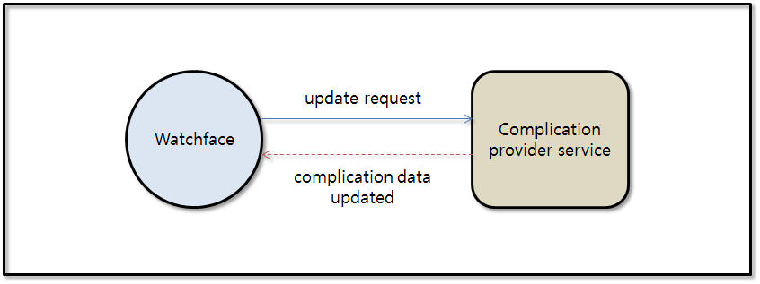
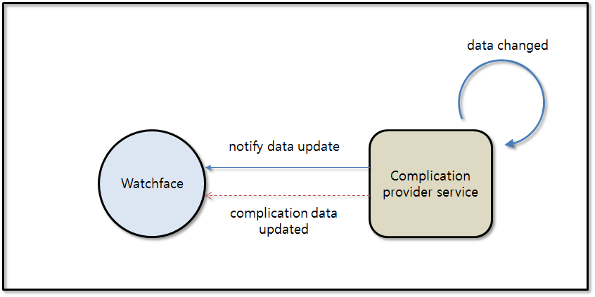
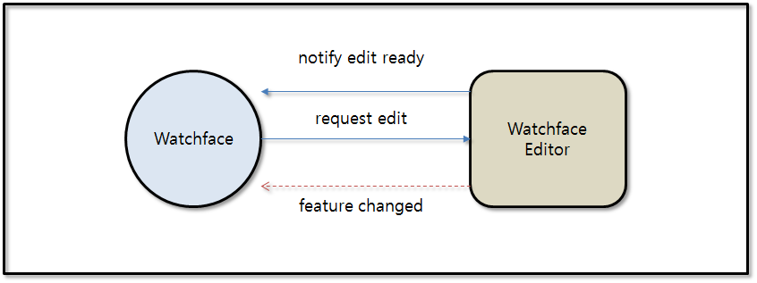

# Watchface Complication

Watchface complications are UI components on a watchface which shows specific information in addition to displaying current time.
The Complications show key information from an app in an economical way. Users can tap complications to open the corresponding app and see more detailed information. 

The complication data is provided from the Complication Providers. 
The complication provider provides only data, and the watchface app decides how to display the complications using that data.
The watchface can select the complication and request to update the complication to the complication provider app.

There are two ways to update the complication data.
1. Watchface can request to update complication data to complication provider app. Complication provider app receives the request 
and update the complication data. Then the update callback is called in watchface.


 

2. If the complication data is changed, complication provider app can notify to the watchface.
The update request comes to the complication provider after notify the update. Complication provider should be set the updated data in 
update requested callback.
After the complication data is updated, complication update callback is called in the watchface.


 

# The Types of Watchface Complication

Complication support type is the types of data that can be provided from complication provider.
Complication Provider have to support at least one type and one Complication provider can support multiple types.
Watchface can set the complication support types to support specific type of complications.


| Support type name | Mandatory data | Optional data   |
|-------------------|----------------|-----------------|
| short text type   | short text     | title           |
|                   |                | icon path       |
|                   |                | extra data      |
| long text type    | long text      | title           |
|                   |                | icon path       |
|                   |                | extra data      |
| ranged value type | min value      | title           |
|                   | max value      | short text      |
|                   | current value  | icon path       |
|                   |                | extra data      |
| image type        | image path     | extra data      |
| icon type         | icon path      | extra data      |
| time type         | timestamp      | short text      |
|                   |                | extra data      |
| empty             |                |                 |

 
# Prerequisites

1. To use the Watchface Complication API, the application has to request permission by adding the following privilege to the tizen-manifest.xml file.

```xml
<privileges>
	<privilege>http://tizen.org/privilege/datasharing</privilege>
	<privilege>http://tizen.org/privilege/appmanager.launch</privilege>
</privileges>
```
 
2. To use the functions and data types for the Watchface Complication API, include the <watchface-complication.h>.

```cpp
#include <watchface-complication.h>
```

 
# Creating the Watchface Complication

Watchface have to make the complication handle to add the default complication.
User chooses the support types of complication that can be selected in the position of complication.
And also chooses the touch event type that can be supported.


```cpp
{
	int ret;
	int comp_id = 1;
	complication_h complication;
 
	ret = watchface_complication_create(comp_id, "org.tizen.sample",
			WATCHFACE_COMPLICATION_TYPE_SHORT_TEXT,
			WATCHFACE_COMPLICATION_TYPE_SHORT_TEXT|WATCHFACE_COMPLICATION_TYPE_ICON,
			WATCHFACE_COMPLICATION_EVENT_TAP, &complication);
}
```

The default provider id and type are the items to set for initial display. They should not be null as the default provider.
If they are null, the complication receives an error. If user selects the other provider and type, they are no longer used.
 
  
# Updating the Complication Data

To receive the updated complication data, watchface_complication_updated_cb() should be added in the watchface by using
watchface_complication_add_updated_cb() function. And If complication provider is not avaliable(disabled, uninstalled),
watchface_complication_error_cb() is called. In this case, watchface can add fallback logic in error callback like
display error message or launch editor interface.

```cpp
void _watchface_complication_updated_cb(int complication_id,
		const char *provider_id,
		watchface_complication_type_e type,
		const bundle *data, void *user_data)
{
}

void _watchface_complication_error_cb)(
		int complication_id,
		const char *provider_id,
		watchface_complication_type_e type,
		watchface_complication_error_e error,
		void *user_data)
{
}

static void _init_complication()
{
	watchface_complication_add_updated_cb(complication,
		_watchface_complication_updated_cb,
		_watchface_complication_error_cb,  NULL);
} 
```
 
When the complication provider data is updated, watchface_complication_updated_cb() is called. 
Watchface can get the information from the bundle parameter of callback by using watchface_complication_data_get_* functions.
To get the complication provider data, following functions can be used.


| Function name | Data type |
|---------------|-----------|
| watchface_complication_data_get_type() | watchface complication type |
| watchface_complication_data_get_short_text() | short text |
| watchface_complication_data_get_long_text() | long text |
| watchface_complication_data_get_title() | title text |
| watchface_complication_data_get_timestamp() | timestamp |
| watchface_complication_data_get_image_path() | image path |
| watchface_complication_data_get_ranged_value() | min / max / current value |
| watchface_complication_data_get_icon_path() | icon path |
| watchface_complication_data_get_extra_data() | extra data |

```cpp
void _watchface_complication_updated_cb(int complication_id,
		const char *provider_id,
		watchface_complication_type_e type,
		const bundle *data, void *user_data)
{
	char *shorttext;
	if (type == WATCHFACE_COMPLICATION_TYPE_SHORT_TEXT)
		watchface_complication_data_get_short_text(data, &shorttext);
}
```


If the callback is not used any more, it should be be removed by using watchface_complication_remove_updated_cb function.

```cpp
{
	watchface_complication_remove_updated_cb(complication,
		_watchface_complication_updated_cb);
}
```


If the watchface want to get the updated complication data, watchface can request to update the data to the complication provider. 

```cpp
{
	watchface_complication_send_update_request(complication);
}
```


# Specify to support only specific complication providers

Watchface can support the specific complication provider by using allowed_list.
In This case, watchface supports complications only in allowed complication list.

```cpp
{
	complication_allowed_list_h allowed_list;

	watchface_complication_allowed_list_create(&allowed_list); 
	watchface_complication_allowed_list_add(allowed_list, "PROVIDER_ID_1", 
			WATCHFACE_COMPLICATION_TYPE_SHORT_TEXT); 
	watchface_complication_allowed_list_add(allowed_list, "PROVIDER_ID_2", 
			WATCHFACE_COMPLICATION_TYPE_SHORT_TEXT); 
	watchface_complication_allowed_list_apply(complication, allowed_list);

	watchface_complication_allowed_list_destroy(allowed_list);
}
```
 
 

# Watchface Edit with Editable feature

The watchface application can provide the changeable features(compliation, color, font..) with watchface editable APIs.
The features can be changed by watchface editor application.





To use the functions and data types for the watchface_editable API, include the <watchface-editable.h>.

```cpp
#include <watchface-editable.h>
```
 
1. When the editor is ready to edit, it notifies the edit ready. To receive the notification from the editor, watchface_editable_edit_ready_cb() should
be added.

```cpp
void _watchface_editable_edit_ready_cb(watchface_editable_container_h handle,
		const char *editor_appid,
		void *user_data)
{
}

{
	watchface_editable_add_edit_ready_cb(_watchface_editable_edit_ready_cb, NULL);
}
```
 
2. Watchface can make the complication_candidates_list_h to identify the editable features to request to editor.
Watchface can request to edit the features by using watchface_editable_request_edit().

3. The watchface editor can draw highlight to give the information what is editing.
To inform the position of editable features, watchface_editable_highlight_h should be used.
The highlight handle can be created by watchface_editable_hilight_create() function with watchface shape type.

There are following shape types.

| Shape types | Description |
|-------------|-------------|
| WATCHFACE_EDITABLE_SHAPE_TYPE_CIRCLE | circle |
| WATCHFACE_EDITABLE_SHAPE_TYPE_RECT | rectangle |


The position of editable feature can be set by using watchface_editable_highlight_set_geometry().
The parameters of this function mean the position(x,y) and size(width, height).


> **Note**
>
> watchface_editable_highlight_h must be released after used by using watchface_editable_highlight_destroy().


4. According to the editable feature, watchface_editable_add_design_element() and watchface_editable_add_complication()
 are used to add editable features to the watchface_editable_container_h.


```cpp
static void _watchface_editable_edit_ready_cb(watchface_editable_container_h handle,
		const char *editor_appid, void *user_data)
{
	bundle *candidate1;
	bundle *candidate2;
	complication_h comp;
	watchface_editable_highlight_h hi;
	complication_candidates_list_h candidates_list = NULL;
 
	watchface_editable_candidates_list_create(&candidates_list);
 
	candidate1 = bundle_create();
	bundle_add_str(candidate1, "TEST_COLOR", "RED");
	watchface_editable_candidates_list_add(candidates_list, candidate1);
	bundle_free(candidate1);
 
	candidate2 = bundle_create();
	bundle_add_str(candidate2, "TEST_COLOR", "YELLOW");
	watchface_editable_candidates_list_add(candidates_list, candidate2);
	bundle_free(candidate2);
 
	watchface_editable_highlight_create(&hi, WATCHFACE_EDITABLE_SHAPE_TYPE_CIRCLE);
	watchface_editable_highlight_set_geometry(hi, 50, 50, 100, 100);
	watchface_editable_add_design_element(handle, COLOR_EDIT, cur_idx, candidates_list, hi, "Color");
	watchface_editable_highlight_destroy(hi);
 
	watchface_editable_candidates_list_destroy(list_handle);
 
	watchface_editable_highlight_create(&hi, WATCHFACE_EDITABLE_SHAPE_TYPE_CIRCLE);
        watchface_editable_highlight_set_geometry(hi, 100, 100, 100, 100);
	watchface_editable_add_complication(handle, comp_id, comp, hi);
	watchface_editable_highlight_destroy(hi);
 
	watchface_editable_request_edit(handle, _watchface_editable_update_requested_cb, user_data);
}
```

5. If some features are changed from editor, watchface_editable_update_requested_cb() is called.
Watchface can check the watchface_editable_edit_state_e from the parameter of that callback to get the edit state.

There are following edit state.

| Edit state | Description |
|------------|-------------|
| WATCHFACE_EDITABLE_EDIT_STATE_COMPLETE | edit complete |
| WATCHFACE_EDITABLE_EDIT_STATE_ONGOING | ongoing edit |
| WATCHFACE_EDITABLE_EDIT_STATE_CANCEL | edit canceled |

```cpp
static void _watchface_editable_update_requested_cb(const watchface_editable_h handle,
		int selected_idx,
		const watchface_editable_edit_state_e state,
		void *user_data)
{
	bundle *data;
	int ed_id;

	watchface_editable_get_current_data(handle, &data);
	watchface_editable_get_editable_id(handle, &ed_id);

}
```


# Transfers Touch Event

Complication can provide additional action for touching when the complication is touched.
To trigger the complication touch action,  watchface should transfer the touch event to complication provider when the
complication is touched.

There are following event types.

| Event type | Description |
|------------|-------------|
| WATCHFACE_COMPLICATION_EVENT_NONE | Not tapped |
| WATCHFACE_COMPLICATION_EVENT_TAP | Tap event |
| WATCHFACE_COMPLICATION_EVENT_DOUBLE_TAP | Double tap event |

Watchface transfers by using watchface_complication_transfer_event().

```cpp
void _on_complication_clicked(complication_h handle)
{
	watchface_complication_transfer_event(handle, WATCHFACE_COMPLICATION_EVENT_TAP);
}
```
