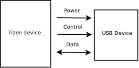
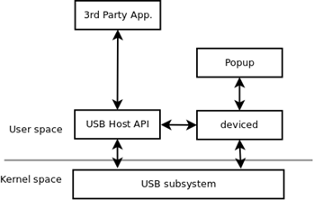
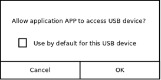

# USB Host


You can use the USB host functionality to learn about connected USB devices and communicate with them on the USB protocol layer.

This feature is supported in mobile applications only.

**Figure: USB host mode overview**



The main features of the USB Host API include:

- Initializing the interface context

  You can set up your application for the USB host functionality by initializing the interface context.

- Finding and opening a device through a device list

  To use the USB host functionality, you have to [find a device and gather information about it](#find_open). You can also [monitor when a USB device is attached or detached](#usb_detection).

- Finding interface and endpoints

  You can [find the correct interface and configuration](#find_endpoint) to connect to a device using USB.

- Transferring data

  You can claim an interface and [send or receive data](#transfer) between 2 devices.

The following figure shows an overview of the USB host architecture.

**Figure: USB host architecture**



## Prerequisites

To enable your application to use the USB host functionality:

1. The [USB Host](../../api/mobile/latest/group__CAPI__USB__HOST__MODULE.html) API does not require any Tizen privileges to be defined, instead the user is asked for confirmation when performing a potentially privileged operation.

   

2. To use the functions and data types of the USB Host API, include the `<usb_host.h>` header file in your application:

   ```
   #include <usb_host.h>
   ```

3. Initialize the interface context.

   A single instance is enough for the entire lifetime of your program.

   ```
   usb_host_context_h context;
   int ret;

   ret = usb_host_create(&context);
   if (ret == USB_HOST_ERROR_NONE)
       dlog_print(DLOG_INFO, LOG_TAG, "USB Host initialized");
   else
       dlog_print(DLOG_INFO, LOG_TAG, "USB Host failed to initialize");
   ```

4. When the functionality is no longer needed, deinitialize it:

   ```
   usb_host_context_h context;
   int ret;

   ret = usb_host_destroy(context);
   if (ret == USB_HOST_ERROR_NONE)
       dlog_print(DLOG_INFO, LOG_TAG, "USB Host deinitialized");
   else
       dlog_print(DLOG_INFO, LOG_TAG, "USB Host failed to deinitialize");
   ```

<a name="find_open"></a>
## Finding and Opening a Device

To begin working with a device, you must find it in the device list.

To find and open a device:

1. Get the device list:

   ```
   usb_host_context_h context;
   usb_host_device_h devices;
   int ret;
   int device_count;

   ret = usb_host_get_device_list(context, &devices, &device_count);
   if (ret == USB_HOST_ERROR_NONE)
       dlog_print(DLOG_INFO, LOG_TAG, "USB Host device list retrieved");
   else
       dlog_print(DLOG_INFO, LOG_TAG, "Unable to retrieve USB device list");
   ```

2. Gather information about the device by looping through the device list.

   Various USB Host API functions allow you to get some basic information about the USB devices in the device list. You can get values, such as vendor ID or product ID, from the descriptors sent by the device. By checking the device information, you can select a device suitable for your communication needs. Usually, the USB device vendor ID and product ID are used to uniquely identify the device.

   All the USB Host API functions can operate on a device even if it has not been opened.

   ```
   int i;

   for (i = 0; i < device_count; ++i) {
       usb_host_device_h device = devices[i];
       int vendor_id;
       int product_id;

       usb_host_device_get_id_vendor(device, &vendor_id);
       usb_host_device_get_id_product(device, &product_id);
   ```

3. Open the device.

   After the device is uniquely identified and you have found the one you need, open it for further use:

   ```
       if (vendor_id == 0x1234 && product_id == 0x5678)
           ret = usb_host_device_open(device);
           if (ret == USB_HOST_ERROR_NONE)
               dlog_print(DLOG_INFO, LOG_TAG, "USB Host device opened");
           else
               dlog_print(DLOG_INFO, LOG_TAG, "Unable to open USB Host device");
   ```

4. While the device is open, you can get strings from it.

   Identify the device using strings, such as the string associated with the manufacturer.

   ```
           char buf[256];
           int len = sizeof(buf);

           usb_host_device_get_manufacturer(dev, &len, buf);
           dlog_print(DLOG_INFO, LOG_TAG, "USB Host device manufacturer: %s", buf);}
   ```

5. When the device is no longer needed, close it and free the device list.

   The device must be closed before deinitializing the interface context.

   ```
           ret = usb_host_device_close(device);
           if (ret == USB_HOST_ERROR_NONE)
               dlog_print(DLOG_INFO, LOG_TAG, "USB Host device closed");
           else
               dlog_print(DLOG_INFO, LOG_TAG, "Unable to close USB Host device");
       }
   }

   ret = usb_host_free_device_list(devices, 1);
   if (ret == USB_HOST_ERROR_NONE)
       dlog_print(DLOG_INFO, LOG_TAG, "USB Host device list freed");
   else
       dlog_print(DLOG_INFO, LOG_TAG, "Unable to release USB Host device list");
   ```

<a name="usb_detection"></a>
## Monitoring Device Connections

To receive notifications when a USB device is attached or detached:

1. Define and register a callback, which is called when the device is attached or detached.

   Define the events you want to monitor in the third parameter of the `usb_host_set_hotplug_cb()` function, using the values of the [usb\_host\_hotplug\_event\_e](../../api/mobile/latest/group__CAPI__USB__HOST__HOTPLUG__MODULE.html#ga1c4a0899703bf547abd2cf4dc36fffe9) enumeration.


   ```
   void
   detected_cb(usb_host_device_h ndev, void *data)
   {
       dlog_print(DLOG_INFO, LOG_TAG, "USB is attached or detached");
   }

   int ret;
   usb_host_hotplug_h hotplug;

   ret = usb_host_set_hotplug_cb(ctx, detected_cb, USB_HOST_HOTPLUG_EVENT_ANY, NULL, &hotplug);
   if (ret == USB_HOST_ERROR_NONE)
       dlog_print(DLOG_INFO, LOG_TAG, "USB callback is successfully registered");
   else
       dlog_print(DLOG_INFO, LOG_TAG, "Unable to register USB callback function");
   ```

2. When the notifications are no longer needed, deregister the callback:

   ```
   usb_host_unset_hotplug_cb(hotplug);
   ```

<a name="find_endpoint"></a>
## Finding the Interface and Endpoints

USB communication always happens between the host and one of the endpoints. The endpoints are grouped into interfaces and interfaces into configurations. A device can have multiple configurations, but only one can be active at a time. All interfaces inside an active configuration can be used at the same time.

To retrieve the interface and endpoints:

```
usb_host_config_h config;
usb_host_interface_h interface;
usb_host_endpoint_h in_ep;
usb_host_endpoint_h out_ep;

usb_host_device_get_active_config(device, &config);
usb_host_config_get_interface(config, 0, &interface);
usb_host_interface_get_endpoint(interface, 0, &in_ep);
usb_host_interface_get_endpoint(interface, 1, &out_ep);
```

The second parameter in the `usb_host_interface_get_endpoint()` function is not the endpoint address but its index inside the interface.

Programs which are dedicated for one specific device often hardcode the interface index and endpoints numbers. More flexible programs must go through a list of interfaces in a configuration, check the basic interface information (such as class), and check the endpoints. After finding a suitable interface, they claim it before starting communication with any of its endpoints.

<a name="transfer"></a>
## Transferring Data

To transfer data, claim the interface with the `usb_host_claim_interface()` function. This operation does not involve any USB traffic, but allows you to exclusively reserve the interface as a system resource.

After claiming the interface, you can send or receive data through it. Release the interface after use.

```
unsigned char buffer [1024];
sprintf(buffer, "Hello world");
int bytes_transferred;

usb_host_claim_interface(interface);

usb_host_transfer(out_ep, buffer, sizeof(buffer), &bytes_transferred, 500);
usb_host_transfer(in_ep, buffer, sizeof(buffer), &bytes_transferred, 500);

usb_host_release_interface(interface);
dlog_print(DLOG_INFO, LOG_TAG, "%d bytes of response received: %s", bytes_transferred, buffer);
```

<a name="async_transfer"></a>
## Asynchronous Transfer

Asynchronous transfer is a way to allow the system to handle the data traffic in the background without having to wait for the transfer to finish. A program can request an asynchronous transfer and proceed with its operations. The program is notified by the system as soon as the request is handled.
The asynchronous transfer includes isochronous and control transfers. For more information and examples, see [Asynchronous IO](../../api/mobile/latest/group__CAPI__USB__HOST__ASYNC__MODULE.html).


## Related Information
- Dependencies
  - Tizen 3.0 and Higher for Mobile
