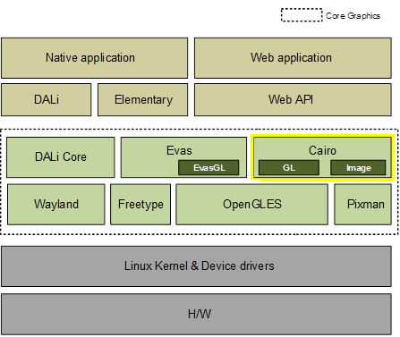
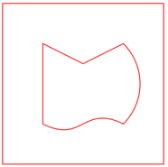
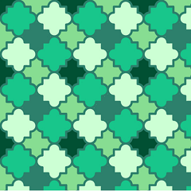
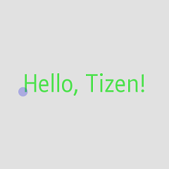

# Cairo Vector Graphics


[Cairo](http://cairographics.org) is a famous 2D graphics library with support for multiple output devices. It provides powerful drawing operations to create a graphical experience that you desire, including stroking, filling, compositing images, and any affine transforms (such as scale, rotation, and shear). You can also render text with Cairo. Within the [Tizen framework](#cairotizen), Cairo is able to output to 2 different backends: Image and GL backend.

The main features of the Cairo API include:

- Creating a Cairo surface linked with an Evas object

  You can [create a Cairo context and surface with the image or GL backend](#create).

- Drawing with Cairo

  You can [draw straight and curved lines](#draw), [paint with image files](#image), and [show text on a surface](#text).

  When you are finished, always remember to [delete the Cairo resources](#delete).

## Cairo in Tizen

Cairo is a part of the Tizen Graphics layer. As shown in the following figure, the rendering functionality of Cairo is provided through the use of the APIs of the lower modules, such as Pixman or OpenGL&reg; ES.

**Figure: Cairo within the Tizen framework**



The Cairo GL backend allows hardware-accelerated rendering by targeting the OpenGL&reg; ES API. The goal of the Cairo GL backend is to achieve better performance with equal functionality to the Cairo Image backend, whenever possible.

> **Note**  
> Since Tizen only exposes EvasGL binding in place of EGL™, Cairo EvasGL APIs have been newly added and specified. To use the Cairo GL backend in Tizen, an application must include in its source code the `cairo-evas-gl.h` header file instead of `cairo-gl.h`.

## Prerequisites

To enable your application to use the Cairo functionality:

1. Before using the Cairo library in Tizen:
   - You must understand the basic concepts of Cairo. For more information, see the [Cairo Tutorial in cairographics.org](http://www.cairographics.org/tutorial/).
   - In the Tizen framework, Cairo can use 2 different backends: image backend and Evas GL backend. You must check which backend is suitable for your work. For more information, see the [Creating a Cairo Surface Linked with an Evas Object](#create).
   - In creating native UI applications in Tizen, make sure you understand [EFL and its features](../ui/efl/introduction-n.md).
2. To use the functions and data types of the Cairo image and GL backends, include the `<cairo.h>` header file in your application. For the Cairo GL backend, you also need the `<cairo-evas-gl.h>`, and `<Evas_GL.h>` header files.

    ```
    #include <cairo.h>

    /* For the Cairo GL backend */
    #include <cairo-evas-gl.h>
    #include <Evas_GL.h>
    ```

<a name="create"></a>
## Creating a Cairo Surface Linked with an Evas Object

To display the rendered output using Cairo APIs, an application must link a Cairo surface with an Evas object. In this context, the Cairo surface is an object that can hold the rendered result within Cairo. Cairo can draw an image on the surface appropriate for a particular backend, and Evas can access the image data from the Cairo surface.

### Creating a Cairo Image Surface in the Evas GL Backend

To develop an application with Elementary, you create a window by using the Elementary utility function, `elm_win_util_standard_add()`. In order to make the GL application use the GPU, you must call the `elm_config_accel_preference_set()` function before creating the window. You also place an `Evas_Object` image into your application's main window. For more information on creating and placing an `Evas_Object` image, see [Manipulating Graphical Objects](../ui/efl/evas-basic-objects.md).

In the Cairo Image backend, you can create a new Cairo image surface by using the `cairo_image_surface_create()` or `cairo_image_surface_create_for_data()` function. The former function requires only the pixel format and dimensions to be specified, while the latter function requires additional data, such as a pointer to an image buffer (supplied by the application) in which to write the content. In order to display a result of Cairo rendering, you must also link an Evas image object to the created Cairo image surface. For this purpose, use the `evas_object_image_data_set()` function.

To create the image surface:

- With the `cairo_image_surface_create()` function.

  Call the `cairo_image_surface_get_data()` function before calling the `evas_object_image_data_set()` function. The `cairo_image_surface_get_data()` function returns a pointer to the raw image data of the created image surface. This pointer is used for the raw data to be linked with an Evas image object in the `evas_object_image_data_set()` function.

    ```
    elm_config_accel_preference_set("opengl");
    Evas_Object *win = elm_win_util_standard_add("Cairo Image Backend guide", " Cairo Image Backend guide");
    Evas_Object *img = evas_object_image_filled_add(evas_object_evas_get(win));
    evas_object_geometry_get(win, NULL, NULL, &WIDTH, &HEIGHT);

    elm_win_resize_object_add(win, img);
    evas_object_image_content_hint_set(img, EVAS_IMAGE_CONTENT_HINT_DYNAMIC);
    evas_object_image_size_set(img, WIDTH, HEIGHT);
    evas_object_image_colorspace_set(img, EVAS_COLORSPACE_ARGB8888);
    evas_object_image_alpha_set(img, 0);
    evas_object_show(img);

    cairo_surface_t *cairo_surface = cairo_image_surface_create(CAIRO_FORMAT_ARGB32, WIDTH, HEIGHT);
    cairo_t *cairo = cairo_create(cairo_surface);
    /* Cairo drawing */

    cairo_surface_flush(cairo_surface);

    unsigned char *imageData = cairo_image_surface_get_data(cairo_surface);
    evas_object_image_data_set(img, imageData);
    evas_object_image_data_update_add(img, 0, 0, WIDTH, HEIGHT);
    ```

- With the `cairo_image_surface_create_for_data()` function.

  To use the function, you need a pointer to an image data, which can be retrieved with the `evas_object_image_data_get()` function. The function returns the data pointer of an image object and requires a parameter to determine whether the data is modified. If modification is enabled by setting the parameter to `EINA_TRUE`, Evas updates the image pixels in the next rendering cycle. Finally, you can link the pixel buffer with the image object by using the `evas_object_image_data_set()` function.

  Since the default backend for Evas is GL, the Cairo Image backend is much slower due to the memory copy operation, which occurs whenever the rendered result from Cairo is uploaded to Evas. To enhance the performance of Cairo Image backend to enable the zero copy feature, set the `EVAS_IMAGE_CONTENT_HINT_DYNAMIC` property with the `evas_object_image_content_hint_set()` function.

  To update a rectangular region on the screen, the `evas_object_image_data_update_add()` function can be used. For more information on the image object functions of Evas, see [Image Objects](../ui/efl/evas-objects.md#image).

    ```
    Evas_Object *win = elm_win_util_standard_add("Cairo Image Backend guide", " Cairo Image Backend guide");
    Evas_Object *img = evas_object_image_filled_add(evas_object_evas_get(win));
    evas_object_geometry_get(win, NULL, NULL, &WIDTH, &HEIGHT);

    elm_win_resize_object_add(win, img);
    evas_object_image_content_hint_set(img, EVAS_IMAGE_CONTENT_HINT_DYNAMIC);
    evas_object_image_size_set(img, WIDTH, HEIGHT);
    evas_object_image_colorspace_set(img, EVAS_COLORSPACE_ARGB8888);
    evas_object_image_alpha_set(img, 0);
    evas_object_show(img);

    int row_stride = cairo_format_stride_for_width(CAIRO_FORMAT_ARGB32, WIDTH);
    unsigned char *imageData = (unsigned char *)evas_object_image_data_get(img, EINA_TRUE);
    cairo_surface_t *cairo_surface = cairo_image_surface_create_for_data(imageData, CAIRO_FORMAT_ARGB32, WIDTH, HEIGHT, row_stride);
    cairo_t *cairo = cairo_create(cairo_surface);
    /* Cairo drawing */

    cairo_surface_flush(cairo_surface);

    evas_object_image_data_set(img, imageData);
    evas_object_image_data_update_add(img, 0, 0, WIDTH, HEIGHT);
    ```

> **Note**
>
> Take care when using the `evas_object_image_data_set()` function. You must match the `evas_object_image_data_get()` and `evas_object_image_data_set()` functions as a pair. Since the `evas_object_image_data_get()` function keeps a rendering sink, the rendered result with Cairo can be reflected outside the Evas area, if the functions are not matched.

### Creating a Cairo GL Surface in the Evas GL Backend

With the Cairo GL backend, you can create a Cairo surface using OpenGL&reg;. For more information on OpenGL&reg;, see the [OpenGL&reg; ES](opengl-n.md) guide.

To create the GL surface:

1. Since an application utilizing the Cairo GL backend in Tizen is based on Evas GL, an Evas GL handler must be created with the `evas_gl_new()` function during the initial stage.

   Afterwards, the `evas_gl_config`, `evas_gl_surface`, and `evas_gl_context` instances are created in that order. For more information on using Evas GL, see [Creating OpenGL&reg; ES Applications](creating-opengles-n.md) and the [OpenGL&reg; ES](opengl-n.md) guide.

    ```
    Evas_Object *win = elm_win_util_standard_add("Cairo GL Backend guide", " Cairo GL Backend guide");
    Evas_Object *img = evas_object_image_filled_add(evas_object_evas_get(win));

    Evas_Native_Surface ns;
    Evas_GL *evas_gl = evas_gl_new(evas_object_evas_get(img));
    Evas_GL_Config *evas_gl_config = evas_gl_config_new();
    evas_gl_config->color_format = EVAS_GL_RGBA_8888;
    evas_gl_config->stencil_bits = EVAS_GL_STENCIL_BIT_8;
    evas_gl_config->multisample_bits = EVAS_GL_MULTISAMPLE_MED;

    Evas_GL_Surface *evas_gl_surface = evas_gl_surface_create(evas_gl, evas_gl_config, WIDTH, HEIGHT);
    Evas_GL_Context *evas_gl_context = evas_gl_context_create(evas_gl, NULL);
    evas_gl_native_surface_get(evas_gl, evas_gl_surface, &ns);
    evas_object_image_native_surface_set(img, &ns);
    ```

2. A Cairo GL application can use the `evas_object_image_pixels_dirty_set()` function in Tizen to show the rendered output on the screen. This function allows the rendered result to be redrawn on the screen for every animator callback in the default update refresh rate. The rendered results are saved inside the Evas object (in this example, the `img` object) connected to the Cairo GL backend during the Cairo drawing.

    ```
    evas_object_image_pixels_dirty_set(img, EINA_TRUE);
    evas_object_image_pixels_get_callback_set(img, cairo_drawing, 0);
    ```

3. If your application employs the Cairo GL backend in Tizen, include the `cairo-evas-gl.h` header file instead of `cairo-gl.h`.

4. To fully use the GPU acceleration, set the `CAIRO_GL_COMPOSITOR` property to `MSAA`.

   In addition, call the `cairo_gl_device_set_thread_aware()` function with `cairo_device` and `0` as input parameters to prevent unnecessary context switches. Cairo can be used in multithreaded environments, and switches out the current GL context by default after each draw finishes. Therefore, if no other thread uses Cairo for GL rendering, set the `thread_aware` parameter to 0.

   To create the Cairo GL surface with the `cairo_gl_surface_create_for_evas_gl()` function, a `cairo_device` and an `evas_gl_surface` must be created beforehand:
	- A `cairo_device` can be created with the `cairo_evas_gl_device_create()` function, which is an interface to the underlying rendering system. You also need the `evas_gl_object` and `evas_gl_context` as input parameters to the `cairo_evas_gl_device_create()` function.
	- A `evas_gl_surface` object is needed to render 2D graphics through the rendering functionality of the Cairo GL backend.

    ```
    setenv("CAIRO_GL_COMPOSITOR", "msaa", 1);
    cairo_device_t *cairo_device = cairo_evas_gl_device_create(evas_gl, evas_gl_context);
    cairo_boot_t thread_aware = 0;
    cairo_gl_device_set_thread_aware(cairo_device, thread_aware);
    cairo_surface_t *cairo_surface = cairo_gl_surface_create_for_evas_gl(cairo_device, evas_gl_surface, evas_gl_config, WIDTH, HEIGHT);
    cairo_t *cairo = cairo_create(cairo_surface);
    /* Cairo drawing */
    ```

5. When any drawing with the Cairo API is finished, call the `cairo_surface_flush()` function. It guarantees a complete rendered result, because it does any pending drawing for the surface and also restores any temporary modifications Cairo has made to the surface state. Specially, this function must be called before switching from drawing on the surface with Cairo to drawing on it directly with native APIs.

    ```
    cairo_surface_flush(cairo_surface);
    ```

<a name="draw"></a>
## Drawing with Cairo

Drawing with Cairo to a surface is accomplished by calling the common backend interface functions. These rendering functions must be called properly for each backend. For more information on the common rendering functions, see the [Cairo: A Vector Graphics Library](http://www.cairographics.org/manual/) manual.

The following sections introduce a general example for drawing a line using Cairo APIs, including some special guidelines. Occasionally, you need to adhere to special guidelines to overcome any Cairo drawing limitations in Tizen.

### Using a Surface to Source Pattern

Within the Cairo API, some functions, such as `cairo_set_source_surface()` and `cairo_mask_surface()`, use a surface to set the source pattern. However, the performance of these functions in Tizen, under certain circumstances, can be heavily degraded if the source surface is created using the `cairo_gl_surface_create_for_evas_gl()` function.

In Tizen, you can create a Cairo GL surface with either the `cairo_gl_surface_create()` or `cairo_gl_surface_create_for_evas_gl()` function. To prevent performance issues, always create the source surface with the `cairo_gl_surface_create()` function.

```
/* Create a surface for destination */
cairo_surface_t *cairo_surface = cairo_gl_surface_create_for_evas_gl(cr, evas_gl_surface, evas_gl_config, WIDTH, HEIGHT);

Evas_GL_Config *evas_gl_config_source = evas_gl_config_new();
evas_gl_config_source->color_format = EVAS_GL_RGBA_8888;
evas_gl_config_source->stencil_bits = EVAS_GL_STENCIL_BIT_1;
evas_gl_config_source->multisample_bits = EVAS_GL_MULTISAMPLE_LOW;
evas_gl_surface_source = evas_gl_surface_create(evas_gl, evas_gl_config_source, WIDTH, HEIGHT);

/* Create a surface for source */
cairo_surface_t *image_surface = cairo_image_surface_create_from_png(image);
cairo_surface_t *gl_surface = cairo_gl_surface_create(cairo_device, CAIRO_CONTENT_COLOR_ALPHA, image_width, image_height);
cairo_t *cairo = cairo_create(gl_surface);
cairo_set_source_surface(cairo, image_surface, 0, 0);
cairo_paint(cairo);
cairo_pattern_create_for_surface(gl_surface);
```

### Support for Reading Various Image Files

Cairo does not support a functionality for reading image files in JPEG or SPI format; only PNG is supported. With a PNG file, you can use the `cairo_image_surface_create_from_png()` function to make a new image surface from the image. However, handle this function with care, because it is experimental and only offers very simple functionality for reading PNG files.

```
cairo_surface_t *image = cairo_image_surface_create_from_png("test_image.png");
cairo_set_source_surface(cairo, image, 0, 0);
cairo_paint(cairo);
cairo_surface_destroy(image);
```

On the other hand, Cairo applications in Tizen can read JPEG and other image formats by using the Evas APIs. Evas supports image loaders for various formats as plug-in modules:

1. Create an image buffer as a temporary buffer for decoding an image file with the `evas_object_image_add()` function.
2. Use the `evas_object_image_file_set()` function to set the image file on the object (in this example, the `decoded_img` object).
3. Use other Evas functions for the image object to manage it. Since the temporary buffers are only used for the decoded content of the given image file (in this example, `inline_buffr` and `decoded_img`), you do not need to call the `evas_object_show()` function.

```
evas_object_geometry_get(win, NULL, NULL, &surface_w, &surface_h);
Evas_Object *inline_buffr = elm_win_add(win, "Img Read", ELM_WIN_INLINED_IMAGE);
evas_object_move(inline_buffr, 0, 0);
evas_object_resize(inline_buffr, surface_w, surface_h);

/* As a temporary buffer */
Evas_Object *decoded_img = evas_object_image_add(evas_object_evas_get(inline_buffer));
evas_object_image_file_set(decoded_img, "test_image.jpeg", NULL);
evas_object_image_size_get(decoded_img, &w, &h);
evas_object_image_fill_set(decoded_img, 0, 0, w, h);
evas_object_image_filled_set(decoded_img, EINA_TRUE);
evas_object_resize(decoded_img, w, h);
```

After the image file reading is complete, you can create a Cairo surface for the image object by using the `evas_object_image_data_get()` and `cairo_image_surface_create_for_data()` functions. The Cairo surface is used to create a pattern with the `cairo_set_source_surface()` function for the Cairo drawing. In addition, to prevent memory leaks, delete the temporary buffers that are no longer used.

```
src_buffer = (unsigned char *)evas_object_image_data_get(decoded_img, EINA_TRUE);
cairo_surface_t *source = cairo_image_surface_create_for_data(src_buffer, CAIRO_FORMAT_ARGB32, w, h,
                                                              evas_object_image_stride_get(decoded_img));
cairo_set_source_surface(cr, source, 0, 0);
cairo_paint(cr);

evas_object_del(inline_buffr);
cairo_surface_destroy(img);
```

### Drawing a Line

When drawing an image with Cairo, you must prepare the context (nouns) for each of the drawing verbs. For example, if you want to use the `cairo_stroke()` or `cairo_fill()` function, create a path first. Similarly, when using the `cairo_show_text()` function, you must position your text by its insertion point. A primary source is needed for using the `cairo_paint()` function and a second source pattern or surface is prepared for using the `cairo_mask()` function. For more information, see the [Cairo Tutorial in cairographics.org](http://www.cairographics.org/tutorial/).

The following example creates a line drawing with a rectangle, and a path that uses straight sections, arcs, and Bézier curves.

**Figure: Rectangle and path drawing with Cairo**



To draw lines with Cairo APIs:

1. Prepare the sources.

   Prior to drawing a line, prepare and select sources. There are 3 main sources in Cairo - colors, gradients, and images:

   - Colors use a uniform hue and opacity for the entire source. You can select these without any preparation with the `cairo_set_source_rgb()` function and `cairo_set_source_rgba()` functions.

     In this example, the color is opaque red:

     ```
     cairo_set_source_rgba(cairo, 1.0, 0.0, 0.0, 1.0);
     ```
 
   - Gradients describe a progression of colors by setting a start and stop reference location and a series of "stops" along the way. There are linear and radial gradients built from 2 points. Stops are added to the gradient with the `cairo_add_color_stop_rgb()` and `cairo_add_color_stop_rgba()` functions which take a color like the `cairo_add_color_stop_rgb()` or `cairo_add_color_stop_rgba()` function, as well as an offset to indicate where it lies between the reference locations.

   - Images include both surfaces loaded from the existing files with the `cairo_image_surface_create_from_png()` function and surfaces created from within Cairo as an earlier destination. For more information on these Cairo APIs, see [the cairo_pattern_t in cairographics.org](http://www.cairographics.org/manual/cairo-cairo-pattern-t.html).

2. Set the line width.

   In this example, the line width is 2:

   ```
   cairo_set_line_width(cairo, 2);
   ```

3. To create the path:

   1. To set the starting point with a user-specified offset, use the `cairo_translate()` function to modify the user-space origin (x, y) by translating it with the current transformation matrix (CTM):
       ```
       cairo_translate(cairo, 40, 40);
       ```
       Cairo uses a connect-the-dots style system for creating paths. You can also set the starting point of the line with the `cairo_move_to()` function. This sets the current reference point without making the path connect the previous point to it.
       ```
       cairo_move_to(cairo, 40, 40);
       ```

   2. To draw a line from point (100,100) to point (200,150) on a surface, use the `cairo_move_to()` and `cairo_line_to()` functions:

       ```
       cairo_move_to(cairo, 100, 100);
       cairo_line_to(cairo, 200, 150);
       ```

   3. To add a line on a path from the current point to a point at the offset (dx, dy), use the `cairo_rel_line_to()` function. In this example, the offset is (100, -50).

       ```
       cairo_rel_line_to(cairo, 100, -50);
       ```

   4. To draw a circular arc of a given radius on the current path, use the `cairo_arc()` function.

       Arcs are parts of the outside of a circle. The point you directly specify is the center of the circle that makes up the addition to the path. Both a starting and an ending point on the circle must be specified, and these points are connected either clockwise using the `cairo_arc()` or counter-clockwise using the `cairo_arc_negative()` function.

       In this example, the radius is (100 * sqrt(2)), the arc is centered at (200, 200), begins at an angle (-0.25 * M_PI) and proceeds in the direction of increasing angles to end at an angle (0.25 * M_PI). If the end angle is less than the begin angle, the end angle is progressively increased by 2*M_PI until it is greater than the begin angle.

       ```
       cairo_arc(cairo, 200, 200, 100 * sqrt(2), -0.25 * M_PI, 0.25 * M_PI);
       ```

   5. To draw a curve, use the `cairo_rel_curve_to()` function.

       Curves in Cairo are cubic Bézier splines. They start at the current reference point and smoothly follow the direction of 2 other points (without going through them) to get to a third specified point. Like lines, there are both absolute (`cairo_curve_to()`) and relative (`cairo_rel_curve_to()`) functions. Note that the relative variant specifies all points relative to the previous reference point, rather than each relative to the preceding control point of the curve.

       In this example, the offsets of (-100, -50) and (-100, 50) are used as the control points. After this function call, the current point is offset by (-200, 0).

       ```
       cairo_rel_curve_to(cairo, -100, -50, -100, 50, -200, 0);
       ```

   6. To add a line segment on the path from the current point to the beginning of the current sub-path, use the `cairo_close_path()` function. After this call, the current point is repositioned at the joined endpoint of the sub-path.

       The behavior of the `cairo_close_path()` function differs from the `cairo_line_to()` function with the equivalent coordinates very little: for stroking, a line joining the final and initial segments of the sub-path is also created.

       ```
       cairo_close_path(cairo);
       ```

4. To draw a rectangle, use the `cairo_rectangle()` function.

    In this example, the function draws a rectangle starting from the point (0, 0) with the width and height of 400 px.

    ```
    cairo_rectangle(cairo, 0, 0, 400, 400);
    ```

5. If you need to create a stroke on a path, the `cairo_stroke()` function is a drawing operator that draws a stroke on the current path, using the current line width and line color. After the function call, the current path is cleared from the Cairo context.

    ```
    cairo_stroke(cairo);
    ```

6. To ensure that any pending Cairo operations are drawn, use the `cairo_surface_flush()` function after finishing the Cairo drawing:

    ```
    cairo_surface_flush(surface);
    ```

7. Destroy the Cairo objects when you terminate the application:

   ```
   cairo_destroy(cairo);
   cairo_surface_destroy(surface);
   ```

<a name="image"></a>
## Painting with Image Files

Cairo supports the painting with image files functionality only for images in the PNG format. These functions for PNG are experimental, so use them with care. For more information on PNG support, see [PNG Support in cairographics.org](http://www.cairographics.org/manual/cairo-PNG-Support.html).

The following figure shows an example of painting with an image file.

**Figure: Painting with image file**



To paint with image files:

1. Get the image resource.

   The following code snippet shows how to prepare image data for your application. To get an application's resource image data, use the `app_get_resource_path()` function. This gets a stored PNG image file path to use as a resource. For more information on the `app_get_resource_path()` function, see the App Common API (in [mobile](../../api/mobile/latest/group__CAPI__APP__COMMON__MODULE.html) and [wearable](../../api/wearable/latest/group__CAPI__APP__COMMON__MODULE.html) applications.

   ```
   char image_filepath[256];
   char *source_filename = "image.png";
   char *resource_path = app_get_resource_path();
   snprintf(image_filepath, 256, "%s/%s", resource_path, source_filename);
   free(resource_path);
   ```

2. Create the source surface.

   To paint using the image data from the PNG file, first create a source surface. The image data is a source surface to paint on the destination surface.

   ```
   cairo_surface_t *image = cairo_image_surface_create_from_png(image_filepath);
   cairo_set_source_surface(cairo, image, 0, 0);
   ```

3. Paint the Cairo surface.

   The `cairo_paint()` function uses a mask that transfers the entire source to the destination. It can be considered an infinitely large mask, or no mask, but the result is the same. To set a compositing operator, use the `cairo_set_operator()` and paint a Cairo surface using the source pattern obtained before. For more information on the `cairo_set_operator()` function, see [operators in cairographics.org](http://www.cairographics.org/operators/).

   ```
   cairo_set_operator(cairo, CAIRO_OPERATOR_SOURCE);
   cairo_paint(cairo);
   ```

<a name="text"></a>
## Showing Text

In Cairo, the `cairo_font_face_t` class represents a particular font at a particular weight, slant, and other characteristics. For more information on using the cairo font, see [cairo_font_face_t of cairographics.org](http://www.cairographics.org/manual/cairo-cairo-font-face-t.html).

The following figure shows an example of text shown using Cairo.

**Figure: Text shown using Cairo**



To show text:

1. Prepare a text to use as a resource:

   ```
   const char *utf8 = "Hello, Tizen!";
   ```

2. Set text configurations.

   In this example, create a font face implicitly using the `cairo_select_font_face()` function. The text is a kind of "mask" you are about to work with. To use a mask, you need a font type and font size. Set the font type as "Sans", and font size as 52.

   ```
   cairo_select_font_face(cairo, "Sans", CAIRO_FONT_SLANT_NORMAL, CAIRO_FONT_WEIGHT_NORMAL);
   cairo_set_font_size(cairo, 52.0);
   ```

3. Show the text.

   The `cairo_show_text()` function forms the mask from the text. You can think of the `cairo_show_text()` function as a shortcut for creating a path with the `cairo_text_path()` and using the `cairo_fill()` function to transfer it.

   The `cairo_show_text()` function caches glyphs, and it is much more efficient if you work with a lot of text. Note that this function is experimental and must be handled with care. For more information on Cairo text, see the [description of cairo_text](http://www.cairographics.org/manual/cairo-text.html).

   ```
   cairo_text_extents_t extents;
   cairo_text_extents(cairo, utf8, &extents);
   cairo_move_to(cairo, 10, 10);
   cairo_show_text(cairo, utf8);
   ```

<a name="delete"></a>
## Deleting Cairo

Delete the Cairo resources when they are no longer needed.

In the `cairo_destroy()` function, a reference count for a Cairo context is decreased by one. If the count is to be zero, the Cairo context and all associated resources must be freed. The same steps apply for the `cairo_surface_destroy()` function as well.

```
cairo_surface_destroy(surface);
cairo_destroy(cairo);
```

## Related Information
- Dependencies
  - Tizen 2.4 and Higher for Mobile
  - Tizen 2.3.1 and Higher for Wearable
