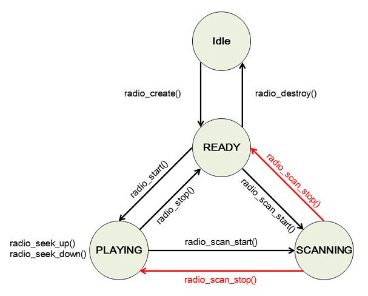

# Radio


Tizen provides functions for controlling radio hardware on your system.

The main features of the Radio API include:

- Switching the radio on and off

  You can create a handle for a radio instance using the `radio_create()` function. A successful creation of the handle requires a radio tuner. You can switch the radio on and off using the `radio_start()` and `radio_stop()` functions.

- Scanning for radio frequencies

  You can [scan for all available frequencies](#scan).

- Tuning the radio

  You can [select and start playing a radio frequency](#tune) using the `radio_set_frequency()` function.

- Searching for an adjacent channel

  You can [seek an adjacent channel](#seek) with the `radio_seek_up()` and `radio_seek_down()` functions.

The Radio API allows only one instance at the time. Radio playback can be interrupted by another radio application.

The following figure illustrates the general radio state changes.

**Figure: Radio state changes**



## Prerequisites

To enable your application to use the radio functionality:

1. To use the functions and data types of the Radio API (in [mobile](../../../../org.tizen.native.mobile.apireference/group__CAPI__MEDIA__RADIO__MODULE.html) and [wearable](../../../../org.tizen.native.wearable.apireference/group__CAPI__MEDIA__RADIO__MODULE.html) applications), include the `<radio.h>` header file in your application:

   ```
   #include <radio.h>
   ```

2. Define a handle for the radio using the `radio_create()` function:

   ```
   #define MAX_FREQUENCIES 10
   struct radioInfo {
       radio_h radio;
       int frequencies[MAX_FREQUENCIES];
       int num_freq;
       int selected_channel;
   };
   typedef struct radioInfo mRadioInfo;

   mRadioInfo mRadio;
   ret = radio_create(&mRadio.radio);
   if (ret != RADIO_ERROR_NONE)
       return false;
   ```

3. To receive notifications when the radio playback is interrupted, register a callback function using the `radio_set_interrupted_cb()` function:

   ```
   ret = radio_set_interrupted_cb(mRadio.radio, on_radio_interrupted, &mRadio);
   if (ret != RADIO_ERROR_NONE) {
       /* Delete the radio handle before closing the application */

       return false;
   }
   ```

   Radio playback is interrupted, for example, when the application moves to the background.

4. Implement the interruption callback:

   ```
   static void
   on_radio_interrupted(radio_interrupted_code_e code, void* userdata)
   {
       /* Retrieve the radio handle from userdata */
       mRadioInfo* mRadio = (mRadioInfo *)userdata;

       switch (code) {
       case RADIO_INTERRUPTED_COMPLETED:
           /* Application, which was the source of the conflict, is now closed */
           /* Restart the radio playback here */
           break;
       default:
           /* Radio listening is interrupted */
           /* Release the application resources or save the current state here */
           break;
       }
   }
   ```

<a name="scan"></a>
## Scanning for Radio Frequencies

To scan for all available radio frequencies:

1. To receive a notification when the scan is completed, register a callback function using the `radio_set_scan_completed_cb()` function:

   ```
   ret = radio_set_scan_completed_cb(mRadio.radio, on_scan_finished, &mRadio);
   if (ret != RADIO_ERROR_NONE)
       return false;
   ```

2. Implement the scan complete callback:

   ```
   void
   on_scan_finished(void* userdata)
   {
       /* Frequency scanning is completed */
       /* Tune in to one of the scanned frequencies and start listening */
   }
   ```

3. Start scanning:

   ```
   radio_scan_start(mRadio.radio, on_scan_updated, &mRadio);
   ```

   The scanning time depends on the environment (the strength of the radio signal).

   Each time the scan finds a new frequency, it calls the `on_scan_updated()` callback function, which returns the kHz value of the frequency. To cancel the scan before it completes, use the `radio_scan_stop()` function.

4. Implement the scan update callback that returns the available frequencies:

   ```
   void
   on_scan_updated(int frequency, void* userdata)
   {
       mRadioInfo* mRadio = (mRadioInfo *)userdata;
       /* Store the radio channels in the array */
       /* Frequency values represent the kHz of the channel */
       mRadio->frequencies[mRadio->num_freq++] = frequency;
   }
   ```

   > **Note**  
   > Do not call radio functions (such as `radio_set_frequency()` or `radio_start()`) in the callback function.

<a name="tune"></a>
## Tuning the Radio

To select and start playing a frequency:

1. Set the frequency you want to play using the `radio_set_frequency()` function:

   ```
   ret = radio_set_frequency(mRadio.radio, mRadio.frequencies[mRadio.selected_channel]);
   if (ret != RADIO_ERROR_NONE)
       return false;
   ```

2. Start playing the frequency using the `radio_start()` function:

   ```
   ret = radio_start(mRadio.radio);
   if (ret != RADIO_ERROR_NONE)
       return false;
   ```

   If the radio emits no sound, check the signal strength with the `radio_get_signal_strength()` function, which returns the current signal strength as a dBuV value.

<a name="seek"></a>
## Searching for an Adjacent Channel

To search for and tune in to an adjacent channel:

1. Search for an active adjacent frequency using the `radio_seek_up()` and `radio_seek_down()` functions.

   This is similar to the scanning operation, but only the nearest active frequency is searched for. Once the maximum frequency is reached in either direction, the search ends, and the radio is set to that frequency.

   To seek down, use the `radio_seek_down()` function:

   ```
   ret = radio_seek_down(mRadio.radio, on_seek_completed, &mRadio);
   if (ret != RADIO_ERROR_NONE)
       return false;
   ```

   To seek up, use the `radio_seek_up()` function in the same way.

2. Implement the search complete callback that returns the adjacent frequency:

   ```
   void
   on_seek_completed(int frequency, void* userdata)
   {
       mRadioInfo *mRadio = (mRadioInfo *)userdata;
       int new_frequency = 0;

       /* Search is complete, and the radio is tuned in to the new frequency */
       /* Application sets the new frequency and updates the user interface */
       radio_get_frequency(mRadio->radio, &new_frequency);
   }
   ```

## Related Information
- Dependencies
  - Tizen 2.4 and Higher for Mobile
  - Tizen 2.3.1 and Higher for Wearable
