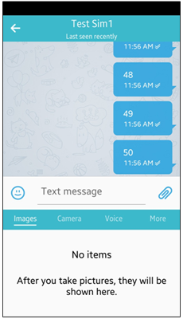
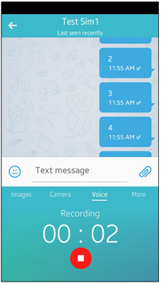

# Attach Panel


The attach panel allows the device user to attach various content into an application that contains an attach panel. The user can attach images, take pictures, record voice, and select files on the attach panel.

This API is supported on Tizen mobile devices that support attach panel feature(http://tizen.org/feature/attach_panel).

The main features of the Attach panel API include:

- Creating an attach panel

  You can [create an attach panel and set callbacks](#create). You can also [add content categories](#categories). When no longer needed, you can also delete the attach panel.

- Managing an attach panel

  You can [set extra data to a content category, show and hide the panel, and get the panel state](#manage).

**Figure: Attach panel**


The attach panel has UI components and it manages user interactions on its interface. The layout component keeps on the tabbar and scroller components, which are connected to show the content synchronously. The scroller component has pages to display the content of, for example, images, camera, and voice recorder. Some content is shown as a page on the panel, while others can be launched from the panel's **More** tab using [application controls](../app-management/app-controls.md).

The attach panel has half and full modes. The mode can be changed by swiping up and down the page.

**Figure: Attach panel modes**


<a name="categories"></a>
## Content Categories

You can manage the following types of content:

- Images

  In the half mode, you can select only 1 image to be attached. In the full mode, you can select multiple images at once.

- Camera

  You can take a picture using the device camera, and attach it.

- Voice

  You can attach a voice recording.

- **More** tabThe **More** tab shows the icons of the applications, for example, video, audio, calendar, contact, myfiles, and video recorder, that can be launched by clicking the applicable icon.

The following figure illustrates the content types. From left to right: images, camera, voice, and **More** tab.

**Figure: Content categories**

   

## Prerequisites

To enable your application to use the attach panel functionality:

1. To use the [Attach panel](../../api/mobile/latest/group__CAPI__PANEL__ATTACH__MODULE.html) API, the application has to request permission by adding the following privileges to the `tizen-manifest.xml` file:

   ```
   <privileges>
      <!--To add the image viewer and camera UI gadget in the attach panel-->
      <privilege>http://tizen.org/privilege/mediastorage</privilege>
      <!--To add the camera UI gadget in the attach panel-->
      <privilege>http://tizen.org/privilege/camera</privilege>
      <!--To add the voice recorder UI gadget in the attach panel-->
      <privilege>http://tizen.org/privilege/recorder</privilege>
      <!--To launch apps from the More tab-->
      <privilege>http://tizen.org/privilege/appmanager.launch</privilege>
   </privileges>
   ```

2. To use the functions and data types of the Attach panel API, include the `<attach_panel.h>` header file in your application:

   ```
   #include <attach_panel.h>
   ```

3. Declare global variables.

   To create and manage an attach panel, you must create variables for a conformant and the attach panel.

   ```
   static struct {
       Evas_Object *conformant;
       attach_panel_h attach_panel;
   } s_info =
   {
       .conformant = NULL,
       .attach_panel = NULL,
   };

   static void
   _create_conformant(Evas_Object *win)
   {
       Evas_Object *conformant = NULL;
       conformant = elm_conformant_add(win);
       evas_object_size_hint_weight_set(conformant, EVAS_HINT_EXPAND, EVAS_HINT_EXPAND);
       elm_win_resize_object_add(win, conformant);
       elm_win_conformant_set(win, EINA_TRUE);
       evas_object_show(conformant);

       s_info.conformant = conformant;
   }
   ```

<a name="create"></a>
## Creating an Attach Panel

To create an attach panel:

1. Create the attach panel using the `attach_panel_create()` function.When the attach panel is created, its state is hidden by default. To show the created panel, use the `attach_panel_show()` function.

    ```
    attach_panel_h attach_panel = NULL;
    int ret = ATTACH_PANEL_ERROR_NONE;

    ret = attach_panel_create(s_info.conformant, &attach_panel);
    if (ret != ATTACH_PANEL_ERROR_NONE || !attach_panel)
        /* Error handling */
    attach_panel_show(attach_panel);
    s_info.attach_panel = attach_panel;
    ```

2. Based on the type of content you want the user to be able to select for the attach panel, add content categories using the `attach_panel_add_content_category()` function. The available content categories are defined in the [attach_panel_content_category](../../api/mobile/latest/group__CAPI__PANEL__ATTACH__MODULE.html#gada3a2db6ac8e7d42b7dff7c3cc48720b)enumerator.The content categories in the **More** tab are shown in the frequency, recently used, and alphabetical sequence.To deliver more information to the UI gadget or called application, add the data with a bundle.

    ```
    bundle *extra_data = NULL;

    extra_data = bundle_create();
    if (!extra_data)
        /* Error handling */

    bundle_add_str(extra_data, http://tizen.org/appcontrol/data/total_count, "3");

    attach_panel_add_content_category(s_info.attach_panel, ATTACH_PANEL_CONTENT_CATEGORY_IMAGE, extra_data);
    attach_panel_add_content_category(s_info.attach_panel, ATTACH_PANEL_CONTENT_CATEGORY_CAMERA, NULL);
    attach_panel_add_content_category(s_info.attach_panel, ATTACH_PANEL_CONTENT_CATEGORY_VOICE, NULL);
    attach_panel_add_content_category(s_info.attach_panel, ATTACH_PANEL_CONTENT_CATEGORY_VIDEO, NULL);
    attach_panel_add_content_category(s_info.attach_panel, ATTACH_PANEL_CONTENT_CATEGORY_AUDIO, NULL);
    attach_panel_add_content_category(s_info.attach_panel, ATTACH_PANEL_CONTENT_CATEGORY_CALENDAR, NULL);
    attach_panel_add_content_category(s_info.attach_panel, ATTACH_PANEL_CONTENT_CATEGORY_CONTACT, NULL);
    attach_panel_add_content_category(s_info.attach_panel, ATTACH_PANEL_CONTENT_CATEGORY_MYFILES, NULL);
    attach_panel_add_content_category(s_info.attach_panel, ATTACH_PANEL_CONTENT_CATEGORY_VIDEO_RECORDER, NULL);

    attach_panel_show(s_info.attach_panel);
    bundle_free(extra_data);
    ```
3. Register and define callbacks:

   - To get the data that the user selects in the called application, register a callback using the `attach_panel_set_result_cb()` function. The callback is triggered when the user selects and conforms something to attach on the caller application. When you use this callback, you must use the `app_control_get_extra_data_array()` function to get the received data.
   - To get the published events from the panel side, register a callback using the `attach_panel_set_event_cb()` function. The callback is triggered when reserved events (defined in the [attach_panel_event](../../api/mobile/latest/group__CAPI__PANEL__ATTACH__MODULE.html#ga722a6d81e76fc1c4567a1bf920b4da3e) enumerator) are published from the panel side.

   ```
   static void
   _result_cb(attach_panel_h attach_panel, attach_panel_content_category_e content_category,
              app_control_h result, app_control_result_e result_code, void *data)
   {
       char **select = NULL;
       int i = 0;
       int length = 0;
       int ret = APP_CONTROL_ERROR_NONE;
       if (!result)
           /* Error handling */
       if (APP_CONTROL_RESULT_SUCCEEDED != result_code)
           /* Error handling */
       ret = app_control_get_extra_data_array(result, "http://tizen.org/appcontrol/data/selected", &select, &length);
       if (APP_CONTROL_ERROR_NONE != ret || !select)
           /* Error handling */

       for (; i < length; i++) {
           printf("path is %s, %d\n", select[i], length);
           free(select[i]);
       }
       free(select);
   }

   static void
   _event_cb(attach_panel_h attach_panel, attach_panel_event_e event, void *event_info, void *data)
   {
       int ret = 0;
       if (!)
           /* Error handling */
       switch (event) {
       case ATTACH_PANEL_EVENT_SHOW_START:
           break;
       case ATTACH_PANEL_EVENT_SHOW_FINISH:
           break;
       case ATTACH_PANEL_EVENT_HIDE_START:
           break;
       case ATTACH_PANEL_EVENT_HIDE_FINISH:
           break;
       }
   }

   static int
   app_control(void *data)
   {
       attach_panel_set_result_cb(s_info.attach_panel, _result_cb, NULL);
       attach_panel_set_event_cb(s_info.attach_panel, _event_cb, NULL);
   }
   ```

4. When no longer needed, destroy the attach panel with the `attach_panel_destroy()` function. If the attach panel is shown when you destroy it, the panel is first hidden and then destroyed.If you only need to remove a specific content category, use the `attach_panel_remove_content_category()` function.

    ```
    bool visible = false;

    if (s_info.attach_panel) {
        attach_panel_remove_content_category(s_info.attach_panel, ATTACH_PANEL_CONTENT_CATEGORY_IMAGE);
        attach_panel_remove_content_category(s_info.attach_panel, ATTACH_PANEL_CONTENT_CATEGORY_CAMERA);
        attach_panel_remove_content_category(s_info.attach_panel, ATTACH_PANEL_CONTENT_CATEGORY_VOICE);
        attach_panel_remove_content_category(s_info.attach_panel, ATTACH_PANEL_CONTENT_CATEGORY_VIDEO);
        attach_panel_remove_content_category(s_info.attach_panel, ATTACH_PANEL_CONTENT_CATEGORY_AUDIO);
        attach_panel_remove_content_category(s_info.attach_panel, ATTACH_PANEL_CONTENT_CATEGORY_CALENDAR);
        attach_panel_remove_content_category(s_info.attach_panel, ATTACH_PANEL_CONTENT_CATEGORY_CONTACT);
        attach_panel_remove_content_category(s_info.attach_panel, ATTACH_PANEL_CONTENT_CATEGORY_MYFILES);
        attach_panel_remove_content_category(s_info.attach_panel, ATTACH_PANEL_CONTENT_CATEGORY_VIDEO_RECORDER);

        attach_panel_unset_result_cb(s_info.attach_panel);
        attach_panel_unset_event_cb(s_info.attach_panel);

        attach_panel_destroy(s_info.attach_panel);
        s_info.attach_panel = NULL;
    }
    ```

<a name="manage"></a>
## Managing an Attach Panel

To manage an attach panel:

- To set some information to the content category after adding the category, use the `attach_panel_set_extra_data()` function, which sets extra data to send to the content category using a bundle:

    ```
    static void
    _reset_bundle(void *data)
    {
        bundle *extra_data = NULL;
        int ret = APP_CONTROL_ERROR_NONE;

        extra_data = bundle_create();
        if (!extra_data)
            /* Error handling */

        bundle_add_str(extra_data, http://tizen.org/appcontrol/data/total_count, "5");
        ret = attach_panel_set_extra_data(s_info.attach_panel, ATTACH_PANEL_CONTENT_CATEGORY_IMAGE, extra_data);
        if (ATTACH_PANEL_ERROR_NONE != ret)
            /* Error handling */
        bundle_free(extra_data);
    }
    ```

- To show or hide the attach panel, use the `attach_panel_show()` and `attach_panel_hide()` functions:

    ```
    attach_panel_h attach_panel;
    int ret = ATTACH_PANEL_ERROR_NONE;

    if (s_info.attach_panel) {
        attach_panel_hide(s_info.attach_panel);
    } else {
        ret = attach_panel_create(s_info.conformant, &attach_panel);
        if (ret != ATTACH_PANEL_ERROR_NONE || !attach_panel)
            /* Error handling */
        attach_panel_add_content_category(s_info.attach_panel, ATTACH_PANEL_CONTENT_CATEGORY_CAMERA, NULL);
        attach_panel_show(attach_panel);
        s_info.attach_panel = attach_panel;
    }
    ```

- To know whether the attach panel is visible, use the `attach_panel_get_visibility()` function. It fills the second parameter with a Boolean value that shows whether the panel is visible.

    ```
    bool visible = false;

    if (s_info.attach_panel) {
        attach_panel_get_visibility(s_info.attach_panel, &visible);
        if (visible)
            attach_panel_hide(s_info.attach_panel);
        else
            attach_panel_show(s_info.attach_panel);
    }
    ```

## Related Information
- Dependencies
  - Tizen 2.4 and Higher for Mobile
