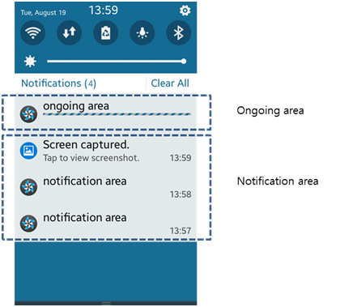
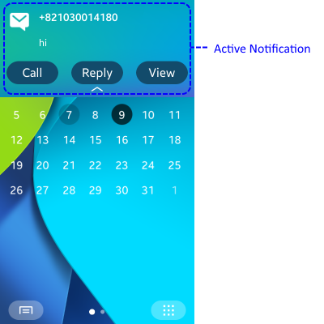
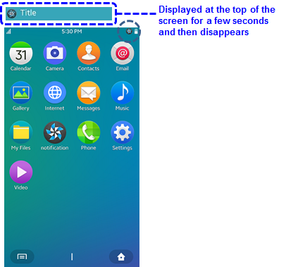
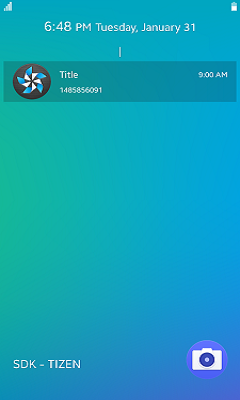
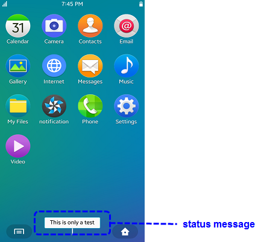
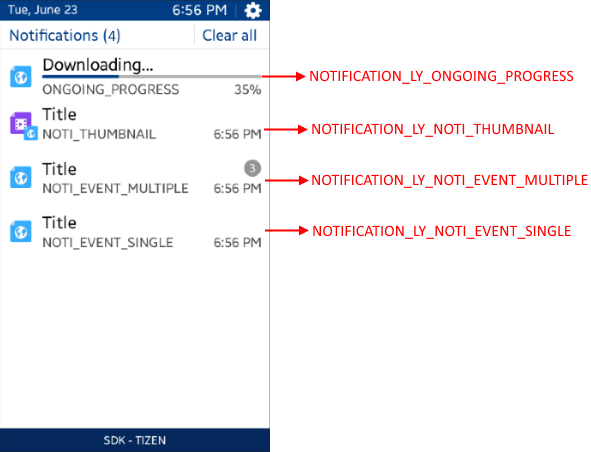
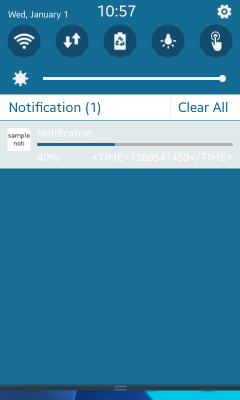
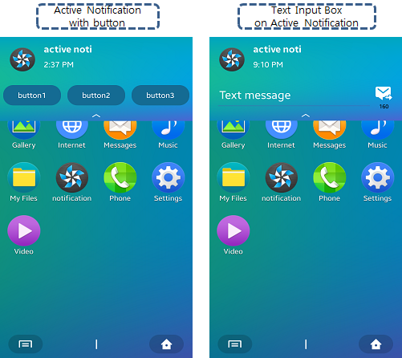

# Notifications


An application can use notifications to keep the user informed of important information.

The main features of the Notification API include:

- Creating a notification

  You can [create a notification](#create). There are 5 [notification display types](#type) and 4 [notification layouts](#layout) you can choose from.

- Setting notification attributes

  You can [set notification attributes](#set), such as the notification text, timestamp, and various display and LED options.

- Posting a notification

  You can [post a simple notification](#post) using the `notification_post()` function, which accepts a notification handle as a parameter.

  The posted notification has a default notification icon and the application name as the title.

- Updating notification content

  You can [update the content of a notification](#update) using the `notification_update()` function.

- Deleting a notification

  You can [delete notifications](#delete) when no longer needed.

- Using advanced notification features

  - You can [create, display, and update a progress bar](#bar) in a notification.
  - You can [create and active notification with a text input field](#input_box).
  - You can [create a template](#template) that can be reused in multiple notifications.

<a name="type"></a>
## Notification Display Types

Tizen provides notifications by using a combination of any of the following notification display types:

- Quick panel
- Active notification
- Indicator
- Lock screen
- Status message

The notification display type determines where and how the notification message is displayed.

### Quick Panel Notifications

The display area for quick panel notifications can be one of the following:

- Notification area

  The notification area is the reserved space for displaying all notifications, except the on-going notifications.

- On-going area

  The on-going area is the application screen area and is only used to display notifications for the currently-running application.

**Figure: Notification and on-going areas**



### Active Notifications

An active notification is displayed on the upper side of the screen. You can add several buttons for user interaction.

**Figure: Active notification**



### Indicator Notifications

The indicator type notification is displayed for a few seconds in the indicator area. Only a simple string and icon can be displayed.

**Figure: Notification on the ticker and the indicator**



### Lock Screen Notifications

You can display a notification on the lock screen. The notification content can be displayed or hidden.

**Figure: Notification on the lock screen**



### Status Message Notifications

A status message type notification can be used like a pop-up. It is displayed for a few seconds and then disappears.

**Figure: Status message**



<a name="layout"></a>
## Notification Layouts

The following notification layouts are provided:

- `NOTIFICATION_LY_NOTI_EVENT_SINGLE`

   Layout for a single event notification.

- `NOTIFICATION_LY_NOTI_EVENT_MULTIPLE`

   Layout for a multiple event notification.

- `NOTIFICATION_LY_NOTI_THUMBNAIL`

   Layout for a notification displaying images.

- `NOTIFICATION_LY_ONGOING_PROGRESS`

   Layout for an ongoing notification displaying progress.

- `NOTIFICATION_LY_EXTENSION`

   Layout for an [extended notification](#extended_noti).

**Figure: Notification layouts**



## Prerequisites

To enable your application to use the notification functionality:

1. To use the Notification API (in [mobile](../../api/mobile/latest/group__NOTIFICATION__MODULE.html) and [wearable](../../api/wearable/latest/group__NOTIFICATION__MODULE.html) applications), the application has to request permission by adding the following privilege to the `tizen-manifest.xml` file:

    ```
    <privileges>
       <privilege>http://tizen.org/privilege/notification</privilege>
    </privileges>
    ```

2. To use the functions and data types of the Notification API, include the `<notification.h>` header file in your application:

    ```
    #include <notification.h>
    ```

 To ensure that a Notification function has been executed properly, make sure that the return is equal to `NOTIFICATION_ERROR_NONE`.

3. To follow this guide, place an image file in, for example, your application's shared resource directory. The following variables are used in the code:

   ```
   static notification_h notification = NULL;
   char *image_path[BUFLEN];
   char *shared_path = app_get_shared_resource_path();
   snprintf(image_path, BUFLEN, "%stutorial_native_api_application.png", shared_path);
   free(shared_path);
   ```

<a name="create"></a>
## Creating a Notification

Initialize a notification handle by calling the `notification_create()` function.

The parameter is the notification type, whose possible values are listed in the `_notification_type` enumeration (in [mobile](../../api/mobile/latest/group__NOTIFICATION__MODULE.html#ga0809cf2728f6e60d54ba8ddf9aa7db20) and [wearable](../../api/wearable/latest/group__NOTIFICATION__MODULE.html#ga0809cf2728f6e60d54ba8ddf9aa7db20) applications).

```
notification = notification_create(NOTIFICATION_TYPE_NOTI);
if (notification != NULL)
    /* Notification was initialized successfully */
```

<a name="set"></a>
## Setting Notification Attributes

You can set the following attributes for a notification:

- Notification text:

  To set the text (title and content string) to display in the notification view, use the `notification_set_text()` function.

  The second parameter defines the notification type, whose possible values are listed in the `_notification_text_type` enumeration (in [mobile](../../api/mobile/latest/group__NOTIFICATION__MODULE.html#ga1b932c18e0430b4cd3a09da98d1fb41b) and [wearable](../../api/wearable/latest/group__NOTIFICATION__MODULE.html#ga1b932c18e0430b4cd3a09da98d1fb41b) applications).

  ```
  int ret =0;
  ret = notification_set_text(notification, NOTIFICATION_TEXT_TYPE_TITLE, "text",
                              NULL, NOTIFICATION_VARIABLE_TYPE_NONE);

  if (ret != NOTIFICATION_ERROR_NONE)
      /* Error handling */
  ```

  To [implement multi-language support](../internationalization/resource-localization.md), define the text string key (`msgid` field in the `.po` file) as the fourth parameter.

- Notification timestamp:

  To set the timestamp to display in the notification text, use the `notification_set_time_to_text()` function.

  The second parameter defines the notification text type in which the timestamp is shown. Its values are listed in the `_notification_text_type` enumeration.

  ```
  ret = notification_set_time_to_text(notification, NOTIFICATION_TEXT_TYPE_CONTENT, time(NULL));
  if (ret != NOTIFICATION_ERROR_NONE)
      /* Error handling */
  ```

- Notification image:

  To set the image to display in the notification view, use the `notification_set_image()` function.

  The second parameter defines the notification image type, whose possible values are listed in the `_notification_image_type` enumeration (in [mobile](../../api/mobile/latest/group__NOTIFICATION__MODULE.html#gaa285a3f74abc58d1cb0b78f0bfd09ed5) and [wearable](../../api/wearable/latest/group__NOTIFICATION__MODULE.html#gaa285a3f74abc58d1cb0b78f0bfd09ed5) applications).

  ```
  ret = notification_set_image(notification, NOTIFICATION_IMAGE_TYPE_ICON, image_path);
  if (ret != NOTIFICATION_ERROR_NONE)
      /* Error handling */
  ```

- Notification display options:

  To set how applications display the notification, use the `notification_set_display_applist()` function.

  The second parameter defines the notification display option, whose possible values are listed in the `_notification_display_applist` enumeration (in [mobile](../../api/mobile/latest/group__NOTIFICATION__MODULE.html#ga12754b4babd618f4870d9fb2904e19ae) and [wearable](../../api/wearable/latest/group__NOTIFICATION__MODULE.html#ga12754b4babd618f4870d9fb2904e19ae) applications). You can set multiple options with the "|" pipe operation.

  ```
  ret = notification_set_display_applist(notification,
                                         NOTIFICATION_DISPLAY_APP_NOTIFICATION_TRAY | NOTIFICATION_DISPLAY_APP_TICKER);
  if (ret != NOTIFICATION_ERROR_NONE)
      /* Error handling */
  ```

- LED options:

  To set the LED options for a notification, use the `notification_set_led()` and `notification_set_led_time_period()` functions:

  - The `notification_set_led()` function sets the LED operation. The second parameter defines the LED notification, whose values are listed in the `_notification_led_op` enumeration (in [mobile](../../api/mobile/latest/group__NOTIFICATION__MODULE.html#gaa96099d9bff211107f6b200eeb92e1d9) and [wearable](../../api/wearable/latest/group__NOTIFICATION__MODULE.html#gaa96099d9bff211107f6b200eeb92e1d9) applications).
  - The `notification_set_led_time_period()` function sets the time period when the LED is switched on and off (second and third parameters).

  ```
  ret = notification_set_led(notification, NOTIFICATION_LED_OP_ON, 100);
  if (ret != NOTIFICATION_ERROR_NONE)
      /* Error handling */

  ret = notification_set_led_time_period(notification, 100, 100);
  if (ret != NOTIFICATION_ERROR_NONE)
      /* Error handling */
  ```

- Notification properties:

  To set a notification property, use the `notification_set_property()` function.

  The second parameter defines the notification property, whose possible values are listed in the `_notification_property` enumeration (in [mobile](../../api/mobile/latest/group__NOTIFICATION__MODULE.html#ga70f1e4c6f3d36e09d0a9bdff7d6807c3) and [wearable](../../api/wearable/latest/group__NOTIFICATION__MODULE.html#ga70f1e4c6f3d36e09d0a9bdff7d6807c3) applications). You can set multiple properties with the "|" pipe operation.

  ```
  ret = notification_set_property(notification, NOTIFICATION_PROP_DISABLE_APP_LAUNCH);
  if (ret != NOTIFICATION_ERROR_NONE)
      /* Error handling */
  ```

- Button on the active notification:

  To add a button on the active notification, use the `notification_add_button()` and `notification_set_event_handler()` functions:

  - The `notification_add_button()` adds the button. The second parameter defines the button index, whose possible values are listed in the `_notification_button_index` enumeration (in [mobile](../../api/mobile/latest/group__NOTIFICATION__MODULE.html#ga2b8eaa47c666ec055def59c32eab419b) and [wearable](../../api/wearable/latest/group__NOTIFICATION__MODULE.html#ga2b8eaa47c666ec055def59c32eab419b) applications).

  - The `notification_set_event_handler()` function defines the application control that launches the application at the button click. The third parameter defines the app control handle, whose possible values are listed in the `_notification_event_type`enumeration (in [mobile](../../api/mobile/latest/group__NOTIFICATION__MODULE.html#ga38d5cdc16c56dbe88d821995f82b0799) and [wearable](../../api/wearable/latest/group__NOTIFICATION__MODULE.html#ga38d5cdc16c56dbe88d821995f82b0799) applications).

    ```
    noti_err = notification_add_button(noti, NOTIFICATION_BUTTON_1);
    if (noti_err != NOTIFICATION_ERROR_NONE)
        /* Error handling */

    app_control_h app_control = NULL;

    app_control_create(&app_control);
    app_control_set_app_id(app_control, "org.tizen.app");
    noti_err  = notification_set_event_handler(noti, NOTIFICATION_EVENT_TYPE_CLICK_ON_BUTTON_1, app_control);
    if (noti_err != NOTIFICATION_ERROR_NONE)
        /* Error handling */

    app_control_destroy(app_control);
    ```

<a name="post"></a>
## Posting a Notification

To post a notification to the database, use the `notification_post()` function:

```
ret = notification_post(notification);
if (ret != NOTIFICATION_ERROR_NONE)
    /* Error handling */
```

<a name="update"></a>
## Updating Notification Content

To update the content of a notification, use the `notification_update()` function. The function works only for ongoing notifications.

```
ret = notification_update(notification);
if (ret != NOTIFICATION_ERROR_NONE)
    /* Error handling */
```

<a name="delete"></a>
## Deleting a Notification

To delete a notification:

1. To delete a notification from the database, use the `notification_delete()` function:

    ```
    ret = notification_delete(notification);
    if (ret != NOTIFICATION_ERROR_NONE)
        /* Error handling */
    ```

2. After deleting the notification, free the internal structure data of the notification handle by calling the `notification_free()` function:

   ```
   ret = notification_free(notification);
   if (ret != NOTIFICATION_ERROR_NONE)
       /* Error handling */
   ```

<a name="bar"></a>
## Displaying the Progress Bar

To display the progress bar and update the progress data:

1. Use the `NOTIFICATION_TYPE_ONGOING` parameter to create a notification with a progress bar. To be able to retrieve the notification handle and update the progress data later, set a notification tag with the `notification_set_tag()` function.

   To set the initial progress:

   ```
   notification_h notification = NULL;

   /* Create a notification */
   notification = notification_create(NOTIFICATION_TYPE_ONGOING);
   PRINT_MSG("notification_create %s", (notification != NULL) ? "succeed" : "failed");

   /* Set the parameters */
   int ret = notification_set_text(notification, NOTIFICATION_TEXT_TYPE_TITLE, "text",
                                   NULL, NOTIFICATION_VARIABLE_TYPE_NONE);
   PRINT_MSG("notification_set_text %s", (ret == 0) ? "succeed" : "failed");

   ret = notification_set_progress(notification, 0);
   PRINT_MSG("notification_set_progress %s", (ret == 0) ? "succeed" : "failed");

   ret = notification_set_tag(notification, "noti_tag");
   PRINT_MSG("notification_set_tag %s", (ret == 0) ? "succeed" : "failed");

   /* Send the notification */
   ret = notification_post(notification);
   PRINT_MSG("notification_post %s", (ret == 0) ? "succeed" : "failed");

   /* Change the status of the notification */
   ecore_timer_add(1, timeout_func, NULL);
   ```

2. To update the progress bar, retrieve the notification handle with the `notification_load_by_tag()` function, set and get the progress data, and update the notification:

    ```
    static
    Eina_Bool timeout_func(void *data)
    {
        static int i = 0;
        double progress = 0;
        i++;
        notification_h notification = notification_load_by_tag("noti_tag");
        notification_set_progress(notification, ((double) i / 10.0));
        notification_get_progress(notification, &progress);
        notification_update(notification);

        dlog_print(DLOG_INFO, "NOTIFICATION", "Progress: %f\n", progress);

        if (10 == i) {
            dlog_print(DLOG_INFO, "NOTIFICATION", "End of awaiting!n");
            notification_delete(notification);

            return ECORE_CALLBACK_DONE;
        }

        return ECORE_CALLBACK_PASS_ON;
    }
    ```

**Figure: Progress bar**



<a name="input_box"></a>
## Creating an Active Notification with Text Input

To create an active notification and an input text field, with which the user can directly reply to the notification:

1. To create an active notification, add the `NOTIFICATION_DISPLAY_APP_ACTIVE` type to the display application list.

    You can create up to 3 buttons, and each button must have an application control that can handle the event.

    ```
    notification_h notification = NULL;
    app_control_h app_control = NULL;

    /* Create a new notification */
    notification = notification_create(NOTIFICATION_TYPE_NOTI);
    if (noti == NULL)
        /* Error handling */

    /* Set notification attributes */
    int ret = notification_set_text(notification, NOTIFICATION_TEXT_TYPE_TITLE, "text",
                                    NULL, NOTIFICATION_VARIABLE_TYPE_NONE);
    if (ret != NOTIFICATION_ERROR_NONE)
        /* Error handling */

    ret = notification_set_image(notification, NOTIFICATION_IMAGE_TYPE_ICON, image_path);
    if (ret != NOTIFICATION_ERROR_NONE)
        /* Error handling */

    ret = notification_add_button(notification, NOTIFICATION_BUTTON_1);
    if (ret != NOTIFICATION_ERROR_NONE)
        /* Error handling */

    ret = notification_set_text(notification, NOTIFICATION_TEXT_TYPE_BUTTON_1, "button1",
                                    NULL, NOTIFICATION_VARIABLE_TYPE_NONE);
    if (ret != NOTIFICATION_ERROR_NONE)
        /* Error handling */

    ret = notification_add_button(notification, NOTIFICATION_BUTTON_2);
    if (ret != NOTIFICATION_ERROR_NONE)
        /* Error handling */

    ret = notification_set_text(notification, NOTIFICATION_TEXT_TYPE_BUTTON_2, "button2",
                                    NULL, NOTIFICATION_VARIABLE_TYPE_NONE);
    if (ret != NOTIFICATION_ERROR_NONE)
        /* Error handling */

    ret = notification_add_button(notification, NOTIFICATION_BUTTON_3);
    if (ret != NOTIFICATION_ERROR_NONE)
        /* Error handling */

    ret = notification_set_text(notification, NOTIFICATION_TEXT_TYPE_BUTTON_3, "button3",
                                    NULL, NOTIFICATION_VARIABLE_TYPE_NONE);
    if (ret != NOTIFICATION_ERROR_NONE)
        /* Error handling */

    ret = notification_set_display_applist(notification, NOTIFICATION_DISPLAY_APP_ACTIVE);
    if (ret != NOTIFICATION_ERROR_NONE)
        /* Error handling */

    /* Button 1 */
    app_control = NULL;

    ret = app_control_create(&app_control);
    if (ret != APP_CONTROL_ERROR_NONE)
        /* Error handling */

    ret = app_control_set_app_id(app_control, "appid");
    if (ret != APP_CONTROL_ERROR_NONE)
        /* Error handling */

    ret = notification_set_event_handler(notification,
                                         NOTIFICATION_EVENT_TYPE_CLICK_ON_BUTTON_1,
                                         app_control);
    if (ret != NOTIFICATION_ERROR_NONE)
        /* Error handling */

    ret = app_control_destroy(app_control);
    if (ret != APP_CONTROL_ERROR_NONE)
        /* Error handling */

    /* Button 2 */
    app_control = NULL;

    ret = app_control_create(&app_control);
    if (ret != APP_CONTROL_ERROR_NONE)
        /* Error handling */

    ret = app_control_set_app_id(app_control, "appid");
    if (ret != APP_CONTROL_ERROR_NONE)
        /* Error handling */

    ret = notification_set_event_handler(notification,
                                         NOTIFICATION_EVENT_TYPE_CLICK_ON_BUTTON_2,
                                         app_control);
    if (ret != NOTIFICATION_ERROR_NONE)
        /* Error handling */

    ret = app_control_destroy(app_control);
    if (ret != APP_CONTROL_ERROR_NONE)
        /* Error handling */

    /* Button 3 */
    app_control = NULL;

    ret = app_control_create(&app_control);
    if (ret != APP_CONTROL_ERROR_NONE)
        /* Error handling */

    ret = app_control_set_app_id(app_control, "appid");
    if (ret != APP_CONTROL_ERROR_NONE)
        /* Error handling */

    ret = notification_set_event_handler(notification,
                                         NOTIFICATION_EVENT_TYPE_CLICK_ON_BUTTON_3,
                                         app_control);
    if (ret != NOTIFICATION_ERROR_NONE)
        /* Error handling */

    ret = app_control_destroy(app_control);
    if (ret != APP_CONTROL_ERROR_NONE)
        /* Error handling */

    /* Post a notification */
    ret = notification_post(notification);
    if (ret != NOTIFICATION_ERROR_NONE)
        /* Error handling */

    if (notification)
        notification_free(notification);
    ```

2. To allow the user to reply to the active notification directly, set a text input field.

   Set the text field size, and add the settings for the placeholder text and input button. The field can be displayed directly on the active notification, or only when the button is pressed.

   ```
   /* Set notification attributes */

   ret = notification_set_text_input(notification, 160);
   if (ret != NOTIFICATION_ERROR_NONE)
       /* Error handling */

   ret = notification_set_text(notification,
                               NOTIFICATION_TEXT_TYPE_TEXT_INPUT_PLACEHOLDER,
                               "Text message", NULL,
                               NOTIFICATION_VARIABLE_TYPE_NONE);
   if (ret != NOTIFICATION_ERROR_NONE)
       /* Error handling */

   ret = notification_set_text(notification,
                               NOTIFICATION_TEXT_TYPE_TEXT_INPUT_BUTTON,
                               "Send", NULL,
                               NOTIFICATION_VARIABLE_TYPE_NONE);
   if (ret != NOTIFICATION_ERROR_NONE)
       /* Error handling */

   /* Text input button */
   app_control = NULL;

   ret = app_control_create(&app_control);
   if (ret != APP_CONTROL_ERROR_NONE)
       /* Error handling */

   ret = app_control_set_app_id(app_control, "appid");
   if (ret != APP_CONTROL_ERROR_NONE)
       /* Error handling */

   ret = notification_set_event_handler(notification,
                                        NOTIFICATION_EVENT_TYPE_CLICK_ON_TEXT_INPUT_BUTTON,
                                        app_control);
   if (ret != NOTIFICATION_ERROR_NONE)
       /* Error handling */

   ret = app_control_destroy(app_control);
   if (ret != APP_CONTROL_ERROR_NONE)
       /* Error handling */

   /* Post a notification */
   ```

**Figure: Text input box**



<a name="extended_noti"></a>
## Creating an Extended Notification

The extended notification layout is used to display long text or large images on the quick panel:

- When the notification is displayed in basic form, the text set with the `NOTIFICATION_TEXT_TYPE_CONTENT` text type is displayed.
- When the notification is displayed in extended form, the text set with the `NOTIFICATION_TEXT_TYPE_CONTENT_EXTENSION` text type is displayed.

To show a large image, use the `NOTIFICATION_IMAGE_TYPE_EXTENSION` image type, and define the size of the image.

To create an extended notification:

1. Create a notification and set the extended layout:

   ```
   notification_h noti_handle = NULL;
   app_control_h app_control = NULL;

   /* Create a new notification */
   noti_handle = notification_create(NOTIFICATION_TYPE_NOTI);
   if (noti == NULL)
       /* Error handling */

   /* Set layout */
   int ret = notification_set_layout(noti_handle, NOTIFICATION_LY_EXTENSION);
   if (ret != NOTIFICATION_ERROR_NONE)
       /* Error handling */
   ```

2. Set the notification attributes. For example, you can set the title text, the body text for basic and extended form, and the large image and its size:

   ```
   ret = notification_set_text(noti_handle, NOTIFICATION_TEXT_TYPE_TITLE, "Title",
                               NULL, NOTIFICATION_VARIABLE_TYPE_NONE);
   if (ret != NOTIFICATION_ERROR_NONE)
       /* Error handling */

   /* Body text for basic form */
   ret = notification_set_text(noti_handle, NOTIFICATION_TEXT_TYPE_CONTENT, "Body",
                               NULL, NOTIFICATION_VARIABLE_TYPE_NONE);
   if (ret != NOTIFICATION_ERROR_NONE)
       /* Error handling */

   /* Body text for extended form */
   ret = notification_set_text(noti_handle, NOTIFICATION_TEXT_TYPE_CONTENT_EXTENSION,
                               "Long Body", NULL, NOTIFICATION_VARIABLE_TYPE_NONE);
   if (ret != NOTIFICATION_ERROR_NONE)
       /* Error handling */

   /* Large image */
   ret = notification_set_image(noti_handle, NOTIFICATION_IMAGE_TYPE_EXTENSION, image_path);
   if (ret != NOTIFICATION_ERROR_NONE)
       /* Error handling */

   /* Image height */
   ret = notification_set_extension_image_size(noti_handle, 300);
   if (ret != NOTIFICATION_ERROR_NONE)
       /* Error handling */

   ret = notification_set_display_applist(noti_handle,
                                          NOTIFICATION_DISPLAY_APP_NOTIFICATION_TRAY);
   if (ret != NOTIFICATION_ERROR_NONE)
       /* Error handling */
   ```

3. Set the application control to launch an application when the user clicks the notification:

   ```
   ret = app_control_create(&app_control);
   if (ret != APP_CONTROL_ERROR_NONE)
       /* Error handling */

   ret = app_control_set_app_id(app_control, appid);
   /*
      Or use:
      ret = app_control_set_uri(app_control, uri);
   */
   if (ret != APP_CONTROL_ERROR_NONE)
       /* Error handling */

   ret = notification_set_launch_option(noti_handle, NOTIFICATION_LAUNCH_OPTION_APP_CONTROL,
                                        app_control);
   if (ret != NOTIFICATION_ERROR_NONE)
       /* Error handling */
   ```

4. Post the notification:

   ```
   ret  = notification_post(noti_handle);
   if (ret != NOTIFICATION_ERROR_NONE)
       /* Error handling */

   app_control_destroy(app_control);

   notification_free(noti_handle);
   ```

<a name="template"></a>
## Using a Notification Template

To create a template from an existing notification, and reuse that template later to quickly create other notifications with the same pattern:

- To create a template:

  1. Create a notification as usual.

     The following example creates an active notification with 2 buttons (**accept** and **cancel**), a background image, sound, led, and vibration:

     ```
     notification_h notification = NULL;
     app_control_h app_control = NULL;

     /* Create a new notification */
     notification = notification_create(NOTIFICATION_TYPE_NOTI);
     if (noti == NULL)
         /* Error handling */

     /* Set notification attributes */
     int ret = notification_set_text(notification, NOTIFICATION_TEXT_TYPE_TITLE, "text",
                                     NULL, NOTIFICATION_VARIABLE_TYPE_NONE);
     if (ret != NOTIFICATION_ERROR_NONE)
         /* Error handling */

     ret = notification_set_image(notification, NOTIFICATION_IMAGE_TYPE_ICON, image_path);
     if (ret != NOTIFICATION_ERROR_NONE)
         /* Error handling */

     ret = notification_set_image(notification, NOTIFICATION_IMAGE_TYPE_BACKGROUND,
                                  image_path);
     if (ret != NOTIFICATION_ERROR_NONE)
         /* Error handling */

     ret = notification_set_sound(notification, NOTIFICATION_SOUND_TYPE_USER_DATA,
                                  sound_path);
     if (ret != NOTIFICATION_ERROR_NONE)
         /* Error handling */

     ret = notification_set_led(notification, NOTIFICATION_LED_OP_ON, 100);
     if (ret != NOTIFICATION_ERROR_NONE)
         /* Error handling */

     ret = notification_set_led_time_period(notification, 100, 100);
     if (ret != NOTIFICATION_ERROR_NONE)
         /* Error handling */

     ret = notification_set_display_applist(notification,
                                            NOTIFICATION_DISPLAY_APP_NOTIFICATION_TRAY
                                            | NOTIFICATION_DISPLAY_APP_ACTIVE);
     if (ret != NOTIFICATION_ERROR_NONE)
         /* Error handling */

     ret = notification_add_button(notification, NOTIFICATION_BUTTON_1);
     if (ret != NOTIFICATION_ERROR_NONE)
         /* Error handling */

     ret = notification_set_text(notification, NOTIFICATION_TEXT_TYPE_BUTTON_1,
                                 "accept", NULL, NOTIFICATION_VARIABLE_TYPE_NONE);
     if (ret != NOTIFICATION_ERROR_NONE)
         /* Error handling */

     ret = notification_add_button(notification, NOTIFICATION_BUTTON_2);
     if (ret != NOTIFICATION_ERROR_NONE)
         /* Error handling */

     ret = notification_set_text(notification, NOTIFICATION_TEXT_TYPE_BUTTON_2,
                                 "cancel", NULL, NOTIFICATION_VARIABLE_TYPE_NONE);
     if (ret != NOTIFICATION_ERROR_NONE)
         /* Error handling */

     /* Button 1 */
     app_control = NULL;

     ret = app_control_create(&app_control);
     if (ret != APP_CONTROL_ERROR_NONE)
         /* Error handling */

     ret = app_control_set_app_id(app_control, "appid");
     if (ret != APP_CONTROL_ERROR_NONE)
         /* Error handling */

     ret = notification_set_event_handler(notification,
                                          NOTIFICATION_EVENT_TYPE_CLICK_ON_BUTTON_1,
                                          app_control);
     if (ret != NOTIFICATION_ERROR_NONE)
         /* Error handling */

     ret = app_control_destroy(app_control);
     if (ret != APP_CONTROL_ERROR_NONE)
         /* Error handling */

     /* Button 2 */
     app_control = NULL;

     ret = app_control_create(&app_control);
     if (ret != APP_CONTROL_ERROR_NONE)
         /* Error handling */

     ret = app_control_set_app_id(app_control, "appid");
     if (ret != APP_CONTROL_ERROR_NONE)
         /* Error handling */

     ret = notification_set_event_handler(notification,
                                          NOTIFICATION_EVENT_TYPE_CLICK_ON_BUTTON_2,
                                          app_control);
     if (ret != NOTIFICATION_ERROR_NONE)
         /* Error handling */

     ret = app_control_destroy(app_control);
     if (ret != APP_CONTROL_ERROR_NONE)
         /* Error handling */
     ```

  2. Save the notification handle as a template and define a name for the template, using the `notification_save_as_template()` function:

     ```
     ret = notification_save_as_template(notification, "CALL_ACCEPT");
     if (ret != APP_CONTROL_ERROR_NONE)
         /* Error handling */
     ```

- To use the template when creating a new notification, call the `notification_create_from_template()` function:

  ```
  notification_h notification = NULL;
  notification = notification_create_from_template("CALL_ACCEPT")
  if (noti == NULL)
      /* Error handling */
  ```

## Related Information
- Dependencies
  - Tizen 2.4 and Higher for Mobile
  - Tizen 3.0 and Higher for Wearable
