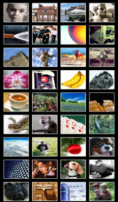
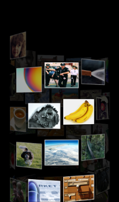
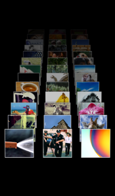

# ItemView


The `Dali::Toolkit::ItemView` class is a scrollable container that can contain many items. It provides several scrollable layouts, as illustrated in the following figure.

**Figure: ItemView layouts**

| Grid                                     | Spiral                                   | Depth                                    |
|------------------------------------------|------------------------------------------|------------------------------------------|
|  |  |  |

You can also create your own custom layout by inheriting from the `Dali::Toolkit::ItemLayout` class.

In this tutorial, the following subjects are covered:

[ItemView events](#1)<br>
[Implementing ItemFactory](#2)<br>
[Creating an ItemView](#3)<br>
[ItemView Properties](#4)<br>

<a name="1"></a>
## ItemView events

The following table lists the basic signals provided by the `Dali::Toolkit::ItemView` class.

**Table: Dali::Toolkit::ItemView input signals**

| Input signal              | Description                                 |
|---------------------------|---------------------------------------------|
| `LayoutActivatedSignal()` | Emitted when layout activation is finished. |

<a name="2"></a>
## Implementing ItemFactory

To create a `Dali::Toolkit::ItemView` instance, you must create your own `ItemFactory` class by deriving from the `Dali::Toolkit::ItemFactory` class and providing its instance to the `ItemView::New()` function. `ItemFactory` is an abstract class having 2 pure virtual member functions to create items and get the number of created items. The following basic example shows how to implement an `ItemFactory` class:

```
class MyFactory : public ItemFactory
{
  public:
    virtual unsigned int GetNumberOfItems()
    {
      // Return the number of items
      return MY_ITEM_COUNT;
    }

    virtual Actor NewItem( unsigned int itemId )
    {
      // Create the actor representing
      // the item based on the itemId
      return ImageView::New( MY_IMAGE_PATHS[itemId] );
    }
};
```

The overridden functions in the derived class are called by the `ItemView` object.

<a name="3"></a>
## Creating an ItemView

The following basic example shows how to create a `Dali::Toolkit::ItemView` object:

```
class HelloWorldExample : public ConnectionTracker
{
  // Store a factory as a member variable
  MyFactory mFactory;
};

void HelloWorldExample::Create( Application& application )
{
  // Create an ItemView with the factory
  ItemView itemView = ItemView::New( mFactory );
  itemView.SetParentOrigin( ParentOrigin::CENTER );

  // Create a layout
  ItemLayoutPtr spiralLayout = DefaultItemLayout::New( DefaultItemLayout::SPIRAL );

  // Add the layout to the itemView
  itemView.AddLayout( *spiralLayout );
  // More layouts can be created and added to the itemView

  // Activate the layout
  itemView.ActivateLayout( 0, Vector3( Stage::GetCurrent().GetSize() ), 0 );

  // Add the itemView to the stage
  Stage::GetCurrent().Add( itemView );
}
```

<a name="4"></a>
## ItemView Properties

The following table lists the available ItemView properties.

**Table: ItemView properties**

| Property                     | Type       | Description                              |
|------------------------------|------------|------------------------------------------|
| `MINIMUM_SWIPE_SPEED`        | FLOAT      | The minimum swipe speed in pixels per second |
| `MINIMUM_SWIPE_DISTANCE`     | FLOAT      | The minimum swipe distance in actor coordinates |
| `WHEEL_SCROLL_DISTANCE_STEP` | FLOAT      | The step of scroll distance in actor coordinates for each wheel event received |
| `SNAP_TO_ITEM_ENABLED`       | BOOLEAN    | Whether the animation for the layout to scroll to its anchor position after dragging or swiping is enabled |
| `REFRESH_INTERVAL`           | FLOAT      | The interval between refreshes           |
| `LAYOUT`                     | ARRAY      | The layout used                          |
| `LAYOUT_POSITION`            | FLOAT      | The current logical position within the layout |
| `SCROLL_SPEED`               | FLOAT      | The scrolling speed when playing the flick animation |
| `OVERSHOOT`                  | FLOAT      | The amount that we can scroll beyond the boundary |
| `SCROLL_DIRECTION`           | FLOAT      | The current scrolling direction          |
| `LAYOUT_ORIENTATION`         | INTEGER    | The current orientation of the layout    |
| `SCROLL_CONTENT_SIZE`        | FLOAT      | The size of the content                  |

## Related Information
* Dependencies
 - Tizen 2.4 and Higher for Mobile
 - Tizen 3.0 and Higher for Wearable
