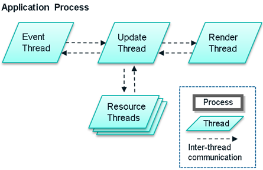
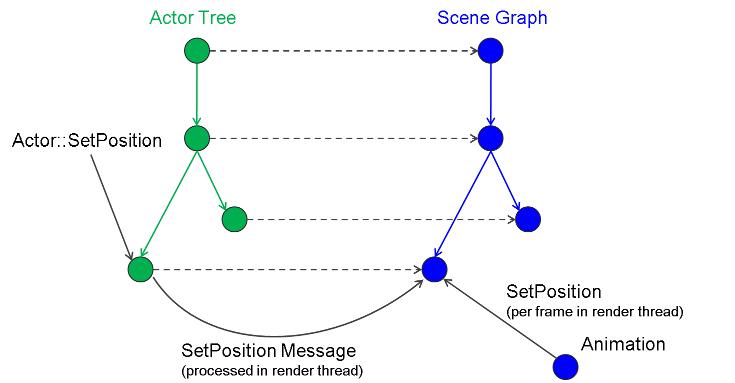

# Multi-threaded Architecture
## Dependencies
- Tizen 2.4 and Higher for Mobile
- Tizen 3.0 and Higher for Wearable

DALi uses a multi-threaded architecture to provide the best performance and scalability:

- **Event thread**: Main thread in which the application code and event handling run.
- **Update thread**: Updates the nodes on the scene as well as the running animations and constraints.
- **Render thread**: OpenGL&reg; drawing, texture, and geometry uploading.
- **Resource thread**: Loads images and decodes them into bitmaps.

**Figure: DALi thread architecture**



## Animations with Multi-threading

DALi animations and rendering occur in a dedicated render thread. This allows animations to run smoothly, regardless of the time taken to process input events in the application code.

Internally, DALi contains the scene graph that mirrors the actor hierarchy. The scene graph objects perform the actual animation and rendering, while the actors provide thread-safe access. Actors and scene graph objects communicate through messaging.

The following figure shows an actor hierarchy, in which one of the actors is being animated. The green objects in are created by the application code, while the blue private objects are used in the dedicated render thread.

**Figure: Actor hierarchy with an animation**


### Reading an Animated Value

When a property is animatable, it can only be modified in the render thread. The value returned from a getter function is the value used when the previous frame was rendered.

For example, the `GetCurrentPosition()` function returns the position in which the actor was last rendered. Since the `SetPosition()` function is asynchronous, a call to `GetCurrentPosition()` function does not immediately return the same value.

```
Actor actor = Actor::New();
Stage::GetCurrent().Add( actor ); // Initial position is 0, 0, 0

actor.SetPosition( Vector3( 10, 10, 10 ) );

Vector3 current;
current = actor.GetCurrentPosition();
std::cout << "Current position: " << current.x << ", " << current.y << ", " << current.z << std::endl;

std::cout << "..." << std::endl;

// Handling another event

current = actor.GetCurrentPosition();
std::cout << "Current position: " << current.x << ", " << current.y << ", " << current.z << std::endl;
```

The above code is likely to output:

```
Actor actor = Actor::New();
"Current position: 0,0,0"
// Other positions
"Current position: 10,10,10"
```

### Setting a Property during an Animation

When a property is being animated, the animation overrides all values set with other functions, such as the `SetPosition()` function.

**Figure: Actor hierarchy with an animated property**



The order of execution in the render thread is:

1. Process the message and call the `SetPosition()` function.
2. Apply the animation and call the `SetPosition()` function.
3. Render the frame.

## Resource Loading with Multi-threading

DALi loads resources in separate threads. If these resource threads are not used, a large image file causes a block in the main thread, which cannot process the next operation while reading data from a file system or downloading from the network.

Currently, DALi creates one thread for loading local resources and another for loading remote resources, as required.