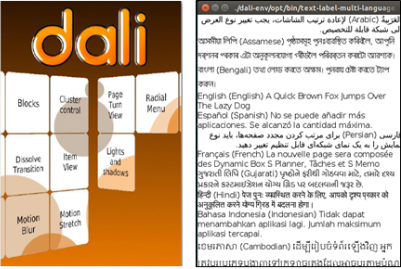
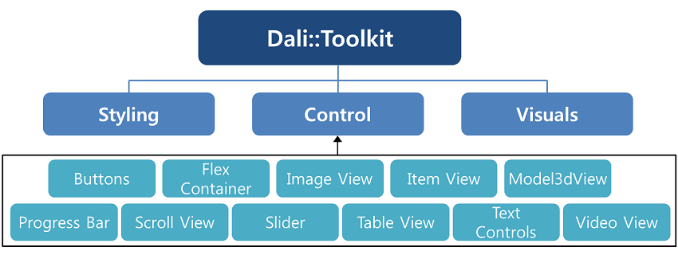

# UI Components

## Dependencies

- Tizen 2.4 and Higher for Mobile
- Tizen 3.0 and Higher for Wearable

UI components are interactive components for layouting and scrolling the user interface. DALi provides UI components, such as buttons, item view, scroll view, table view, text controls, image view, flex container, model3dview, slider, and video view.

**Figure: DALi UI components**

The following table lists the available UI components.

**Table: DALi UI components**

| Control                               | Description                              | Related classes                          |
| ------------------------------------- | ---------------------------------------- | ---------------------------------------- |
| [Buttons](./buttons-n.md)             | A push button that can be pressed, a checkbox button that can be checked/unchecked, and a radio button that only one option can be selected. | `Button`, `PushButton`, `CheckBoxButton`, `RadioButton` |
| [FlexContainer](./flexcontainer-n.md) | A layout model that allows responsive elements within a container, automatically arranged to different size screens or devices. | `FlexContainer`              |
| [ImageView](./imageview-n.md)         | An image view that renders an image.     | `ImageView`                              |
| [ItemView](./itemview-n.md)           | An item view that renders item sets in a scrollable layout. | `ItemView`, `ItemFactory`, `ItemLayout`, `Scrollable` |
| [Model3dView](./model3dview-n.md)     | A model view that displays static 3D content. | `Model3dView`                            |
| [ProgressBar](./progressbar-n.md)     | A control to give the user an indication of the progress of an operation. | `ProgressBar`                              |
| [ScrollView](./scrollview-n.md)       | A scroll view to provide scrollable view. | `ScrollView`, `Scrollable`, `ScrollViewEffect`, `ScrollViewPagePathEffect` |
| [Slider](./slider-n.md)               | A control that indicates a modifiable value within a specific range. | `Slider`                                 |
| [TableView](./tableview-n.md)         | A table view that can align child actors in a grid like layout. | `TableView`                              |
| [TextLabel](./textlabel-n.md)         | A text label that renders a short text string. | `TextLabel`                              |
| [TextField](./textfield-n.md)         | A text field that provides a single-line editable text. | `TextField`                              |
| [TextEditor](./texteditor-n.md)       | A text field that provides a multi-line editable text. | `TextEditor`                             |
| [VideoView](./videoview-n.md)         | A video view that controls and displays video playback. | `VideoView`                              |

The base class for the components is `Dali::Toolkit::Control` (in [mobile](http://org.tizen.native.mobile.apireference/classDali_1_1Toolkit_1_1Control.html) and [wearable](http://org.tizen.native.wearable.apireference/classDali_1_1Toolkit_1_1Control.html) applications). This class can also be used to create your own custom UI components. For tips for the control class, see [Control](./control_base_n.md). In this UI Components guide, both the terms **control** and **component** are used to refer to a UI component.

You can [customize the look of the UI components with stylesheets](./styling_n.md). For a reusable rendering logic that can be used by all UI components, take advantage of [DALi visuals](./visuals_n.md).

The following figure illustrates the hierarchy of the UI components.

**Figure: DALi UI component hierarchy**

