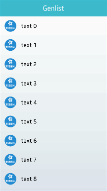
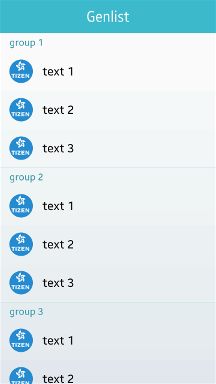
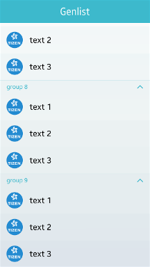
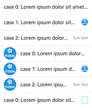

# Genlist

The genlist UI component displays a scrollable list of items. It allows you to manage a lot of items while still being fast and having a low memory footprint, as only visible items are allocated in the memory. For more information, see the [Genlist](../../../../../org.tizen.native.mobile.apireference/group__Elm__Genlist.html) API.

This feature is supported in mobile applications only.

To save memory and speed up processing when many items exist, the genlist uses the concept of "realization" when managing items. It means that a genlist item creates its text and content (realizes) when the user scrolls the list and the item shows up on the screen, and frees them (unrealizes) when the item is scrolled out of the screen. Since item realization is dynamic, you cannot set content in advance. You need to fill the item in the form of a callback function. That is the key point of using a genlist component.

## Basic Usage

To use a genlist component in your application:

1. Add a genlist with the `elm_genlist_add()` function:

   ```
   Evas_Object *genlist;

   genlist = elm_genlist_add(parent);
   ```

2. Define the genlist item class:

   1. Create a genlist item class with the `elm_genlist_item_class_new()` function, set a style to the item class, and register callback functions. The genlist item class must be freed manually with the `elm_genlist_item_class_free()` function after all items are appended.

      ```
      Elm_Genlist_Item_Class *itc = elm_genlist_item_class_new();

      itc->item_style = "default";
      itc->func.text_get = _item_label_get;
      itc->func.content_get = _item_content_get;
      itc->func.del = _item_del;
      ```

   2. Define the `text_get` function.

      When a genlist item becomes realized, the `text_get` function is called repeatedly for all text parts in that item. After the text is set to the part, it is freed automatically. Do not free it manually.

      ```
      static char*
      _item_label_get(void *data, Evas_Object *obj, const char *part)
      {
          if (!strcmp(part, "elm.text"))
              return strdup("text");
          else
              return NULL;
      }
      ```

   3. Define the `content_get` function.

      The `content_get` function is called repeatedly for all swallow parts in the item. It must return a valid object handle to be set, or `NULL` when no content is desired. The object is deleted by the genlist on its deletion or when the item is unrealized.

      ```
      static Evas_Object*
      _item_content_get(void *data, Evas_Object *obj, const char *part)
      {
          if (!strcmp(part, "elm.swallow.icon")) {
              Evas_Object *img = elm_image_add(obj);
              elm_image_file_Set(img, "sample.png", NULL);

              return img;
          } else {
              return NULL;
          }
      }
      ```

   4. Define the `del` function.

      This function is called when the genlist item is deleted. It deletes any data that has been allocated at the item's creation.

      ```
      static void
      _item_del(void *data, Evas_Object *obj)
      {
          printf("item(%d) is now deleted", (int)data);
      }
      ```

3. Append items to the genlist with the `elm_genlist_item_append()` function.

   ```
   elm_genlist_item_append(genlist, itc, (void *)i, NULL, ELM_GENLIST_ITEM_NONE,
                           _item_selected_cb, (void *)i);
   ```

4. Register the [callback](#callbacks) functions for the genlist and its items.The following example shows how to define a callback for when the genlist item is selected:

   ```
   static void
   _item_selected_cb(void *data, Evas_Object *obj, void *event_info)
   {
       printf("item(%d) is selected", (int)data);
   }
   ```

The following example shows a simple use case of the genlist component.

**Example: Genlist use case**



```
Evas_Object *win;
Evas_Object *conf;
Evas_Object *nf;
Evas_Object *genlist;
Elm_Object_Item *nf_it;
Elm_Genlist_Item_Class *itc;

/* Starting right after the basic EFL UI layout code */
/* win - conformant - naviframe */

genlist = elm_genlist_add(nf);
evas_object_show(genlist);
elm_naviframe_item_push(nf, "Genlist", NULL, NULL, genlist, NULL);

itc = elm_genlist_item_class_new();
itc->item_style = "default";
itc->func.content_get = _item_content_get;
itc->func.text_get = _item_label_get;
itc->func.del = _item_del;

int i;
for (i = 0; i < 10; i++) {
    elm_genlist_item_append(genlist, /* Genlist object */
                            itc, /* Genlist item class */
                            (void *)i, /* Item data */
                            NULL, /* Parent item */
                            ELM_GENLIST_ITEM_NONE, /* Item type */
                            NULL, /* Select callback */
                            NULL); /* Callback data */
}
elm_genlist_item_class_free(itc);

_item_label_get(void *data, Evas_Object *obj, const char *part)
{
    char buf[16];
    int i = (int) data;
    if (!strcmp(part, "elm.text")) {
        sprintf(buf, "text %d", i);

        return strdup(buf);
    }

    else return NULL;
}

static Evas_Object*
_item_content_get(void *data, Evas_Object *obj, const char *part)
{
    if (!strcmp(part, "elm.swallow.icon")) {
        Evas_Object *img = elm_image_add(obj);
        ret = elm_image_file_set(img, ICON_DIR"/tizen.png", NULL);
        evas_object_size_hint_min_set(img, ELM_SCALE_SIZE(30), ELM_SCALE_SIZE(30));

        return img;
    }

    else return NULL;
}

static void
_item_del(void *data, Evas_Object *obj)
{
    printf("item(%d) is now deleted", (int) data);
}
```

## Options

You can define the genlist item mode and compress mode as options. You can also select and update items.

### Item Mode

The genlist defines the concept of the item mode to provide a way to enrich a list view. The genlist component is able to display trees or a group mode where scrolling keeps the item at the top of the component until another group comes and replaces it. This is most useful for title items. Establish the parent-children relationship when adding the children items.

The following item types are available:

- `ELM_GENLIST_ITEM_NONE`
- `ELM_GENLIST_ITEM_TREE`
- `ELM_GENLIST_ITEM_GROUP`

You can use the group items in the group mode or tree mode:

- To group several items under a parent item using the group mode, follow these steps in addition to the basic usage:

  1. Define another genlist item class which is used to append group items, and set the `group_index` style to it.
  2. Append group items with the `ELM_GENLIST_ITEM_GROUP` parameter.
  3. Append child items with the group item and the `ELM_GENLIST_ITEM_NONE` parameter.

  **Example: Genlist group mode use case**

  

  ```
  Elm_Genlist_Item_Class *itc;
  Elm_Genlist_Item_Class *gitc;
  Elm_Object_Item *g;
  int i;
  int j;

  itc = elm_genlist_item_class_new();
  itc->item_style = "default";
  itc->func.content_get = _item_content_get;
  itc->func.text_get = _item_label_get;
  itc->func.del = _item_del;

  gitc = elm_genlist_item_class_new();
  gitc->item_style = "group_index";
  gitc->func.text_get = _group_item_label_get;
  gitc->func.del = _item_del;


  for (i = 1; i < 10; i++) {
      g = elm_genlist_item_append(genlist,
                                  gitc,
                                  (void *)i,
                                  NULL,
                                  ELM_GENLIST_ITEM_GROUP, /* Group item */
                                  NULL,
                                  NULL);
      for (j = 1; j < 4; j++) {
          elm_genlist_item_append(genlist,
                                  itc,
                                  (void *)j,
                                  g, /* Pass group item as a parameter */
                                  ELM_GENLIST_ITEM_NONE, /* Child item */
                                  NULL,
                                  NULL);
      }
  }
  elm_genlist_item_class_free(itc);
  elm_genlist_item_class_free(gitc);
  ```

- To group several items under a parent item using the tree mode, follow these steps in addition to the basic usage:

  1. Define another genlist item class which is used to append group items, and set the `group_index/expandable` style to it.
  2. Append group items with the `ELM_GENLIST_ITEM_TREE` parameter.
  3. Append child items with the group item and the `ELM_GENLIST_ITEM_NONE` parameter.

  **Example: Genlist tree mode use case**

  

  ```
  Elm_Genlist_Item_Class *titc;
  Elm_Object_Item *it;
  int i;

  /*
     Register the callback functions to make the genlist
     "expanded" or "contracted" when "selected"
  */
  evas_object_smart_callback_add(genlist, "selected", gl_selected_cb, NULL);
  evas_object_smart_callback_add(genlist, "expanded", gl_expanded_cb, NULL);
  evas_object_smart_callback_add(genlist, "contracted", gl_contracted_cb, NULL);

  titc = elm_genlist_item_class_new();
  titc->item_style = "group_index/expandable";
  titc->func.text_get = _group_item_label_get;
  titc->func.del = _item_del;

  for (i = 1; i < 10; i++) {
	it = elm_genlist_item_append(genlist,
                                 titc,
                                 (void *)i,
                                 NULL,
                                 ELM_GENLIST_ITEM_TREE, /* Tree item */
                                 NULL,
                                 NULL);
    /* Expand each item */
    /* This causes the "expanded" callback to be called */
    elm_genlist_item_expanded_set(it, EINA_TRUE);
  }

  static void
  gl_selected_cb(void *data, Evas_Object *obj, void *event_info)
  {
      Elm_Object_Item *it = event_info;
      Eina_Bool expanded = EINA_FALSE;

      expanded = elm_genlist_item_expanded_get(it);
      elm_genlist_item_expanded_set(it, !expanded);
  }

  static void
  gl_expanded_cb(void *data EINA_UNUSED, Evas_Object *obj EINA_UNUSED, void *event_info)
  {
      Elm_Object_Item *it = event_info;
      Evas_Object *genlist = elm_object_item_widget_get(it);
      Elm_Genlist_Item_Class *itc;
      int i;

      itc = elm_genlist_item_class_new();
      itc->item_style = "default";
      itc->func.content_get = _item_content_get;
      itc->func.text_get = _item_label_get;
      itc->func.del = _item_del;

      for (i = 1; i < 4; i++) {
          elm_genlist_item_append(genlist,
                                  itc,
                                  (void *)i,
                                  it, /* Set the selected item as parent */
                                  ELM_GENLIST_ITEM_NONE,
                                  NULL,
                                  NULL);
      }
      elm_genlist_item_class_free(itc);
  }

  static void
  gl_contracted_cb(void *data EINA_UNUSED, Evas_Object *obj EINA_UNUSED,
                   void *event_info)
  {
      Elm_Object_Item *it = event_info;

      elm_genlist_item_subitems_clear(it);
  }
  ```

You can retrieve the parent of an item with the `elm_genlist_item_parent_get()` function. When the children of an item are no longer needed, you can clear them with the `elm_genlist_item_subitems_clear()` function.

### Compress Mode

The genlist and item size can be managed through the mode set by the `elm_genlist_mode_set()` function:

- `ELM_LIST_COMPRESS`  
The genlist respects its container's geometry. Even if there are items exceeding the genlist in the transverse axis, the genlist is not scrollable in that direction.

- `ELM_LIST_SCROLL`  
Same as `ELM_LIST_COMPRESS`, but if there are items exceeding the genlist in the transverse axis, the genlist is scrollable in that direction.

- `ELM_LIST_LIMIT`  
Sets a minimum size hint on the list object, so that containers can respect it. A minimum size hint is set for its transverse axis, so that the largest item in that direction fits well.

- `ELM_LIST_EXPAND`  
Besides setting a minimum size on the transverse axis, like `ELM_LIST_LIMIT`, the list sets a minimum size on the longitudinal axis, trying to reverse space to all its children to be visible at a time.

### Item Selection

To select or deselect items manually, use the `elm_genlist_item_selected_set()` function.

By default, the genlist is in a single-selection mode: only 1 item can be selected at a time.

To manage the item selection, use the following functions:

- `elm_genlist_multi_select_set()`: Activate multi-selection mode.
- `elm_genlist_selected_item_get()`: Retrieve the selected item.
- `elm_genlist_selected_items_get()`: Retrieve the list of the currently selected items.

> **Note**  
> The item selection comes with a highlight effect. If the user wants to cancel the highlight by touch off, you must cancel the select operation in the `select()` callback:

```
static void
select_cb(void *data, Evas_Object *obj, void *event_info)
{
    Elm_Object_Item *it = (Elm_Object_Item *)event_info;
    /* Cancel select and highlight when item is selected */
    elm_genlist_item_selected_set(it, EINA_FALSE);
}
```

Calling this function does not show or hide any child of an item (if it is a parent). You must manually delete and create them on the callbacks of the `expanded` or `contracted` signals.

### Item Update

You can update the items using the following functions:

- `elm_genlist_item_update()`: Update an item
- `elm_genlist_item_fields_update()`: Update only specific parts:  
  - `ELM_GENLIST_ITEM_FIELD_TEXT`
  - `ELM_GENLIST_ITEM_FIELD_CONTENT`

## Styles

The genlist has a separate style for itself and for its items. The genlist style determines the characteristics of the entire scrollable area.

The genlist items have a gradient opacity from the top to the bottom rather than an explicit divider since Tizen 2.4. Each item is identified by its color, made by blending its opacity and background color (or image). The `solid` prefix in a genlist style name means that genlist items have an explicit divider and background color. To set a genlist with a solid background color:

```
elm_object_style_set(genlist, "solid/default");
```

The following table lists the available component styles.

**Table: Genlist styles**

| Style                            | Sample                                   | Notes                                    |
|------------------------ ---------|------------------------------------------|------------------------------------------|
| `elm/genlist/base/solid/default` |  | N/A                                      |
| `default`                        |                  -                        | Same as `effect`.                        |
| `effect`                         |              -                            | When the genlist reaches its edge during scrolling, it shows an effect. |
| `no_effect`                      |              -                            | The genlist has no effect when it reaches an edge. |
| `handler`                        |              -                            | Enables a scrollbar that eases scrolling through the whole list. |
| `solid/effect`                   |              -                            | N/A                                      |
| `solid/no_effect`                |              -                            | N/A                                      |
| `solid/handler`                  |            -                              | N/A                                      |

### Item Styles

The genlist item style determines the number of parts for text and content, and their arrangement within the item. For example, a default style item has 1 text part (`elm.text`), and 2 content parts (`elm.swallow.icon` and `elm.swallow.end`).

The following table lists the available item styles.

**Table: Genlist item styles**

| Style                                    | Sample                                   | Text part                                | Swallow part                             |
|----------------------------------------|----------------------------------------|----------------------------------------|----------------------------------------|
| `elm/genlist/item/type1/default`         |  | `elm.text`<br>`elm.text.end`<br>`elm.text.sub`<br>`elm.text.sub.end` | `elm.swallow.bg`<br>`elm.swallow.icon`<br>`elm.swallow.icon.0`<br>`elm.swallow.icon.1`<br>`elm.swallow.icon.2`<br>`elm.swallow.end` |
| `elm/genlist/item/type2/default`         |  | `elm.text`<br>`elm.text.end`<br>`elm.text.sub`<br>`elm.text.sub.end` | `elm.swallow.bg`<br>`elm.swallow.icon`<br>`elm.swallow.icon.0`<br>`elm.swallow.icon.1`<br>`elm.swallow.end` |
| `elm/genlist/item/multiline/default`     |  | `elm.text`<br>`elm.text.multiline`       | `elm.swallow.bg`<br>`elm.swallow.icon`<br>`elm.swallow.icon.0`<br>`elm.swallow.icon.1`<br>`elm.swallow.icon.2`<br>`elm.swallow.end` |
| `elm/genlist/item/full/default`          |  | N/A                                      | `elm.swallow.bg`<br>`elm.swallow.content` |
| `elm/genlist/item/group_index/default`   |  | `elm.text`<br>`elm.text.end`             | `elm.swallow.bg`<br>`elm.swallow.end`    |
| `elm/genlist/item/group_index/expandable/default` |  | `elm.text`                               | N/A                                      |
| `elm/genlist/item/default/default`       |  | `elm.text`                               | `elm.swallow.icon`<br>`elm.swallow.end`  |
| `elm/genlist/item/double_label/default`  |  | `elm.text`<br>`elm.text.sub`             | `elm.swallow.icon`<br>`elm.swallow.end`  |
| `elm/genlist/item/one_icon/default`      |  | `elm.text`                               | `elm.swallow.icon`                       |
| `elm/genlist/item/end_icon/default`      |  | `elm.text`                               | `elm.swallow.end`                        |

## Callbacks

You can register callback functions connected to the following signals for a genlist object.

**Table: Genlist callback signals**

| Signal                 | Description                              | `event_info`                             |
|----------------------|----------------------------------------|----------------------------------------|
| `activated`            | The item is double-clicked or pressed (enter &#124; return &#124; spacebar). | `Elm_Object_Item`                        |
| `clicked,double`       | The item is double-clicked.              | `Elm_Object_Item`                        |
| `selected`             | The item is selected.                    | `Elm_Object_Item`                        |
| `unselected`           | The item is unselected.                  | `Elm_Object_Item`                        |
| `expanded`             | The item is to be expanded with the `elm_genlist_item_expanded_set()` function. The callback fills in the child items. | `Elm_Object_Item`                        |
| `contracted`           | The item is to be collapsed with the `elm_genlist_item_expanded_set()` function. The callback deletes the child items. | `Elm_Object_Item`                        |
| `expand,request`       | The user wants to expand a tree branch item. The callback decides whether the item can expand (if it has any children) and calls the `elm_genlist_item_expanded_set()` function to set the state. | `Elm_Object_Item`                        |
| `contract,request`     | The user wants to collapse a tree branch item. The callback decides whether the item can collapse (if it has any children) and calls the `elm_genlist_item_expanded_set()` function to set the state. | `Elm_Object_Item`                        |
| `realized`             | The item is created as a real Evas object. | `Elm_Object_Item`                        |
| `unrealized`           | The item is going to be unrealized. Provided content objects are deleted and the item object is deleted or put into a floating cache. | `Elm_Object_Item`                        |
| `drag,start,up`        | The item in the list is dragged (not scrolled) up. | `Elm_Object_Item`                        |
| `drag,start,down`      | The item in the list is dragged (not scrolled) down. | `Elm_Object_Item`                        |
| `drag,start,left`      | The item in the list is dragged (not scrolled) left. | `Elm_Object_Item`                        |
| `drag,start,right`     | The item in the list is dragged (not scrolled) right. | `Elm_Object_Item`                        |
| `drag,stop`            | The item in the list has stopped being dragged. | `Elm_Object_Item`                        |
| `drag`                 | The item in the list is being dragged.   | `Elm_Object_Item` object that contains the dragged item |
| `longpressed`          | The item is pressed for a certain amount of time. The default specified time is 1 second. | `Elm_Object_Item` object that contains the pressed item |
| `scroll,anim,start`    | The scrolling animation is started.      | `NULL`                                   |
| `scroll,anim,stop`     | The scrolling animation is stopped.      | `NULL`                                   |
| `scroll,drag,start`    | Dragging the content is started.         | `NULL`                                   |
| `scroll,drag,stop`     | Dragging the content is stopped.         | `NULL`                                   |
| `scroll`               | Scrolling is ongoing.                    | `NULL`                                   |
| `edge,top`             | The genlist is scrolled to the top edge. | `NULL`                                   |
| `edge,bottom`          | The genlist is scrolled to the bottom edge. | `NULL`                                   |
| `edge,left`            | The genlist is scrolled to the left edge. | `NULL`                                   |
| `edge,right`           | The genlist is scrolled to the right edge. | `NULL`                                   |
| `multi,swipe,left`     | The genlist is multi-touch-swiped left.  | `Elm_Object_Item` object that contains the swiped item |
| `multi,swipe,right`    | The genlist is multi-touch-swiped right. | `Elm_Object_Item` object that contains the swiped item |
| `multi,swipe,up`       | The genlist is multi-touch-swiped up.    | `Elm_Object_Item` object that contains the swiped item |
| `multi,swipe,down`     | The genlist is multi-touch-swiped down.  | `Elm_Object_Item` object that contains the swiped item |
| `multi,pinch,out`      | The genlist is multi-touch-pinched out.  | `Elm_Object_Item` object that contains the pinched item |
| `multi,pinch,in`       | The genlist is multi-touch-pinched in.   | `Elm_Object_Item` object that contains the pinched item |
| `swipe`                | The genlist is swiped.                   | `Elm_Object_Item` object that contains the swiped item |
| `moved`                | The item is moved in the reorder mode.   | `Elm_Object_Item` object that contains the moved item |
| `moved,after`          | The item is moved after another item in the reorder mode. To access the relative previous item, use the `elm_genlist_item_prev_get()` function. This signal is called along with the `moved` signal. | `Elm_Object_Item` object that contains the moved item |
| `moved,before`         | The item is moved before another item in the reorder mode. To access the relative next item, use the `elm_genlist_item_next_get()` function. This signal is called along with the `moved` signal. | `Elm_Object_Item` object that contains the moved item |
| `language,changed`     | The program language changes.            | `NULL`                                   |
| `tree,effect,finished` | The genlist tree effect is finished.     | `NULL`                                   |
| `pressed`              | The item is pressed by mouse down.       | `Elm_Object_Item` object that contains the pressed item |
| `released`             | The item is released by mouse up.        | `Elm_Object_Item` object that contains the released item |

> **Note**  
> The signal list in the API reference can be more extensive, but only the above signals are actually supported in Tizen.

> **Note**  
> Except as noted, this content is licensed under [LGPLv2.1+](http://opensource.org/licenses/LGPL-2.1).

## Related Information
- Dependencies
  - Tizen 2.4 and Higher for Mobile
