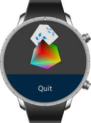

# GLView

This feature is supported in wearable applications only.

The GLView component renders OpenGL&reg; in an Elementary object, which hides Evas GL complexity.

For more information, see the [OpenGL&reg; ES](../../graphics/opengl.md) guide and the [GLView](../../../../../org.tizen.native.wearable.apireference/group__Elm__GLView.html) API.

**Figure: GLView component**



**Figure: GLView hierarchy**


## Adding a GLView Component

To create a GLView component:

1. Add a GLView component using the `elm_glview_add()` function:

   ```
   Evas_Object *glview;
   Evas_Object *parent;

   glview = elm_glview_add(parent);
   ```

2. Set the size of the GLView.

   To set the size to 200 x 200 pixels:

   ```
   elm_glview_size_set(glview, 200, 200);
   ```

## Configuring the GLView

To configure the GLView:

- Enable the appropriate GLView rendering modes. The [Elm_GLView_Mode](../../../../../org.tizen.native.wearable.apireference/group__GLView.html#ga4d0a2281e13c66d7274987ef24e7abe7) enumerator defines the available modes.

  To enable the alpha channel and depth buffer rendering modes:

  ```
  elm_glview_mode_set(glview, ELM_GLVIEW_ALPHA | ELM_GLVIEW_DEPTH);
  ```

- Set the resize policy.

  To set a policy that decides what to do with the OpenGL&reg; ES surface when the GLView component is resized:

  ```
  elm_glview_resize_policy_set(glview, ELM_GLVIEW_RESIZE_POLICY_RECREATE);
  ```

  The OpenGL&reg; ES surface is destroyed and recreated in the new size (default function). The resize policy can also be set to `ELM_GLVIEW_RESIZE_POLICY_SCALE`, in which case only the image object is scaled, not the underlying OpenGL&reg; ES surface.

- Set the GLView rendering policy.

  To always redraw the GLView component during the rendering loop:

  ```
  elm_glview_render_policy_set(glview, ELM_GLVIEW_RENDER_POLICY_ALWAYS);
  ```

  The rendering policy can also be set to `ELM_GLVIEW_RENDER_POLICY_ON_DEMAND` (default function), in which case the GLView component is redrawn only when it is visible.

- Register callbacks for managing changes in the GLView component state:

  - The initialization callback is called at the GLView component creation.
  - The deletion callback is called when the GLView component is deleted.
  - The resize callback is called during the rendering loop when the GLView component is resized.
  - The render callback is called when the GLView component must be redrawn.

  ```
  elm_glview_init_func_set(glview, _init_gl_cb);
  elm_glview_del_func_set(glview, _del_gl_cb);
  elm_glview_resize_func_set(glview, _resize_gl_cb);
  elm_glview_render_func_set(glview, _draw_gl_cb);
  ```

## Using the GLView Callbacks

To receive notifications about the GLView events, listen for the following signals:

- `focused`: The GLView component is focused.  
The `event_info` callback parameter points at an `Elm_Focus_Info` object.

- `unfocused`: The GLView object is unfocused.

> **Note**  
> The signal list in the API reference can be more extensive, but only the above signals are actually supported in Tizen.

To register and define a callback for the `focused` signal:

```
{
    evas_object_smart_callback_add(glview, "focused", focused_cb, data);
}

/* Callback for the "focused" signal */
/* Called when the GLView is focused */
void
focused_cb(void *data, Evas_Object *obj, void  *event_info)
{
    Elm_Focus_Info *fi = event_info;

    dlog_print(DLOG_INFO, LOG_TAG, "GLView is focused\n");
}
```

> **Note**  
> Except as noted, this content is licensed under [LGPLv2.1+](http://opensource.org/licenses/LGPL-2.1).

## Related Information
- Dependencies
  - Tizen 2.3.1 and Higher for Wearable
