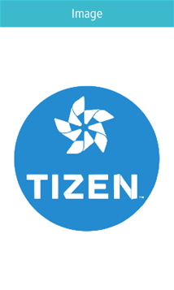

# Image

This feature is supported in mobile applications only.

The image component can load and display an image from a disk file or a memory region.

For more information, see the [Image](../../../../../org.tizen.native.mobile.apireference/group__Elm__Image.html) API.

**Figure: Image component**



**Figure: Image hierarchy**


## Adding an Image Component

To create an image component, use the `elm_image_add()` function:

```csharp
Evas_Object *image;
Evas_Object *parent;

image = elm_image_add(parent);
```

## Configuring the Image

To configure the image component:

- Disable Elementary scaling so that the image does not scale but resizes in both directions:

  ```csharp
  elm_image_no_scale_set(image, EINA_TRUE);
  elm_image_resizable_set(image, EINA_TRUE, EINA_TRUE);
  ```

- To keep the original aspect ratio when resizing the image, define how the image fits into the object's area:

  ```csharp
  /* Tell the image to keep original aspect ratio */
  elm_image_aspect_fixed_set(image, EINA_TRUE);
  /* Then let the image fill the entire object */
  elm_image_fill_outside_set(image, EINA_TRUE);
  ```

  In the above configuration, a part of the image can go outside the object. If the `elm_image_fill_outside_set()` function is set to `EINA_FALSE`, the image stays inside the limits of the parent object.

- Use the smooth scaling algorithm to provide a better quality image. It is slower than the default algorithm.

  ```
  elm_image_smooth_set(image, EINA_TRUE);
  ```

- Preload images without blocking the user interface. This preserves the reactivity of the user experience, as the image is loaded in a thread.

  To disable preloading:

  ```
  elm_image_preload_disabled_set(image, EINA_TRUE);
  ```

- Rotate or flip the image.

  The following orientation changes are available:

  - `ELM_IMAGE_ORIENT_0`: No orientation change.
  - `ELM_IMAGE_ROTATE_90`: Rotate the image 90 degrees clockwise.
  - `ELM_IMAGE_ROTATE_180`: Rotate the image 180 degrees clockwise.
  - `ELM_IMAGE_ROTATE_270`: Rotate the image 90 degrees counter-clockwise.
  - `ELM_IMAGE_FLIP_HORIZONTAL`: Flip the image horizontally.
  - `ELM_IMAGE_FLIP_VERTICAL`: Flip the image vertically.
  - `ELM_IMAGE_FLIP_TRANSPOSE`: Flip the image along the bottom-left to top-right line.
  - `ELM_IMAGE_FLIP_TRANSVERSE`: Flip the image along the top-left to bottom-right line.

  ```
  elm_image_orient_set(image, ELM_IMAGE_ROTATE_180);
  ```

- Execute an animation:

  - To check whether the image supports animation, use the `elm_image_animated_available_get()` function.
  - To define whether the image must animate itself, use the `elm_image_animated_set()` function. To enable the animation, use the `EINA_TRUE` flag.
  - To control the animation, use the `elm_image_animated_play_set()` function. To play the animation, use the `EINA_TRUE` flag, and to stop the animation, use the `EINA_FALSE` flag.

  ```csharp
  if (elm_image_animated_available_get(image)) {
      elm_image_animated_set(image, EINA_TRUE);
      elm_image_animated_play_set(image, EINA_TRUE);
  }
  ```

## Callbacks

You can register callback functions connected to the following signals for an image object.

**Table: Image callback signals**

| Signal    | Description                              | `event_info`               |
|---------|----------------------------------------|--------------------------|
| `drop`    | An image-type object is dropped onto the object in question. | The path to the image file |
| `clicked` | The image is clicked.                    | `NULL`                     |

> **Note**  
> The signal list in the API reference can be more extensive, but only the above signals are actually supported in Tizen.

The following example shows how to define and register a callback for the `clicked` signal:

```csharp
evas_object_smart_callback_add(image, "clicked", clicked_cb, data);

/* Callback for the "clicked" signal */
/* Called when the user clicks on the image */
void
clicked_cb(void *data, Evas_Object *obj, void *event_info)
{
    dlog_print(DLOG_INFO, LOG_TAG, "Image clicked\n");
}
```

> **Note**  
> Except as noted, this content is licensed under [LGPLv2.1+](http://opensource.org/licenses/LGPL-2.1).

## Related Information
- Dependencies
  - Tizen 2.4 and Higher for Mobile
