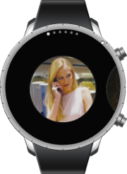

# Index

This feature is supported in wearable applications only.

The index component gives you an index for quick access to a group of other UI items. The index component is hidden by default, but it appears when the user clicks over its reserved area on the canvas.

In the default theme, the index component is a one-finger-wide area on the right side of the index component's container. Generally, it is used together with lists, generic lists, or generic grids.

For more information, see the [Index](../../../../../org.tizen.native.wearable.apireference/group__Elm__Index.html) API.

**Figure: Index component**



**Figure: Index hierarchy**


## Adding an Index Component

To create a new index component, use the `elm_index_add()` function:

```
Evas_Object *index;
Evas_Object *parent;

index = elm_index_add(parent);
```

## Adding Index Items

To add index items:

1. Add a list item object at the letter `A`, calling the `it_select_cb()` smart callback when this item is selected:

   ```
   Elm_Object_Item *list_item1;
   Elm_Object_Item *list_item2;
   elm_index_item_append(index, "A", it_select_cb, list_item1);
   ```

   The `elm_index_item_append()` function appends the indexes to the existing ones. It is also possible to prepend index items with the `elm_index_item_prepend()` function.

2. Add item objects, calling the `it_select_cb()` smart callback when the item is selected:

   ```
   Elm_Object_Item *it[5];
   for (i = 0; i < 5; ++i)
       it[i] = elm_index_item_append(index, NULL, it_select_cb, (void *)i);
   ```

3. Define the smart callback:

   ```
   /* Called when the list_item1 object is selected */
   void
   it_select_cb(void *data, Evas_Object *obj, void *event_info)
   {
       dlog_print(DLOG_INFO, LOG_TAG, "Item1 selected\n");
   }
   ```

## Using the Index Callbacks

To receive notifications about the index events, listen for the following signals:

- `changed`: The selected index item changes.  
The `event_info` callback parameter is the selected item's data pointer.

- `delay,changed`: The selected index item changes, but after a small idling period.  
The `event_info` callback parameter is the selected item's data pointer.

- `selected`: The user selects an item by releasing the mouse button.  
The `event_info` callback parameter is the selected item's data pointer.

- `level,up`: The user moves a finger from the first level to the second level.

- `level,down`: The user moves a finger from the second level to the first level.

> **Note**  
> The signal list in the API reference can be more extensive, but only the above signals are actually supported in Tizen.

Register and define the associated callback to perform appropriate actions. For example, when the `selected` signal occurs, show a given area or child object depending on the selected index item:

```
static void
_index_selected_cb(void *data, Evas_Object *obj, void *event_info)
{
    Elm_Object_Item *lit = event_info;

    /* Code that does the desired action */
}

evas_object_smart_callback_add(index, "selected", _index_selected_cb, NULL);
```

> **Note**  
> Except as noted, this content is licensed under [LGPLv2.1+](http://opensource.org/licenses/LGPL-2.1).

## Related Information
- Dependencies
  - Tizen 2.3.1 and Higher for Wearable
