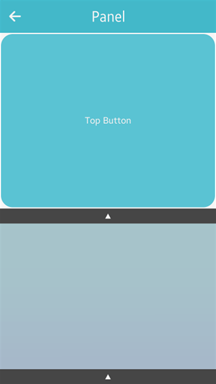

# Panel

The panel UI component can contain subobjects. It can be expanded or collapsed by clicking on the button on its edge. The panel component inherits from the [layout](container-layout.md) component, which means that layout functions can be used on the panel component. For more information, see the [Panel](../../../../../org.tizen.native.mobile.apireference/group__Elm__Panel.html) API.

This feature is supported in mobile applications only.

## Basic Usage

To use a panel component in your application:

1. Add a panel with the `elm_panel_add()` function:

   ```
   Evas_Object *panel;

   panel = elm_panel_add(parent);
   ```

2. You can set the panel orientation with the `elm_panel_orient_set()` function:

   ```
   elm_panel_orient_set(panel, ELM_PANEL_ORIENT_TOP);
   ```

3. Add content to the panel with the `elm_object_part_content_set()` function:

   ```
   Evas_Object *button;

   elm_object_part_content_set(panel, "default", button);
   ```

4. Register the [callback](#callbacks) functions. The following example shows how to define and register a callback for the `scroll` signal:

   ```
   evas_object_smart_callback_add(panel, "scroll", panel_scroll_cb, data);

   void
   panel_scroll_cb(void *data, Evas_Object *obj, void *event_info)
   {
       Elm_Panel_Scroll_Info *ev = event_info;
       dlog_print(DLOG_INFO, LOG_TAG, "Panel scroll to: %f, %f\n", ev->rel_x, ev->rel_y);
   }
   ```

The following example shows a simple use case of the panel component.

**Example: Panel use case**

 

```
Evas_Object *win;
Evas_Object *conf;
Evas_Object *nf;
Evas_Object *box;
Evas_Object *button;

/* Starting right after the basic EFL UI layout code */
/* (win - conformant - naviframe) */

/* Add a box to contain 2 panels and push the box into the naviframe */
box = elm_box_add(nf);
evas_object_show(box);
elm_object_content_set(nf, box);
elm_naviframe_item_push(nf, "Panel", NULL, NULL, box, NULL);

/* Add an expanded panel to (dis)appear from the top to the box */
panel = elm_panel_add(box);
elm_panel_orient_set(panel, ELM_PANEL_ORIENT_TOP);
evas_object_size_hint_weight_set(panel, EVAS_HINT_EXPAND, EVAS_HINT_EXPAND);
evas_object_size_hint_align_set(panel, EVAS_HINT_FILL, EVAS_HINT_FILL);
elm_box_pack_end(box, panel);
evas_object_show(panel);

/* Add a button to the panel */
button = elm_button_add(panel);
elm_object_text_set(button, "Top Button");
evas_object_size_hint_weight_set(button, EVAS_HINT_EXPAND, EVAS_HINT_EXPAND);
evas_object_size_hint_align_set(button, EVAS_HINT_FILL, EVAS_HINT_FILL);
elm_object_part_content_set(panel, "default", button);
evas_object_show(button);

/* Add a collapsed panel to (dis)appear from the bottom to the box */
panel = elm_panel_add(box);
elm_panel_orient_set(panel, ELM_PANEL_ORIENT_BOTTOM);
elm_panel_hidden_set(panel, EINA_TRUE);
evas_object_size_hint_weight_set(panel, EVAS_HINT_EXPAND, EVAS_HINT_EXPAND);
evas_object_size_hint_align_set(panel, EVAS_HINT_FILL, EVAS_HINT_FILL);
elm_box_pack_end(box, panel);
evas_object_show(panel);

/* Add a button to the panel */
button = elm_button_add(panel);
elm_object_text_set(button, "Bottom Button");
evas_object_size_hint_weight_set(button, EVAS_HINT_EXPAND, EVAS_HINT_EXPAND);
evas_object_size_hint_align_set(button, EVAS_HINT_FILL, EVAS_HINT_FILL);
elm_object_part_content_set(panel, "default", button);
evas_object_show(button);
```

## Callbacks

You can register callback functions connected to the following signals for a panel object.

**Table: Panel callback signals**

| Signal   | Description                  | `event_info`            |
|--------|----------------------------|-----------------------|
| `scroll` | The panel is being scrolled. | `Elm_Panel_Scroll_Info` |

> **Note**  
> The signal list in the API reference can be more extensive, but only the above signals are actually supported in Tizen.

> **Note**  
> Except as noted, this content is licensed under [LGPLv2.1+](http://opensource.org/licenses/LGPL-2.1).

## Related Information
- Dependencies
  - Tizen 2.4 and Higher for Mobile
