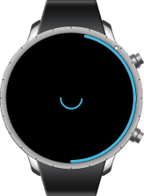

# Progressbar

The progressbar UI component displays the progress status of a given job. For more information, see the [Progressbar](../../../../../org.tizen.native.wearable.apireference/group__Elm__Progressbar.html) API.

This feature is supported in wearable applications only.

## Basic Usage

To use a progressbar component in your application:

1. Add a progressbar with the `elm_progressbar_add()` function:

   ```csharp
   Evas_Object *progressbar;

   progressbar = elm_progressbar_add(parent);
   ```

2. Set a [style](#styles) available for a rectangular or circular UI screen.  
Set a style to the progressbar with the `elm_object_style_set()` function. If you use the default style, you can skip this step.

   ```csharp
   elm_object_style_set(progressbar, "pending_list");
   ```

3. Activate the progressbar:

   - Set the progressbar pulse mode to activate the progressbar with the `elm_progressbar_pulse_set()` function:

     ```csharp
     elm_progressbar_pulse_set(progressbar, EINA_TRUE);
     ```

     The pulse mode makes the progressbar loop infinitely between the start and end position. If you activate the pulse mode in the default style, the unit is invisible.

   - Use the `elm_progressbar_pulse()` function to start the progressbar animation loop:

     ```csharp
     elm_progressbar_pulse(progressbar, EINA_TRUE);
     ```

4. Register the [callback](#callbacks) functions.  

 The following example shows how to define and register a callback for the `changed` signal:

   ```csharp
   evas_object_smart_callback_add(progressbar, "changed", changed_cb, data);

   void
   changed_cb(void *data, Evas_Object *obj, void *event_info)
   {
       dlog_print(DLOG_INFO, LOG_TAG, "The value has changed\n");
   }
   ```

The following example shows a simple use case of the progressbar component.

**Example: Progressbar component use case**

 

```csharp
Evas_Object *win;
Evas_Object *conf;
Evas_Object *nf;
Evas_Object *box;
Evas_Object *progressbar;

/* Starting right after the basic EFL UI layout code */
/* (win - conformant - naviframe) */

/* Add a box to contain the progressbar and push the box into the naviframe */
box = elm_box_add(nf);
evas_object_show(box);
elm_naviframe_item_push(nf, "Progressbar", NULL, NULL, box, NULL);

/* Add a progressbar and set a "default" style */
progressbar = elm_progressbar_add(box);

/* Set the progressbar alignment. The progressbar fills whole parent area */
evas_object_size_hint_align_set(progressbar, EVAS_HINT_FILL, EVAS_HINT_FILL);
/* Set the progressbar weight size. The progressbar takes up all the space in its parent */
evas_object_size_hint_weight_set(progressbar, EVAS_HINT_EXPAND, EVAS_HINT_EXPAND);

/* Set the progressbar value */
elm_progressbar_value_set(progressbar, 0.6);

/* Push the progressbar into the box */
elm_box_pack_end(box, progressbar);
evas_object_show(progressbar);
```

## Features

To configure the progressbar features:

- Use the progressbar value:

  - Change the value with the `elm_progressbar_value_set()` function. The progressbar emits the `changed` signal when the progress value changes. In the following example, the progressbar value is set to 20%.

    ```csharp
    /* Supported style: default */
    elm_progressbar_value_set(progressbar, 0.2);
    ```

  - Read the current value:

    ```csharp
    double value = elm_progressbar_value_get(progressbar);
    ```

- Invert the progressbar.

  In the inverted mode the high values are on the left and the low values on the right.

  ```csharp
  /* Supported style: default */
  elm_progressbar_inverted_set(progressbar, EINA_TRUE);
  ```

## Styles

The following table lists the available component styles according to the UI screen (rectangular or circular).

**Table: Progressbar styles**

| Style                                    | Sample                                   |                                          |
|----------------------------------------|----------------------------------------|----------------------------------------|
| `elm/progressbar/horizontal/default`     | (rectangular and circular) |                                          |
| `elm/progressbar/horizontal/pending_list` | (rectangular and circular) |                                          |
| `elm/progressbar/horizontal/process`     | (rectangular) | (circular) |
| `elm/progressbar/horizontal/process/groupindex` | (rectangular) |                                          |
| `elm/progressbar/horizontal/process/small` | (circular) |                                          |
| `elm/progressbar/horizontal/process/popup/small` | (circular) |                                          |

## Callbacks

You can register callback functions connected to the following signals for a progressbar object.

**Table: Progressbar callback signals**

| Signal    | Description                    | `event_info` |
|---------|------------------------------|------------|
| `changed` | The progressbar value changes. | `NULL`       |

> **Note**  
> The signal list in the API reference can be more extensive, but only the above signals are actually supported in Tizen.

> **Note**  
> Except as noted, this content is licensed under [LGPLv2.1+](http://opensource.org/licenses/LGPL-2.1).

## Related Information
- Dependencies
  - Tizen 2.3.1 and Higher for Wearable
