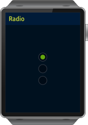
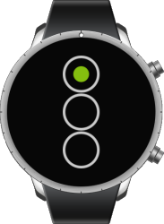

# Radio

The radio UI component displays 1 or more options and allows users to select 1 of them. For more information, see the [Radio](../../../../../org.tizen.native.wearable.apireference/group__Elm__Radio.html) API.

This feature is supported in wearable applications only.

## Basic Usage

To use a radio component in your application:

1. Add a radio button with the `elm_radio_add()` function:

   ```
   Evas_Object *radio;

   radio = elm_radio_add(parent);
   ```

2. Set values and group the radio buttons:

   - Assign a unique value to each radio button with the `elm_radio_state_value_set()` function:

     ```
     elm_radio_state_value_set(radio, 1);
     ```

   - Group the radio buttons with the `elm_radio_group_add()` function. You can set one of the radio buttons as selected with the `elm_radio_value_set()` function.

     ```
     elm_radio_group_add(radio, group);
     ```

   - Group the radio buttons visually by packing them into a box.

3. Register the [callback](#callbacks) functions.  

 The following example shows how to define and register a callback for the `changed` signal:

   ```
   evas_object_smart_callback_add(radio, "changed", changed_cb, data);

   void
   changed_cb(void *data, Evas_Object *obj, void *event_info)
   {
       dlog_print(DLOG_INFO, LOG_TAG, "The value has changed\n");
   }The following example shows a simple use case of the radio component.
   ```

**Example: Radio use case**

 

```
Evas_Object *win;
Evas_Object *conf;
Evas_Object *nf;
Evas_Object *box;
Evas_Object *radio;
Evas_Object *group;

/* Starting right after the basic EFL UI Layout code */
/* win - conformant - naviframe */

box = elm_box_add(nf);
evas_object_show(box);
elm_naviframe_item_push(nf, "Radio", NULL, NULL, box, NULL);

/* Radio 1 */
/* Add a radio */
radio = elm_radio_add(box);
/* Configure the radio */
elm_radio_state_value_set(radio, 1);
evas_object_show(radio);
elm_box_pack_end(box, radio);

group = radio;

/* Radio 2 */
radio = elm_radio_add(box);
elm_radio_state_value_set(radio, 2);
evas_object_show(radio);
elm_box_pack_end(box, radio);
/* Add to the group */
elm_radio_group_add(radio, group);

/* Radio 3 */
radio = elm_radio_add(box);
elm_radio_state_value_set(radio, 3);
evas_object_show(radio);
elm_box_pack_end(box, radio);
elm_radio_group_add(radio, group);

/* Set 1 of the radio components as selected */
elm_radio_value_set(group, 1);
```

## Styles

The following tables lists the available component styles.

**Table: Radio styles (rectangular device)**

| Style     | Sample                                   |
|---------|----------------------------------------|
| `default` |  |

**Table: Radio styles (circular device)**

| Style     | Sample                                   |
|---------|----------------------------------------|
| `default` |  |

## Callbacks

You can register callback functions connected to the following signals for a radio object.

**Table: Radio callback signals**

| Callback  | Description                   | `event_info` |
|---------|-----------------------------|------------|
| `changed` | The radio button is selected. | `NULL`       |

> **Note**  
> The signal list in the API reference can be more extensive, but only the above signals are actually supported in Tizen.

> **Note**  
> Except as noted, this content is licensed under [LGPLv2.1+](http://opensource.org/licenses/LGPL-2.1).

## Related Information
- Dependencies
  - Tizen 2.3.1 and Higher for Wearable
