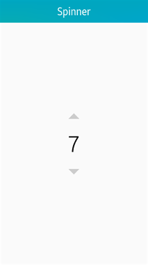

# Spinner

This feature is supported in mobile applications only.

The spinner component increases or decreases a numeric value with the arrow buttons.

The spinner component inherits from the layout component, which means that layout functions can be used on the spinner component.

For more information, see the [Spinner](../../../../../org.tizen.native.mobile.apireference/group__Elm__Spinner.html) API.

**Figure: Spinner component**



**Figure: Spinner hierarchy**


## Adding a Spinner Component

To create a spinner component, use the `elm_spinner_add()` function:

```csharp
Evas_Object *spin;
Evas_Object *parent;

spin = elm_spinner_add(parent);
```

## Using the Spinner Styles

The following table lists the available spinner styles.

**Table: Spinner styles**

| Style                         | Sample                                   |
|-----------------------------|----------------------------------------|
| `elm/spinner/base/horizontal` |  |
| `elm/spinner/base/vertical`   |  |

To use the spinner styles:

- Set the spinner style with the `elm_object_style_set()` function.

  To set the style to, for example, `vertical`:

  ```csharp
  elm_object_style_set(spinner, "vertical");
  ```

- Get the current style with the `elm_object_style_get()` function:

  ```csharp
  char *style = elm_object_style_get(spinner);
  ```

## Configuring the Spinner

To configure the spinner:

- Set the label format:

  ```csharp
  elm_spinner_label_format_set(spin, "%1.2f meters");
  ```

- Determine the result of clicking the arrow buttons.

  In the following example, a click on an arrow increases or decreases the spinner value by 2.0 units:

  ```csharp
  elm_spinner_step_set(spin, 2.0);
  ```

- Activate the wrapping mode.

  In this mode, the spinner wraps when it reaches its minimum or maximum value.

  ```csharp
  elm_spinner_wrap_set(spin, EINA_TRUE);
  ```

- Set the minimum and maximum values of the spinner:

  ```csharp
  elm_spinner_min_max_set(spin, -25.0, 100.0);
  ```

- Modify the change interval when the user long-presses the arrows to change the value faster:

  ```csharp
  elm_spinner_interval_set(spin, 0.1);
  ```

- Add custom text labels, if the user has to select between text values instead of numerical values.

  In the following example, the `spin2` component shows 3 numbers written in text characters:

  ```csharp
  Evas_Object *spin2 = elm_spinner_add(parent);

  elm_spinner_min_max_set(spin2, 1, 3);
  elm_spinner_special_value_add(spin2, 1, "One");
  elm_spinner_special_value_add(spin2, 2, "Two");
  elm_spinner_special_value_add(spin2, 3, "Three");
  ```

## Using the Spinner Callbacks

To receive notifications about the spinner events, listen for the following signals:

- `changed`: The spinner value changes.
- `delay,changed`: The user stops dragging for a very short period or releases the finger or mouse. The signal is emitted a short time after the user changes the value, to avoid possibly expensive reactions to the value change.
- `language,changed`: The program language is changed.

> **Note**  
> The signal list in the API reference can be more extensive, but only the above signals are actually supported in Tizen.

To register and define a callback for the `delay,changed` signal:

```csharp
{
    evas_object_smart_callback_add(spin, "delay,changed", delay_changed_cb, data);
}

/* Callback for the "delay,changed" signal */
/* Called a short time after the spinner value changes */
void
delay_changed_cb(void *data, Evas_Object *obj, void *event_info)
{
    dlog_print(DLOG_INFO, LOG_TAG, "The spinner value has changed\n");
}
```

> **Note**  
> Except as noted, this content is licensed under [LGPLv2.1+](http://opensource.org/licenses/LGPL-2.1).

## Related Information
- Dependencies
  - Tizen 2.4 and Higher for Mobile
