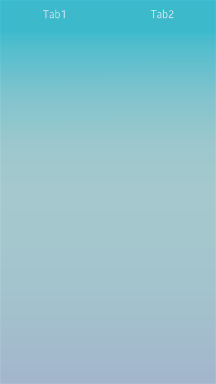
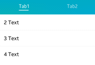
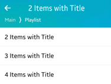
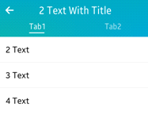

# Toolbar

The toolbar UI component has a scrollable list of items which can be selected. Only one item can be selected at a time. For more information, see the [Toolbar](../../../../../org.tizen.native.mobile.apireference/group__Elm__Toolbar.html) API.

This feature is supported in mobile applications only.

## Basic Usage

To use a toolbar component in your application:

1. Add a toolbar with the `elm_toolbar_add()` function:

   ```
   Evas_Object *toolbar;

   toolbar = elm_toolbar_add(parent);
   ```

2. Configure the toolbar [options](#options).

3. Append items to the toolbar with `elm_toolbar_item_append()` function. The function takes 5 parameters: the pointer of the toolbar, a file path of an icon, a text, a callback function to call when the item is clicked, and the parameter passed to the callback.

   ```
   elm_toolbar_item_append(toolbar, "icon.png", "Tab", _item_selected_cb, NULL);
   ```

   The following example shows how to add 2 items and define callbacks for when they are clicked:

   ```
   Elm_Object_Item *home_it;
   Elm_Object_Item *help_it;

   home_it = elm_toolbar_item_append(toolbar, "home", "Home",
                                     _home_item_pressed_cb, NULL);
   help_it = elm_toolbar_item_append(toolbar, "help", "Help",
                                     _help_item_pressed_cb, NULL);

   static void
   _home_item_pressed_cb(void *data, Evas_Object *obj, void *event_info)
   {
       dlog_print(DLOG_INFO, LOG_TAG, "Home item clicked \n");
   }

   static void
   _help_item_pressed_cb(void *data, Evas_Object *obj, void *event_info)
   {
       dlog_print(DLOG_INFO, LOG_TAG, "Help item clicked \n");
   }
   ```

4. Set the toolbar as the content of a container component. A toolbar is usually used to show a menu inside a naviframe.

5. Register the [callback](#callbacks) functions.

   The following example shows how to define and register a callback for the `clicked` signal:

   ```
   evas_object_smart_callback_add(toolbar, "clicked", clicked_cb, data);

   /* Callback for the "clicked" signal */
   /* Called when a toolbar item is double-clicked and selected */
   void
   clicked_cb(void *data, Evas_Object *obj, void *event_info)
   {
       Elm_Toolbar_Item * item = event_info;

       dlog_print(DLOG_INFO, LOG_TAG, "Item clicked\n");
   }
   ```

The following example shows a simple use case of the toolbar component.

**Example: Toolbar use case**



```
Evas_Object *win;
Evas_Object *conf;
Evas_Object *nf;
Evas_Object *tb;
Elm_Object_Item *nf_it;

/* Starting right after the basic EFL UI layout code */
/* win - conformant - naviframe */

/* Add a toolbar */
tb = elm_toolbar_add(nf);
evas_object_show(tb);

/* Configure the toolbar */
elm_toolbar_shrink_mode_set(tb, ELM_TOOLBAR_SHRINK_EXPAND);
elm_toolbar_transverse_expanded_set(tb, EINA_TRUE);

/* Append items */
elm_toolbar_item_append(tb, NULL, "Tab1", NULL, NULL);
elm_toolbar_item_append(tb, NULL, "Tab2", NULL, NULL);

/* Set the toolbar as a part of the naviframe item */
nf_it = elm_naviframe_item_push(nf, "Test", NULL, NULL, NULL, "tabbar/notitle");
elm_object_item_part_content_set(nf_it, "tabbar", tb);
```

## Options

You can set the shrink and select mode of the toolbar, and set the items to be displayed homogeneously. You can also define a state for the toolbar item.

### Shrink Mode

The toolbar offers the following options for shrinking its content:

- `ELM_TOOLBAR_SHRINK_NONE`: Set a minimum size to the toolbar so that all of them fit without scrolling.
- `ELM_TOOLBAR_SHRINK_HIDE`: Hide excess items that do not fit.
- `ELM_TOOLBAR_SHRINK_SCROLL`: Scroll to show the items that do not fit.
- `ELM_TOOLBAR_SHRINK_MENU`: Insert a button to pop up a menu with hidden items.
- `ELM_TOOLBAR_SHRINK_EXPAND`: Expand all items according to the size of the toolbar.

To set the shrinking mode:

```
elm_toolbar_shrink_mode_set(toolbar, ELM_TOOLBAR_SHRINK_EXPAND);
```

The following examples illustrate the shrink modes.

**Table: Shrink mode example**

| Mode                        | Example                                  |
|---------------------------|----------------------------------------|
| `ELM_TOOLBAR_SHRINK_EXPAND` |  |
| `ELM_TOOLBAR_SHRINK_SCROLL` |  |

### Select Mode

The following select modes are available:

- `ELM_OBJECT_SELECT_MODE_DEFAULT`
- `ELM_OBJECT_SELECT_MODE_ALWAYS`
- `ELM_OBJECT_SELECT_MODE_NONE`
- `ELM_OBJECT_SELECT_MODE_DISPLAY_ONLY`

To set a select mode:

```
elm_toolbar_select_mode_set(toolbar, ELM_OBJECT_SELECT_MODE_ALWAYS);
```

### Homogeneous

A toolbar displays items homogeneously by default, with long label items occupying a lot of space.

To avoid that, disable the homogeneous mode:

```
elm_toolbar_homogeneous_set(toolbar, EINA_FALSE);
```

### Item State

You can define 2 or more states for an item. Each state has its own icon, label, and function to call when an item is clicked.

To create 2 states for an item with the same icon but 2 different labels:

```
Elm_Object_Item *it;
it = elm_toolbar_item_append(toolbar, NULL, "Tab1", NULL, NULL);

elm_toolbar_item_state_add(it, "icon.png", "State 1", _item_pressed_cb, NULL);
elm_toolbar_item_state_add(it, "icon.png", "State 2", _item_pressed_cb, NULL);

```

You can cycle through the item states to set the state you want:

```
elm_toolbar_item_state_set(it, elm_toolbar_item_state_next(it));
```

## Styles

To set the style to `navigationbar`:

```
elm_object_style_set(toolbar, "navigationbar");
```

The following table lists the available component styles.

**Table: Toolbar styles**

| Style                                    | Sample                                   | Text part  | Swallow part       | Notes                                    |
|----------------------------------------|----------------------------------------|----------|------------------|----------------------------------------|
| `elm/toolbar/base/default`               |  | N/A        | N/A                | N/A                                      |
| `elm/toolbar/base/navigationbar`         |  | N/A        | N/A                | N/A                                      |
| `elm/toolbar/base/tabbar_with_title`     |  | N/A        | N/A                | N/A                                      |
| `elm/toolbar/item/tabbar``elm/toolbar/item/default` |                                          | `elm.text` | `elm.swallow.icon` | This style is for the toolbar's item. Use the `elm_toolbar_item_append()` function to set the text and the icon. |
| `elm/toolbar/item/navigationbar`         |                                          | `elm.text` | N/A                | This style is for the toolbar's item. Use the `elm_toolbar_item_append()` function to set the text and the icon. |

## Callbacks

You can register callback functions connected to the following signals for a toolbar object.

**Table: Toolbar callback signals**

| Signal              | Description                              | `event_info`       |
|-------------------|----------------------------------------|------------------|
| `clicked`           | The toolbar item is double-clicked and selected. | `Elm_Toolbar_Item` |
| `clicked,double`    | The toolbar item is double-clicked.      | `Elm_Toolbar_Item` |
| `longpressed`       | The toolbar is pressed for a certain amount of time. | `Elm_Toolbar_Item` |
| `language,changed`  | The program language changes.            |                    |
| `item,focused`      | The item is highlighted.                 | `Elm_Toolbar_Item` |
| `item,unfocused`    | The highlight is removed from the item.  | `Elm_Toolbar_Item` |
| `scroll`            | The toolbar scrolls.                     | `NULL`             |
| `scroll,anim,start` | The toolbar scrolling animation starts.  | `NULL`             |
| `scroll,anim,stop`  | The toolbar scrolling animation stops    | `NULL`             |
| `scroll,drag,start` | The user starts dragging the toolbar.    | `NULL`             |
| `scroll,drag,stop`  | The user stops dragging the toolbar.     | `NULL`             |

> **Note**  
> The signal list in the API reference can be more extensive, but only the above signals are actually supported in Tizen.

> **Note**  
> Except as noted, this content is licensed under [LGPLv2.1+](http://opensource.org/licenses/LGPL-2.1).

## Related Information
- Dependencies
  - Tizen 2.4 and Higher for Mobile
