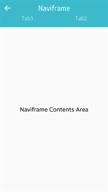
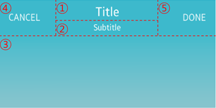
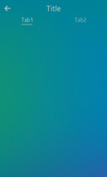
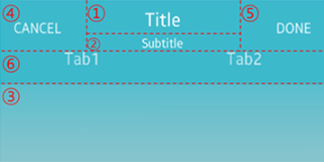
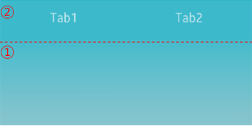
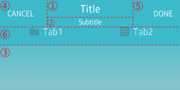
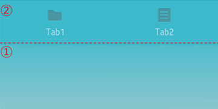

# Naviframe

The naviframe container manages many views by stacking them and displaying the topmost one. For more information, see the Naviframe API (in [mobile](../../../../../org.tizen.native.mobile.apireference/group__Elm__Naviframe.html) and [wearable](../../../../../org.tizen.native.wearable.apireference/group__Elm__Naviframe.html) applications).

## Basic Usage

To build a layout with a naviframe:

1. Add a naviframe with the `elm_naviframe_add()` function.

2. Add an item (a view) and push it to the stack using the `elm_naviframe_item_push()` function. The function takes 6 parameters and returns a handler of the item.

   ```
   Elm_Object_Item
   *elm_naviframe_item_push(Evas_Object *obj, const char *title, Evas_Object *prev_btn,
                            Evas_Object *next_btn, Evas_Object *content, const char *item_style);
   ```

   - In Tizen, the `next_btn` (fourth parameter) is not shown, so use `NULL`. The `prev_btn` (third parameter) is supported, but auto pushing is also supported since Tizen 2.4. As a result, use `NULL` for `prev_btn` too, and set the auto-pushed flag (about the `prev_btn`) to `true` (like below).

     ```
     /*
        Make prev_btn automatically,
        if multiple items are pushed (default: EINA_FALSE)
     */
     elm_naviframe_prev_btn_auto_pushed_set(nf, EINA_TRUE);
     ```

   - The last parameter is the style of the naviframe item. In Tizen mobile, various [item styles](#item-styles) are provided:

     - If an item style supports text parts, fill the text parts with the `elm_object_item_part_text_set()` function:

       ```
       elm_object_item_part_text_set(nf_it, "subtitle", "subtitle");
       ```

     - If an item style supports swallow parts, fill the swallow parts with the `elm_object_item_part_content_set()` function:

       ```
       elm_object_item_part_content_set(nf_it, "title_left_btn", btn);
       ```

   - The `default` text part is the title, and the `default` swallow part is the main content area. You can fill these parts with the `elm_naviframe_item_push()` function as well.

3. Repeat step 2 for each view you have. You can pop and delete the topmost view during the process using the `elm_naviframe_item_pop()` function.

The following example shows a simple use case of the naviframe component in a mobile application.

**Example: Naviframe use case**

 

```
Evas_Object *nf;
Evas_Object *ly;
Evas_Object *tb;
Elm_Object_Item *nf_it;

/* Variables for naviframe item push */
const char *title_text = "Naviframe";
/* Recommended NULL, replace with elm_naviframe_prev_btn_auto_pushed_set() */
Evas_Object *prev_btn = NULL;
/* Recommended NULL */
Evas_Object *next_btn = NULL;
Evas_Object *empty_content = NULL;
const char *item_style_default = NULL;
const char *item_style_tabbar = "tabbar";

/* Starting right after the conformant the basic EFL UI layout code */
/* (win - conformant) */

nf = elm_naviframe_add(ad->conform);
elm_naviframe_prev_btn_auto_pushed_set(nf, EINA_TRUE); /* since Tizen 2.4 */
elm_object_content_set(ad->conform, nf);
evas_object_show(nf);

/* Add a layout */
ly = elm_layout_add(nf);
elm_layout_theme_set(ly, "layout", "nocontents", "default");
elm_object_part_text_set(ly, "elm.text", "Naviframe Content Area");

/* Add a toolbar */
tb = elm_toolbar_add(nf);
elm_toolbar_shrink_mode_set(tb, ELM_TOOLBAR_SHRINK_EXPAND);
elm_toolbar_transverse_expanded_set(tb, EINA_TRUE);
elm_toolbar_item_append(tb, NULL, "Tab1", NULL, NULL);
elm_toolbar_item_append(tb, NULL, "Tab2", NULL, NULL);
evas_object_show(tb);

/* Push a naviframe item (push 2 items in total to show the back button) */
elm_naviframe_item_push(nf, title_text, prev_btn, next_btn,
                        empty_content, item_style_default);

/* Push a naviframe item, set the style as "tabbar" and pass the layout as content */
nf_it = elm_naviframe_item_push(nf, title_text, prev_btn, next_btn, ly, item_style_tabbar);

/* Set the toolbar into the "tabbar" part of the naviframe item */
elm_object_item_part_content_set(nf_it, "tabbar", tb);
```

## Item Styles

The following table lists the item styles available for Tizen mobile applications.

**Table: Naviframe item styles**

| Style                 | Sample                                   | Text part           | Swallow part                             | Notes                                    |
|---------------------|----------------------------------------|-------------------|----------------------------------------|----------------------------------------|
| `default`             |  | `default`<br>`subtitle` | `default`<br>`title_left_btn`<br>`title_right_btn` | 1. Text part: `default`<br>2. Text part: `subtitle`<br>3. Swallow part: `default`<br>4. Swallow part: `title_left_btn`<br>5. Swallow part: `title_right_btn` |
| `tabbar`              |  | `default`<br>`subtitle` | `default`<br>`title_left_btn`<br>`title_right_btn`<br>`tabbar` | The `tabbar_with_title` style toolbar can be set into the `tabbar` part.1. Text part: `default`<br>2. Text part: `subtitle`<br>3. Swallow part: `default`<br>4. Swallow part: `title_left_btn`<br>5. Swallow part: `title_right_btn`<br>6. Swallow part: `tabbar` |
| `tabbar/notitle`      |  |           -          | `default`<br>`tabbar`                        | The toolbar can be set into the `tabbar` part.1. Swallow part: `default`<br>2. Swallow part: `tabbar` |
| `tabbar/icon`         |  | `default`<br>`subtitle` | `default`<br>`title_left_btn`<br>`title_right_btn`<br>`tabbar` | The `tabbar_with_title` style toolbar with icons can be set into the `tabbar` part.1. Text part: `default`<br>2. Text part: `subtitle`<br>3. Swallow part: `default`<br>4. Swallow part: `title_left_btn`<br>5. Swallow part: `title_right_btn`<br>6. Swallow part: `tabbar` |
| `tabbar/icon/notitle` |  |         -            | `default`<br>`tabbar`                        | The toolbar with icons can be set into the `tabbar` part.1. Swallow part: `default`<br>2. Swallow part: `tabbar` |

## Callbacks

You can register callback functions connected to the following signals for a naviframe object.

**Table: Naviframe callback signals**

| Signal                      | Description                              | `event_info` |
|---------------------------|----------------------------------------|------------|
| `transition,finished`       | The transition has finished changing the view. | `NULL`       |
| `title,transition,finished` | The title area transition has finished changing the state of the title. | `NULL`       |
| `title,clicked`             | The title area is clicked.               | `NULL`       |

> **Note**  
> The signal list in the API reference can be more extensive, but only the above signals are actually supported in Tizen.

> **Note**  
> Except as noted, this content is licensed under [LGPLv2.1+](http://opensource.org/licenses/LGPL-2.1).

## Related Information
- Dependencies
  - Tizen 2.4 and Higher for Mobile
  - Tizen 2.3.1 and Higher for Wearable
