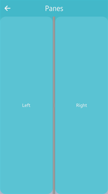

# Panes

The panes container adds a draggable bar between 2 sections of content. The sections are resized when the bar is dragged. For more information, see the [Panes](../../../../../org.tizen.native.mobile.apireference/group__Elm__Panes.html) API.

This feature is supported in mobile applications only.

## Basic Usage

To use panes in your application:

1. Add a panes container with the `elm_panes_add()` function:

   ```
   Evas_Object *panes;

   panes = elm_panes_add(parent);
   ```

2. Add content to the panes with the `elm_object_part_content_set()` function:

   - Add content to the left pane:

     ```
     Evas_Object *left_button;

     elm_object_part_content_set(panes, "left", left_button);
     ```

   - Add content to the right pane:

     ```
     Evas_Object *right_button;

     elm_object_part_content_set(panes, "right", right_button);
     ```

3. Set the direction of the panes with the `elm_panes_horizontal_set()` function. A panes container is vertical by default. Horizontal panes have "top" and "bottom" content, while vertical panes have "left" and "right" content.

   ```
   elm_panes_horizontal_set(panes, EINA_TRUE);
   elm_object_part_content_set(panes, "top", top_button);
   elm_object_part_content_set(panes, "bottom", bottom_button);
   ```

4. Set the size of the panes with the `elm_panes_content_right_size_set` function.  

 By default, both sides of the panes have the same size. You can change the size proportion of the panes. If the left content must be displayed over 75% of the panes size, the size must be passed as 0.75. This way, the right content is resized to 25% of the panes size. If displayed vertically, left content is displayed at top, and right content at the bottom.

   ```
   elm_panes_content_left_size_set(panes, 0.75);
   ```

5. Register the [callback](#callbacks) functions.  

 The following example shows how to define and register a callback for the `clicked,double` signal:

   ```
   evas_object_smart_callback_add(panes, "clicked,double", clicked_double_cb, data);

   void
   clicked_double_cb(void *data, Evas_Object *obj, void *event_info)
   {
       dlog_print(DLOG_INFO, LOG_TAG, "Panes double clicked\n");
   }
   ```

The following example shows a simple use case of the panes component.

**Example: Panes use case**

 

```
Evas_Object *win;
Evas_Object *conf;
Evas_Object *nf;
Evas_Object *panes;
Evas_Object *left_button;
Evas_Object *right_button;

/* Starting right after the basic EFL UI layout code */
/* (win - conformant - naviframe) */

/* Add a panes container to contain 2 buttons and push the panes into the naviframe */
panes = elm_panes_add(nf);
elm_object_content_set(nf, panes);
evas_object_show(panes);
elm_naviframe_item_push(nf, "Panes", NULL, NULL, panes, NULL);

/* Add a button to the left pane */
left_button = elm_button_add(panes);
elm_object_text_set(left_button, "Left");
elm_object_part_content_set(panes, "left", left_button);
evas_object_show(left_button);

/* Add a button to the right pane */
right_button = elm_button_add(panes);
elm_object_text_set(right_button, "Right");
elm_object_part_content_set(panes, "right", right_button);
evas_object_show(right_button);
```

## Callbacks

You can register callback functions connected to the following signals for a panes object.

**Table: Panes callback signals**

| Signal           | Description                              | `event_info` |
|----------------|----------------------------------------|------------|
| `clicked`        | The panes container is clicked (press and release). | `NULL`       |
| `clicked,double` | The panes container is double-clicked.   | `NULL`       |
| `pressed`        | The panes container is pressed.          | `NULL`       |
| `unpressed`      | The panes container is released after being pressed. | `NULL`       |

> **Note**  
> The signal list in the API reference can be more extensive, but only the above signals are actually supported in Tizen.

> **Note**  
> Except as noted, this content is licensed under [LGPLv2.1+](http://opensource.org/licenses/LGPL-2.1).

## Related Information
- Dependencies
  - Tizen 2.4 and Higher for Mobile
