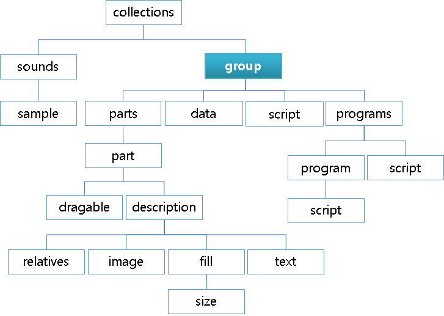

# Group Block

The `group` block contains a list of parts and programs that compose a given Edje Object.

**Figure: Group block**



```
group {
   name: "nameusedbytheapplication";
   alias: "anothername";
   min: width height;
   max: width height;
   parts {
      <definitions of parts>
   }
   script {
      <embryo script>
   }
   limits {
      vertical: "limit_name" height_barrier;
      horizontal: "limit_name" width_barrier;
   }
   data {
      items: "key" "value";
      file: "key" "file";
   }
   programs {}
}
```

- `name [group name]`Sets the name used by the application to load the resulting Edje object and to identify the group to swallow in a group part. If a group with the same name exists already, it is completely overridden by the new group.

- `inherit_only [1 or 0]`Flags the group as being used only for inheriting, which inhibits the `edje_cc` tool from resolving programs and parts that do not exist in this group, but are located in the group which is inheriting this group.

- `inherit [parent group name]`Sets the parent group name for inheritance. The `inherit` property is used to inherit any predefined group and change some properties which belong to a `part`, `description`, `items`, or `program`. The child group has the same properties as its parent group. If you specify the type again in an inherited part, it causes an error.	

> **Note**	
> When inheriting any parts, descriptions without state names are not allowed.

- `script_recursion [1/0]`Determines whether to error on unsafe calls when recursively running Embryo programs. For example, running an Embryo script which calls EDC that has a `script{}` block is unsafe, and the outer-most (first) Embryo stack is corrupted. It is strongly unadvisable to use this flag.

- `alias [additional group name]`Sets the additional name to be used as an identifier. Defining multiple aliases is supported.

- `min [width] [height]`Sets the minimum size for the container defined by the composition of the parts. It is not enforced.

- `max [width] [height]`Sets the maximum size for the container defined by the totality of the parts. It is not enforced.

- `broadcast_signal [on/off]`Determines whether a signal gets automatically broadcasted to all sub group parts. The default value is `on`.

- `orientation [AUTO/LTR/RTL]`Sets the group orientation. It is useful if you want to match the interface orientation with language.	`AUTO`: Follow system defaults	`LTR`: Used in the Left To Right Languages (Latin)	`RTL`: Used in the Right To Left Languages (Hebrew, Arabic)

- `mouse_events [1 or 0]`Changes the default value of `mouse_events` for every part in this group. The default value is `1`, to maintain compatibility.

- `program_source [source name]`Changes the default value of the source in the current group for every program which is declared after this value is set. The value defaults to an unset value to maintain compatibility. The name of the source can be set on every program, but if the name can be defined in the group level, it reduces the effort to indicate it in every program.

- `group.parts` block

  ```
  parts {
     part {}
     part {}
     part {}
  ```

  The `parts` block contains 1 or more [part](./learn-edc-part-n.md) blocks. Each part describes a visual element and has a type, such as `text`, `image`, or `table`.

- `group.script` block

  ```
  group {
     script {
        <embryo script>
     }
     program {
        script {
           <embryo script>
        }
     }
  }
  ```

  The `script` block is used to inject embryo scripts to a given Edje theme. It functions in 2 modalities: when it is included inside a `program` block, the script is executed every time the [program](./learn-edc-program-n.md) is run, and when included directly into a `group`, `part`, or `description` block, it is executed once at the load time, in the load order.

- `group.limits` block

  ```
  limits {
     vertical: "limit_name" height_barrier;
     horizontal: "limit_name" width_barrier;
  }
  ```

  The `limits` block is used to trigger signals when the Edje object is resized.`vertical [name] [height barrier]`Sends a `limit,name,over` signal when the object is resized and passes the limit by growing over it. When the object's size is reduced below the limit, the `limit,name,below` signal is sent. This limit is applied on the Y axis and is given in pixels.`horizontal [name] [width barrier]`Sends a `limit,name,over` signal when the object is resized and passes the limit by growing over it. When the object's size is reduced below the limit, the `limit,name,below` signal is sent. This limit is applied on the X axis and is given in pixels.

- `group.data` block

  ```
  data {
     item: "key" "value";
     file: "key2" "somefile";
  }
  ```

  The `data` block is used to pass arbitrary parameters from the theme to the application. Unlike the `images` and `fonts` blocks, additional `data` blocks can only be included inside the `group` block.`items: "key" "value";`Sets a new parameter, the value is the string specified next to it.`file: "key" "file";`Sets a new parameter, the value is the content of the specified file formatted as a single string of text. This property only works with plain text files.	
  > **Note**	
  > For genlist item styles, keys must be texts and icons, respectively for text parts and swallow parts; values must the names of the parts, separated with spaces.

- `group.programs` block

  ```
  programs {
     program {}
     program {}
     program {}
  }
  ```

  The `programs` group contains 1 or more [program](./learn-edc-program-n.md) blocks. Each program contains code related to the interaction and animation of the visual elements.

> **Note**	
> Except as noted, this content is licensed under [LGPLv2.1+](http://opensource.org/licenses/LGPL-2.1).