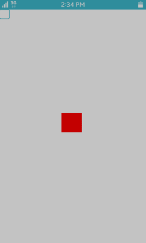
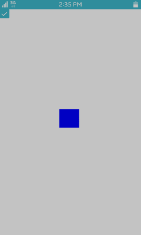

# Signal Handling

Elementary objects have a communication interface between the application logic (code) and UI (theme). You can emit signals from the code to a theme, or create handles for the signals emitted from themes. Signals are identified by strings.

Using signals in the EDC file is simple:

1. Create a program that changes the rectangle color between red and blue when specific signals are received. Set the signal name to the `signal` attribute:

   ```
   collections {
      group { name: "main";
         parts {
            part { name: "rect1";
               type: RECT;
               description {
                  state: "default" 0.0;
                  min: 100 100;
                  max: 100 100;
                  color: 255 0 0 255;
               }
               description {
                  state: "default" 1.0;
                  min: 100 100;
                  max: 100 100;
                  color: 0 0 255 255;
               }
            }
            part { name: "swallow.check";
               type: SWALLOW;
               description {
                  state: "default" 0.0;
                  align: 0.0 0.0;
                  rel1.relative: 0.0 0.0;
                  rel2.relative: 0.0 0.0;
               }
            }
         }
         programs {
            program { name: "to_default_0";
               signal: "to,state,default,0";
               action: STATE_SET "default" 0.00;
               transition: ACCELERATE 0.5 CURRENT;
               target: "rect1";
            }
            program { name: "to_default_1";
               signal: "to,state,default,1";
               action: STATE_SET "default" 1.00;
               transition: ACCELERATE 0.5 CURRENT;
               target: "rect1";
            }
         }
      }
   }
   ```

2. Emit signals from the C code:

   a. Create a window with the check UI component. Define a callback for when the check component is selected.

      ```
      static void
      create_base_gui(appdata_s *ad)
      {
         char edj_path[PATH_MAX] = {0,};

         /* Create a window */
         ad->win = elm_win_util_standard_add(PACKAGE, PACKAGE);
         elm_win_conformant_set(ad->win, EINA_TRUE);
         elm_win_autodel_set(ad->win, EINA_TRUE);

         if (elm_win_wm_rotation_supported_get(ad->win)) {
            int rots[4] = {0, 90, 180, 270};
            elm_win_wm_rotation_available_rotations_set(ad->win,
                                                        (const int *)(&rots), 4);
         }

         evas_object_smart_callback_add(ad->win, "delete,request",
                                        win_delete_request_cb, NULL);
         eext_object_event_callback_add(ad->win, EEXT_CALLBACK_BACK, win_back_cb, ad);

         /* Create a conformant */
         ad->conform = elm_conformant_add(ad->win);
         elm_win_indicator_mode_set(ad->win, ELM_WIN_INDICATOR_SHOW);
         elm_win_indicator_opacity_set(ad->win, ELM_WIN_INDICATOR_OPAQUE);
         evas_object_size_hint_weight_set(ad->conform, EVAS_HINT_EXPAND,
                                          EVAS_HINT_EXPAND);
         elm_win_resize_object_add(ad->win, ad->conform);
         evas_object_show(ad->conform);

         /* Set a base layout */
         app_get_resource(EDJ_FILE, edj_path, (int)PATH_MAX);
         ad->layout = elm_layout_add(ad->win);
         elm_layout_file_set(ad->layout, edj_path, GRP_MAIN);
         evas_object_size_hint_weight_set(ad->layout, EVAS_HINT_EXPAND,
                                          EVAS_HINT_EXPAND);

         ad->check = elm_check_add(ad->win);
         elm_object_part_content_set(ad->layout, "swallow.check", ad->check);
         evas_object_smart_callback_add(ad->check, "changed", _check_toggled, ad);

         /* Show the window */
         evas_object_show(ad->win);
      }
      ```

      The following figure displays the result.

      

   b. The following example implements the callback for the `changed` event from the check component. When the `changed`  event is triggered, a signal is emitted from the C code to the EDC file.

      ```
      static void
      _check_toggled(void *data, Evas_Object *obj, void *event_info)
      {
         appdata_s *ad = data;

         if (elm_check_state_get(obj))
            elm_object_signal_emit(ad->layout, "to,state,default,1", "");
         else
            elm_object_signal_emit(ad->layout, "to,state,default,0", "");
      }
      ```

      The following figure displays the result.

      

## Related Information
- Dependencies      
  - Tizen 2.4 and Higher for Mobile
  - Tizen 2.3.1 and Higher for Wearable
