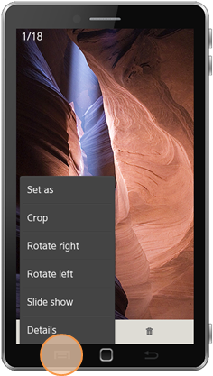

# Event Handling

The Tizen platform supports event handling for user interactions. To
provide a full user experience for your application users, you must
handle various events in your application.

All Tizen mobile native devices provide the **Menu** and **Back**
hardware keys, and the circular wearable devices provide rotary
components for emitting rotary events. Both mobile and wearable devices
support the media key events. You can use the Efl Extension Event API
(in
[mobile](../../../../org.tizen.native.mobile.apireference/group__EFL__EXTENSION__EVENTS__GROUP.html)
and
[wearable](../../../../org.tizen.native.wearable.apireference/group__CAPI__EFL__EXTENSION__EVENT__MODULE.html)
applications) to handle the **Menu** key, **Back** key, and rotary
events.

> **Note**  
> For more information on using Efl Extension for **Menu** key,
**Back** key, and rotary events, see [Hardware Input
Handling](../../guides/ui/efl/hw-input-n.md).

Follow the guidelines below to ensure predictable and reliable
navigation in your application.

## Menu Key Events in Mobile Applications

All Tizen mobile devices provide a **Menu** key, which is used to
present users a context-dependent set of options. Pressing the **Menu** key shows a hierarchical option menu. The following figure illustrates the **Menu** key position and the option menu.

**Figure: Menu key**

## Back Key Events in Mobile Applications

All Tizen mobile devices provide a **Back** key for backward navigation.
A back button in the application UI is not required.

The **Back** key must support the following features:

-   Hiding the software keyboard
-   Closing windows
-   Closing message boxes
-   Closing pop-ups
-   Handling backward scene transitions

## Rotary Events in Wearable Applications

The Tizen platform supports rotary events for user interaction on a
wearable rotary device or sensor. The rotary device can rotate clockwise or counter-clockwise, and dispatch an event for each movement. The rotary device has points called **detent**. If the rotary device detects the detent point while rotating, it dispatches a separate new event about the point. The number of the available detent points depends on the device hardware.

You can use the rotary events to change your application state (for
example, change the value of the scroller or slider, change selected
items, or zoom the image).

**Figure: Rotary device**

## Media Key Events

Tizen supports handling **Media** key events, such as play, stop, and
pause events, from media devices (such as Bluetooth remote controller
and earjack).

To handle the **Media** key events, use the Media key API (in
[mobile](../../../../org.tizen.native.mobile.apireference/group__CAPI__SYSTEM__MEDIA__KEY__MODULE.html)
and
[wearable](../../../../org.tizen.native.wearable.apireference/group__CAPI__SYSTEM__MEDIA__KEY__MODULE.html)
applications).

## Ambient Events in Wearable Applications

An ambient mode is available on a low-powered wearable device. For more
information on ambient events in the mobile native profile, see the
[Watch Application](../../guides/app-management/watch-app-n.md)
guide.
