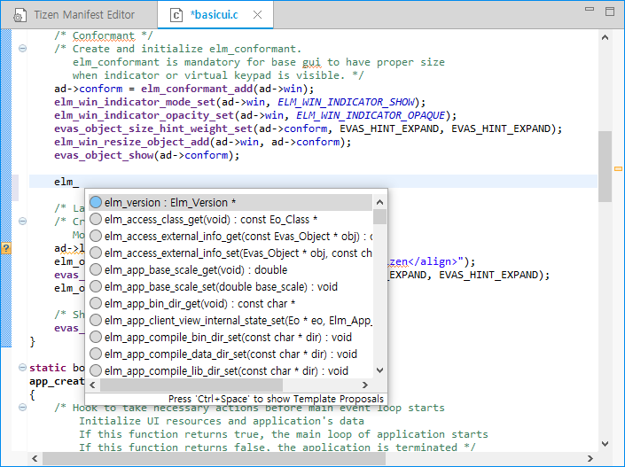
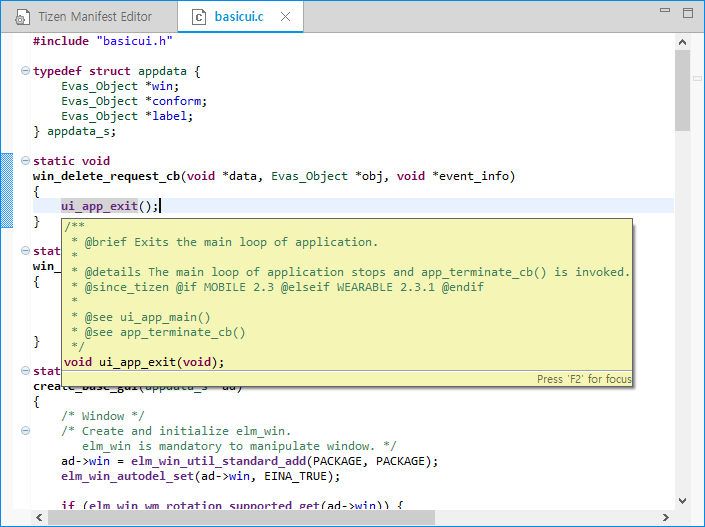

# Completing and Entering APIs with Assist and Hover
## Dependencies

- Tizen Studio 1.0 and Higher

The Tizen Studio provides API assist and hover features to ease code writing:

- The API assist helps you to write code quickly by completing the names of the APIs automatically when writing a part of the API name.
- The API hover displays information about API functions, API-related types, and macros for the native framework.

These features improve your coding productivity when developing your applications.

## API Assist

When you write code, the API assist feature provides API suggestions to complete the code faster.

To receive the API suggestions manually, type at least one letter of content, and press **Ctrl + Space**. The suggestion list appears. Use the arrow keys to select a suggestion from the list, and press **Enter** to complete the code.

**Figure: Using API assist**

> **Note**  
> The API assist feature is based on Content Assist in Eclipse Mars. Like in Eclipse, you can customize the feature: in the Tizen Studio, go to **Window > Preferences > C/C++ > Editor > Content Assist**. For more information, see the [Content Assist preferences](http://help.eclipse.org/mars/index.jsp?topic=%2Forg.eclipse.cdt.doc.user%2Freference%2Fcdt_u_c_editor_con_assist.htm) help page.

## API Hover

When you hover over a Tizen native API function in the source editor, a popup window appears below the function. In that window, you can get detailed information on the API function, such as a brief description, defined parameters, return value type, and exception information.

**Figure: Using API hover**

> **Note**  
> The API hover feature is based on Hovers in Eclipse Mars. Like in Eclipse, you can customize hover behavior: in the Tizen Studio, go to **Window > Preferences > C/C++ > Editor > Hovers**. For more information, see the [Hovers preferences](http://help.eclipse.org/mars/index.jsp?topic=%2Forg.eclipse.cdt.doc.user%2Freference%2Fcdt_u_c_editor_hov.htm) help page.