# Custom UI Component

Custom UI components are interface elements you can create for application-specific purposes.

With custom UI components, you can:

- Use the UI Builder to visually edit the properties in the EDJ and XML files that define the custom UI component.
- Support mutual value-binding between event-driven primitive UI components and custom UI components.
- Reuse UI components in other projects by gathering EDJ resources into components.

<a name="handle_customcomponentfile"></a>
## Custom UI Component Files

A custom component consists of EDJ and XML files that describe its structure, and icon files for displaying it in the Tizen Studio.

### EDJ and XML Files

A custom component requires an EDJ resource file (`[ComponentName].edj`) and an XML descriptor (`[ComponentName].xml`) file.

- **EDJ**

    Each custom UI component has an EDJ resource file. The custom UI component makes this EDJ file available to the **Design** editor by placing it on the **Palette** and enables visual editing in the **Properties** view.

    The EDJ file is created by compiling EDC code with the [EDC Editor](../edc-editor.md). For more information about EDC, see [Layouting with EDC]( ../../../native/guides/ui/efl/learn-edc-intro.md).

- **XML**

    The XML descriptor file allows you to register a custom UI component in the UI Builder **Palette** and create a definition for the property, to be used in the **Properties** view.

    The XML descriptor file consists of the following elements:

    - `<component>`: The root element for the custom UI component. The `<component>` element describes the EDJ resource content, such as the group, used by the custom UI component.
    - `<state>`: A state value that must be defined in EDC and changed by the custom UI component during runtime.
    - `<value>`: A value defined for a state property.
    - `<text>`: A text value that must be defined in EDC and changed by the custom UI component during runtime. You can define this to change the text value of the text part name.
    - `<color>`: A color value that must be defined in EDC and changed by the custom UI component during runtime. You can define this to change the color value of the color class name.

    The following table shows the XML descriptor file configuration.

    **Table: XML descriptor file configuration**

    | Parent      | Element     | Attribute     | Description                              | Type    | Required | Default Value                        |
    |-------------|-------------|---------------|------------------------------------------|---------|----------|--------------------------------------|
    | -         | \<component\> | name          | Component identifier, shown on the Palette, Outline view, and Properties view. This attribute must be identical to the XML file  name. | String  | Yes      | -                                  |
    | -         | \<component\> | description   | Description  shown when you mouse over the custom UI component on the Palette | String  | No       | null                                 |
    | -         | \<component\> | group         | group block defined in the EDC file for the component. For more information see [Group Block]( ../../../native/guides/ui/efl/learn-edc-group.md ). | String  | Yes      | -                                  |
    | -         | \<component\> | resize_mode   | Which  directions the component can be resized in. The possible values are both, horizontal, vertical, and none. | String  | No       | both                                 |
    | -         | \<component\> | min_width     | Minimum component width in the Design editor | Integer | No       | 1                                    |
    | -         | \<component\> | min_height    | Minimum component height in the Design editor | Integer | No       | 1                                    |
    | \<component\> | \<state\>     | name          | State property identifier               | String  | Yes      | -                                  |
    | \<component\> | \<state\>     | display_name  | Name shown on the state property label in the Properties view | String  | No       | name attribute in the <\<state\> element |
    | \<component\> | \<state\>     | description   | State property description              | String  | No       | null                                 |
    | \<component\> | \<state\>     | default_value | State property default value. The default value must be a name attribute defined in the value element attributes. | String  | Yes      | -                                  |
    | \<state\>     | \<value\>     | name          | Value  property identifier               | String  | Yes      | -                                  |
    | \<state\>     | \<value\>     | display_name  | Name shown on the value property label in the Properties view | String  | No       | name attribute in the \<value\> element |
    | \<state\>     | \<value\>     | signal        | EDC signal used to change the UI state at runtime. For information on using signals, see [Program Block](../../../native/guides/ui/efl/learn-edc-program.md). | String  | Yes      | -                                  |
    | \<state\>     | \<value\>     | source        | User-defined parameter sent when the EDC signal is triggered | String  | No       | null                                 |
    | \<component\> | \<text\>      | name          | Text property identifier                | String  | Yes      | -                                  |
    | \<component\> | \<text\>      | display_name  | Name shown on the text property label in the Properties view | String  | No       | name attribute in the \<text\> element  |
    | \<component\> | \<text\>      | description   | Text property description               | String  | No       | null                                 |
    | \<component\> | \<text\>      | part_name     | part block to change when the text property is modified. For more information, see [Part Block](../../../native/guides/ui/efl/learn-edc-part.md). | String  | Yes      | -                                  |
    | \<component\> | \<text\>      | default_value | Text property  default value             | String  | No       | null                                 |
    | \<component\> | \<color\>     | name          | Color property identifier               | String  | Yes      | -                                  |
    | \<component\> | \<color\>     | display_name  | Name shown on the color property label in the Properties view | String  | No       | name attribute in the \<color\> element |
    | \<component\> | \<color\>     | description   | Color property description              | String  | No       | null                                 |
    | \<component\> | \<color\>     | class_name    | EDC color class name. For more information, see [Color Classes Block](../../../native/guides/ui/efl/learn-edc-color-classes.md). | String  | Yes      | -                                  |
    | \<component\> | \<color\>     | default_value | Color property  default value            | String  | No       | null                                 |
    | \<component\> | \<event\>     | name          | Event  property identifier               | String  | Yes      | -                                  |
    | \<component\> | \<event\>     | display_name  | Name  shown on the event property label in the Properties view | String  | No       | name attribute in the \<event\> element |
    | \<component\> | \<event\>     | description   | Event  property description              | String  | No       | null                                 |
    | \<component\> | \<event\>     | signal        | EDC  signal used to change the UI state at runtime | String  | Yes      | -                                  |
    | \<component\> | \<event\>     | source        | String  or message emitted when the event is triggered | String  | No       | null                                 |

The following figures show corresponding elements between the XML and EDC files.

**Figure: Correspondence between XML and EDC (color, state, and event properties)**

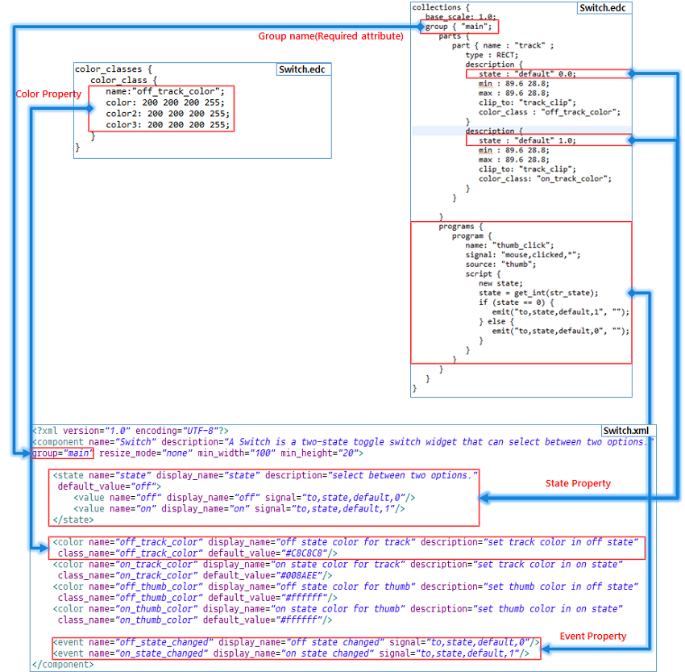

**Figure: Correspondence between XML and EDC (text property)**

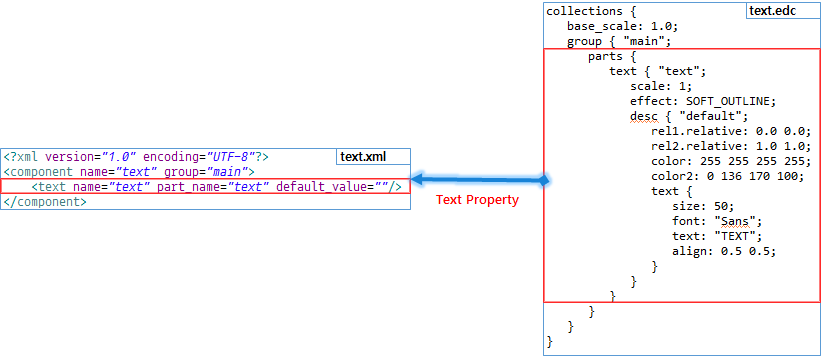

### Icon Files

Icons are used on the **Palette**, the **Outline** view, and the **Properties** view.

There are 3 supported icon types:

- The normal icon, which is shown when no action has been taken.
- The mouseover icon, which appears when the mouse cursor is placed over the icon.
- The select icon, which is shown when the icon is selected with the mouse.

If you do not include custom icon files with your custom component, the default icons are used. The following table illustrates the default icons.

**Table: Default icon types**

| Normal icon                              | Mouseover icon                           | Select icon                              |
|----------------------------------------|----------------------------------------|----------------------------------------|
|  |  |  |
| `pal_custom**_nor.png**`                 | `pal_custom**_mv.png**`                  | `pal_custom**_sel.png**`                 |

To use custom icon files, the following conditions must be observed:

- The file names must be in the format `[ComponentName]_[Type].png`:
  - `[ComponentName]` is the UI component name shown on the **Palette**.
  - `[Type]` depends on the icon type: `nor` (for normal), `mv` (for mouseover), and `sel` (for selected).
- The icon file must be in PNG format.
- Icon files are recommended to have a maximum size of 32 x 32 pixels.

<a name="using_customcomponent"></a>
## Using Custom UI Components

The following example shows how you can create a custom UI component in the UI Builder, using the **Mobile 4.0** project template. The following sections show how to add or remove a custom component within a project.

To create a custom UI component:

1. In the Tizen Studio, create a new UI Builder project using the **Mobile v4.0** project template.

2. Add a preset **Switch** UI component:

   1. In the **Palette**, right-click the **Custom UI Components** category and select **Add preset UI Component &gt; Switch**.

      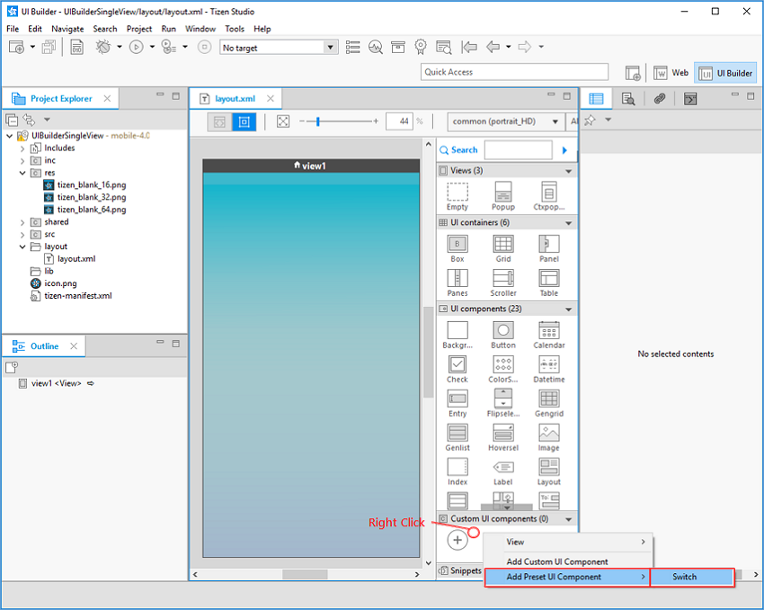

      The **Switch** UI component is added to the **Custom UI Components** category in the **Palette**. In the **Project Explorer** view, the related files can be seen in the `res/custom-components` folder.

      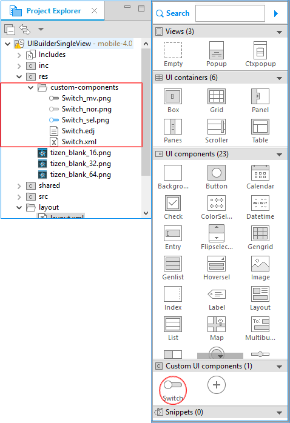

3. Create a `text.edj` file for a **text** custom UI component:

    1. Right-click the project name in the **Project Explorer** view, and select **New &gt; EDC File**.

       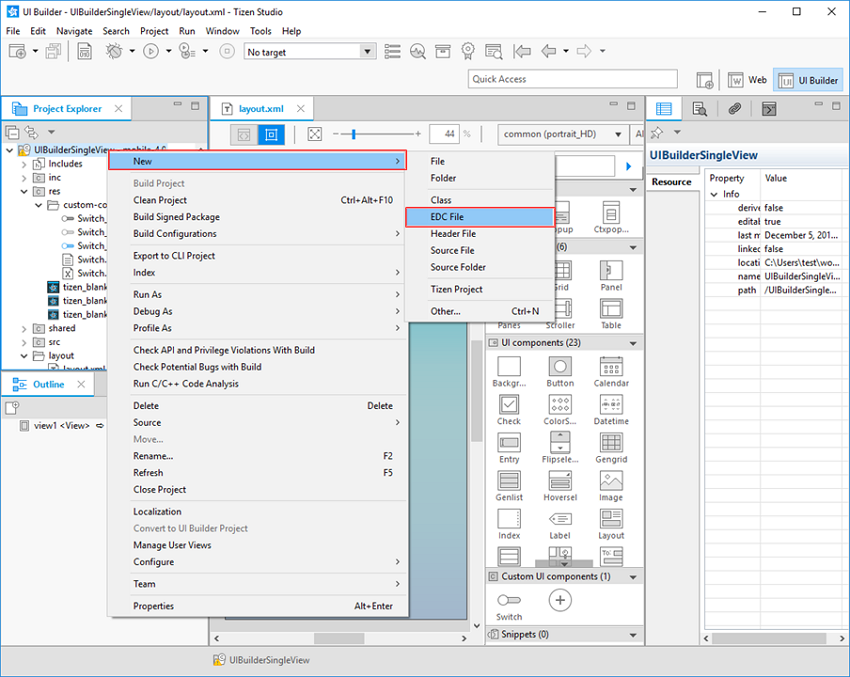

    2. In the **EDC File** dialog, select your project as the parent folder and enter `text.edc` in the **File name** field. Click **Finish**.

       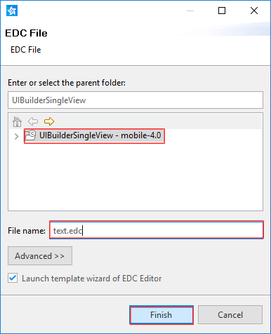

    3. In the EDC Editor's **New File: Choose a Template** dialog, select the **Text** template and click **Ok**.

       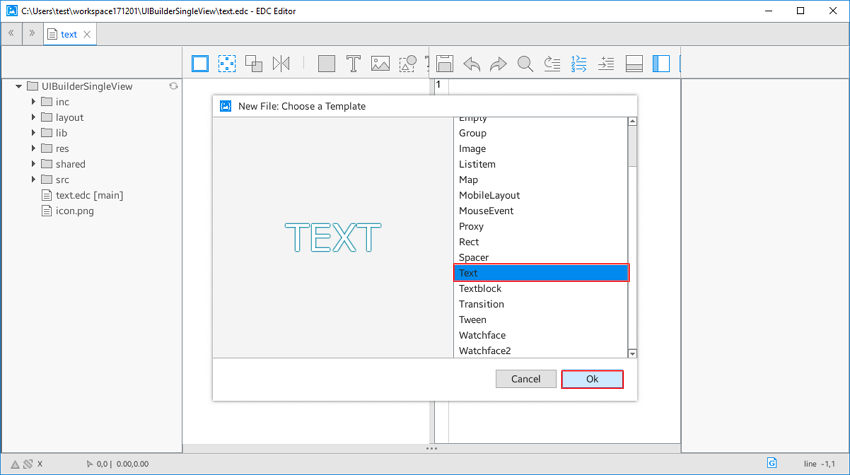

    4. To save the `text.edc` file, click the **Save** button and close the EDC Editor.

       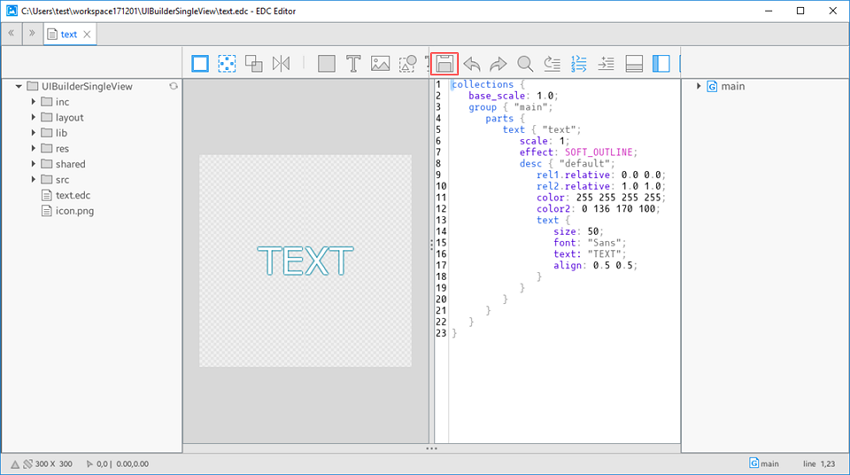

       The `text.edc` and `text.edj` files can be seen in the **Project Explorer** view.

4. Create a `text.xml` file:

   1. Right-click the project name in the **Project Explorer** and select **New &gt; Other**.

      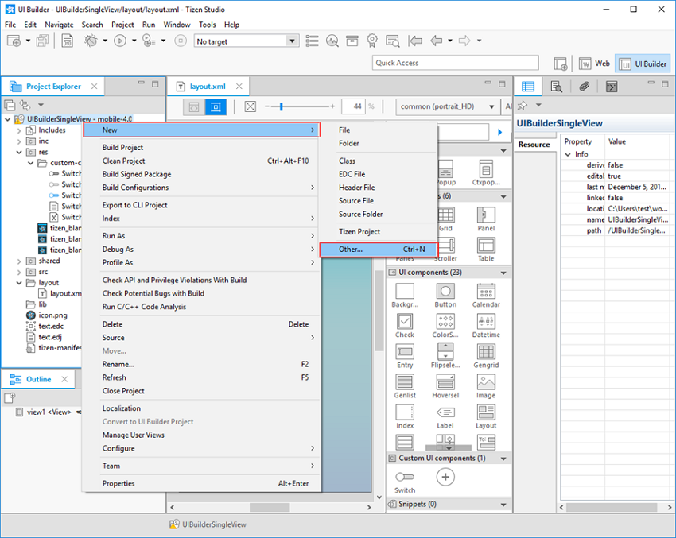

   2. In the **New** dialog, select **General &gt; Untitled Text File** and click **Finish**.

      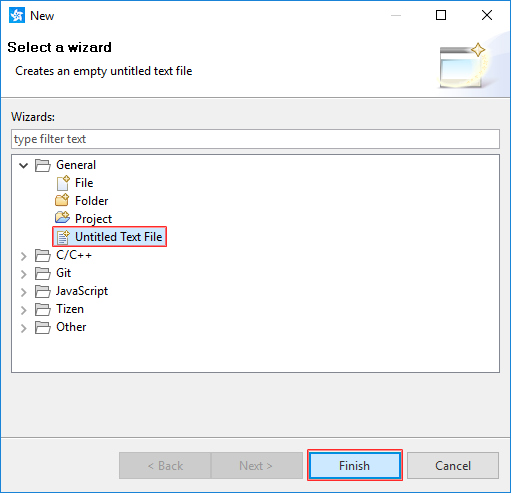

   3. Enter the following code in the newly-created `Untitled 1` file:

      ```
      <?xml version="1.0" encoding="UTF-8"?>
      <component name="text" group="main">
         <text name="text" part_name="text" default_value=""/>
      </component>
      ```

      This XML code contains only the required attributes for `text.xml`.

   4. Save the file by pressing **Ctrl + S**.

   5. In the **Save As** dialog, select your project as the parent folder and enter `text.xml` in the **File name** field. Click **OK**.

      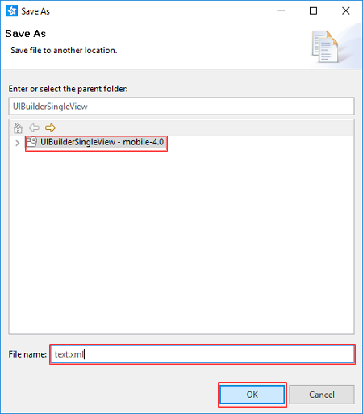

      The `text.xml` file can be seen in the **Project Explorer** view.

5. Add the **text** UI component to the **Palette**:

   1. Click the **Add Custom Component** () button on the **Palette**, or right-click the **Custom UI Components** category and select **Add Custom UI Component**.

      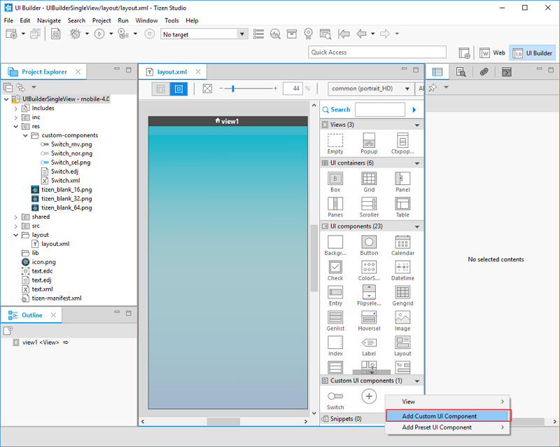

   2. In the **New Custom UI Component** dialog, to select the XML file, click **...**.

      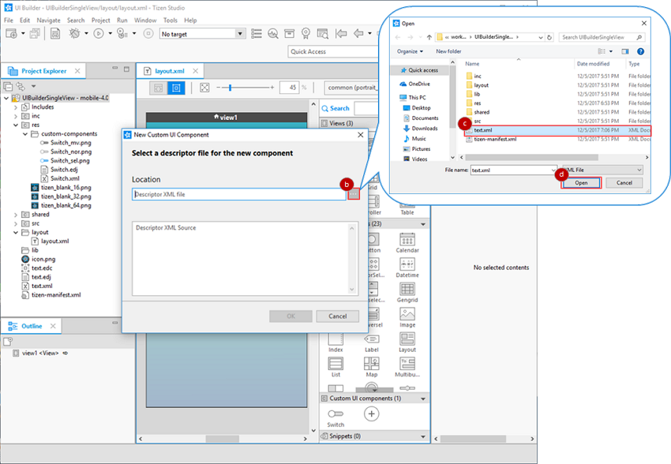

   3. Select the `text.xml` file from your project folder.

   4. Click **Open**.

      The following table lists error messages that can occur when adding a custom UI component.

      | Error message                            | Description                              |
      |----------------------------------------|----------------------------------------|
      | A Custom UI Component already exists with the same name. | You cannot import a custom UI component if a component with the same name already exists in the **Palette**. Check the your custom UI component name. |
      | An EDJ file required for handling the new component is missing. | The EDJ file must be located in the same folder as the XML file. Check the location of your EDJ and XML files. |
      | The descriptor file is missing a required attribute (such as name or group). | The `name` attribute in the `<component>` element in the descriptor file defines the display name for the component in the **Palette**, and the `group` attribute specifies which `group` block to use in the EDJ file. Check the descriptor file to see whether a required attribute is missing. |
      | The descriptor file name does not match the value for the internal name attribute. | The descriptor file name must be the same as the `name` attribute inside the file. Check that the XML file name and internal `name` attribute are identical. |
      | XML syntax in the descriptor file is incorrect. | If there are syntax errors in the XML file, registration and visual editing in the **Palette** do not work properly. Check the XML file syntax. |
      | Unexpected internal error occurred.     | If the descriptor XML and EDJ files have unexpected errors, registration and visual editing in the **Palette** do not work properly. Check that the XML and EDJ files exist. |
      | The descriptor file is missing a root element(component). | To use a custom UI component, a `<component>` element must exist as the root element in the XML file. Check the XML file syntax. |
      | The name can contain letters, digits, and underscores ("_"), and must not begin with a digit. | Check that the component name in the XML file follows the naming rules. |
      | The required attribute cannot contain any space characters. | Check the XML file syntax.              |

   5. Click **OK**.

      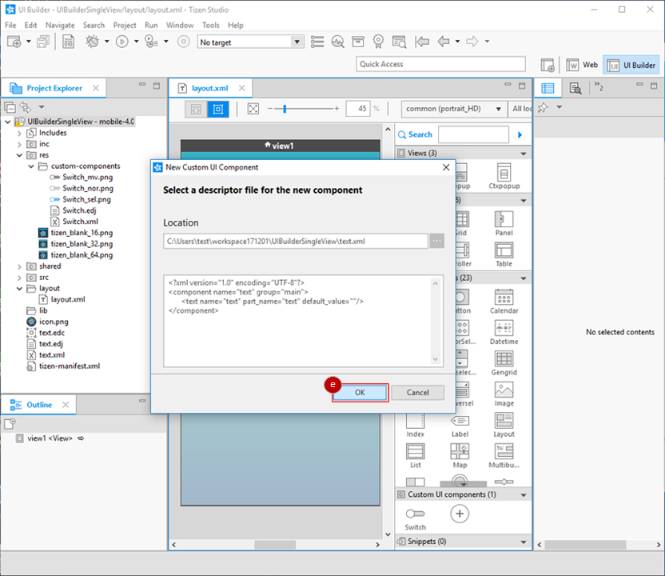

      The **text** UI component is added to the **Palette**, and the `text.xml` and `text.edj` files are added to the `res/custom-components` folder.

      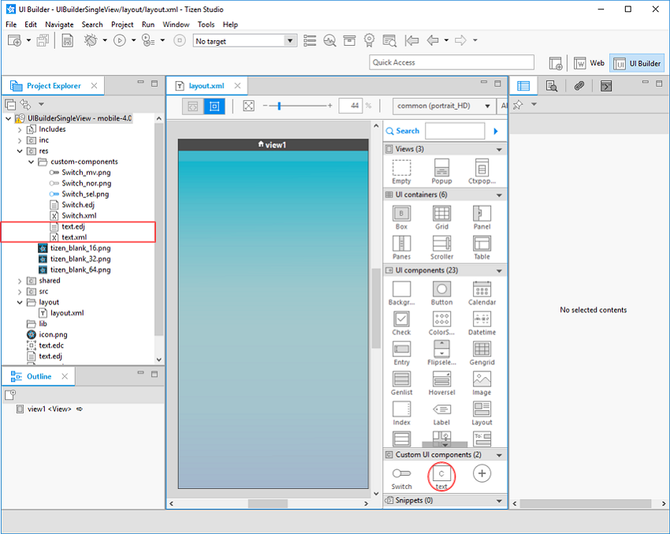

<a name="make_application_using_custom_ui_component"></a>
### Adding Custom UI Components to Projects

To add the new custom elements to your project:

1. Add UI components on the **Design** editor:

   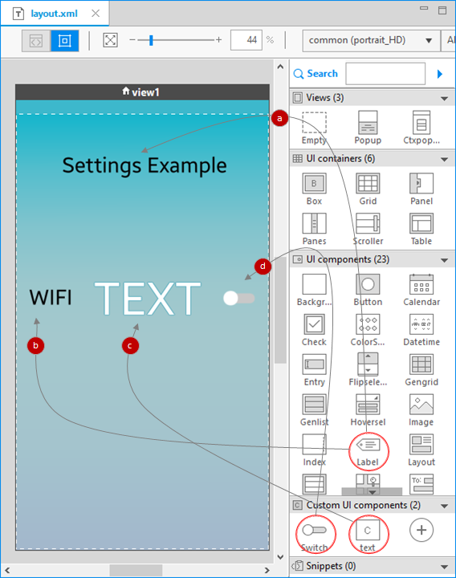

   1. Add a **Label** component to the **Design** editor by dragging and dropping it from the **Palette**.

      In the **Properties** view, modify the **Text** field for the component:

      ```
      <align=center><font_size=60>Settings Example</font></align>
      ```

   2. Add a second **Label** component in the same way, and modify its **Text** property:

      ```
      <align=center><font_size=60>WIFI</font></align>
      ```

   3. Add a **text** custom UI component.

   4. Add a **Switch** custom UI component.

2. Modify the custom UI component properties:

   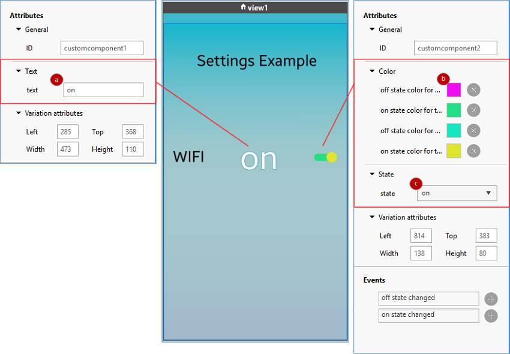

   1. For the **text** component, change the **Text** value to **on**.
   2. For the **Switch** component, change the **Color** values to colors of your choosing.
   3. For the **Switch** component, change the **State** value to **on**.

3. Add an event handler to the **Switch** component:

   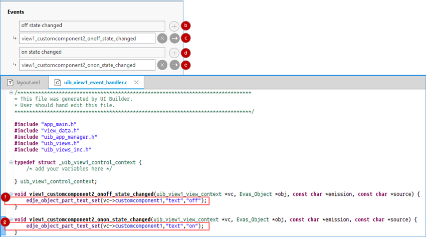

   1. In the **Design** editor, select the **Switch** component.
   2. In the **Properties** view, add an **off state changed** event handler by clicking the  icon next to the event name.
   3. Add the event handler to your source code by clicking the  icon.
   4. Add an **on state changed** event handler by clicking the  icon next to the event name.
   5. Add the event handler to your source code by clicking the  icon.
   6. For the **off state changed** event handler, add code that changes the **text** UI component **Text** property value to "off" when the **Switch** UI component state changes to **off**.
   7. For the **on state changed** event handler, add code that changes the **text** UI component **Text** property value to "on" when the **Switch** UI component state changes to **on**.
   8. Save all changes to your project by pressing **Ctrl + S**.

The following figure shows the created custom UI components in operation. The **Switch** component color and the **text** component value change depending on the **Switch** component state.

**Figure: Custom UI component example**

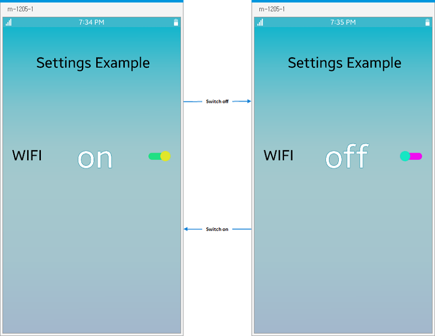

<a name="delete_custom_ui_component"></a>
### Deleting Custom UI Components

To remove a custom UI component from the **Palette**:

1. In the **Palette**, right-click the **Switch** UI component and select **Delete Custom UI Component**.

   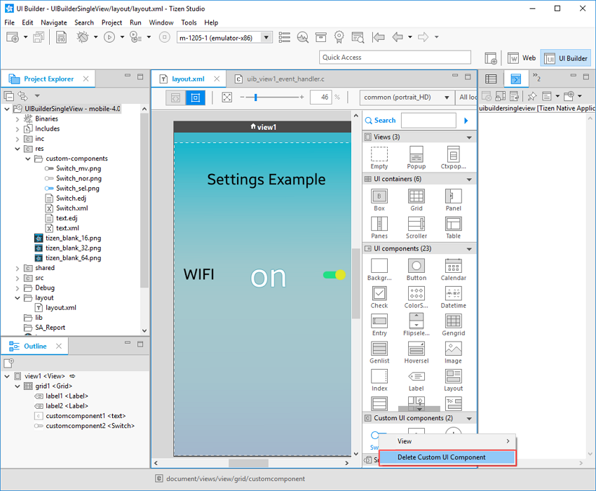

2. Confirm the deletion by clicking **Yes**.

   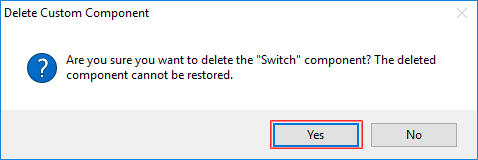

3. The **Switch** component is removed from the **Palette**.

   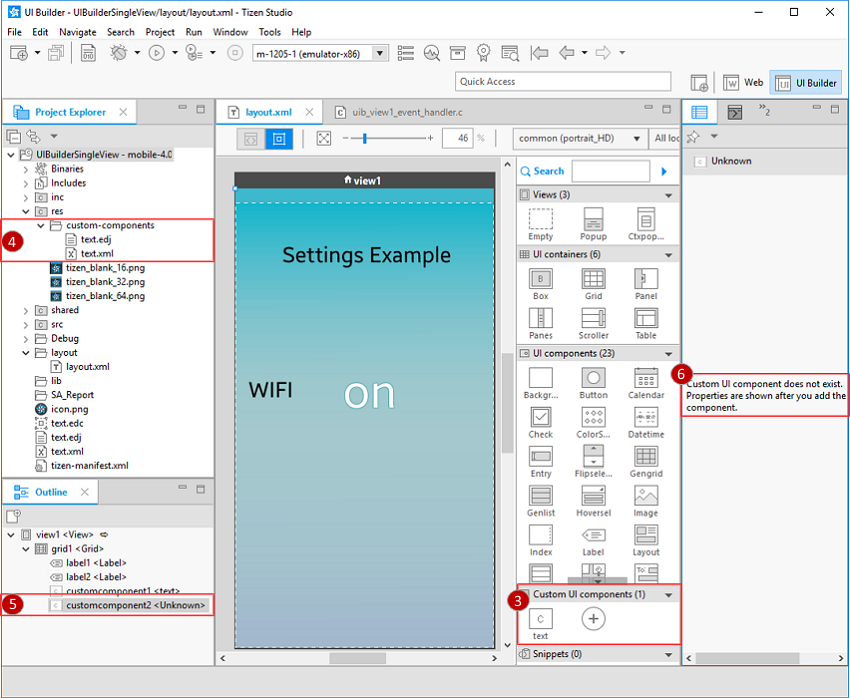

4. In the **Project Explorer**, all files related to the custom component are deleted. For the **Switch** component, this includes `Switch.xml`, `Switch.edj`, `Switch_mv.png`, `Switch_nor.png`, and `Switch_sel.png`.
5. In the **Outline** view, the UI component previously labeled **Switch** now appears as **Unknown**.
6. If you select the UI component labeled **Unknown** in the **Outline** view, the **Properties** view shows an error message.

   If you add a new custom UI component with the same name as the deleted one, the component name is restored in the **Outline** view.


## Related Information
- Dependencies
  - Tizen Studio 2.1 and Higher
