# Hardware Accelerated Execution Manager

The Intel Hardware Accelerated Execution Manager (Intel® HAXM) is a hardware-assisted virtualization engine (hypervisor) that uses Intel Virtualization Technology (VT) to speed up Tizen application emulation on Windows® and macOS host machines. In combination with Tizen x86 emulator images and the [Tizen Studio](../index.md), Intel® HAXM speeds up the Tizen emulation on Intel-VT-enabled systems.

This topic describes how to install the HAXM on your [Windows®](#on_Windows) or [macOS](#on_MacOS) development system.

Hardware requirements:

- Intel processor with support for VT-x, EM64T, and Execute Disable Bit
- At least 1 GB of available memory (2 GB or more is preferred)

> **Important**  
> Intel® HAXM can only be used on systems with an Intel processor which supports the Intel VT.

<a name="on_Windows"></a>
## Installing Intel® HAXM on Windows®

Supported Windows® versions: 8.1/8/7 (32/64-bit), Vista (32/64-bit), XP SP2 or higher (32-bit only)

**HAXM is installed automatically as part of the Tizen Studio**. If you want to install the HAXM individually, visit [http://download.tizen.org/sdk/haxm/6.0.4/win/](http://download.tizen.org/sdk/haxm/6.0.4/win/) and download the Windows installer package.

**Table: Windows installer package**

| Windows installer                        | File description | File size | MD5 checksum                     |
| ---------------------------------------- | ---------------- | --------- | -------------------------------- |
| [IntelHAXM_6.0.4.exe](http://download.tizen.org/sdk/haxm/6.0.4/win/IntelHAXM_6.0.4.exe) | System driver    | 2.66 MB   | bc05f881d9282ed0914b3e0bf3c96e89 |

To install Intel® HAXM:

1. Run the downloaded installer and accept the UAC prompt.

   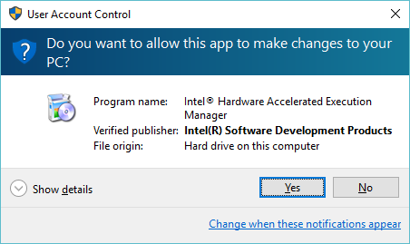

2. Click **Next** to start the installation.  
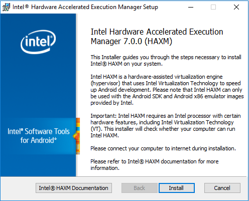  
You can access the documentation at any time by clicking **Intel® HAXM Documentation**.

3. Adjust the amount of RAM to be allocated to Intel® HAXM.

   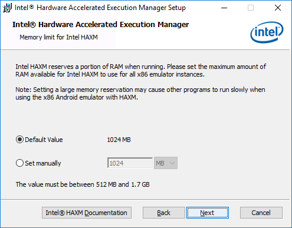

   The installer also functions as a configuration tool for Intel® HAXM. To change the memory settings later, run the installer again.

   > **Note**  
   > If you change the Intel® HAXM memory settings for the emulator, you must restart the Intel® HAXM and the emulator. Emulators currently running continue to use the previous memory setting.

4. Confirm your Intel® HAXM memory allocation settings and click **Install**.  
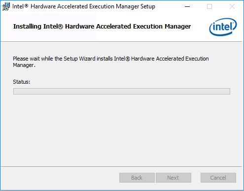

5. When the Intel® HAXM installation is finished, click **Finish** to exit the installer.  
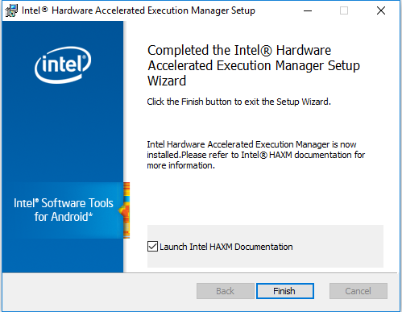

The Intel® HAXM is installed and ready to use.

To verify that Intel® HAXM is running, open the Command Prompt window and execute the following command:

```
sc query intelhaxm
```

If Intel® HAXM is working, the command displays a status message indicating that the state is "4 RUNNING".

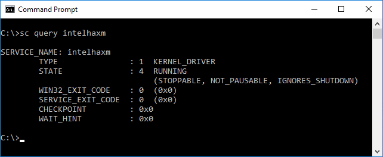

### Starting and Stopping Intel® HAXM

To start or stop Intel® HAXM, open the Command Prompt window with administrator privileges and execute one of the following commands:

- Start HAXM: `sc start intelhaxm`
- Stop HAXM: `sc stop intelhaxm`

### Removing Intel HAXM

> **Warning**  
> Close all instances of the Tizen emulator before removing the Intel® HAXM.

To uninstall the Intel® HAXM, run the installer again or use the Control Panel.

> **Important**  
> If you remove the Intel® HAXM, the acceleration of the Tizen emulator is disabled, but the emulator still works. If you install the Intel® HAXM again, the acceleration is re-enabled.

### Troubleshooting

If you meet an installation failure because of hardware requirements, check the BIOS/OS settings:

- Make sure **VT** is enabled in BIOS.
- Make sure **Execute Disable Bit** is enabled in BIOS.
- Make sure **Data Execution Prevention** is enabled in Windows®. On the Windows® platform, click **Control Panel > System > Advanced system settings > Advanced tab > Performance section**, **Options** (or **Settings**), and **Data Execution Prevention**. Make sure that **DEP** is enabled.
- Make sure that **Hyper-V** is disabled (on Windows® 8 or after):  
  1. Run **Programs and Features** on the **Start** menu.  
  
  2. Click **Turn Windows features on or off**.
  3. Disable **Hyper-V** and click **OK**.  
  
  4. Reboot the computer.

<a name="on_MacOS"></a>
## Installing Intel® HAXM on macOS

Supported macOS versions: 10.10 Yosemite (64-bit), 10.9 Mavericks (64-bit), 10.8 Mountain Lion (64-bit)

**HAXM is installed automatically as part of the Tizen Studio.** If you want to install the HAXM individually, visit [http://download.tizen.org/sdk/haxm/6.0.3/mac/](http://download.tizen.org/sdk/haxm/6.0.3/mac/) and download the macOS installer package.

**Table: Windows installer package**

| macOS installer                          | File description | File size | MD5 checksum                     |
| ---------------------------------------- | ---------------- | --------- | -------------------------------- |
| [IntelHAXM_6.0.3.dmg](http://download.tizen.org/sdk/haxm/6.0.3/mac/IntelHAXM_6.0.3.dmg) | System driver    | 213 KB    | cbd7e3cbdb8b4a84c91fc9094b2cd134 |

To install Intel® HAXM:

1. Open the downloaded DMG file and run the installer inside it.

2. Click **Continue** to start the installation.  
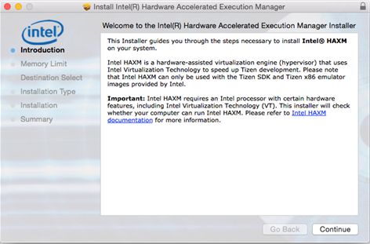

3. Adjust the amount of RAM to be allocated to Intel® HAXM or set it to **2048 MB** as the default value.  
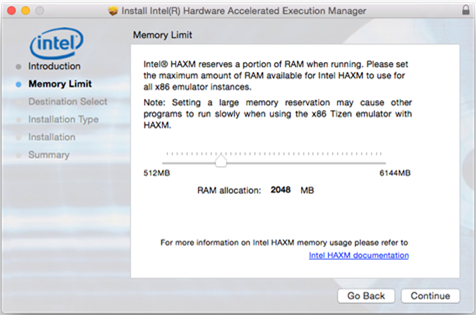  
The installer also functions as a configuration tool for Intel® HAXM. To change the memory settings later, run the installer again.

4. Confirm your Intel® HAXM memory allocation settings, and click **Continue**.  
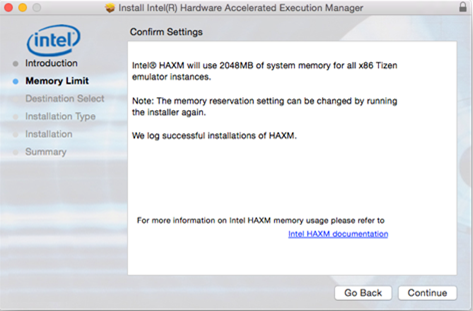

5. Check the capacity and the disk location of the HAXM driver, and click **Install**.  
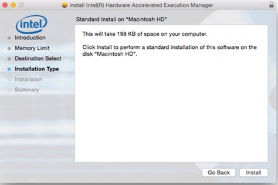

6. Type your password.

   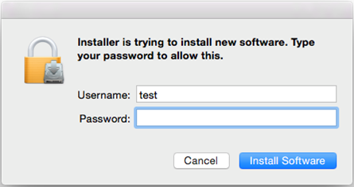

7. When the Intel® HAXM installation is finished, click **Close** to exit the installer.  
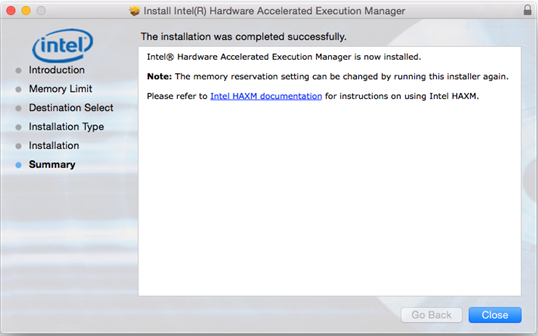

The Intel® HAXM is installed and ready to use.

### Using Intel® HAXM

The Intel® HAXM significantly enhances the performance of the Tizen emulator. For more information on the emulator details, see [Increasing the Application Execution Speed](../common-tools/emulator.md#speed).


## Related information
* Dependencies
  - Tizen Studio 1.0 and Higher
