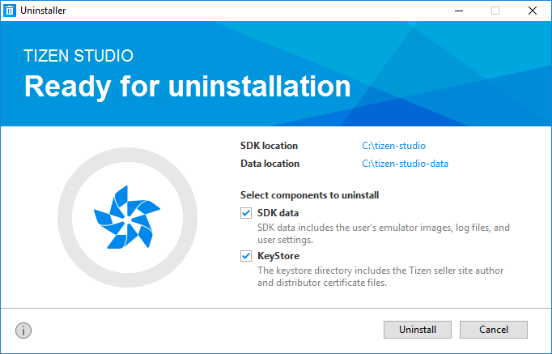
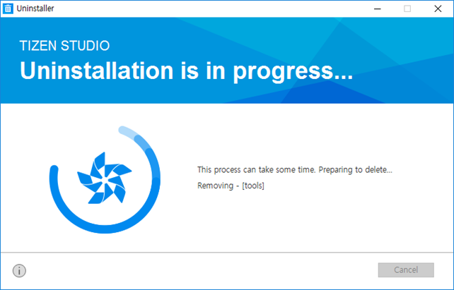

# Uninstalling Tizen Studio

By uninstalling the Tizen Studio, you can completely remove all the Tizen platforms and tools that you have installed. To remove a single package or multiple packages, see [Updating Tizen Studio](updating-sdk.md).

You can uninstall using the GUI uninstaller or the CLI Package Manager.

## Using the GUI Uninstaller

To uninstall the Tizen Studio:

1. Launch the Tizen Studio uninstaller.

2. Select the components to uninstall.

   If you do not select the **SDK data** or **KeyStore** components, you can keep the SDK data or keystore files in their directories for future re-use:

   - **SDK data**  
   The SDK data directory typically contains user-created data files, including emulator images, log files, and tool configuration files.

   - **KeyStore**  
   The keystore directory is located inside the SDK data directory, and contains the author and distributor certificate files. If the certificate files are deleted, you cannot restore them from any Tizen seller market site. If you plan to install another Tizen Studio version or reinstall the Tizen Studio later, it is strongly recommended that you back up the certificate files or keep the keystore directory by unchecking the **KeyStore** component.

   

   > **Note**  
   > Before proceeding, back up all data and files that you want to keep. Once started, uninstallation cannot be canceled and removed files cannot be restored.

3. To remove all installed platforms and tools, as well as user-created data and files, click **Uninstall**.If you have selected to uninstall the SDK data or KeyStore components, they are also removed.  


## Uninstalling with CLI

Run the CLI Package Manager with the `uninstall` command using the following syntax:

```
package-manager-cli uninstall [-p <password>] <package name>[,…] | [--all]
```

**Table: Uninstall command parameters**

| Parameter                   | Description                              |
| --------------------------- | ---------------------------------------- |
| `-p, --password <password>` | Administrator (sudo) password for authentication. Ubuntu only. |
| `--all`                     | Uninstalls the entire Tizen Studio with tools and platforms, including user-created data, emulator images, and settings. |
| `<package name>[,…]`        | Name of the package you want to uninstall. You can enter multiple package names (such as **NativeIDE** and **Emulator**).To retrieve the names of uninstallable packages, use the following command:`package-manager-cli show-pkgs` |

## Related Information
* Dependencies
  - Tizen Studio 1.0 and Higher
