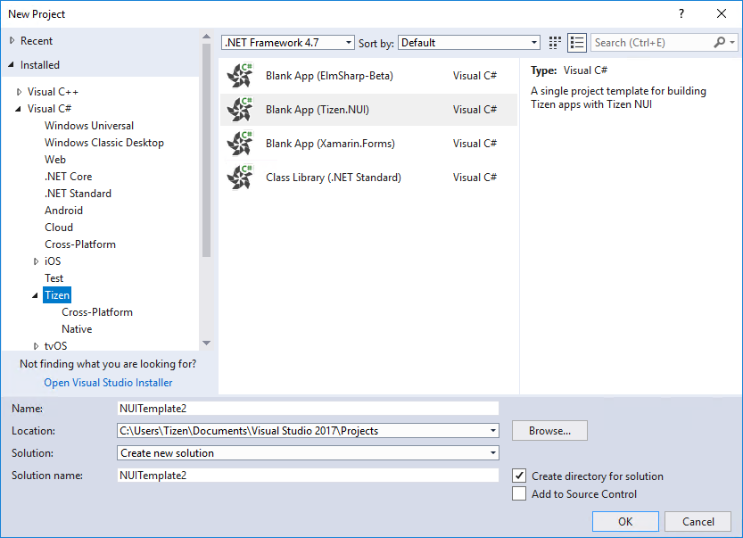
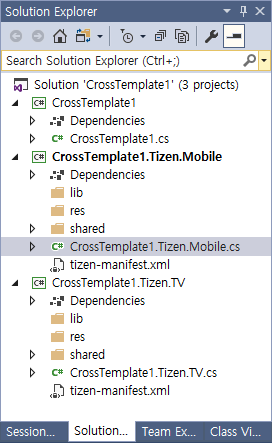

# Project Wizard

The Project Wizard in Visual Studio Tools for Tizen is used to create a Tizen .NET application project.

In the Project Wizard, you can select a template and profile to create the project. In addition, you can set basic project properties, such as the project name, package name, and location.

The Project Wizard provides 4 project templates with which you can start a .NET application project:

-   **Blank App (Xamarin.Forms)**

    Use this template for creating a Tizen Xamarin application (Common, Mobile, TV, and Wearable). You can also use this template for a cross-platform project to add a Tizen project into a Xamarin.Forms solution.

-   **Blank App (ElmSharp-Beta)**

    Use this template for creating a Tizen application using ElmSharp APIs.

-   **Blank App (Tizen.NUI)**

    Use this template for creating a Tizen application using Tizen NUI APIs.

-   **Class Library (.NET Standard)**

    Use this template for creating .NET Standard class library.

**Figure: Project Wizard templates for .NET projects**

When you create a new project with a specific template, the Project Wizard automatically creates basic functionalities for the application based on the template. The default project files and folders are also created.

To create a Tizen .NET application project:

1.  To open the Project Wizard:
    a.  In the Visual Studio menu, go to **File &gt; New &gt; Project &gt; Templates &gt; Visual C\# &gt; Tizen**.
    b.  Select a template for your project.

        The Project Wizard creates the project based on the selected template.

    c.  Set the basic project properties, such as the project name and its location in your local repository, and click **OK**.

2.  If you selected the **Blank App (Xamarin.Forms)** template, the Tizen Project Wizard dialog opens.

    Define the package name, select the profiles that you want to add to your solution, and click **OK**.

    

The following figure shows a new .NET application project solution that contains both mobile and TV profiles.

**Figure: Solution with mobile and TV profiles**

