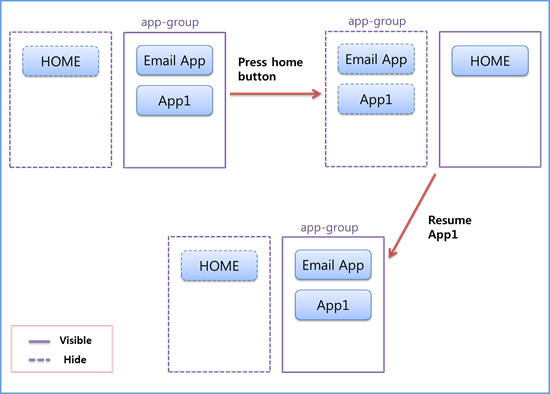

# Application Groups

You can define the application launch mode and group your applications into entities that can be managed together.

The Application API is mandatory for Tizen mobile, wearable, and TV profiles, which means that it is supported on all mobile, wearable, and TV devices. All mandatory APIs are supported on the Tizen Emulators.

The main application group features include:

- Grouping applications in manageable entities

  Application grouping has an effect on what happens when the user hides or exits an application. When applications [belong to the same group](#group-behavior), they are hidden and exited together.

- Controlling the launch mode    

  The launch mode determines how a newly launched application is grouped. You can [control the launch mode](#controlling-the-launch-mode) by:

  - Setting it in the application `config.xml` file.
  - Defining it in an application control that is used to launch the application.

## Group Behavior

Applications in the same group act as if they are in 1 stack. For example, if an application A wants to send an email using an email application B, the application A can launch the email application B, making the email application B a sub application in the same group as the application A. When both applications are running, and the user presses the **Home** key, both applications are hidden. When the user later resumes the caller application (application A), the email application B is shown on top of the caller application.

If an application is launched in a group, it can be terminated by the main (first) application in the group. If the main application is terminated or killed, the sub applications in the group are terminated automatically (they can be terminated by the framework even if they are hidden).

**Figure: Group behavior when using the Home key**



## Prerequisites

To use the Application API (in [mobile](../../../../org.tizen.web.apireference/html/device_api/mobile/tizen/application.html), [wearable](../../../../org.tizen.web.apireference/html/device_api/wearable/tizen/application.html), and [TV](../../../../org.tizen.web.apireference/html/device_api/tv/tizen/application.html) applications), the application has to request permission by adding the following privilege to the `config.xml` file:

```
<tizen:privilege name="http://tizen.org/privilege/application.launch"/>
```

## Controlling the Launch Mode

You can set the application launch mode in the `config.xml` file (in [mobile](../../../../org.tizen.studio/html/web_tools/config_editor_w.htm#mw_application) and [wearable](../../../../org.tizen.studio/html/web_tools/config_editor_w.htm#ww_application) applications) with one of the following values:

- The `SINGLE` launch mode means that the application is launched as a main application (in a new group).
- The `GROUP` launch mode means that the application can be launched as a sub application      belonging to the same group as the caller application which is causing the application to be launched.

Additionally, if the launch mode is not set to `SINGLE` in the `config.xml` file and the application is launched by the `launchAppControl()` method of the `ApplicationManager` interface (in [mobile](../../../../org.tizen.web.apireference/html/device_api/mobile/tizen/application.html#ApplicationManager), [wearable](../../../../org.tizen.web.apireference/html/device_api/wearable/tizen/application.html#ApplicationManager), and [TV](../../../../org.tizen.web.apireference/html/device_api/tv/tizen/application.html#ApplicationManager) applications) with the `ApplicationControl` object (in [mobile](../../../../org.tizen.web.apireference/html/device_api/mobile/tizen/application.html#ApplicationControl), [wearable](../../../../org.tizen.web.apireference/html/device_api/wearable/tizen/application.html#ApplicationControl), and [TV](../../../../org.tizen.web.apireference/html/device_api/tv/tizen/application.html#ApplicationControl) applications), the `launchMode` property of this object overrides the launch mode of the called application. If the launch mode in the `config.xml` file is set to `SINGLE`, the value of the `ApplicationControl.launchMode` property is ignored and the sub application is always called in the `SINGLE` mode.

To launch an application in a `GROUP` mode:

1. Define the application control object with the `GROUP` mode:

   ```
   var appControl = new tizen.ApplicationControl('http://tizen.org/appcontrol/operation/view',
                                                 null, 'image/jpeg', null, [], 'GROUP');
   ```

2. Define an array with callbacks for the `tizen.application.launchAppControl()` method:

   ```
   var appControlReplyCallback = {
       /* Callee sent a reply */
       onsuccess: function(data) {
           console.log('onsuccess');
       },
       /* Callee returned failure */
       onfailure: function() {
           console.log('onfailure');
       }
   }
   ```

3. Launch the application in the `GROUP` mode with the previously defined application control object:

   ```
   tizen.application.launchAppControl(appControl, null, function() {
       console.log('launch application control succeed');
   }, function(e) {
       console.log('launch application control failed. reason: ' + e.message);
   }, appControlReplyCallback);
   ```

## Related Information
* Dependencies
   - Tizen 2.4 and Higher for Mobile
   - Tizen 2.3.1 and Higher for Wearable
   - Tizen 3.0 and Higher for TV
