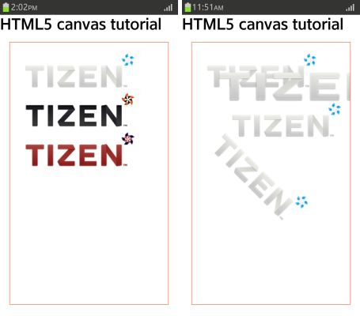
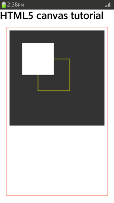
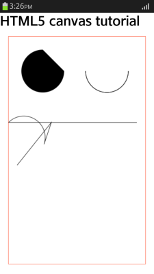
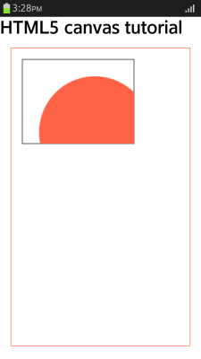
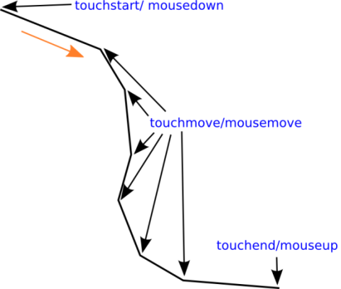
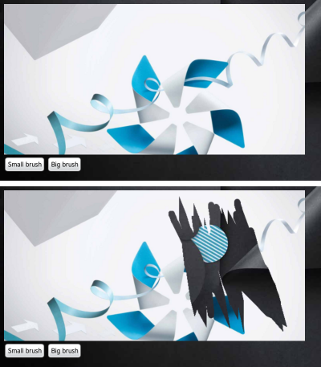
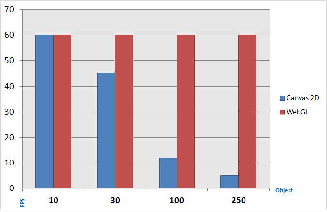
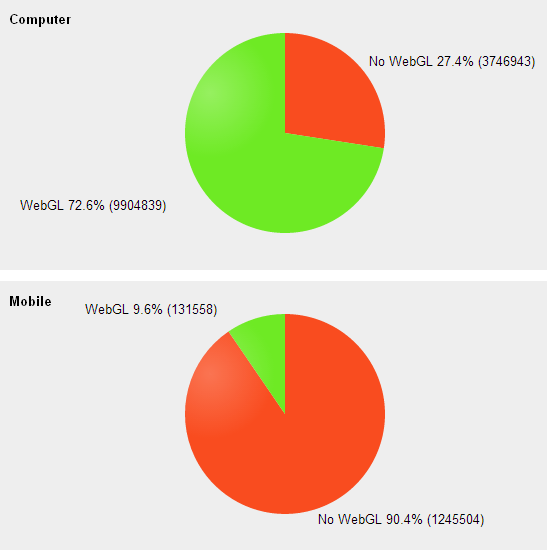

# HTML5 Canvas

The HTML5 canvas allows you to use graphics on the screen, and draw and manage various shapes. The HTML Canvas 2D Context API (in [mobile](../../../../org.tizen.web.apireference/html/w3c_api/w3c_api_m.html#canvas2d) or [wearable](../../../../org.tizen.web.apireference/html/w3c_api/w3c_api_w.html#canvas2d) applications) defines a special canvas element that expresses images or shapes with JavaScript.

This feature is supported in mobile and wearable applications only.

The main features of the Canvas Element API include:

- Creating a canvas

  To draw and manage shapes, you must [insert a &lt;canvas&gt; element](#using-a-canvas) in the HTML page.

- Using images

  You can [use images on the canvas](#using-images-on-the-canvas) by using the applicable method of the HTML Canvas 2D Context API.

- Drawing shapes

  With the HTML Canvas 2D Context API, you can [draw various shapes](#drawing-shapes-to-the-canvas), such as rectangles, circles, and lines to a canvas.

  You can also [draw and mask objects](#drawing-masks-to-the-canvas) on the canvas.

- Using styles and transformations

  You can use a canvas to [create text or lines](#creating-text-and-lines-on-the-canvas) other than images and shapes.

For all canvas objects (images, shapes, text, and lines), you can define colors (the `fillStyle` and `strokeStyle` attributes), shadows (the `shadowColor` and `shadowBlur` attributes), and gradation (the `createLinearGradient()` method). You can also use the transformation methods, such as `scale()`, `translate()`, `transform()`, and `rotate()`, to implement, for example, transparency or shape gradient transformations.

In mobile applications only, in HTML5, the [Scalable Vector Graphics (SVG) 2](../../../../org.tizen.web.apireference/html/w3c_api/w3c_api_m.html#svg) API provides similar features as the canvas. Their difference is that SVG expresses graphics using vectors, while the canvas is based on pixels. To express complex graphics, use the canvas, and to express graphics with a liberal expansion or reduction, use [SVG](./svg.md).

> **Note**  
> The canvas currently supports 2D graphics only, since the 3D graphics specification is still in progress. The [WebGL™](https://www.khronos.org/registry/webgl/specs/1.0/) API is currently called 3D Canvas, and is used to express 3D graphics. For more information on the performance differences between Canvas 2D and WebGL™ in mobile applications, see [Performance Comparison of Canvas 2D and WebGL™](#comparison).

## Using a Canvas

To create a canvas in your application:

1. Create a `<canvas>` element with the HTML5 Canvas Element API.The canvas assigns the region (canvas context) where images are drawn with JavaScript.

   ```
   <canvas width="300" height="300" id="canvas">
      This browser is not supported
   </canvas>
   ```

   If no `width` and `height` attributes are inserted, the default value is `width: 300px, height: 150px`.

2. To check the information on the image connected to the canvas, use the `toDataURL([Optional], [Variadic])` method to restore the URL of the image used on the canvas. To create a blob object of the image file, use the `getContext(contextId)` method.

3. Use the `CanvasRenderingContext2D` interface (in [mobile](http://www.w3.org/TR/2015/REC-2dcontext-20151119/#canvasrenderingcontext2d) and [wearable](http://www.w3.org/TR/2012/CR-2dcontext-20121217/#canvasrenderingcontext2d) applications) to connect to the canvas and get the canvas context:

   ```
   var canvas = document.querySelector('canvas'),
       context = canvas.getContext('2d');
   ```

   The interface has various methods and attributes for expressing images and shapes.

4. To manage the work stack of the canvas, use the following methods:

   - `save()`: Pushes the current state onto the stack.
   - `restore()`: Pops the top state on the stack, restoring the context to that state.

There is a need to separately check whether the canvas 2D context can be used by using the `getContext()` method:

```
if (!(canvas.getContext)) {
    alert('This browser is not supported');
}
```

### Source Code

For the complete source code related to this use case, see the following files:

- [canvas_tutorial1.html](http://download.tizen.org/misc/examples/w3c_html5/graphics/html5_the_canvas_element_and_html_canvas_2d_context)
- [canvas_tutorial2.html](http://download.tizen.org/misc/examples/w3c_html5/graphics/html5_the_canvas_element_and_html_canvas_2d_context)

## Using Images on the Canvas

To use images on the canvas, use the `drawImage()` method of the HTML Canvas 2D Context API. The method receives information, such as the image URL and position, and where it is indicated, and then creates the image on the canvas. The created image is pixel-based.

> **Note**  
> To edit the created image, you must comply with the same-origin policy.

To use images on a canvas:

1. Use the `drawImage()` method to express an image on the canvas.

   When you define the URL of the image to be imported and its coordinates, the original image is imported as it is. You can hide certain parts of the image by assigning its size accordingly.

   ```
   /* Draw the image by setting its size */
   context.drawImage(image, 30, 130, 130, 30);
   context.drawImage(image, 200, 100, 80, 60);

   /* Draw the image by setting the image area */
   context.drawImage(image, 193, 0, 30, 30, 80, 220, 50, 50);
   context.drawImage(image, 0, 10, 40, 60, 190, 205, 40, 60);
   ```

2. When the image is connected to the canvas, extract the color value through the `getImageData()` method. Re-input the transformed values with the `putImageData()` method.

   ```
   /* Import the image with the required coordinates */
   var transImage = context.getImageData(30, 20, image.width, image.height);

   /* Convert the data color value for each image pixel */
   for (var i = 0; i < transImage.data.length; i += 4) {
       transImage.data[i + 0] = 255 - transImage.data[i + 0];
       transImage.data[i + 1] = 255 - transImage.data[i + 1];
       transImage.data[i + 2] = 255 - transImage.data[i + 2];
   }

   /* Insert the converted image back to the canvas */
   context.putImageData(transImage, 30, 20);
   ```

3. Use the `CanvasTransformation` interface to transform the selected object, for example, its size, angle, or position. By connecting to the image used on the canvas, you can also rotate it. (The following figure applies to mobile applications only.)

   ```
   context.beginPath();
   context.scale(1.7, 1.3);
   context.drawImage(image, 30, 20);
   context.restore();

   /* Move the (0, 0) reference axis coordinates of the canvas */
   context.beginPath();
   context.translate(50, 100);
   context.drawImage(image, 30, 20);
   context.restore();

   /* Rotate using the (0, 0) coordinates as reference */
   context.beginPath();
   context.rotate(45 * Math.PI/180);
   context.drawImage(image, 70, 20);
   context.restore();
   ```

   

### Source Code

For the complete source code related to this use case, see the following files:

- [canvas_tutorial1.html](http://download.tizen.org/misc/examples/w3c_html5/graphics/html5_the_canvas_element_and_html_canvas_2d_context)
- [canvas_tutorial2.html](http://download.tizen.org/misc/examples/w3c_html5/graphics/html5_the_canvas_element_and_html_canvas_2d_context)

## Drawing Shapes to the Canvas

With the HTML Canvas 2D Context API, you can draw various shapes, such as rectangles (`rect()`), circles (`arc()` and `arcTo()`), and lines (`lineTo()` and `bezierCurveTo()`), to a canvas. You can define the position and size of the shapes, and also merge shapes with other shape objects.

To create and draw shapes on a canvas:

1. Use the `rect()` method to create a rectangle.Use the canvas context to assign the rectangle attributes, such as position and size. (The following figure applies to mobile applications only.)

   ```
   /* Rectangle fill style */
   context.fillStyle = '#333';
   context.fillRect(10, 10, 300, 300);

   /* Rectangle stroke style */
   context.strokeStyle = '#ff0';
   context.strokeRect(100, 100, 100, 100);

   /* Rectangle clear style */
   context.clearRect(50, 50, 100, 100);
   ```

   

2. Use the `arc()` method to create a circle.Use the canvas context to assign the circle attributes, such as position and radius. (The following figure applies to mobile applications only.)

   ```
   /* Create a circle */
   context.beginPath();
   context.arc(80, 80, 50, 0, 1.5 * Math.PI);
   context.fill();

   context.beginPath();
   context.arc(230, 80, 50, 0, 1 * Math.PI);
   context.stroke();

   /* Create line A */
   context.moveTo(20, 300);
   context.lineTo(100, 200);

   /* Connect the line A end coordinates to the line B start coordinates */
   context.arcTo(150, 50, 100, 100, 50);

   /* Draw line B */
   context.lineTo(300, 200);
   context.stroke();
   ```

   

3. Use the `CanvasTransformation` interface to transform the created shapes. With compositing, a certain part of the shape can be made transparent. (The following figure applies to mobile applications only.)

   ```
   /* Display the relevant area */
   context.rect(50, 20, 100, 120);
   context.stroke();
   context.clip();

   context.beginPath();
   context.arc(150, 150, 100, 0, 2 * Math.PI);

   /* Fill the shape */
   context.fillStyle = 'tomato';
   ```

   

> **Note**  
> For a canvas, the rendering occurs in the order from the back of the input source.

### Source Code

For the complete source code related to this use case, see the following file:

- [canvas_tutorial3.html](http://download.tizen.org/misc/examples/w3c_html5/graphics/html5_the_canvas_element_and_html_canvas_2d_context)

## Drawing Masks to the Canvas

To draw masks on a canvas:

1. Create the HTML layout with a canvas and 2 button input elements for brush selection:

   ```
   <canvas id="canvas" width="600" height="300"></canvas>
   <input type="button" value="Small brush" id="smallBrush"/>
   <input type="button" value="Big brush" id="bigBrush"/>
   ```

2. Define the CSS style for the background image:

   ```
   <style>
      body {
         background: url(images/tizen_blackfold3.png) no-repeat;
         background-size: cover;
      }
   </style>
   ```

3. Declare the JavaScript variables needed in the application. The `lastX` and `lastY` variables indicate the last position of a user event. The `mouseBtn` variable indicates whether a button or touch event has occurred, and the `brushSize` variable indicates the current brush size.

   ```
   var lastX = 0,
       lastY = 0,
       mouseBtn = false,
       brushSize = 4;
   var canvas, context;
   ```

4. Initialize the canvas:

   ```
   window.onload = function() {
       canvas = document.getElementById('canvas');
       context = canvas.getContext('2d');
       if (!context) {
           return;
       }
   };
   ```

5. Draw an image on the canvas using the `drawImage()` method. The user is able to replace the image with another using a brush.Create a new `Image` object, including the path of the image file. Define the line width to be based on the brush size selected by the user.

   ```
   var img = new Image();
   img.addEventListener('load', function() {
       context.drawImage(img, 0, 0);
   });
   img.src = 'images/TizenPinwheelArrows.png';
   context.lineWidth = brushSize;
   context.lineCap = 'round';
   ```

6. Define the button events and brushes:

   ```
   var smallBtn = document.getElementById('smallBrush');
   smallBtn.addEventListener('click', smallBrush);
   var bigBtn = document.getElementById('bigBrush');
   bigBtn.addEventListener('click', bigBrush);

   function smallBrush(e) {
       context.beginPath();
       brushSize = 4;
       context.lineWidth = brushSize;
   }
   /* Define the big brush similarly */
   ```

7. Add event listeners to detect touch and mouse events:

   ```
   canvas.addEventListener('touchstart', startDraw);
   canvas.addEventListener('touchmove', drawStep);
   canvas.addEventListener('touchend', stopDraw);
   canvas.addEventListener('mouseout', stopDraw);
   /* Event listeners for mouse events */
   ```

   The `touchstart` and `mousedown` events only store the event coordinates, the `touchmove` and `mousemove` events define the position and direction of the drawing, and the `touchend` and `mouseup` events indicate that the user event ends, as illustrated in the following figure.

   

8. Use the `updateLastPos()` method to update the `lastX` and `lastY` variable values. The real coordinates can be calculated by reducing the offset position of the canvas element from the touch position coordinates. The `'touch'` string indicates that the event is a touch event.

   ```
   function updateLastPos(e) {
       if (e.type.indexOf('touch') >= 0) {
           var pos = e.touches.item(0);
           lastX = pos.clientX-pos.target.offsetLeft;
           lastY = pos.clientY-pos.target.offsetTop;
       } else {
           lastX = e.offsetX;
           lastY = e.offsetY;
       }
   }
   ```

9. When the user starts drawing, the `touchstart` or `mousedown` event calls the `startDraw()` method, which updates the event position, sets the composite operations property to make the drawing a mask, begins to draw a new path, moves the drawing point to the selected coordinates, and sets the button or touch event state to `true`.

   ```
   function startDraw(e) {
       updateLastPos(e);
       context.globalCompositeOperation = 'destination-out';
       context.beginPath();
       context.moveTo(lastX, lastY);
       mouseBtn = true;
   }
   ```

10. While the user is drawing, the `touchmove` and `mousemove` events are handled with the `drawStep()` method based on the button state retrieved from the `mouseBtn` variable. The `drawStep()` method calls the `updateLastPos()` method only when the mouse or finger is being moved. Use the `stroke()` method to make the drawn line visible.

    ```
    function startDraw(e) {
        updateLastPos(e);
        context.globalCompositeOperation = 'destination-out';
        context.beginPath();
        context.moveTo(lastX, lastY);
        mouseBtn = true;
    }
    ```

11. When the touch event ends or the mouse button is released, use the `stopDraw()` method to stop drawing:

    ```
    function stopDraw(e) {
        context.globalCompositeOperation = 'source-over';
        mouseBtn = false;
    }
    ```

    

### Source Code

For the complete source code related to this use case, see the following file:

- [renamed_index.html](http://download.tizen.org/misc/examples/w3c_html5/graphics/html5_the_canvas_element_and_html_canvas_2d_context/scratchcard)

## Creating Text and Lines on the Canvas

To create text and lines on a canvas:

1. To draw a line, use the `moveTo()` method to assign the beginning point of the line, and the `lineTo()` method to assign the end point of the line. The `stroke()` method draws the full line.

   ```
   context.lineJoin = 'bevel';
   context.lineWidth = 20;

   context.beginPath();
   context.lineJoin = 'round';
   context.moveTo(20, 20);
   context.lineTo(100, 40);
   context.stroke();
   ```

2. When adding text on the canvas, use various attributes and methods to define how the text looks and where it is located.

   The `font` attribute defines the font style, and the `textBaseline` attribute the vertical alignment of the text.

   ```
   context.font = 'italic 400 22px/2 sans-serif';
   context.strokeStyle = '#f00';
   context.textBaseline = 'alphabetic';
   context.moveTo(150, 20);
   context.lineTo(150, 170);
   context.stroke();
   ```

3. Use the `textAlign` attribute and the `fillText()` method to position the text in the assigned location:

   ```
   context.textAlign = 'start';
   context.fillText('textAlign=start', 150, 50);
   context.textAlign = 'end';
   context.measureText('textAlign=end', 150, 100);
   ```

> **Note**  
> When drawing multiple images on a canvas, indicate the starting point with the `beginPath()` method to prevent unforeseen errors.

### Source Code

For the complete source code related to this use case, see the following files:

- [Line_Styles_3.html](http://download.tizen.org/misc/examples/w3c_html5/graphics/html5_the_canvas_element_and_html_canvas_2d_context)
- [Text_Styles_2.html](http://download.tizen.org/misc/examples/w3c_html5/graphics/html5_the_canvas_element_and_html_canvas_2d_context)
- [Text_Styles_4.html](http://download.tizen.org/misc/examples/w3c_html5/graphics/html5_the_canvas_element_and_html_canvas_2d_context)

<a name="comparison"></a>
## Performance Comparison of Canvas 2D and WebGL™ in Mobile Applications

In Web documents prior to HTML5, only simple image loading was supported. To create graphic animations, you had to use a separate plug-in. However, as the graphic-related APIs have become more standardized, you can now express graphics by using only JavaScript, without a separate plug-in.

When developing Web applications that need to express complex graphics, such as games, the most important issue to consider is graphic performance. Currently, the HTML Canvas 2D Context API and [WebGL™](https://www.khronos.org/registry/webgl/specs/1.0/) are used to express graphic elements in many games. The following example illustrates how to create an effective graphic animation by comparing the performance of the renderers in the Canvas 2D Context API and WebGL™.

To compare the performance, 2 simple Web applications must be created, using the Canvas 2D Context API and WebGL™:

1. Create the applications with the following logic:
   1. Load an image.
   2. Render the loaded image in the random location of the canvas.
   3. Use the `requestAnimationFrame()` method of the Timing control for script-based animations API (in [mobile](../../../../org.tizen.web.apireference/html/w3c_api/w3c_api_m.html#timing) or [wearable](../../../../org.tizen.web.apireference/html/w3c_api/w3c_api_w.html#timing) applications) to change the color of the loaded image, based on different times.
   4. Create a logic that measures FPS (frames per second) in order to check the performance.
2. Execute the applications and measure the FPS.
3. Increase only the number of objects so that the same 1~N images, under the same conditions, are shown repeatedly based on 1~N.
4. Measure the FPS as the number of repeatedly shown objects increase.

The following figure shows the result of the test: As the number of objects increase, the performance of the Canvas 2D Context API rapidly decreases compared to WebGL™ (the result is subject to change according to the complexity of the application logic). As such, when expressing many graphic objects all differently, it is much more efficient to use WebGL™ than the Canvas 2D Context API.

**Figure: Test result**



There is one problem with using WebGL™; the ratio of mobile browsers supporting it is quite low compared to the Canvas 2D Context API, and even when it is supported, usually only partial features are included (support for 3D acceleration, reflection effect, and camera effect is particularly low). The following figure shows the support status of WebGL™ in computer (top) and mobile (bottom) browsers, as published in [http://webglstats.com/](http://webglstats.com/) in June 2013.

**Figure: WebGL™ support in computer and mobile browsers**



Many mobile browsers do not support WebGL™ or only partially support WebGL™. Even though Tizen supports WebGL™, it is recommended to use the Canvas 2D Context API for small numbers of 2D drawings, since the API is supported in most mobile browsers. However, for performance critical applications, use WebGL™ for faster 2D performance.

## Related Information
* Dependencies
  - Tizen 2.4 and Higher for Mobile
  - Tizen 2.3.1 and Higher for Wearable
  - Tizen 3.0 and Higher for TV
