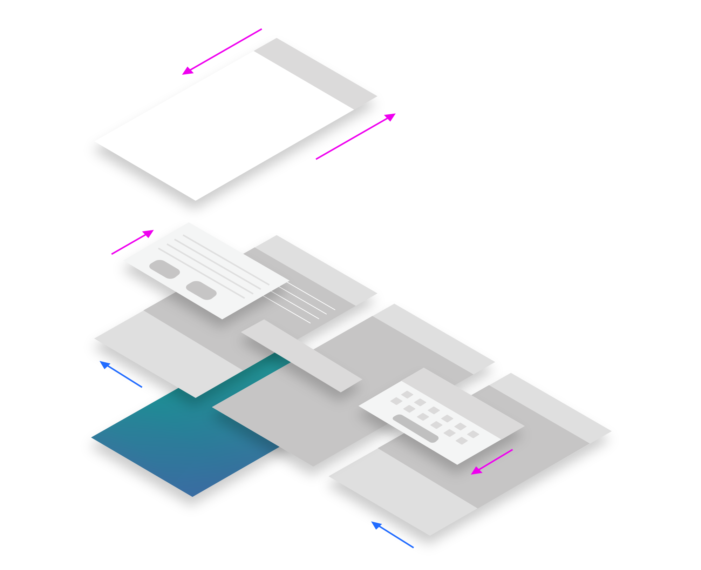

# Animations

The idea of on-screen animation effects in the Tizen UI was inspired by the behavior of wind. We aim to reproduce the wind’s natural movements on the screen to provide a more organic and aesthetic experience for users.

##### The Look and Feel of a Gentle Breeze

The concept of fluid animation design represents the look and feel of a gentle breeze. Objects glide across the screen as if they were blown by a gentle breeze.

* [Video of gentle breeze [Do]](media/animations_doencoded.webm) * (Click to play)*  
* [Video of gentle breeze [Don't]](media/animations_donsencoded.webm)   *(Click to play)*

##### Consistent Flow

Animations on the screen should have a consistent direction. Disorienting animations create visual noise and confuse users. Uniform animation effects that take place in a timely manner can maximize usability by enhancing understanding of what is occurring on the screen.

> Avoid overusing animations. Add animations to tasks only if they are related to the task and can enhance users’ understanding of the task. Meaningless, irrelevant animations only add confusion.

* [Video of consistent flow [Do]](media/2.5_c_1.webm)  * (Click to play)*
* [Video of consistent flow [Don't]](media/2.5_d_1.webm)    *(Click to play)*

 
When you design animations for different layers on the screen, provide them based on the actual movement of the layer they belong to.

  
*Design your motions work in harmony*

If necessary, you can design animations with different styles on the same screen. However, if you design a screen with multiple simultaneous animations, they should be consistent and uniform.

 

##### Subtle Dispersion

Animations that convey the idea of dispersion may be applied to user interfaces, such as buttons and icons.

When you design animations for buttons or icons, there are a few rules to follow to maximize the effect and avoid confusion:

-   Intrigue users by providing a hint that the UI is motion-ready.
-   Keep the original shape of the UI to avoid confusion.
-   Orient the animation from the center to the edge of the UI.
-   Ensure that users clearly recognize the animation effect. To make the effect visible, design the initial animation in a size no less than 80% of the UI size, and then allow it to grow to 100%.

* [Video of dispersion [Do]](media/2.5_h_1.webm) *(Click to play)*
* [Video of dispersion [Don't]](media/2.5_i_1.webm)  *(Click to play)*
