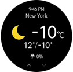
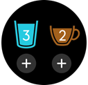
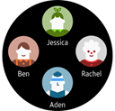
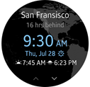
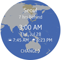

# Widgets

Widgets provide easy access to frequently used tasks or content. They’re useful when users are engaged in other activities or unable to precisely control their Gear. Users can access any app’s key features without launching the app.

Make sure you understand how different types of widgets work, and the widget designs that are best suited to your app. You can also design widgets in web-native languages. Refer to [Native widgets](http://developer.samsung.com/gear/develop/creating-your-first-app/native-widget) for more details on native apps and [Web widgets](http://developer.samsung.com/gear/develop/creating-your-first-app/web-widget) for web apps.

## Basics

-   **Widgets should fit on one page**

    Widgets occupy the whole screen and must be designed for a single page without scrolling.

-   **Widgets only take a single tap**

    Tapping is the only gesture widgets use to perform a task or open an app.

-   **One app can have multiple widgets for different purposes**
-   **Widgets refresh automatically**

>**Tip**
>-   Users can add up to 15 favorite widgets on the Widget Board, located to the right of the watch face.
>-   Users can manage widgets by touching and holding on any widget screen. They can rearrange the order by dragging widgets to the desired position, and add or remove them by tapping the corresponding buttons.  
>      
>    *Users can manage widgets by touching and holding any widget screen.*
>
>-   If an app is uninstalled, all related widgets will also be removed.

## Types of widgets

Three widget types are available for the Gear:

-   Informative widgets that deliver information from the parent app
-   Interactive widgets that both deliver information and receive user input
-   Shortcut widgets that provide a link without exchanging any data with the app

Choose the right widget type for the content you want to offer.

| Informative widget | Interactive widget | Shorcut widget |
| :--: | :--: | :--: |
| | ||  

*Three types of widgets are used on the Gear: Informative widgets, interactive widgets, and shortcut widgets.*

-   **Informative widgets**

    Informative widgets provide information in a scannable way. Widgets should display the key information on a single screen without scrolling, and give users a direct route to more detailed information within the related app. Providing an appropriate image can enhance readability.

      

    *Weather widgets can show the weather for a chosen city and provide a direct route to more detailed info within the app.*

-   **Interactive widgets**

    Interactive widgets perform simple tasks that can be completed with one tap. Ensure that your components are designed intuitively so that users notice they are tappable. Widgets should immediately reflect any user input in real-time and make it clear that user input has been recognized.

      

    *S Health widgets let users input the number of cups of water/coffee consumed and see the changes immediately.*

-   **Shortcut widgets**

    Shortcut widgets provide quick access to frequently used menus or tasks. Shortcuts should use appropriate icons and text to communicate where they lead. When providing multiple shortcuts on one screen, ensure each one is still visible and has a sufficient touchable area.

      

    *Widgets for a contact app can provide shortcuts to call or send a message to favorite contacts.*

## Types of actions

Two actions are available for widgets. Links connect users to an app's menu, and direct actions perform a task on the widget.

-   **Link action**

    Links can connect users directly to the first screen or a particular menu of an app. The link can make up the whole screen, or be shown through a button.

-   **Direct action**

    Direct actions perform simple tasks without opening the app. You can use direct actions for tasks like measuring data or toggling an alarm.

      

    *Tapping an icon on an alarm widget toggles the alarm on/off without opening the app.*

## Common use cases

Here are some common use cases that will help you design your widgets.

-   **Filling empty widgets**

    Some widgets need to be filled with content by users. If you’re creating one of these, include an “Add” button, instead of leaving the screen completely empty.

      

    *An add button helps users initiate the add flow.*

-   **Multi-view widgets**

    Each widget should present just one piece of information on each screen, but this can be broken up across a number of views that you can browse through. In cases like this, dim and turn off the browsing button when there are no more views in a particular direction.

      

    *User can browse many views of a widget with the buttons*

-   **Check your phone**

    Widgets can redirect users to another device like a phone. If your widgets support this feature, use the phrase "Check your phone" to indicate this.

## Designing widgets

Keep the visual principles for colors, layout, and typography in mind when you’re designing your widgets.

-   **Make your widgets readable with a dark background**

    A dark background works best for widgets. It increases screen readability when outdoors and smoothly integrates the widget with the black bezel. Using a transparent background is recommended, but if you are using a colorful image, add a tinted black layer on top (at least 60% opacity) to ensure the text is legible.

      

    *Dark-colored backgrounds enhance screen readability.*

-   **Maintain visual identity with an identity color**

    Applying the primary color of your app to the main text can communicate a strong visual identity. You can choose any app identity color, but do take readability into consideration.

|| |
| :--: | :--: |
| Widget | App |    

*Widgets for the World Clock app use blue as an identity color.*

-   **Use Breeze Sans.**

    Using the system font Breeze Sans optimizes readability on the Gear and makes your app consistent with others. Breeze Sans comes in condensed, regular, and medium fonts. Determine the weight of the font according to the relative level of importance of the text. Refer to [Visual design](../visual-design/typography.md) for more details on Breeze Sans.
