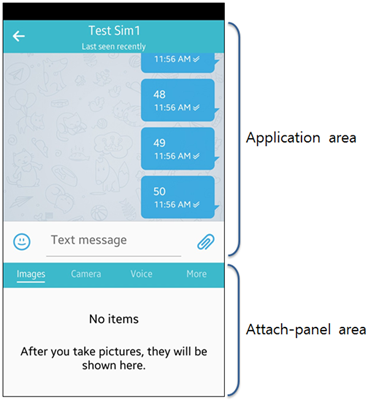
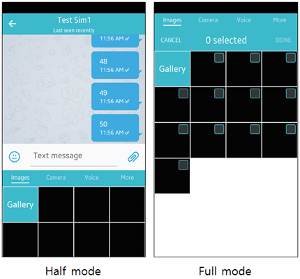
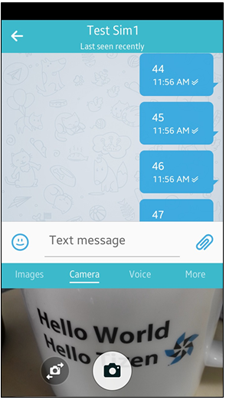
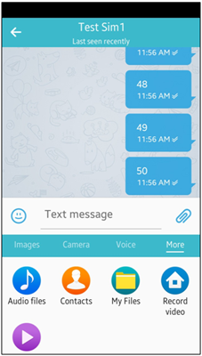

# Attach Panel
## Dependencies
-   Tizen 4.0 and Higher

The attach panel allows the device user to attach various content into an application that contains an attach panel. The user can attach images, take pictures, record voice, and select files on the attach panel.

The main features of the Tizen.Applications.AttachPanel namespace include:

-   Creating an attach panel

    You can [create an attach panel](#create) and manage events related to user selections and panel visibility. You can also add and remove [content categories](#categories).

    You can also [create an attach panel in xamarin](#createInxamarin) by using [Custom Renderers](https://developer.xamarin.com/guides/xamarin-forms/application-fundamentals/custom-renderer/).

-   Managing an attach panel

    You can [set extra data](#manage) to a content category to manage its content.

**Figure: Attach panel**



The attach panel has UI components and it manages user interactions on its interface. The layout component keeps on the tabbar and scroller components, which are connected to show the content synchronously. The scroller component has pages to display the content of, for example, images, camera, and voice recorder. Some content is shown as a page on the panel, while others can be launched from the panel's **More** tab using [application controls](../app-management/app-controls.md).

The attach panel has half and full display modes. The mode can be changed by swiping up and down the page.

**Figure: Attach panel modes**




<a name="categories"></a>
## Content Categories

You can manage the following types of content:

-   Images

    In the half mode, you can select only 1 image to be attached. In the full mode, you can select multiple images at once.

-   Camera

    You can take a picture using the device camera, and attach it.

-   Voice

    You can attach a voice recording.

-   Various content in the **More** tab

    The **More** tab shows the icons of additional categories, for example, video, audio, calendar, contact, myfiles, and video recorder, that can be launched by clicking the applicable icon.

The following figure illustrates the content types. From left to right: images, camera, voice, and **More** tab content.

**Figure: Content categories**

   

## Prerequisites


To enable your application to use the attach panel functionality:

1.  To use the [Tizen.Applications.AttachPanel](https://developer.tizen.org/dev-guide/csapi/api/Tizen.Applications.AttachPanel.html) namespace, the application has to request permission by adding the following privileges to the `tizen-manifest.xml` file:

    ``` 
    <privileges>
       <!--To add the image viewer and camera UI gadget in the attach panel-->
       <privilege>http://tizen.org/privilege/mediastorage</privilege>
       <!--To add the camera UI gadget in the attach panel-->
       <privilege>http://tizen.org/privilege/camera</privilege>
       <!--To add the voice recorder UI gadget in the attach panel-->
       <privilege>http://tizen.org/privilege/recorder</privilege>
       <!--To launch apps from the More tab-->
       <privilege>http://tizen.org/privilege/appmanager.launch</privilege>
    </privileges>
    ```

2.  To use the methods and properties of the Tizen.Applications.AttachPanel namespace, include it in your application:

    ``` 
    using Tizen.Applications.AttachPanel;
    ```

3.  To create an attach panel instance, you need an [ElmSharp.Conformant](https://developer.tizen.org/dev-guide/csapi/api/ElmSharp.Conformant.html) instance. You can either:
    -   [Get the Tizen platform conformant](#getConformant).
    -   Create a conformant, into which you can add the attach panel later:

        ``` 
        class App : CoreUIApplication
        {
            Conformant conformant;

            protected override void OnCreate()
            {
                /// Application initialization

                conformant = new Conformant(window);
                conformant.Show();
                conformant.SetContent(bg);

                /// Create an attach panel
            }
        }
        ```

<a name="create"></a>		
## Creating an Attach Panel

To create an attach panel:

1.  Create an attach panel using the [Tizen.Applications.AttachPanel.AttachPanel](https://developer.tizen.org/dev-guide/csapi/api/Tizen.Applications.AttachPanel.AttachPanel.html) class.

    When the attach panel is created, its state is hidden by default. To show the created panel, use the `Show()` method of the `Tizen.Applications.AttachPanel.AttachPanel` class.

    ``` 
    AttachPanel attachPanel;

    public void CreateAttachPanel(Conformant conformant)
    {
        if (attachPanel == null)
        {
            attachPanel = new AttachPanel(conformant);
            attachPanel.AddCategory(ContentCategory.Image, null);
            attachPanel.Show();
        }
    }
    ```

2.  Based on the type of content you want the user to be able to select for the attach panel, add content categories using the `AddCategory()` method. The available content categories are defined in the [Tizen.Applications.AttachPanel.ContentCategory](https://developer.tizen.org/dev-guide/csapi/api/Tizen.Applications.AttachPanel.ContentCategory.html) enumeration.

    The content categories in the **More** tab are shown in the frequency, recently used, and alphabetical sequence.

    To deliver more information to the UI gadget or called application, add the data with a bundle.

    ``` 
    Bundle bundle = new Bundle();
    bundle.AddItem("http://tizen.org/appcontrol/data/total_count", "3");

    attachPanel.AddCategory(ContentCategory.Image, bundle);

    attachPanel.AddCategory(ContentCategory.Camera, null);
    attachPanel.AddCategory(ContentCategory.Voice, null);
    attachPanel.AddCategory(ContentCategory.Video, null);
    attachPanel.AddCategory(ContentCategory.Audio, null);
    attachPanel.AddCategory(ContentCategory.Calendar, null);
    attachPanel.AddCategory(ContentCategory.Contact, null);
    attachPanel.AddCategory(ContentCategory.Myfiles, null);
    attachPanel.AddCategory(ContentCategory.VideoRecorder, null);
    attachPanel.AddCategory(ContentCategory.Document, null);
    attachPanel.AddCategory(ContentCategory.TakePicture, null);
    attachPanel.AddCategory(ContentCategory.Memo, null);

    attachPanel.Show();
    ```

3.  Register the needed event handlers:

    -   To access the data that the user selects in the called application, register the `ResultCallback` event of the `Tizen.Applications.AttachPanel.AttachPanel` class and define an event handler for it.

        The event is triggered when the user selects and confirms something to attach on the caller application. In the event handler, you can retrieve the selected items from the `Result.ExtraData` property of the [Tizen.Applications.AttachPanel.ResultEventArgs](https://developer.tizen.org/dev-guide/csapi/api/Tizen.Applications.AttachPanel.ResultEventArgs.html) class.

    -   To monitor published events from the panel side, register the `EventChanged` event of the `Tizen.Applications.AttachPanel.AttachPanel` class and define an event handler for it.

        The event is triggered when reserved events (defined in the [Tizen.Applications.AttachPanel.EventType](https://developer.tizen.org/dev-guide/csapi/api/Tizen.Applications.AttachPanel.EventType.html) enumeration) are published from the panel side.

    ``` 
    private void AttachPanelResultCallback(object sender, ResultEventArgs e)
    {
        if (e.ResultCode != AppControlReplyResult.Succeeded)
        {
            /// Error handling

            return;
        }

        IEnumerable<string> selectedItems;
        if (e.Result.ExtraData.TryGet("http://tizen.org/appcontrol/data/selected", out selectedItems))
        {
            foreach (var item in selectedItems)
            {
                Tizen.Log.Debug("AttachPanelTest", $"Selected content type is {e.Category}, selected item is {item}");
            }
        }
        else
        {
            /// Error handling
        }
    }

    private void AttachPanelEventChanged(object sender, StateEventArgs e)
    {
        switch (e.EventType)
        {
            case EventType.ShowStart:
                /// Attach panel showing starts
                break;
            case EventType.ShowFinish:
                /// Attach panel showing ends
                break;
            case EventType.HideStart:
                /// Attach panel hiding starts
                break;
            case EventType.HideFinish:
                /// Attach panel hiding ends
                break;
        }
    }

    attachPanel.ResultCallback += AttachPanelResultCallback;
    attachPanel.EventChanged += AttachPanelEventChanged;
    ```

4.  When no longer needed, you can remove a specific content category by using the `RemoveCategory()` method:

    ``` 
    public void RemoveCategory()
    {
        attachPanel.RemoveCategory(ContentCategory.Image);
        attachPanel.RemoveCategory(ContentCategory.Camera);
    }
    ```

<a name="createInxamarin"></a>	
## Creating an Attach Panel in Xamarin

To create an attach panel in Xamarin, you can use custom renderers:

1.  Get the Tizen platform conformant.

    In Tizen, `BaseLayout.Parent` is the conformant of the main window.

    ``` 
    public static EvasObject WindowConformant
    {
        set; get;
    }

    protected override void OnCreate()
    {
        base.OnCreate();
        WindowConformant = BaseLayout.Parent;
        LoadApplication(new App());
    }
    ```

2.  Create the custom control.

    The following example creates an `AttachPanelLayout` custom control, which is a custom renderer showing the attach panel in the `ContentView`. The control also has the `IsAttachPanelVisibleProperty` property, which determines whether the attach panel is shown or hidden.

    ``` 
    public partial class AttachPanelLayout : ContentView
    {
        public static readonly BindableProperty IsAttachPanelVisibleProperty =
            BindableProperty.Create("IsAttachPanelVisible", typeof(bool), typeof(AttachPanelLayout), true);

        public bool IsAttachPanelVisible
        {
            get
            {
                return (bool)GetValue(IsAttachPanelVisibleProperty);
            }
            set
            {
                SetValue(IsAttachPanelVisibleProperty, value);
            }
        }

        public AttachPanelLayout()
        {
            InitializeComponent();
        }
    }
    ```

3.  Consume the custom control.

    The following code example shows how the `attachPanelLayout` custom control can be consumed by a C\# page:

    ``` 
    private void OpenAttachPanelClicked(object sender, EventArgs e)
    {
        if (attachPanelLayout != null)
        {
            attachPanelLayout.IsAttachPanelVisible = true;
        }
        else
        {
            if (Content is StackLayout layout)
            {
                attachPanelLayout = new AttachPanelLayout();
                layout.Children.Add(attachPanelLayout);
            }
        }
    }
    ```

4.  Create the custom renderer on the Tizen platform:

    ``` 
    [assembly: ExportRenderer(typeof(AttachPanelLayout), typeof(AttachPanelLayoutRenderer))]
    namespace AttachPanelSample.Tizen.Mobile
    {
        public class AttachPanelLayoutRenderer : LayoutRenderer
        {
            private AttachPanel attachPanel;

            protected override void OnElementChanged(ElementChangedEventArgs<Xamarin.Forms.Layout> e)
            {
                base.OnElementChanged(e);

                if (attachPanel == null)
                {
                    attachPanel = new AttachPanel(Program.WindowConformant);

                    attachPanel.AddCategory(ContentCategory.Image, null);
                }

                attachPanel.Show();

                if (e.OldElement != null)
                {
                    attachPanel.ResultCallback -= AttachPanelResultCallback;
                    attachPanel.EventChanged -= AttachPanelEventChanged;
                    attachPanel = null;
                }

                if (e.NewElement != null)
                {
                    attachPanel.ResultCallback += AttachPanelResultCallback;
                    attachPanel.EventChanged += AttachPanelEventChanged;
                }
            }
        }
    }
    ```

<a name="manage"></a>
## Managing an Attach Panel
To manage an attach panel content, you can set extra data to a previously-added content category through a bundle. Use the `SetExtraData()` method of the [Tizen.Applications.AttachPanel.AttachPanel](https://developer.tizen.org/dev-guide/csapi/api/Tizen.Applications.AttachPanel.AttachPanel.html) class.

The following extra data is supported:
-   `http://tizen.org/appcontrol/data/total_count`: Total count of selected items in the Images category
-   `http://tizen.org/appcontrol/data/total_size`: Total size of selected items in the VideoRecorder category within the **More** tab

``` 
public void SetTotalCountOfSelectedImages()
{
    Bundle bundle = new Bundle();
    bundle.AddItem("http://tizen.org/appcontrol/data/total_count", "3");

    attachPanel.SetExtraData(ContentCategory.Image, bundle);
}

public void SetTotalSizeOfSelectedItems()
{
    Bundle bundle = new Bundle();
    bundle.AddItem("http://tizen.org/appcontrol/data/total_size", "200000");

    attachPanel.SetExtraData(ContentCategory.VideoRecorder, bundle);
}
```


