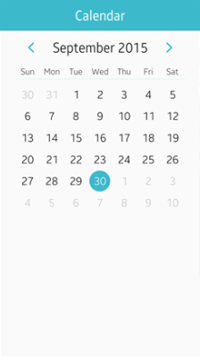
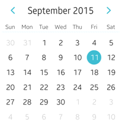

# Calendar

## Dependencies

- Tizen 2.4 and Higher for Mobile

The calendar UI component displays month views. For more information, see the [Calendar](../../../../../org.tizen.native.mobile.apireference/group__Elm__Calendar.html) API.

This feature is supported in mobile applications only.

**Figure: Calendar component**



## Basic Usage

To use a calendar component in your application:

1. Add a calendar with the `elm_calendar_add()` function.

2. Select the month to display with the `elm_calendar_selected_time_set()` function:

   ```
   Evas_Object *calendar;
   Evas_Object *parent;
   time_t the_time;

   /* Set the current time to display the current month */
   time(&the_time); /* Get the current time */
   calendar = elm_calendar_add(parent);
   elm_calendar_selected_time_set(calendar, gmtime(&the_time));
   ```

3. Configure the month view:

   - Change the first day of the week (by default, Sunday).

     To change the first weekday to Monday:

     ```
     elm_calendar_first_day_of_week_set(calendar, ELM_DAY_MONDAY);
     ```

   - Modify the names of the weekdays using the `elm_calendar_weekdays_names_set()` function:

     ```
     const char *weekname[7] = {"A", "B", "C", "D", "E", "F", "G"};
     elm_calendar_weekdays_names_set(calendar, &weekname);
     ```

   - Mark holidays with the `elm_calendar_mark_add()` function.The following example shows how to mark a Sunday as holiday:

     ```
     struct tm *sunday = gmtime(&the_time);
     sunday->tm_mday -= sunday->tm_wday;
     sunday->tm_wday = 0;

     elm_calendar_mark_add(calendar, "holiday", sunday, ELM_CALENDAR_WEEKLY);
     ```

4. Register the [callback](#callback) functions.The following example shows how to define and register a callback for the `changed` signal:

   ```
   evas_object_smart_callback_add(calendar, "changed", changed_cb, data);

   void
   changed_cb(void *data, Evas_Object *obj, void *event_info)
   {
       dlog_print(DLOG_INFO, LOG_TAG, "Calendar is changed. \n");
   }
   ```

## Styles

The following table lists the available component styles.

**Table: Calendar styles**

| Style                    | Sample                                   |
| ------------------------ | ---------------------------------------- |
| `elm/check/base/default` |  |

## Callbacks

You can register callback functions connected to the following signals for a calendar object.

**Table: Calendar callback signals**

| Signal    | Description                   | `event_info` |
| --------- | ----------------------------- | ------------ |
| `changed` | The selected date is changed. | `NULL`       |

> **Note**  
> The signal list in the API reference can be more extensive, but only the above signals are actually supported in Tizen.

> **Note**  
> Except as noted, this content is licensed under [LGPLv2.1+](http://opensource.org/licenses/LGPL-2.1).