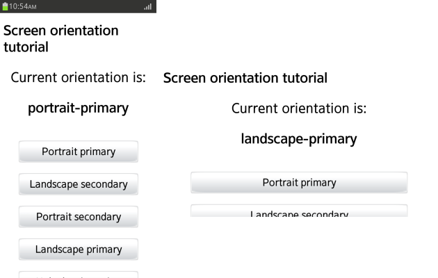

# Screen Orientation

## Dependencies

- Tizen 2.4 and Higher for Mobile

You can [manage the screen orientation state](./w3c/device/screen-orientation-w.md#manage) through the `Screen` interface.

This feature is supported in mobile applications only.

The main features of the Screen Orientation API include:

- Accessing the current screen orientation

  You can use the current screen orientation information, for example, to define the visibility or dimensions of the HTML elements according to the orientation state. The orientation can be portrait-primary, portrait-secondary, landscape-primary, or landscape-secondary.

- Reacting to screen orientation changes

  To receive notifications of the screen orientation changes, add an event listener to the `Screen` object, or assign a function reference to the `screen.onorientationchange` attribute:

  ```
  /* Add listener */
  screen.addEventListener('orientationchange', handleScreenOrientationFun, false);

  /* Or assign reference */
  screen.onorientationchange = handleScreenOrientationFun;
  ```

  In the above example, the `handleScreenOrientationFun` is the event handler called when the screen orientation changes.

- Locking the screen to a specified orientation

  Locking means that the rendering of the current browsing context is forced to be shown in the specified orientation. The screen remains in the selected orientation state until the lock is removed.

## Managing the Screen Orientation

The application implemented below consists of buttons used to either lock the screen orientation to a specific state or release the lock. The current orientation state is also displayed on the screen.

**Figure: Screen orientation application**



To enhance the user interaction with the device, learn to manage the screen orientation:

1. Define the text and button elements for the screen (the body of the HTML page):

   ```
   <body>
      <div class="main">
         <p>Current orientation is:</p>
         <p id="currentOrientation" class="current-orientation"></p>

         <button id="portrait-primary" class="button">Portrait primary</button><br/>
         <button id="landscape-secondary" class="button">Landscape secondary</button><br/>
         <button id="portrait-secondary" class="button">Portrait secondary</button><br/>
         <button id="landscape-primary" class="button">Landscape primary</button><br/>
         <button id="unlock-orientation" class="button">Unlock orientation</button>
      </div>
   </body>
   ```

2. When the screen is loaded, the `onload()` method is called. Within the method, add an event listener to the `screen` object, and define the `updateCurrOrrTxt()` event handler to be called whenever the screen orientation changes. The event handler updates the text element containing the current screen orientation information on the screen, by retrieving the current state with the `screen.orientation` attribute.

   ```
   <script>
       function updateCurrOrrTxt() {
           document.getElementById('currentOrientation').innerHTML = screen.orientation;
       }

       window.onload = function() {
           document.getElementById('currentOrientation').innerHTML = screen.orientation;
           screen.addEventListener('orientationchange', updateCurrOrrTxt, false);
   ```

3. Use the `onclick` event handlers to react to the button clicks. For the first 4 buttons, use the `lockOrientation()` method to lock the screen orientation in place, and for the final button, use the `unlockOrientation()` method to release the orientation lock.

   The `lockOrientation()` method accepts the following parameter values: `portrait-primary`, `portrait-secondary`, `landscape-primary`, `landscape-secondary`, `portrait`, and `landscape`.

   ```
           document.getElementById('portrait-primary').onclick = function() {
               screen.lockOrientation('portrait-primary');
           };

           /* Other 3 orientation buttons are handled similarly */

           document.getElementById('unlock-orientation').onclick = function() {
               screen.unlockOrientation();
           };
       };
   </script>
   ```

> **Note**
> When using the screen orientation lock:When the `portrait` value is used to lock the orientation, the orientation can change between `portrait-primary` and `portrait-secondary`. The `landscape` value behaves similarly.Depending on the browser, unlocking the screen orientation may have no visual effect.

4. Define CSS styles in the <head> section of the document to make the application more eye-catching.

   ```
   <style type="text/css">
      * {
         font-family: Lucida Sans, Arial, Helvetica, sans-serif;
      }

      .main {
         font-size: 32px;
         text-align: center;
         margin-top: auto;
         margin-left: auto;
         margin-right: auto;
         margin-bottom: auto;
      }

      .button {
         font-size: x-large;
         margin-top: 25px;
         width: 80%;
         height: 50px;
      }

      .current-orientation {
         font-size: xx-large;
         font-weight: bolder;
      }
   </style>
   ```

### Source Code

For the complete source code related to this use case, see the following file:

- [screen_orientation.html](http://download.tizen.org/misc/examples/w3c_html5/device/the_screen_orientation_api)