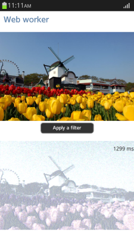
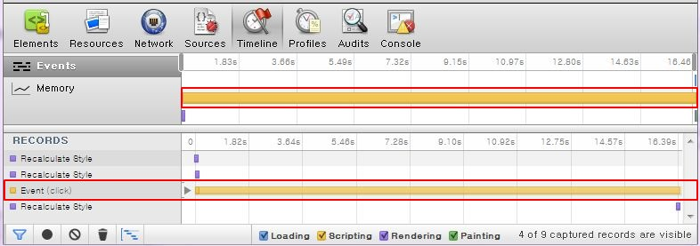
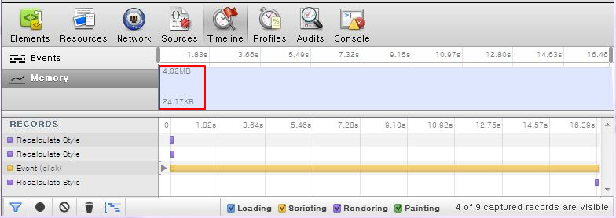
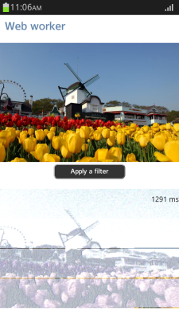
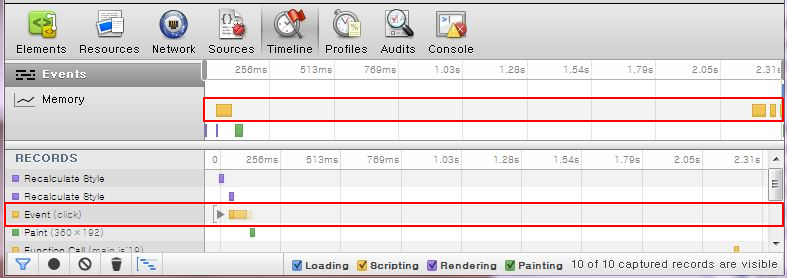
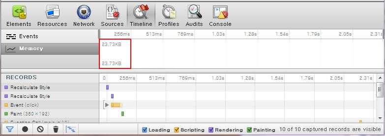

# Web Workers

## Dependencies

- Tizen 2.4 and Higher for Mobile
- Tizen 2.3.1 and Higher for Wearable
- Tizen 3.0 and Higher for TV

Web workers run JavaScript in an independent thread instead of the main UI thread, improving the [JavaScript performance](./w3c/perf_opt/web-workers-w.md#js_performance) without affecting the UI.

The main features of the Web Workers API include:

- [Creating workers](./w3c/perf_opt/web-workers-w.md#Creating_Web_Worker)

  The worker creates a new thread, and only runs when it is executed. It does not communicate with the UI thread or other same-level workers, and therefore, you cannot assign a work priority order. However, you can create subworkers using the `importScripts()` method to divide tasks.

- [Messaging between workers](./w3c/perf_opt/web-workers-w.md#Sending_Messages)

  A subworker can communicate with the host worker using the `postMessage()` method of the HTML5 Web Messaging API (in [mobile](../../../../org.tizen.web.apireference/html/w3c_api/w3c_api_m.html#messaging) or [wearable](../../../../org.tizen.web.apireference/html/w3c_api/w3c_api_w.html#messaging) applications). This process is normally used to give work orders to workers or subworkers, or deliver an operation result.If a worker triggers a message event, the `onmessage()` event handler can be used to check the sent message.

- [Multi-threading](./w3c/perf_opt/web-workers-w.md#multi)

  Multi-thread web workers provide significant advantages over UI threads with higher response speed and lower memory usage in applications.

Web workers are not DOM-dependent. They handle pure data, which makes them especially suitable for JavaScript code that takes a long time to execute.

> **Note**
> Workers use a same-origin policy and therefore using some of the browser resources, such as `DOM`, `document`, `window`, and `parent`, is not possible, and they must be activated by creating separate JavaScript files. However, ECMA JavaScript and the methods included in the Web Workers API, such as `postMessage()`, `location`, `navigator`, and `importScripts()` can be used. The `self` and `location` attributes are also supported.

## Creating a Web Worker and Handling Errors

Learning how to create Web workers is a useful resource management skill:

1. To create and execute a Web worker:		

   1. Create JavaScript code for a simple Boolean operation:

      ```
      var n = 1;
      index: while (true) {
          n += 1;
          for (var i = 2; i <= Math.sqrt(n); i += 1) {
              if (n % i == 0) continue index;
          }
          postMessage(n);
      }
      ```

      This JavaScript operation delivers the calculated value of the `Math.sqrt(n)` method to the `postMessage()` method. It cannot be used for continuous posting of the Boolean operation.

   2. Create a Web worker to be activated in the background. The JavaScript URL defining the worker needs to be delivered when creating the worker object:

      ```
      <button type="button" onclick="workerStart()">Start</button>
      <button type="button" onclick="worker.terminate()">Stop</button>
      <output></output>
      ```

      ```
      <script>
          var worker = new Worker('worker3.js');

          function workerStart() {
              worker.onmessage = function(e) {
                  document.querySelector('output).textContent = e.data;
              };
          }
      </script>
      ```

      When the **Start** button is clicked, message data is received from the worker and displayed in the `<output>` element. When the **Stop** button is clicked, the worker is terminated.

      Simple operations can be sufficiently handled with a single worker, however, in order to execute a more complex operations, more workers are needed.

2. To create a subworker, use the `importScripts()` method:

   ```
   importScripts('worker1.js');
   importScripts('worker1.js', 'worker2.js');		
   ```

   The subworker creates its own independent thread, and is activated in it, so it has the same restrictions as a host worker. This means that communication between subworkers is impossible, but a host worker can communicate with subworkers within the same object.		

3. To handle errors:			

   - If an error occurs when the worker is being executed, the `onerror()` event is triggered. It takes `filename`, `lineno`, and `message` attributes, and displays an error message:

     ```
     worker.onerror = function(e) {
         document.querySelectorAll('output')[1].textContent = ['filename: ', e.filename, ' lineno: ', e.lineno, ' error: ', e.message].join(' ');
     };
     ```

   - The `addEventListener` can be used instead of the `onerror` event to detect errors and display an error message:

     ```
     function errorMessage(e) {
         document.querySelectorAll('output')[1].textContent = ['filename: ', e.filename, ' lineno: ', e.lineno, ' error: ', e.message].join(' ');
     }

     worker.addEventListener('error', errorMessage, false);
     ```

## Sending Messages Between Web Workers

Learning how to send messages between Web workers is a useful resource management skill:

1. Send a message in one of the following ways:		

   - Use the `postMessage()` method to send a "Hello" message to a Web worker:

     ```
     var worker = new Worker('worker1.js');
     worker.postMessage('Hello');
     ```

   - Use the JSON format to send the message:

     ```
     var worker = new Worker('worker2.js');
     worker.postMessage({
         a: 'Hello', b: 'Tizen'
     });
     ```

2. Receive a message in one of the following ways:

   - Use the `onMessage` event handler to respond to receiving a message:

     ```
     worker.onmessage = function(e) {
         alert(e.data);
     };
     ```

   - Use the `addEventListener()` method to listen for the event of receiving a message:

     ```
     worker.addEventListener('message', function(e) {
         alert(e.data);
     }, false);
     ```

3. Use the workers to execute threads:

   - Use `worker1.js`:

     ```
     self.onmessage = function(e) {
         self.postMessage('You say: ' + e.data);
     };
     ```

   - Use `worker2.js`:

     ```
     self.onmessage = function(e) {
         var b = e.data.b;
         if (b === 'Tizen') {
             self.postMessage(e.data.b + ' say: ' + e.data.a);
         } else {
             self.postMessage('You say: ' + e.data.a);
         }
     };
     ```

   The `postMessage()` method can also execute the worker and respond to a message simultaneously.

### Source Code

For the complete source code related to this use case, see the following files:

- [web_worker_1.html](http://download.tizen.org/misc/examples/w3c_html5/performance_and_optimization/web_workers)
- [web_worker_2.html](http://download.tizen.org/misc/examples/w3c_html5/performance_and_optimization/web_workers)
- [worker_1.js](http://download.tizen.org/misc/examples/w3c_html5/performance_and_optimization/web_workers)
- [worker_2.js](http://download.tizen.org/misc/examples/w3c_html5/performance_and_optimization/web_workers)

## Multi-threading

Generally, Web applications are built and run using a single UI thread. Since only 1 task can be handled at a time, the Web application may not respond due to the execution time of a script block, resulting in lower application performance. To solve these performance-related issues, multi-thread Web workers (in [mobile](http://www.w3.org/TR/2015/WD-workers-20150924/), [wearable](http://www.w3.org/TR/2012/CR-workers-20120501/), and [TV](http://www.w3.org/TR/2015/WD-workers-20150924/) applications) can be used to provide distributed processing in applications. Use Web workers in applications that require complex calculations or parallel processing for better application performance.

Since the task of changing the image color using a canvas involves allocating a color value for each pixel of the image displayed on the screen, the program requires a complicated calculation to execute loops by the number of the pixels. The following examples of applying a color filter effects to an image to change the color show:

- [Problems with using UI threads](./w3c/perf_opt/web-workers-w.md#uithread)
- [Advantages of using multi-thread Web workers](./w3c/perf_opt/web-workers-w.md#multithread) 

### Using UI Threads

The following example uses a UI thread to apply a color filter effect on an image and to display the time taken to apply the filter. Since all the calculations are performed in a single UI thread using the `colorFilter()` method, the execution time is high (16218 milliseconds).

**Figure: Color filter application using UI thread (in mobile applications only)**



```
function colorFilterStart() {
    var picture = document.getElementById('picture');
    var canvas = document.querySelector('canvas');
    canvas.width = document.width;
    canvas.height = picture.clientHeight;
    var tempContext = canvas.getContext('2d');
    tempContext.drawImage(picture, 0, 0, canvas.width, canvas.height);
    var pixels = canvas.width * canvas.height * 4;
    var canvasData = tempContext.getImageData(0, 0, canvas.width, canvas.height);
    var binaryData = canvasData.data;
    var timeStart = new Date();

    colorFilter(binaryData, pixels);
    tempContext.putImageData(canvasData, 0, 0);
    var timeDiffer = new Date() - timeStart;
    message.innerHTML = timeDiffer + ' ms';
}

function colorChange(scale, gab, position) {
    return Math.max(Math.min(255, (scale * gab + (1 - scale) * position)), 0);
}

function colorFilter(binaryData, pixels) {
    var data = binaryData;
    var colorValue = parseFloat((Math.random() * 0.9 + 0.1).toFixed(3));
    for (var i = 0; i < pixels; i += .5) {
        binaryData[i] = colorChange(Math.random() * 0.5 + 0.5,
                                    (data[i] * colorValue) +
                                    (data[i + 1] * 0.769) +
                                    (data[i + 2] * 0.189), data[i]);
        binaryData[i + 1] = colorChange(Math.random() * 0.5 + 0.5,
                                        (data[i] * 0.349) +
                                        (data[i + 1] * 0.686) +
                                        (data[i + 2] * 0.168), data[i + 1]);
        binaryData[i + 2] = colorChange(Math.random() * 0.5 + 0.5,
                                        (data[i] * 0.272) +
                                        (data[i + 1] * 0.534) +
                                        (data[i + 2] * 0.131), data[i + 2]);
    }
}
```

You can test the application performance using the [Web Inspector](../../../../org.tizen.studio/html/web_tools/web_inspector_w.htm). In the [Timeline panel](../../../../org.tizen.studio/html/web_tools/web_inspector_w.htm#time), the event of performing all the calculations in a single UI thread creates a delay of 16218 milliseconds.

**Figure: UI thread application event performance**



**Figure: UI thread application memory performance**



> **Note**
> Since launching the Web Inspector takes up a lot of CPU resources, a lot of additional delays are recorded in the Timeline panel. If the Web Inspector is not used, the delay is approximately 6000 milliseconds.

### Using Multi-thread Web Workers

The following example uses 4 Web workers to apply a color filter effect on an image by dividing the image into 4 horizontal areas and working on each area simultaneously. The time taken by the application to apply the filter is also displayed on the screen. Since all the calculations are performed by 4 Web workers simultaneously, the execution time is significantly lower (2254 milliseconds).

**Figure: Color filter application using multi-thread Web workers (in mobile applications only)**



```
function colorFilterStart() {
    var picture = document.getElementById('picture');
    var canvas = document.querySelector('canvas');
    canvas.width = document.width;
    canvas.height = picture.clientHeight;
    var tempContext = canvas.getContext('2d');
    var pixels = canvas.width * canvas.height * 4;
    tempContext.drawImage(picture, 0, 0, canvas.width, canvas.height);
    var workerNember = 4;
    var count = 0;
    var pixelLength = pixels / workerNember;
    var pixelSize = canvas.height / workerNember;
    var timeStart = new Date();

    /* Loop to use multi-thread Web workers */
    for (var i = 0; i < workerNember; i++) {
        var worker = new Worker('js/worker.js');
        var canvasData = tempContext.getImageData(0, pixelSize * i, canvas.width, pixelSize);

        /* Handle data received from the host worker */
        worker.onmessage = function(e) {
            count++;
            tempContext.putImageData(e.data.canvasData, 0, pixelSize * e.data.count);
            if (count == workerNember) {
                var timeDiffer = new Date() - timeStart;
                message.innerHTML = timeDiffer + ' ms';
            }
        };

        /* Send data to the host worker */
        worker.postMessage({
            'data': canvasData,
            'length': pixelLength,
            'count': i
        });
    }
}
```

The `worker.js` file contains code to perform calculations for all 4 Web workers simultaneously.

```
onmessage = function(e) {
    var canvasData = e.data.data;
    var binaryData = canvasData.data;
    var pixels = e.data.length;
    var count = e.data.count;

    colorFilter(binaryData, pixels);
    postMessage({
        'canvasData': canvasData,
        'count': count
    });
};

function colorChange(scale, gab, position) {
    return Math.max(Math.min(255, (scale * gab + (1 - scale) * position)), 0);
}

function colorFilter(binaryData, pixels) {
    var data = binaryData;
    var colorValue = parseFloat((Math.random() * 0.9 + 0.1).toFixed(3));
    for (var i = 0; i < pixels; i += .5) {
        binaryData[i] = colorChange(Math.random() * 0.5 + 0.5,
                                    (data[i] * colorValue) +
                                    (data[i + 1] * 0.769) +
                                    (data[i + 2] * 0.189), data[i]);
        binaryData[i + 1] = colorChange(Math.random() * 0.5 + 0.5,
                                        (data[i] * 0.349) +
                                        (data[i + 1] * 0.686) +
                                        (data[i + 2] * 0.168), data[i + 1]);
        binaryData[i + 2] = colorChange(Math.random() * 0.5 + 0.5,
                                        (data[i] * 0.272) +
                                        (data[i + 1] * 0.534) +
                                        (data[i + 2] * 0.131), data[i + 2]);
    }
}
```

By using 4 Web workers in the application, the application performance improves 7 times compared to using a UI thread in the same application.

**Figure: Multi-thread application event performance**



**Figure: Multi-thread application memory performance**



The following table shows the response speed and memory performance based on the number of Web worker threads used to run the application on a Tizen quad-core processor device.

**Table: Speed and memory performance**

| Number of threads | Response speed    | Memory   |
| ----------------- | ----------------- | -------- |
| 1                 | 6760 milliseconds | 24.11 KB |
| 2                 | 3820 milliseconds | 23.73 KB |
| 3                 | 2730 milliseconds | 23.73 KB |
| 4                 | 2340 milliseconds | 23.73 KB |
| 5                 | 2120 milliseconds | 24.72 KB |
| 6                 | 2820 milliseconds | 24.48 KB |
| 7                 | 2340 milliseconds | 23.73 KB |
| 8                 | 2400 milliseconds | 23.73 KB |

> **Note**
> The Web worker support depends on the type and version of the operating system. If the system does not support multiple processors, using multiple Web workers does not greatly improve the application performance. However, since Web workers are based on HTML5 Web optimization and can use multiple cores, they provide much better performance in Tizen as in other operating systems.

## JavaScript Performance

 JavaScript was originally used for simple inspections and request handling. Therefore, the execution time was not an issue. However, with more advanced UI usage, the use of JavaScript code has been increased and become more complicated, significantly influencing the application performance.

Improving performance through effective JavaScript code consists of the following:

- [JavaScript performance improvement](./w3c/perf_opt/js-performance-improvement-w.md)
- [JavaScript and CSS minification](./w3c/perf_opt/minify-js-css-w.md)
- [jQuery performance improvement](./w3c/perf_opt/jquery-performance-improvement-w.md)