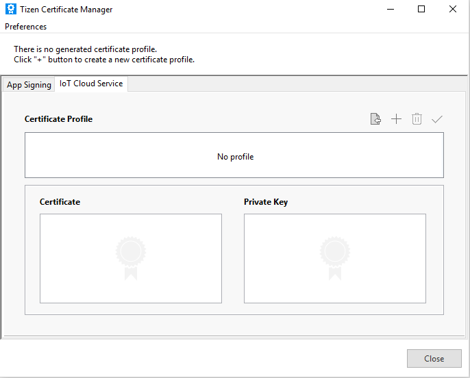
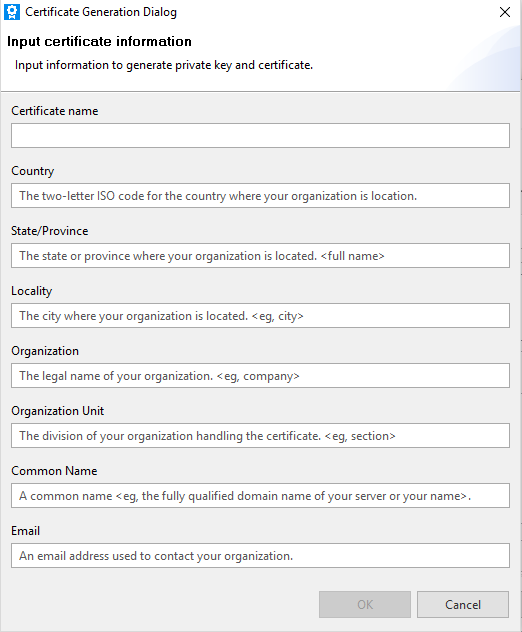
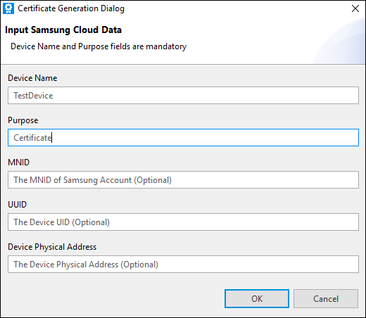
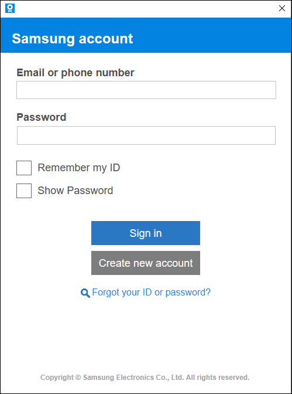
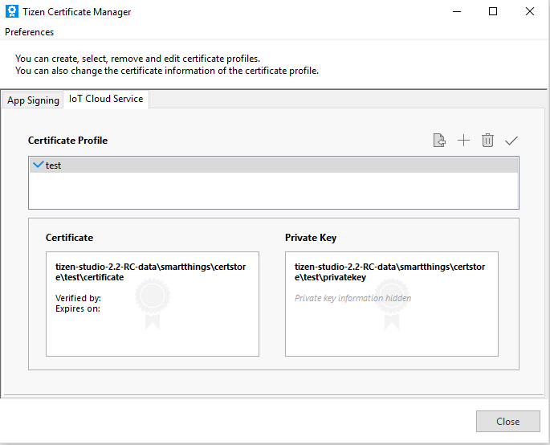
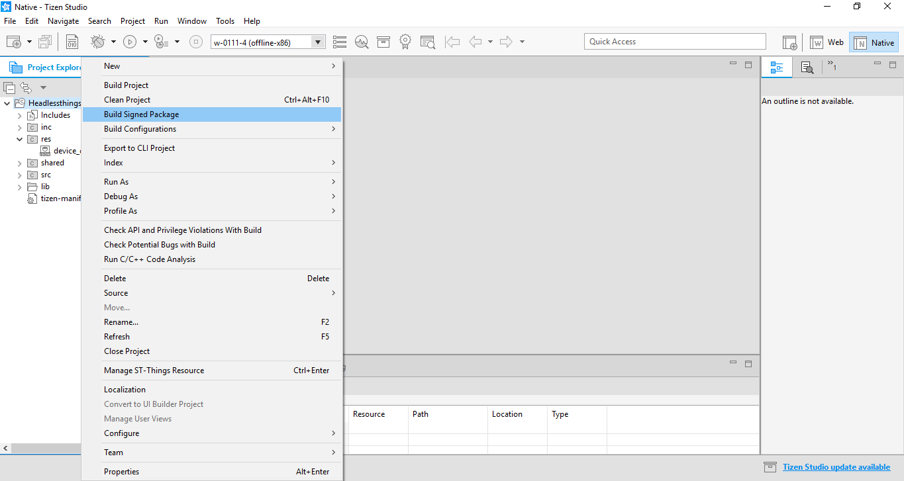
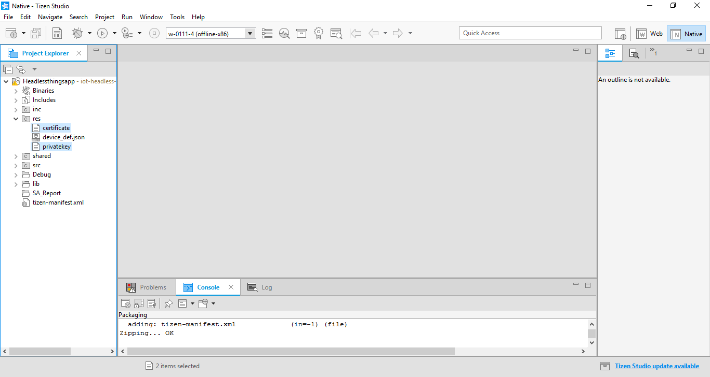

# Setting up the SmartThings Cloud

To develop applications that integrate with the SmartThings Cloud, you must register the function of your device (called a resource or capability in the SmartThings Cloud) and generate a private key and a cloud certificate.

## Registering Your Device

To register the function of your device:

1.  Create a cloud-connected device in the Developer Workspace site (<https://devworkspace.developer.samsung.com/>), by following the instructions on the [SmartThings Developers site](https://smartthings.developer.samsung.com/develop/workspace/ide/create-a-cloud-connected-device.html):

    -   Create a unique VID (vendor ID) for each device you develop.
    -   Select the **Switch** and **Audio Volume** capabilities in the **Device Profile** field, for the Network Audio sample application.

    

2.  After the cloud-connected device is created, check the device information by clicking the new device.
3.  Note the **VID** and the **MNID** field value, shown in the device information. The values must be updated in the device definition JSON file.

    For more information, see [Developing Applications with Things SDK API](things-app-development.md).

    

## Generating Cloud Certificates

SmartThings&trade; uses OpenSSL for security. To begin development, you need to get certificates for both plugins (PPK) and devices. For instructions on installing OpenSSL, see the OpenSSL documentation.

Generate the IoT certificate and private key using the Certificate Manager:

1.  In the Tizen Studio menu, open the Certificate Manager by going to **Tools &gt; Certificate Manager**.

    

2.  In the Tizen Certificate Manager window, select the **IoT Cloud Service** tab and click **+** to create a new certificate and key pair.

    

3.  Fill the requested information in the Certificate Generation Dialog and click **OK**.

    

4.  In the next page of Certificate Generation Dialog, fill the requested Device and Manufacturer information and click **OK**.

    
   
   > **NOTE**
   > 
   > "Device Name" should be the same as what was defined when the application was created.

5.  Sign in to Samsung account.

    

6.  Once you have signed in successfully, you can see the generated certificate and private key in the **Certificate Profile** list.

    

## Using the Generated IoT certificate

The IoT certificate and key pair generated in the previous section needs to be copied to the application in a designated directory. This enables the device to connect to the SmartThings cloud using the IoT certificate.

To add the IoT certificate to the application:

1.  In the Tizen Studio **Project Explorer** view, **right-click** the project and select **Build Signed Package**.

    

2.  The certificate and private key must be copied to the **res** folder of the application.

    
