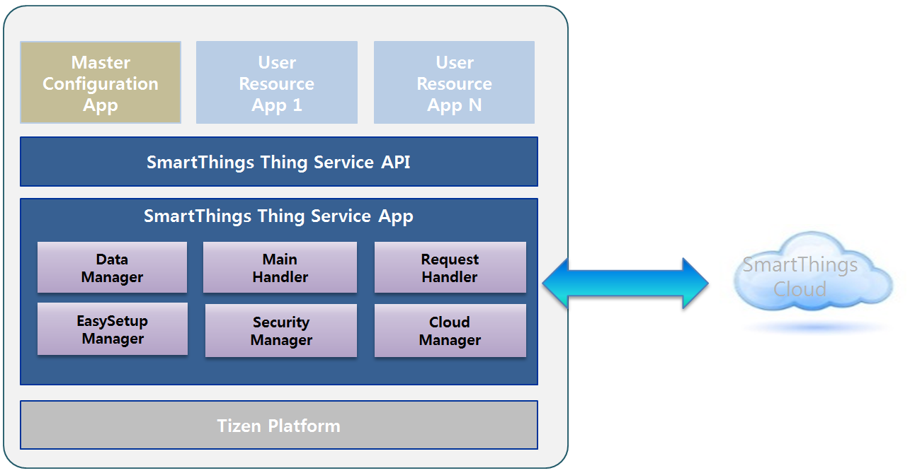
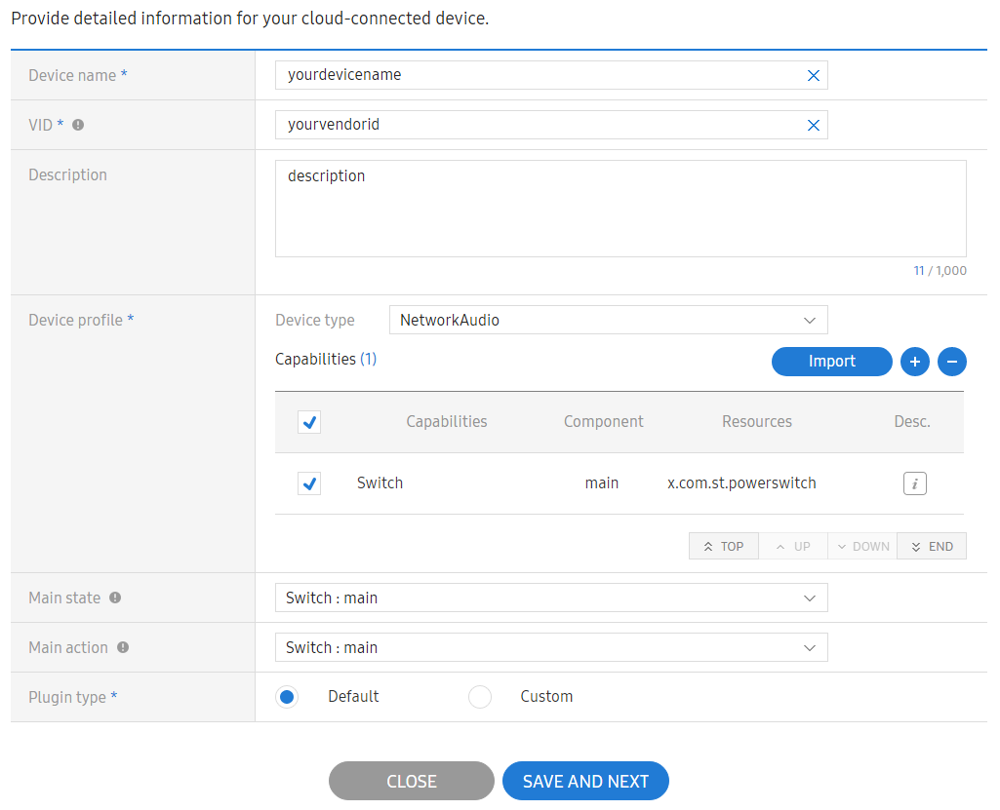
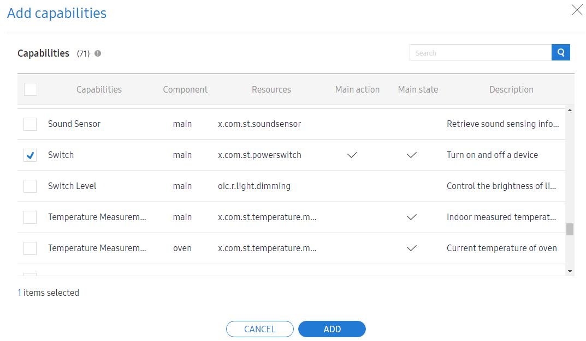
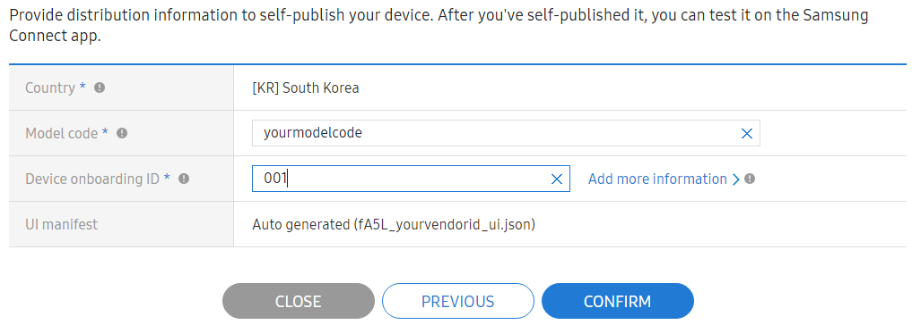

# API Usage

SmartThings Thing API is a service that provides connection to SmartThings Cloud. Also, it acts as an interface for resource applications to be controlled by the SmartThings applications.

**Figure: SmartThings Thing overall architecture**



The main SmartThings Thing API features include:

- Master API: Connecting to SmartThings Cloud with Samsung account information.
- Resource API: Interfaces for Resource applications to be controlled by SmartThings application.

> **Note**
>
> You can use both the APIs separately, for each Master and Resource application or together for the hybrid (master+resource) applications.

## Prerequisites

You must connect to the Internet.

## Registering Samsung account

You must have a [Samsung account](https://account.samsung.com/membership/index.do) and access to the [Developer Workspace](https://devworkspace.developer.samsung.com).

> **Note**
>
> Log on to the [Developer Workspace](https://devworkspace.developer.samsung.com) and click Development > SmartThings Device > Cloud-connected > My Cloud-connected devices > Create.

## Configuring SmartThings API

Update the following pages on the SmartThings cloud:
 - Device Info
 - Self-publish

> **Note:**
>
> For some fields, the values entered in the pages must match with the values specified in your JSON file.

  **Table: Device information - page fields matching with Master.json**

  Field|master.json
  :---:|----
  Device type|deviceType
  Device name|deviceName
  MNID|mnid
  VID|vid
  Device onboarding ID|setupId

  **Table: Self-publish - page fields matching with Resource.json**

  Field|resource.json
  :---:|----
  Capabilities|resources > uri
  Resources|resourceTypes > type

**Figure: SmartThings Thing device information**



**Figure: SmartThings Thing add capabilities**



**Figure: SmartThings Thing self publish**



- Setup the background categories

    ```xml
    <service-application>
        <background-category value="background-network"/>
    </service-application>
    ```

- Add the following privileges to the `tizen-manifest.xml` file, to request permission for using the SmartThings Thing Master API:

    ```xml
    <privileges>
        <privilege>http://tizen.org/privilege/appmanager.launch</privilege>
        <privilege>http://tizen.org/privilege/datasharing</privilege>
        <privilege>http://tizen.org/privilege/internet</privilege>
        <appdefined-privilege>http://com.samsung.tizen.smartthings-thing/appdefined/smartthings-thing.master</appdefined-privilege>
    </privileges>
    ```

- Add the following privileges to the `tizen-manifest.xml` file, to request permission for using the SmartThings Thing Resource API:

    ```xml
    <privileges>
        <privilege>http://tizen.org/privilege/appmanager.launch</privilege>
        <privilege>http://tizen.org/privilege/datasharing</privilege>
        <privilege>http://tizen.org/privilege/internet</privilege>
        <appdefined-privilege>http://com.samsung.tizen.smartthings-thing/appdefined/smartthings-thing.resource</appdefined-privilege>
    </privileges>
    ```

- Include the `<smartthings.h>` header file to your application, to use the SmartThings Thing Master API functions.

    ```cpp
    #include <smartthings.h>
    ```

- Include the `<smartthings_resource.h>` header file to your application, to use the SmartThings Thing Resource API functions.

    ```cpp
    #include <smartthings_resource.h>
    ```

## Metadata info and JSON file

- Add metadata by adding the following key and value to the `tizen-manifest.xml` file of the service-application, to install the SmartThings Thing Master application.

    ```xml
    <service-application>
        <metadata key="http://tizen.org/iot/metadata/master" value="shared/res/master.json"/>
    </service-application>
    ```

- Add metadata by adding the following key and value to the `tizen-manifest.xml` file of the service-application, to install the SmartThings Thing Resource application.

    ```xml
    <service-application>
        <metadata key="http://tizen.org/iot/metadata/resource" value="shared/res/resource.json"/>
    </service-application>
    ```

- Write a `master.json` file for its own devices and configuration, by adding the `shared/res` path, to install the SmartThings Thing Master application.

    ```json
    {
        "devices": [
            {
                "deviceType": "oic.d.networkaudio",
                "deviceName": "XXX",
                "mnid": "XXX",
                "vid": "XXX"
            }
        ],
        "configuration": {
            "otm": 2,
            "otmDescription" : "ownershipTransferMethod : b0001(Random PIN-based), b0010(UserConfirm-based)",
            "crtType" : 3,
            "crtDescription" : "certificate type: 1(Test Certificate), 2(Artik Certificate), 3(CUSTOM)",
            "easySetup": {
                "mode": 2,
                "modeDescription" : "easysetup mode : 1(SoftAP), 2(CUSTOM)",
                "setupId": "XXX"
            }
        }
    }
    ```

- Write a `resource.json` file for its own resource definition, by adding the `shared/res` path, to install the SmartThings Thing Resource application.

    ```json
    {
        "resources": {
            "single": [
                {
                    "uri": "/capability/switch/main/0",
                    "types": [
                        "x.com.st.powerswitch"
                    ],
                    "interfaces": [
                        "oic.if.a",
                        "oic.if.baseline"
                    ]
                }
            ]
        },
        "resourceTypes": [
            {
                "type": "x.com.st.powerswitch",
                "properties": [
                    {
                        "key": "power",
                        "type": "string",
                        "mandatory": true,
                        "description": "State of the power switch.",
                        "enumDescription": ["on", "off"]
                    }
                ]
            }
        ]
    }
    ```

## Master application programming

To program the Master application, follow the given steps:
1. Use `smartthings_initialize()` API to begin the initialization and register the callback function for checking changes in connection status with agent. After connecting to agent, you can proceed to step 2.
2. Use `smartthings_set_status_changed_cb()` API to register the callback function for checking changes in status.
3. Use `smartthings_set_user_confirm_cb()` API to register the callback function for getting user confirmation for ownership transfer. In callback, you can send confirmation using `smartthings_send_user_confirm()` API.
4. Use `smartthings_set_reset_confirm_cb()` API to register the callback function for getting user confirmation for reset. In callback, you can send confirmation using `smartthings_send_reset_confirm()` API.
5. Use `smartthings_set_reset_result_cb()` API to register the callback function for checking reset operation result.
6. Use `smartthings_set_pin_cb()` API to register callback functions for checking generated PIN. Also, it verifies PIN based ownership transfer is done.
7. Use `smartthings_set_wifi_ap_provisioning_cb()` API to register the callback function for checking Wi-Fi access point information during Easy Setup.
8. Use `smartthings_set_device_provisioning_cb()` API to register the callback function for checking device provisioning information during Easy Setup.
9. Use `smartthings_set_scan_ap_cb()` API to register the callback function for scanning access point, setting access point list, and sending it to agent.
10. Use `smartthings_set_stop_soft_ap_cb()` API to register the callback function for stopping SoftAP.
11. Use `smartthings_start()` API to start the agent operation.

    ```cpp
    smartthings_h st_h;

    void _thing_status_cb(smartthings_h handle, smartthings_status_e status, void *user_data)
    {
        // check status.
    }

    void _user_confirm_cb(smartthings_h handle, void *user_data)
    {
        smartthings_send_user_confirm(handle, true);
    }

    void _reset_confirm_cb(smartthings_h handle, void *user_data)
    {
        smartthings_send_reset_confirm(handle, true);
    }

    void _reset_result_cb(smartthings_h handle, bool result, void *user_data)
    {
        // check reset result.
    }

    void _pin_generated_cb(smartthings_h handle, const char* pin, size_t size, void *user_data)
    {
        // check generated PIN.
    }

    void _pin_close_cb(smartthings_h handle, void *user_data)
    {
        // PIN based ownership transfer is finished.
    }

    void _wifi_prov_cb(smartthings_h handle, smartthings_ap_info_h ap_info_h, void *user_data)
    {
        // check Wi-Fi AP information.
    }

    void _dev_prov_cb(smartthings_h handle, smartthings_device_prov_info_h dev_prov_h, void *user_data)
    {
        // check device provisioning information.
    }

    void _scanned_ap_cb(smartthings_h handle, int req_id, void *user_data)
    {
        // scan AP.
        // set AP list.
        // send AP list to agent.
    }

    void _stop_soft_ap_cb(smartthings_h handle, void *user_data)
    {
        // stop soft AP.
    }

    void _connection_status_cb(smartthings_error_e result, smartthings_h handle, smartthings_connection_status_e status, void *user_data)
    {
        // check result
        if (result != SMARTTHINGS_ERROR_NONE) {
            // Do error handling
	        goto _out;
        }

        // check connection status
        if (status == SMARTTHINGS_CONNECTION_STATUS_CONNECTED) {
            // set status changed callback
            if (smartthings_set_status_changed_cb(st_h, _thing_status_cb, NULL) != SMARTTHINGS_ERROR_NONE) {
                goto _out;
            }

            // set user confirm callback
            if (smartthings_set_user_confirm_cb(st_h, _user_confirm_cb, NULL) != SMARTTHINGS_ERROR_NONE) {
                goto _out;
            }

            // set reset confirm callback
            if (smartthings_set_reset_confirm_cb(st_h, _reset_confirm_cb, NULL) != SMARTTHINGS_ERROR_NONE) {
                goto _out;
            }

            // set reset result callback
            if (smartthings_set_reset_result_cb(st_h, _reset_result_cb, NULL) != SMARTTHINGS_ERROR_NONE) {
                goto _out;
            }

            // set PIN callbacks
            if (smartthings_set_pin_cb(st_h, _pin_generated_cb, _pin_close_cb, NULL) != SMARTTHINGS_ERROR_NONE) {
                goto _out;
            }

            // set Wi-Fi AP provisioning callback
            if (smartthings_set_wifi_ap_provisioning_cb(st_h, _wifi_prov_cb, NULL) != SMARTTHINGS_ERROR_NONE) {
                goto _out;
            }

            // set device provisioning callback
            if (smartthings_set_device_provisioning_cb(st_h, _dev_prov_cb, NULL) != SMARTTHINGS_ERROR_NONE) {
                goto _out;
            }

            // set scan AP callback
            if (smartthings_set_scan_ap_cb(st_h, _scanned_ap_cb, NULL) != SMARTTHINGS_ERROR_NONE) {
                goto _out;
            }

            // set stop AP callback
            if (smartthings_set_stop_soft_ap_cb(st_h, _stop_soft_ap_cb, NULL) != SMARTTHINGS_ERROR_NONE) {
                goto _out;
            }

            if (smartthings_start(st_h) != SMARTTHINGS_ERROR_NONE) {
                goto _out;
            }
        }
	}

    int init_master_app()
    {
        // initialize Master
        if (smartthings_initialize(&st_h, _connection_status_cb, NULL) != SMARTTHINGS_ERROR_NONE) {
            goto _out;
        }
    }
    ```

## Resource application programming

To start the Resource application program, follow the given steps:
1. Use `smartthings_resource_initialize()` API to begin the initialization and register the callback function for checking changes in connection status with agent. After connecting to agent, you can proceed to step 2.
2. Implement interfaces to handle GET, SET requests for your resources.
3. To inform about changes in resources:
     - Send response using the `smartthings_resource_send_response()` API.
	 - Send notification using the `smartthings_resource_notify()` API.

    ```cpp
    static smartthings_resource_h st_handle;

    void _request_cb(smartthings_resource_h st_h, int req_id, const char *uri, smartthings_resource_req_type_e req_type, smartthings_payload_h payload, void *user_data)
    {
        // create a payload for response
        smartthings_payload_h resp_payload = NULL;
        smartthings_payload_create(&resp_payload);

        // handle GET, SET request
        if (req_type == SMARTTHINGS_RESOURCE_REQUEST_GET) {
            if (0 == strncmp(uri, "/capability/switch/main/0", strlen("/capability/switch/main/0"))) {
                smartthings_payload_set_string(resp_payload, "power", "on");
            }
        } else if (req_type == SMARTTHINGS_RESOURCE_REQUEST_SET) {
            // if SET case, check input parameter payload
            if (0 == strncmp(uri, "/capability/switch/main/0", strlen("/capability/switch/main/0"))) {
                char *str_value = NULL;
                smartthings_payload_get_string(payload, "power", &str_value);

                // if str_value is changed comparing with previous value
                smartthings_payload_set_string(resp_payload, "power", str_value);
            }
        }

        // send response and Notify
        if (smartthings_resource_send_response(st_h, req_id, uri, resp_payload, true) != SMARTTHINGS_RESOURCE_ERROR_NONE) {
	        goto _out;
		}

        if (req_type == SMARTTHINGS_RESOURCE_REQUEST_SET) {
            if (smartthings_resource_notify(st_h, uri, resp_payload) != SMARTTHINGS_RESOURCE_ERROR_NONE) {
	            goto _out;
            }
        }

        // destroy the payload for response
        smartthings_payload_destroy(resp_payload);
    }

    void _reg_status_cb(smartthings_resource_h st_h, bool is_registered, void *user_data)
    {
        int count = 0;
        char **uri_list = NULL;

        if (smartthings_resource_get_uris(st_handle, &count, &uri_list) != SMARTTHINGS_RESOURCE_ERROR_NONE) {
            goto _out;
        }

        // find resource URI list
    }


    void _resource_connection_status_cb(smartthings_resource_error_e result, smartthings_resource_h handle, smartthings_resource_connection_status_e status, void *user_data)
    {
        // check result
        if (result != SMARTTHINGS_RESOURCE_ERROR_NONE) {
            // Do error handling
	        goto _out;
        }

        // check connection status
        if (status == SMARTTHINGS_RESOURCE_CONNECTION_STATUS_CONNECTED) {
            // set request callback
            if (smartthings_resource_set_request_cb(st_handle, _request_cb, NULL) != SMARTTHINGS_RESOURCE_ERROR_NONE) {
                goto _out;
            }

            // set cloud registration status callback
            if (smartthings_resource_set_cloud_registration_status_cb(st_handle, _reg_status_cb, NULL) != SMARTTHINGS_RESOURCE_ERROR_NONE) {
                goto _out;
            }
        }
    }

    int init_resource_app()
    {
        // initialize resource
        if (smartthings_resource_initialize(&st_handle, _resource_connection_status_cb, NULL) != SMARTTHINGS_RESOURCE_ERROR_NONE) {
            goto _out;
        }
    }
    ```

4. To handle the array type payload, refer:

    ```cpp
    // set array type's payload
    smartthings_payload_h resp_payload = NULL;
    smartthings_payload_create(&resp_payload);
    const char *test_string_array[] = {"test1", "test2", "test3"};
    unsigned int array_length = 3;
    smartthings_payload_set_string_array(resp_payload, "test_key", test_string_array, array_length);
    ```

    ```cpp
    // get array type's payload
    char *test_string_array[];
    unsigned int array_length;
    smartthings_payload_get_string_array(resp_payload, "test_key", &test_string_array, &array_length);

    // after getting array type's payload and using it, please release it.
    smartthings_payload_release_string_array(test_string_array, array_length);
    ```

