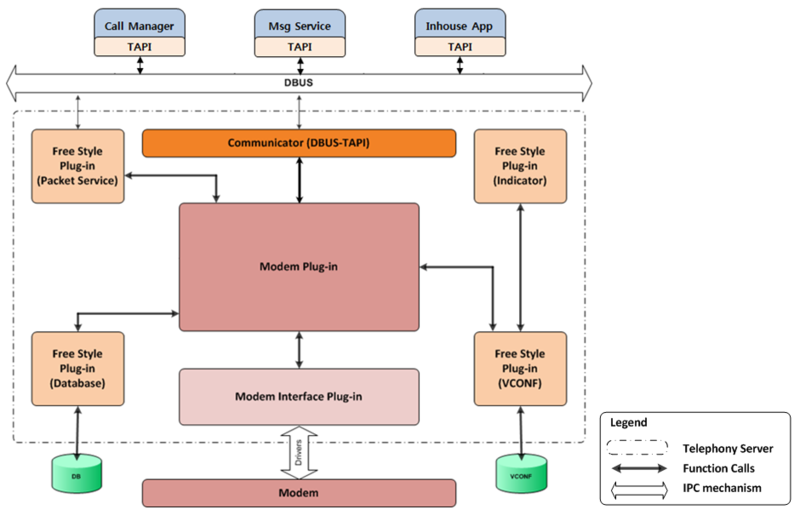
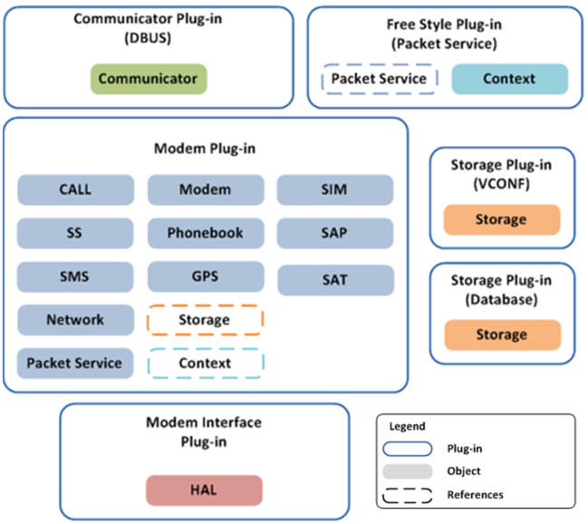
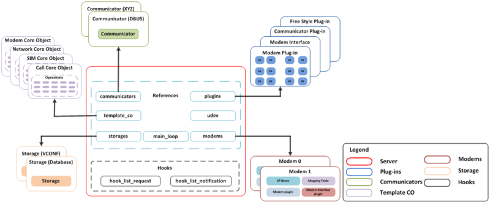
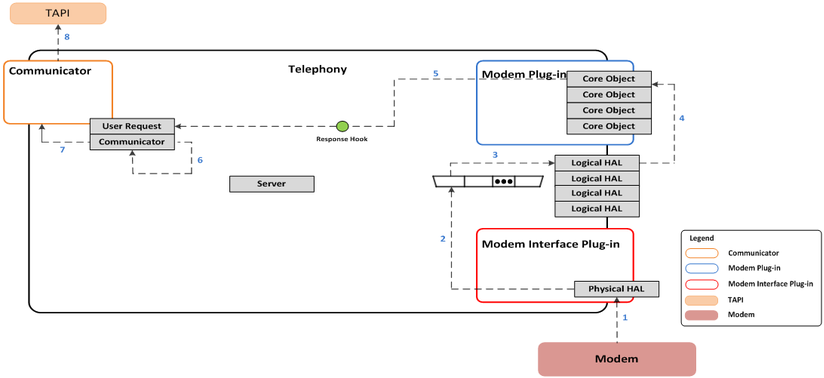
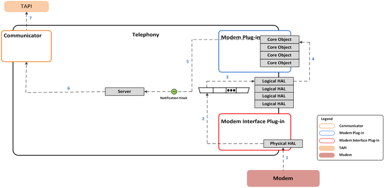

# Telephony

This guide describes the Telephony architecture in detail, including the various telephony components and the workflow in the Telephony framework. It also provides porting guidelines for vendors to facilitate OAL interface development for their hardware.

The Tizen Telephony features include:
- Telecommunication functionalities, such as call, SS, SMS, SIM, network, and packet service
- Plug-in architecture


To understand the telephony implementation, you must be familiar with the following definitions:

- Core object
  - Bundle of functions and supporting database information which processes requests, responses, and notifications designated to a specific module, such as call, SS, SIM, and network.
  - Core objects form the executable component of a Telephony module (call, SS, SIM, network)
- Hardware Abstraction Layer (HAL)
  - The HAL ensures that similar functionality is provided by various hardware (modems) from the same modem vendor.
  - All hardware-specific changes are controlled and processed by HALs.
  - Depending on the modem chipset, a modem driver can be required.
- Hooks
  - Hooks provide a mechanism to tap the requests, responses, and notifications of other Telephony modules.
  - Hooking is a transparent mechanism and does not affect the normal processing of requests, responses, and notifications.

## Tizen Telephony Architecture

Tizen Telephony supports plugin architecture, which provides the flexibility to include various predefined plugins in the system with little modification.

**Figure: Telephony architecture**



The 3 major components of Tizen Telephony are the libraries, plugins, and server.

## Telephony Libraries

There are 2 main telephony libraries:

- Telephony API (TAPI) library

  The TAPI library (or simply TAPI) is a standardized interface, provided as the `libtapi` package, for applications to interact with Tizen Telephony. TAPI executes in the application's context, and it provides synchronous and asynchronous APIs. The following figure shows the `libtapi` components.

  **Figure: libtapi components**

  

  Applications can interface to telephony features, such as call, SMS, and network, through the respective module APIs exposed in the `libtapi` library. Telephony also provides an additional library, `capi-telephony`, for third-party applications.

- Core Telephony library

  The Core Telephony library, provided as the `libtcore` package, provides an API framework to interwork with Tizen Telephony. The following figure shows the `libtcore` components.

  **Figure: libtcore components**

  

  With `libtcore`, you can:

  - Create, destroy, and maintain various server components, such as the server, communicators, HALs, core objects, and plugins.
  - Maintain storage, queue mechanism, and general utilities.
  - Support CMUX (creation/destruction/processing).
  - Parse AT.

## Telephony Plugins

There are 4 kinds of plugins:

- **Communicator plugins** interface TAPI and the telephony server. For example, the DBUS communicator (`DBUS_TAPI`) is provided by default.
- **Modem plugins** are core functional units providing the telephony functionality. They maintain and manage the telephony states and related databases.
- **Modem interface plugins** interface the telephony server to the communication processor. They are hardware-specific plugins which define hardware capabilities and usage. Modem interface plugins are also called HALs.
- **Free style plugins** provide functionality independent of communication processor hardware. Examples of free style plugins are packetservice, storage, and indicator.

The following figure provides an overview of the Telephony plugin types.

**Figure: Telephony plugins**



## Telephony Server

Tizen Telephony runs as a Telephony server daemon, `telephony-daemon`.

The Telephony server executes as a `g-main` loop from the `glib` library.

**Figure: Telephony server**



## Porting the OAL Interface

OEM vendors can port available plugins within Telephony as needed to support specific hardware. It is not mandatory that all plugins are ported.

This section provides guidance to OEM vendors to develop various Telephony plugins.

### Plugin Descriptor

Each telephony plugin must provide a descriptor structure:

```c
struct tcore_plugin_define_desc {
    /* Name of the plugin */
    gchar *name;

    /* Initializing priority of the plugin */
    enum tcore_plugin_priority priority;

    /* Plugin version */
    int version; 

    /* Plugin 'load' function reference */
    gboolean(*load)(); 

    /* Plugin 'init' function reference */
    gboolean(*init)(TcorePlugin *);

    /* Plugin 'unload' function reference */
    void (*unload)(TcorePlugin *); 
};
```

The plugin descriptor structure must be named as `plugin_define_desc`. The server obtains the address of this symbol to give control to the plugin to execute its defined functionality.

The initialization order among various Telephony plugins is based on each plugin's priority.

OEMs need to specifically implement the modem and modem interface plugins to support their hardware.

### Call Service Operations

To provide call services, the following functions must be implemented:

```c
struct tcore_call_operations {  
    /* Call 'dial' function reference */
    TReturn (*dial)(CoreObject *o, UserRequest *ur); 
    
    /* Call 'answer' function reference */
    TReturn (*answer)(CoreObject *o, UserRequest *ur); 
    
    /* Call 'end' function reference */
    TReturn (*end)(CoreObject *o, UserRequest *ur); 

    /* Call 'hold' function reference */
    TReturn (*hold)(CoreObject *o, UserRequest *ur); 
    
    /* Call 'active' function reference */
    TReturn (*active)(CoreObject *o, UserRequest *ur); 
    
    /* Call 'swap' function reference */
    TReturn (*swap)(CoreObject *o, UserRequest *ur);
    
    /* Call 'join' function reference */
    TReturn (*join)(CoreObject *o, UserRequest *ur); 
    
    /* Call 'split' function reference */
    TReturn (*split)(CoreObject *o, UserRequest *ur); 
};
```

### SMS Service Operations

To provide SMS services, the following functions must be implemented:

```c
struct tcore_sms_operations {
    /* For UMTS, SMS 'send' function reference */
    TReturn (*send_umts_msg)(CoreObject *o, UserRequest *ur);
  
    /* For CDMA, SMS 'read' function reference */
    TReturn (*send_cdma_msg)(CoreObject *o, UserRequest *ur);
  
    /* SMS 'read' function reference */
    TReturn (*read_msg)(CoreObject *o, UserRequest *ur); 
  
    /* SMS 'save' function reference */
    TReturn (*save_msg)(CoreObject *o, UserRequest *ur); 
  
    /* SMS 'delete' function reference */
    TReturn (*delete_msg)(CoreObject *o, UserRequest *ur); 
  
    /* SMS 'get sca' function reference */
    TReturn (*get_sca)(CoreObject *o, UserRequest *ur); 
  
    /* SMS 'set sca' function reference */
    TReturn (*set_sca)(CoreObject *o, UserRequest *ur); 
  
    /* SMS 'get sms params' function reference */
    TReturn (*get_sms_params)(CoreObject *o, UserRequest *ur); 
  
    /* SMS 'set sms params' function reference */
    TReturn (*set_sms_params)(CoreObject *o, UserRequest *ur); 
};
```

### Network Service Operations

To provide network services, the following functions must be implemented:

```c
struct tcore_network_operations {
    /* Network 'search' function reference */
    TReturn (*search)(CoreObject *o, UserRequest *ur); 
  
    /* Network 'set plmn selection mode' function reference */
    TReturn (*set_plmn_selection_mode)(CoreObject *o, UserRequest *ur); 
    
    /* Network 'get plmn selection mode'' function reference */
    TReturn (*get_plmn_selection_mode)(CoreObject *o, UserRequest *ur); 
  
    /* Network 'set service domain' function reference */
    TReturn (*set_service_domain)(CoreObject *o, UserRequest *ur); 
  
    /* Network 'get service domain' function reference */
    TReturn (*get_service_domain)(CoreObject *o, UserRequest *ur); 
  
    /* Network 'set band' function reference */
    TReturn (*set_band)(CoreObject *o, UserRequest *ur);
   
    /* Network 'get band' function reference */
    TReturn (*get_band)(CoreObject *o, UserRequest *ur); 
};
```

### HAL Operations

To provide HAL operations, the following functions must be implemented:

```c
struct tcore_hal_operations {
    /* HAL 'power' function reference */
    TReturn (*power)(TcoreHal *hal, gboolean flag); 
  
    /* HAL 'send' function reference */
    TReturn (*send)(TcoreHal *hal, unsigned int data_len, void *data); 
  
    /* Network 'set up network interface' function reference */
    TReturn (*setup_netif)(CoreObject *co,
                           TcoreHalSetupNetifCallback func, void *user_data,
                           unsigned int cid, gboolean enable);
};
```

For sample implementations of the modem and modem interface plugins, see [Sample Modem Interface Plugin Implementation](#sample-modem-interface-plugin-implementation).

## Configuration

Telephony plugins must be installed in the following folders:

- Modem plugins: `%{_libdir}/telephony/plugins/modems/`
- Other plugins: `%{_libdir}/telephony/plugins/`

## References

Tizen source site: [http://review.tizen.org/git/](http://review.tizen.org/git/)

Telephony packages:
- Telephony daemon
- Telephony core library
- TAPI
- Telephony API for a third party application
- Communicator (DBUS_TAPI)
- Free style plugin (indicator)
- Free style plugin (packetservice)
- Free style plugin (nitz)
- Free style plugin (Database)
- Free style plugin (VCONF)
- Modem plugin (device)
- Modem interface plugin (device)
- Modem plugin (emulator)
- Modem interface plugin (emulator)

## Sample Modem Interface Plugin Implementation

```c
/* HAL Operations */
static struct tcore_hal_operations hal_ops = {
    .power = hal_power,
    .send = hal_send,
    .setup_netif = hal_setup_netif,
};

static
gboolean on_load() {
    dbg(" Load!!!");

    return TRUE;
}

static
gboolean on_init(TcorePlugin *plugin) {
    TcoreHal *hal;
    PluginData *user_data;
    struct custom_data *data;

    dbg(" Init!!!");

    if (plugin == NULL) {
        err(" PLug-in is NULL");

        return FALSE;
    }

    /* User data for Modem Interface plugin */
    user_data = g_try_new0(PluginData, 1);
    if (user_data == NULL) {
        err(" Failed to allocate memory for Plugin data");

        return FALSE;
    }

    /* Register to server */
    user_data->modem = tcore_server_register_modem(tcore_plugin_ref_server(plugin), plugin);
    if (user_data->modem == NULL) {
        err(" Registration Failed");
        g_free(user_data);

        return FALSE;
    }
    dbg(" Registered from Server");


    data = g_try_new0(struct custom_data, 1);
    if (data == NULL) {
        err(" Failed to allocate memory for Custom data");

        /* Unregister from server */
        tcore_server_unregister_modem(tcore_plugin_ref_server(plugin), user_data->modem);

        /* Free plugin data */
        g_free(user_data);

        return FALSE;
    }

    /* Open DPRAM device */
    data->vdpram_fd = vdpram_open();
    if (data->vdpram_fd < 0) {
        /* Free custom data */
        g_free(data);

        /* Unregister from server */
        tcore_server_unregister_modem(tcore_plugin_ref_server(plugin), user_data->modem);

        /* Free plugin data */
        g_free(user_data);

        return FALSE;
    }
    /* Create and initialize HAL */
    hal = tcore_hal_new(plugin, "vmodem", &hal_ops, TCORE_HAL_MODE_AT);
    if (hal == NULL) {
        /* Close VDPRAM device */
        vdpram_close(data->vdpram_fd);

        /* Free custom data */
        g_free(data);

        /* Unregister from server */
        tcore_server_unregister_modem(tcore_plugin_ref_server(plugin), user_data->modem);

        /* Free Plugin data */
        g_free(user_data);

        return FALSE;
    }
    user_data->hal = hal;

    /* Link custom data to HAL user data */
    tcore_hal_link_user_data(hal, data);

    /* Set HAL as Modem Interface plugin's user data */
    tcore_plugin_link_user_data(plugin, user_data);

    /* Register to Watch list */
    data->watch_id_vdpram = __register_gio_watch(hal, data->vdpram_fd, on_recv_vdpram_message);
    dbg(" fd: [%d] Watch ID: [%d]", data->vdpram_fd, data->watch_id_vdpram);

    /* Power ON VDPRAM device */
    if (_modem_power(hal, TRUE) == TCORE_RETURN_SUCCESS) {
        dbg(" Power ON - [SUCCESS]");
    } else {
        err(" Power ON - [FAIL]");
        goto EXIT;
    }

    /* Check CP Power ON */
    g_timeout_add_full(G_PRIORITY_HIGH, SERVER_INIT_WAIT_TIMEOUT, __load_modem_plugin, hal, 0);

    dbg("[VMMODEM] Exit");

    return TRUE;

EXIT:
    /* Deregister from Watch list */
    __deregister_gio_watch(data->watch_id_vdpram);

    /* Free HAL */
    tcore_hal_free(hal);

    /* Close VDPRAM device */
    vdpram_close(data->vdpram_fd);

    /* Free custom data */
    g_free(data);

    /* Unregister from Server */
    tcore_server_unregister_modem(tcore_plugin_ref_server(plugin), user_data->modem);

    /* Free plugin data */
    g_free(user_data);

    return FALSE;
}

static void
on_unload(TcorePlugin *plugin) {
    TcoreHal *hal;
    struct custom_data *data;
    PluginData *user_data;

    dbg(" Unload!!!");

    if (plugin == NULL)
        return;

    user_data = tcore_plugin_ref_user_data(plugin);
    if (user_data == NULL)
        return;

    hal = user_data->hal;

    data = tcore_hal_ref_user_data(hal);
    if (data == NULL)
        return;

    /* Deregister from Watch list */
    __deregister_gio_watch(data->watch_id_vdpram);
    dbg(" Deregistered Watch ID");

    /* Free HAL */
    tcore_hal_free(hal);
    dbg(" Freed HAL");

    /* Close VDPRAM device */
    vdpram_close(data->vdpram_fd);
    dbg(" Closed VDPRAM device");

    /* Free custom data */
    g_free(data);

    tcore_server_unregister_modem(tcore_plugin_ref_server(plugin), user_data->modem);
    dbg(" Unregistered from Server");

    dbg(" Unloaded MODEM");
    g_free(user_data);
}

/* VMODEM Descriptor Structure */
EXPORT_API struct tcore_plugin_define_desc plugin_define_desc = {
    .name = "VMODEM",
    .priority = TCORE_PLUGIN_PRIORITY_HIGH,
    .version = 1,
    .load = on_load,
    .init = on_init,
    .unload = on_unload
};
```

### Sample Modem Plugin Implementation

```c
static
gboolean on_load() {
    dbg("LOAD!!!");

    return TRUE;
}

static
gboolean on_init(TcorePlugin *p) {
    TcoreHal *h;

    dbg("INIT!!!");

    if (!p) {
        err("Plug-in is NULL");

        return FALSE;
    }

    h = tcore_server_find_hal(tcore_plugin_ref_server(p), "vmodem");
    if (!h) {
        err("HAL is NULL");

        return FALSE;
    }

    tcore_hal_add_send_hook(h, on_hal_send, p);
    tcore_hal_add_recv_callback(h, on_hal_recv, p);

    /* Initialize modules */
    s_modem_init(p, h);
    s_network_init(p, h);
    s_sim_init(p, h);
    s_ps_init(p, h);
    s_call_init(p, h);
    s_ss_init(p, h);
    s_sms_init(p, h);
    tcore_hal_set_power(h, TRUE);

    /* Send "CPAS" command to invoke POWER UP NOTI */
    s_modem_send_poweron(p);

    dbg("Init - Successful");

    return TRUE;
}

static void
on_unload(TcorePlugin *p) {
    TcoreHal *h;

    dbg("UNLOAD!!!");

    if (!p) {
        err("Plug-in is NULL");

        return;
    }

    h = tcore_server_find_hal(tcore_plugin_ref_server(p), "vmodem");
    if (h) {
        tcore_hal_remove_send_hook(h, on_hal_send);
        tcore_hal_remove_recv_callback(h, on_hal_recv);
    }

    /* Deinitialize the modules */
    s_modem_exit(p);
    s_network_exit(p);
    s_sim_exit(p);
    s_ps_exit(p);
    s_call_exit(p);
    s_ss_exit(p);
    s_sms_exit(p);
}

/* ATMODEM plug-in descriptor */
struct tcore_plugin_define_desc plugin_define_desc = {
    .name = "ATMODEM",
    .priority = TCORE_PLUGIN_PRIORITY_MID,
    .version = 1,
    .load = on_load,
    .init = on_init,
    .unload = on_unload
};
```

### Workflow

- Initialization sequence
   1. The server loads the modem interface plugin.

   2. The modem interface plugin registers to the server.

   3. The server enumerates the modem interface plugin.

   4. The physical HAL is created.

   5. The modem interface plugin queries the modem state.

   6. If the modem is online, the CMUX (internal) channels are established.

   7. A logical HAL is created for each CMUX channel and assigned to a core object type. These are updated to the mapping table.

   8. The physical HAL mode is changed to `TRANSPARENT`, which disables the queue.

   9. The modem interface plugin requests the server to load the modem plugin corresponding to its architecture.

   10. The server loads the modem plugin.

   11. The modem plugin initializes the sub-modules and creates the core objects, based on the core object types defined in the mapping table by the modem interface plugin.

   12. The modem plugin notifies the server of the `PLUGIN_ADDED` event.

   13. The modem notifies the communicator of the `PLUGIN_ADDED` event.

   14. The communicator creates interfaces for the sub-modules present, based on the core objects created.

   **Figure: Initialization sequence**

   


- Request processing sequence
   1. The application request is sent to the communicator through TAPI.

   2. The communicator creates a user request based on the incoming request.

   3. The user request is dispatched to the communicator.

   4. The communicator dispatches the user request to the server.

   5. The server finds the plugin based on the modem name.

   6. The server extracts the core object type from the plugin's core objects list, based on the request command.

   7. The server dispatches the user request to the core object.

   8. The core object dispatches the user request to dispatch a function based on the request command.

   9. A pending request is formed, added to the queue, and sent to the logical HAL assigned to the core object.

   10. The logical HAL dispatches the request data to its dedicated CMUX channel.

   11. CMUX encodes the request data and dispatches it to the physical HAL.

   12. The physical HAL sends the request data to the modem.

   **Figure: Request processing sequence**

   


- Response processing sequence
   1. The modem sends response data to the physical HAL.

   2. The physical HAL dispatches the response data to CMUX.

   3. CMUX decodes the received response data and dispatches it to the corresponding logical HAL, based on the CMUX channel.

   4. The logical HAL dispatches the decoded response data to the corresponding core object.

   5. The core object processes the received response data and extracts the user request from the pending queue. It sends the response data corresponding to the user request.

   6. The user request extracts the communicator.

   7. The received response data is sent to the corresponding communicator.

   8. The communicator sends the response data to TAPI, which communicates it to the application.

   **Figure: Response processing sequence**

   


- Indication processing sequence
   1. The modem sends notification data to the physical HAL.

   2. The physical HAL dispatches the notification data to CMUX.

   3. CMUX decodes the received notification data and dispatches it to the corresponding logical HAL, based on the CMUX channel registered for the notification.

   4. The logical HAL dispatches the decoded notification data to the corresponding core object registered for the notification.

   5. The core object processes the received notification data and dispatches to the server.

   6. The server dispatches the notification data to the corresponding communicator.

   7. The communicator sends the notification data to TAPI, which communicates it to the application.

   **Figure: Indication processing sequence**

   
