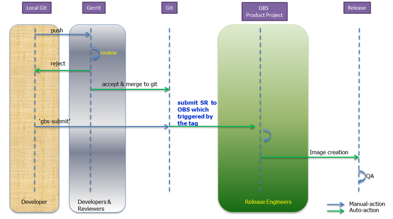
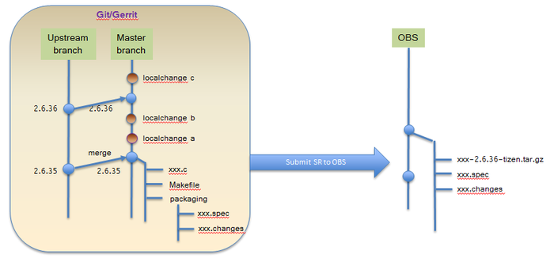

# Tizen Development Workflow

The Tizen development system has 2 main components:

- **Source Code Management (SCM)** system consists of 2 parts:
  - **Git** is a particularly powerful, flexible, and low-overhead version control system that makes collaborative development efficient and robust. For more information, see:
    - [Git Community Book](http://git-scm.com/book)
    - [Git Wiki](https://git.wiki.kernel.org/index.php/Main_Page)
    - [Git Manual Page](https://www.kernel.org/pub/software/scm/git/docs/)
  - **Gerrit** is a Web-based code review system, facilitating online code reviews for projects using the Git version control system. By showing changes in a side-by-side display and supporting inline comments, Gerrit optimizes the code review process, enhancing review quality. Furthermore, by permitting any authorized user to submit changes to the central Git repository, Gerrit simplifies the maintenance of Git-based projects, enabling a more centralized use of Git.
- **Open Build Service (OBS)** is an open and complete distribution development platform that provides the infrastructure for developers to easily create and release open source software for various Linux distributions on different hardware architectures. In addition, OBS delivers a collaborative environment that enables developer groups to build and submit changes to other projects.

  For more information, see:
  - [Open Build Service](http://openbuildservice.org/)
  - [Build Service (openSUSE)](http://en.opensuse.org/openSUSE:Build_Service)

## Git Branches

A given project in the Git repository has 2 possible branches: a master branch and an upstream branch.

- **Master branch**

  Git introduces the master branch (also known as development branch) during the initialization of a repository, thus the default branch in a repository is the master branch and most developers keep the repository's most robust and dependable line of development on the master branch.

  In other words, the master branch hosts each project's full source tree (for example, in C/C++, `.h`, and `makefile` files), including the upstream source and any Tizen local changes. Though the master branch can be renamed or even deleted, it is best practice to regard it as mandatory and leave as is.

  > **Note**  
  > You are responsible for maintaining the packaging change log within the `/packaging` folder of each Git tree.

- **Upstream branch**

  When talking about 2 repositories that have been cloned one from the other, the parent repository is commonly referred to as being "upstream".

  This conventional concept applies to the "upstream branch", as well. More specifically, a parent branch is referred to as the "upstream branch" on which developers base their Git projects. The upstream branch becomes optional in the following scenarios:

  - The project only contains native code from Tizen and has no upstream project to base on.
  - The project does not need to track the latest update of the upstream project.

> **Note**  
> The master branch is mandatory, whereas the upstream branch is optional.

## Roles and Responsibilities

The development workflow includes various roles and related responsibilities:

- **Developers** are responsible for:

  - Writing and submitting code to the development branch of a Git project.
  - Verifying and reviewing (vote "+1" or "-1") code changes for any project on any branch.

- **Maintainers** are responsible for:

  - Creating additional branches, such as upstream and development branches to profile projects.
  - Rebasing the master branch to the upstream branch.
  - Reviewing code, as well as approving (vote "+2") or reject (vote "-2") patches.

  Maintainers also must adhere to the following guidelines:

  - Despite the granted power, maintainers must not accept their own changes without them passing a peer review ("+1") or ("+2").
  - The force push right is granted for maintainers to be able to handle code rebasing. Maintainers must not abuse the right to hide patch submissions that are supposed to be reviewed.

- **Reviewers** are responsible for:

  - Reviewing code, as well as approving (vote "+2") or rejecting (vote "-2") patches.

- **Release engineers** are responsible for:

  - Approving submissions to OBS.
  - Performing smoke tests on the resulting images and transferring them to the release area for QA engineers to perform further tests.

- **QA engineers** are responsible for:

  - Performing thorough integration and verification of the image to eliminate regressions and bugs.

## Package Development Workflow

The package development workflow is described in the following procedure and shown in the following figure.

**Figure: Package development workflow**

1. Developers set up the development environment and install the development tools.
1. Developers clone the source code, do required development, and perform local verification through a local build.
1. Developers submit patches to Gerrit for all stakeholders to review.
1. Tizen backend service and reviewers verify the patches through automated and manual testing, respectively, and then vote "-1", "0", or "+1" based on the quality of the patches.
   - Automated testing: Tizen backend service automatically submits patches to OBS to perform a remote build and then posts the test results back to Gerrit.
   - Manual testing: Testers verify the patches manually and then publish comments on Gerrit.
1. Maintainers approve the patches ("Code-Review +2") after they pass verifications ("Verified +1") and then merge code changes to the Gerrit repository.
1. Maintainers and developers submit packages to OBS by using the `gbs submit` command.
   > **Note**  
   > It is best practice to always have a maintainer role for every Tizen project, and maintainers must submit packages to OBS as soon as all merged packages are ready for submission, in order to prevent possible omissions.
1. Tizen backend service activates pre-release and normal release processes at the same time. During the pre-release process, Tizen images that incorporate specific packages are created and submitted to release engineers for review.
1. Release engineers accept or reject submissions based on the quality of the packages. For accepted submissions, the corresponding source code is merged into the OBS repository. Meanwhile, the normal release process takes over and publishes repositories together with Tizen images.

### Package Generation

After submitting code from a source repository to OBS, the backend generates the package file in the required format, by the following steps:

1. Create a tarball.  
   Create the tarball using the `git-archive` command. The `/packaging` directory must be included in the tarball as well. The tarball version is abstracted from the spec file by **rpmbuild**.
1. Take the contents of the packaging directory and put them alongside the tarball.

The package files in the required form are shown in the following figure.

**Figure: Package files**

