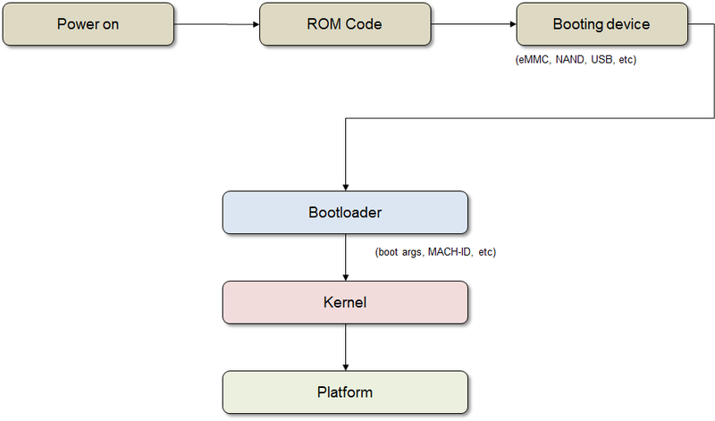
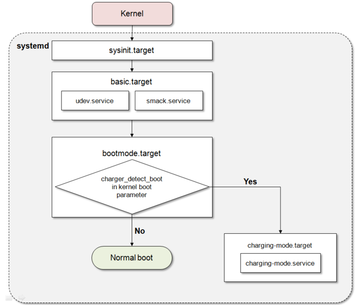
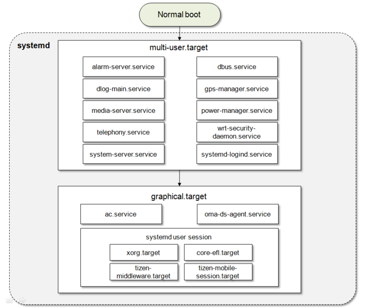
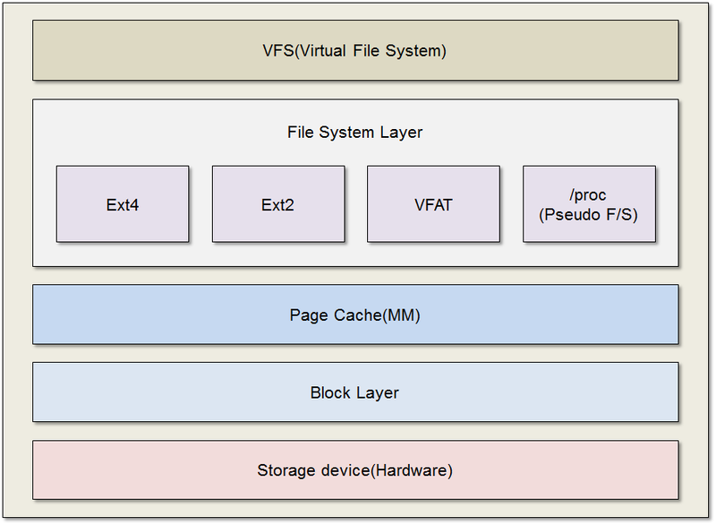
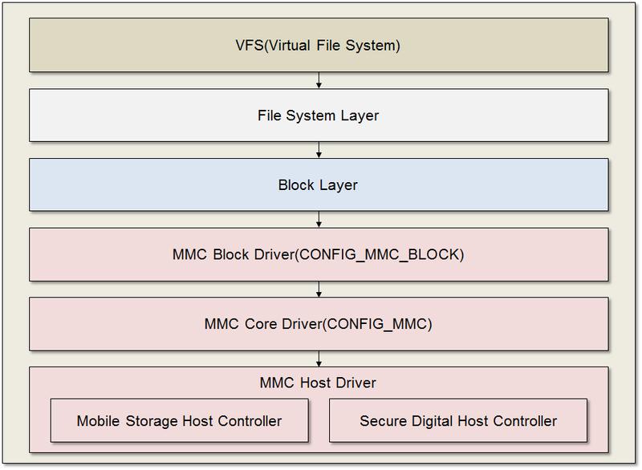

# Kernel

## Development Environment Setup

To set up the Tizen OS development environment and to obtain information regarding development, see [Developing](../developing/setting-up.md )


## Kernel Build

To build the Tizen kernel for the TM1 board:

1. Install and setup cross compile tools on your system if the target and host are different (such as x86).
2. Prepare the kernel source code for TM1 from `profile/mobile/platform/kernel/linux-3.10-sc7730`.`git: https://review.tizen.org/git/?p=profile/mobile/platform/kernel/linux-3.10-sc7730.git``branch: accepted/tizen_mobile`
3. If your kernel source has been used to create binaries for other architecture, start by cleaning them up.
4. Setup the `.config` file for TM1.`$ make ARCH=arm tizen_tm1_defconfig`
5. After reconfiguring your needs (such as `make ARCH=arm menuconfig`) or using the stock configuration (no modifications), build it.`$ make ARCH=arm zImage``$ make ARCH=arm dtbs`
6. Create `devicetree` and `zImage` merged image with image tools.`$ scripts/sprd_dtbtool.sh -o arch/arm/boot/merged-dtb -p scripts/dtc/ -v arch/arm/boot/dts/``$ scripts/sprd_mkdzimage.sh -o arch/arm/boot/dzImage -k arch/arm/boot/zImage -d arch/arm/boot/merged-dtb`
7. Build and make kernel module image as well. Note that you may need to do sudo first to let `sudo -n` work in the script.`$ sudo ls``$ scripts/mkmodimg.sh`
8. Make a `.tar` archive from `dzImage` and `modules.img`.You can make your own `.tar` file from the 2 files.`$ tar cf FILENAME_YOU_WANT.tar -C arch/arm/boot dzImage -C ../../../usr/tmp-mod modules.img`
9. Send the `.tar` image to the target using `lthor`.`$ lthor FILENAME_YOU_WANT.tar`

## Image Build

To create the image by using MIC, see [MIC Image Creator](https://source.tizen.org/documentation/reference/mic-image-creator).


# Tizen Bootup Overview

This section provides a brief overview of the typical booting sequence, starting from the boot loader to the kernel and the platform.



## Kernel Bootup

The Tizen bootup process is the same as any other [Linux](https://wiki.tizen.org/Linux) kernel. Just make sure that the correct machine ID and the boot arguments are passed from the boot loader.

## Platform Bootup

After mounting the initial RAM disk image, `initramfs` hands over the control to `systemd` as system manager daemon in the Tizen platform. From this point, `systemd` is responsible for probing all remaining hardware, mounting all necessary file systems and spawning all configured services. Basically system boot-up process is split up in various discrete steps. To synchronize point during start-up, target units (some file whose name ends in `.target`) are used for grouping units. The boot-up process is highly parallelized in each target so that the order in which specific target units are reached is not deterministic. The `system-plugin-slp` is an OAL plugin for configuration setting such as mount point (`/etc/fstab`).

The following figure shows the early boot sequence after starting the kernel.



- `sysinit.target`Special target unit for early boot-up scriptsIt has dependencies on necessary services and targets, such as `local-fs.target</code.````At this point, most of file systems like <code>/opt`, `/tmp`, and `/media` are mounted and the `systemd` related daemons, such as `systemd-journald` are launched.


- `basic.target`Special target unit for basic boot-up.At this point, all necessary initialization for general purpose daemons such as mount points, sockets, timers, and path units are completed.Tizen specific services (such as `vconf-setup` and `tizen-debug-level`) also are executed.


- `bootmode.target`Special target unit for selecting the boot mode.If kernel boot parameter (`/proc/cmdline`) has the `charger_detect_boot` option passed by the boot loader such as `uboot`, the platform boots up as charging mode. In this mode, the system enters the low power mode and charges the battery.If the `charger_detect_boot` option is not included as the kernel boot parameter, normal boot is started.

The following figure shows the overview of normal booting sequence in Tizen platform.



- `multi-user.target`Special target unit for setting up a multi-user system which is non-graphical support.In Tizen platform, this target is used for launching platform infrastructure daemons such as `dbus` (system session), power manager, GPS manager, telephony daemon, WRT (Web Run Time) security daemon, and media server.Some `systemd` related daemons (such as `systemd-logind`) are also started in this phase.


- `graphical.target`Special target unit for setting up a graphical environment.Some important daemons (such as access control server and OMA DS agent server) that must have root permission are launched at this point.Tizen platform uses the `systemd` user session for App privilege daemons.Some daemons related with graphic system such as Enlightenment (Windows manager) are launched as App privilege in this phase.Tizen platform has its special target for middleware and mobile service: `tizen-middleware.target` starts the platform service daemons, such as calendar, contacts, email, message, sound, and download provider. `tizen-mobile-session.target` starts some service daemons related with the mobile session.

# BSP Customization

This section covers the basic configuration, setup, and build procedure required for building the boot loader and the kernel image for [ARM](https://wiki.tizen.org/ARM).

## Boot Loader Fundamentals

Boot loader is a small piece of software that is required to perform the basic hardware and peripheral initialization and load the kernel and proper device tree binary for the device to RAM. For the Tizen platform, the boot loader comes in 2 parts. The first part is the primary boot loader and the second part is the secondary boot loader. The primary boot loader is the proprietary boot loader. The secondary boot loader is the open source boot loader u-boot, which is customized further for the Tizen platform.

If your platform is already loaded with the compatible boot loader software, you can skip this section and move directly to the kernel section.

## Boot Loader Setup and Build

To build the Tizen TM1 boot loader:

1. Install and setup cross compile tools on your system if the target and your host are different (such as x86).
2. Start with cleaning up the `u-boot-tm1` source. (Download the source from the [u-boot-tm1](https://review.tizen.org/git/?p=profile/mobile/platform/kernel/u-boot-tm1.git;a=summary) repository.)`$ make distclean`
3. Set up the configration for TM1.
4. Build `u-boot`.`$ make ARCH=arm`
5. Once the build is successful, the `u-boot.bin` file is created. (This step is for preventing from flashing the other `u-boot.bin` file.)`$ tools/mkimage_signed.sh u-boot.bin "tizen_tm1"`
6. After the scrip is run, the `u-boot-mmc.bin` file is created.
7. Create a boot loader tarball to download the `u-boot` binary onto the target.`$ tar cvf bootloader.tar u-boot-mmc.bin`

Be careful when you modify the boot loader, as there is a risk of breaking the device for good.

## Boot Loader Kernel Parameters

The command line parameters can be passed from boot loader to [Linux](https://wiki.tizen.org/Linux) kernel. Here are some example command line parameters:

```
   Example:
   console=ttyS1,115200n8
   mem=1024M
   loglevel=1

```

# Kernel Fundamentals

The kernel is the operating system that drives the platform. In this case, the kernel refers to the open source [Linux](https://wiki.tizen.org/Linux) kernel that is customized for the Tizen platform. The following section gives a brief overview about the Tizen kernel setup, configuration, and the build procedure for building a Linux kernel for your Tizen platform. The output of the kernel binary is a uImage that is suitable only for a `u-boot` boot loader. If you have chosen a secure booting configuration in your boot loader, this uImage must be compatible with your boot loader.

## Kernel Configurations

To download the Tizen kernel source package, see [Getting Source Code and Build](https://wiki.tizen.org/Porting_Guide#Getting_Source_Code.26Build). Set up or modify your kernel configuration, use the appropriate `defconfig` file from `arch/arm/configs/` ( [ARM](https://wiki.tizen.org/ARM) CPU ).

For more detailed information about Tizen kernel configuration and kernel building, see [Kernel Build](https://wiki.tizen.org/Porting_Guide#Kernel_Build).

| Note                                     |
| ---------------------------------------- |
| Tizen uses `INOTIFY` instead of `DNOTIFY`. You must disable `DNOTIFY` from your kernel configuration. |

If you want to use `initramfs`, you can use these configurations:

- `CONFIG_INITRAMFS_SOURCE`
- `CONFIG_INITRAMFS_ROOT_UID`
- `CONFIG_INITRAMFS_ROOT_GID`
- `CONFIG_INITRAMFS_COMPRESSION_NONE/GZIP/BZIP2/LZNA/LZO`

## Tizen File System

### Virtual Filesystem (VFS )

The virtual file system (VFS) is an abstraction layer on top of a more concrete file system (such as ext2, jfs, and ext4). The VFS provides a switching layer between the SCI (system call interface) and the file systems supported by the kernel, as shown in the following figure.



At the top of the VFS is a common API abstraction of functions, such as open, close, read, and write. At the bottom of the VFS are the file system abstractions that define how the upper-layer functions are implemented with respect to specific file system.

Below the file system layer is the page cache, which provides a common set of functions to the file system layer (independent of any particular file system). This caching layer optimizes access to the physical devices by keeping data around for a short time (or speculatively read ahead, so that the data is available when needed). Below the page cache are the device drivers, which implement the interface for the particular physical device.

### Tizen Partition Layout

The following description is an example of the Tizen partition layout. The product vendor can modify the sequence or partition layout for their devices, as needed.

![Partitionlayout.png]](media/800px-Partitionlayout.png)

The `boot` partition is mounted in the `/boot` directory of `rootfs`. Here `s-boot`, `u-boot`, and the kernel image are saved as a file format, provided as `system.tar`.

1. The CSA (Configuration Saved Area) partition is for non-volatile data, such as the calibration value of modem.
2. The boot partition includes the kernel image, boot loader image, and modem image. Additionally, it can have device driver modules.
3. Third partition is reserved for the future.
4. The `platform` partition is mounted on the root directory. It contains fundamental frameworks for Tizen and some general utility for Linux. It canbe provided as a `platform.img` file.
5. The `data` partition is mounted in the `/opt` directory and it includes applications, libraries of applications, and the platform database. It can be provided as a `data.img` file.
6. The CSC (Customer Software Configuration) partition is mounted in the `/mnt/csc` directory. It can store the customer’s software configuration, such as the default language and time zone.
7. The UMS (USB Mass Storage) partition is mounted in the `/opt/media` directory and it includes default (media) contents. It can be provided as `ums.img`.
8. Each image file, `platform.img`, `data.img`, and `ums.img` can be zipped for downloading, for example, `<IMAGE_NAME>.tar.gz`.

### File System Hierarchy Standard in Tizen

Each partition has the hierarchy illustrated in the following figure.

![Filesystemhierarchy.png]](media/800px-Filesystemhierarchy.png)

### Supported File Systems in Tizen

Tizen supports the Extended 4 (ext4) file system. The Tizen kernel has to be compiled to enable support for the other file systems like JFS, XFS, BTRFS, and Reiserfs.

### Default File System in Tizen

The Extended 4 (ext4) file system is configured as a default file system for Tizen.

### Configuration

The ext4 kernel configuration is done like this standard kernel configuration.

### Reference

These are the configuration options to be enabled in the kernel configuration file.

- `CONFIG_EXT4_FS=y`
- `CONFIG_EXT4_FS_XATTR=y`
- `CONFIG_EXT4_USE_FOR_EXT23=y`
- `CONFIG_EXT4_FS_SECURITY=y`

## MMC/SD/SDIO

Tizen supports MultiMediaCard, Secure Digital, and Secure Digital I/O Support. The MMC driver is implemented on top of host controller (such as SDHCI controller driver) and supports MMC, SD, SD High Speed, and SDHC cards.

If MMC is your booting device, read-write APIs, partition management, and flashing must be provided at the boot loader.



### MSHCI/SDHCI Features Overview

The MMC/SD/SDIO driver supports the following features:

- The driver is built in-kernel
- MMC cards, including high speed cards
- SD cards, including SD high speed and SDHC cards

MMC subsystem code structure in the kernel is located at `/driver/mmc`.

MMC subsystem structure is divided into 3 parts:

- MMC block device driver located at `/driver/mmc/card/`
- Protocol stack for MMC, SD, SDIO located at `/driver/mmc/core/`
- Host controller driver located at `/driver/mmc/host/`

### Hotplug MMC Event Handling in Tizen

Based on the hotplug event handling, the notification is passed to the `deviced` for device status changes. It detects, mounts, and monitors the status of the SD card.

### Reference

The SDHCI controller is supported in the MMC/SD/SDIO interface. The Mobile Storage Host controller is only supported in the MMC interface.

- **Kernel Configuration for MMC Interface**`CONFIG_MMC_BLOCK``CONFIG_MMC``CONFIG_MSHCI` (for Mobile Storage Interface enable)`sys interface: /dev/mmcblk0pX`


- **Kernel Configuration for SD/SDIO Interface**`CONFIG_MMC_BLOCK``CONFIG_MMC``CONFIG_MMC_SDHCI` (for SDHCI host Interface enable)`CONFIG_MMC_SDHCI_S3C` (for Samsung SoC)`sys interface: /dev/mmcblk1pX`

The `X` denotes the MMC partition number. Details of the partition mount point for Tizen are covered under [Tizen Partition Layout](https://wiki.tizen.org/Porting_Guide#Tizen_Partition_Layout).
