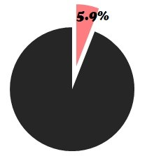
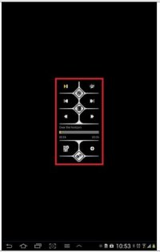
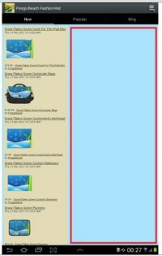

# Display Error

  

Not in compliance with the following Validation guidelines.

- UI/UX
  \- Menu, graphics and text must be clearly visible and work correctly.
  \- Application should cover the entire screen of device.
  \- Application should not contain overlapped or truncated text, graphic distortion, or any kinds of display errors.
  \- Application should be displayed and work correctly regardless of screen orientation.

## Defect Examples

    

1. Application screen does not fit with device screen.
   \- Defect: Application screen is smaller than device screen.
   \- Defect: Application screen is bigger than device screen.
2. Application shows display distortion or overlapping.
   \- Defect: Application is terminated by force right after executing application.
   \- Defect: Application is not opened and shows no response when user clicks icon.
   \- Solution: Application should be executed successfully.
3. Application fails to be terminated.

## Self-check List

- [Ⅱ-1] The size of apk file*4MB (multiplied by 4MB) must not exceed the internal memory of device.
- [Ⅱ-2] Application must be installed for the targeted devices without any problems.
- [Ⅱ-3] Application must be uninstalled as user expects.
- [Ⅱ-4] Application should be executed without any problems.
- [Ⅱ-5] Application must be closed without any problems by following options.
  \- 5-1) Using the exit option in application
  \- 5-2) Using the Task Manager
- [Ⅵ-1] It should be possible to reinstall the deleted application on the device.

> **TIP to solve this issue:**
>
> Developer can use the Samsung RTL (Remote Test Lab) to test and tune the application

 