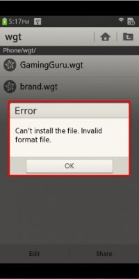

# Fail to Install, Execute or Terminate Application

 

Not in compliance with the following Validation guidelines.

- Application should be installed on its target device without any errors.
- 3.1.3 Application should be launched within 10 seconds after clicking the icon unless there is a visual indication of progress.
- 3.1.8 It should be possible to remove application without any errors.

## Defect Examples

 

1. Application fails to be installed.
   \- Defect: Application file can’t be installed because of its invalid format file type.
   \- Defect: User cannot download essential data even if the network is available.
   \- Solution: Application should be installed successfully.
2. Application fails to be executed.
   \- Defect: Application is terminated by force right after executing application.
   \- Defect: Application is not opened and shows no response when user clicks icon.
   \- Solution: Application should be executed successfully.
3. Application fails to be terminated.

## Self-check List

- [Ⅱ-1] The size of file*4MB (multiplied by 4MB) must not exceed the internal memory of device.
- [Ⅱ-2] Application must be installed for the targeted devices without any problems.
- [Ⅱ-3] Application must be uninstalled as user expects.
- [Ⅱ-4] Application should be executed without any problems.
- [Ⅱ-5] Application must be closed without any problems by following options.
  \- 5-1) Using the exit option in application
  \- 5-2) Using the Task Manager
- [Ⅵ-1] It should be possible to reinstall the deleted application on the device.

> **TIP to Solve This Issue:**
>
> - Developer can use the Samsung RTL (Remote Test Lab) to test and tune the application before submission.
> - Check if your target device is whether ARM based or Intel 80386 based because your native application is failed to execute if the file type of .exe file is not suitable for your target device.
> - If your application is a multi-thread application, please make sure that UI handling is done only in the main thread since the Tizen UI framework is not thread safe. If not, your application may cause execution or termination failure unexpectedly depending upon the race condition among the threads. Please refer to [this link](https://developer.tizen.org/dev-guide/2.2.0/org.tizen.native.appprogramming/html/guide/ui/multithread_ui_framework.htm) for more details on multithreading with the UI framework.

 