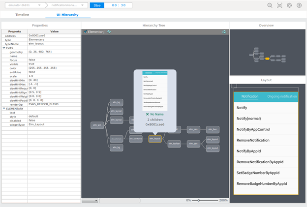
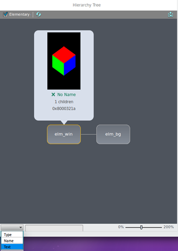
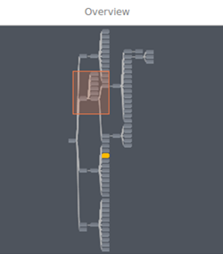
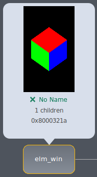
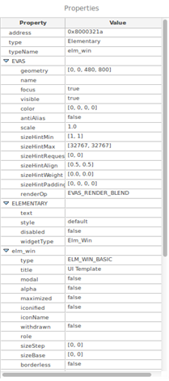
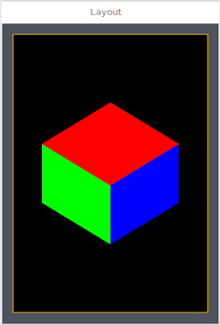

# Performing UI Hierarchy Analysis
## Dependencies

- Tizen Studio 1.0 and Higher

The **UI Hierarchy** tab of the Dynamic Analyzer shows the information about the EFL UI objects (Evas, Elementary, and Edje). You can see the hierarchy relationship of all UI objects and detailed information about each UI object.

The tab consists of the following views:

- [Hierarchy Tree](#hierarchy) view shows the relationship of UI objects in a tree format.
- [Overview](#overview) shows the outline of the hierarchy tree.
- [UI Object](#UI_object) view shows basic information about the UI object selected from the hierarchy tree.
- [Properties](#properties) table shows the properties of the UI object selected from the hierarchy tree.
- [Layout](#layout) view shows a block representation of your application.

**Figure: UI hierarchy analysis**

## Hierarchy Tree

The Hierarchy Tree view provides the following features:

- You can view the relationships between the UI objects of your application.

  When the application UI changes, the Hierarchy Tree view is not automatically updated. To update the view:

  1. To see only Elementary UI objects without Evas and Edje, select the **Elementary** check box in the upper-left corner.
  2. Click the refresh button ().

  In the view, each node represents a corresponding UI object and shows its type (such as `elm_win`).

- You can zoom the hierarchy tree in and out.

  To zoom in or out of the tree, use the slider in the lower-right corner, or use a keyboard shortcut (**Ctrl + Mouse wheel scroll**).

- You can easily find the UI objects you want to see by using filtering options.

  To find UI objects in the tree:

  1. Select a filtering option in the combo box in the lower-left corner:
     - **Type**: Type of the UI object (such as `elm_win` or `elm_button`)
     - **Name**: Name set by the EFL `evas_object_name_set()` function
     - **Text**: Text in the UI object (such as a Label or Text object)
  2. Enter the search text in the search box. The nodes that contain the search text are highlighted in blue.

- You can export the hierarchy tree to an image file.

  To save a screenshot of the tree view to an image file (PNG), click the export button () in the upper-right corner. In the dialog box, click **Save As** and define a location for the file.

  **Figure: Hierarchy tree**

  

## Overview

The Overview area represents the entire tree in the map style. The Hierarchy Tree view displays an enlarged tree, which indicates a particular part of the whole tree in the Overview area.

Through the Overview area, you can move around the hierarchy tree. Select and move the shaded rectangle, and the tree in the rectangle is displayed as an enlarged tree in the Hierarchy Tree view.

**Figure: Overview**

## UI Object

When you select a node in the Hierarchy Tree view, basic information about the selected UI object appears in a small balloon (UI Object view) above the node.

**Figure: UI Object view**

In the view, you can see:

- The actual image of the UI object as displayed in your application. When the image is not available, one of the following messages appears instead:

  - **App In Background**: If the application is running in the background, you cannot see the image. To see the image, bring the application to the foreground and select the node again.
  - **Not In Tracing**: If you stop tracing the application, you cannot see the image. To see the image, start tracing.
  - **No Image**: If the UI object has no image, this message appears (if the width or height of the UI object is 0).
  - **No Object**: When the UI object does not exist anymore in the application, this message appears. This can happen because the Hierarchy Tree view is not automatically updated.

  > **Note**  
  > If there are other UI objects intersecting the position of the selected UI object, those are also displayed.

- The name set by the EFL `evas_object_name_set()` function. If the name is not set, the **No Name** message appears instead of the name.

- The number of child UI objects. If the UI object has no children, the **0 children** message appears.

- The memory address of the UI object.

## Properties

The Properties table shows a list of the properties for the selected UI object from the Hierarchy Tree view. To find an individual property, expand a category name by clicking the arrow on its left.

The properties are categorized by the type of the EFL UI object (Evas, Elementary, or Edje). The Properties table always shows the Evas category, because all of the EFL UI objects are subtypes of Evas.

If the UI object is of the Elementary or Edje type, the view shows those categories too. Each type's own properties are also categorized (such as `elm_label`).

**Figure: Properties table**

## Layout

The Layout view shows a block representation of the application. When you select a node in the Hierarchy Tree view, the corresponding image is displayed and highlighted.

**Figure: Layout view**

