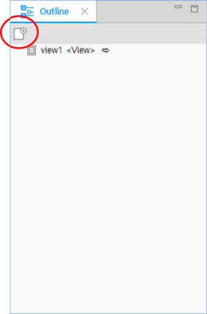
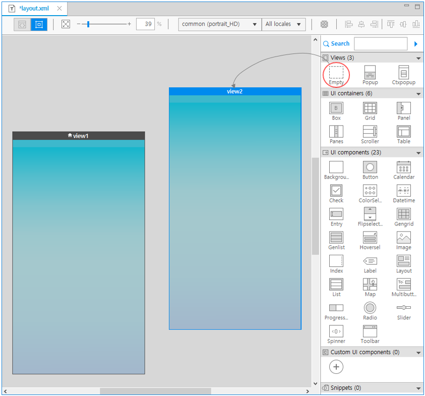
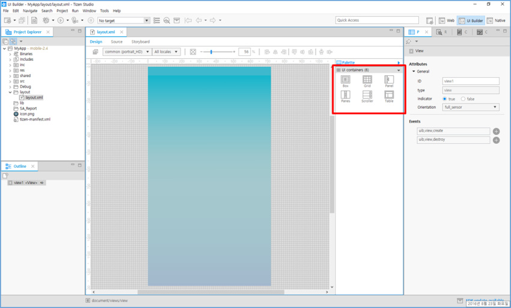
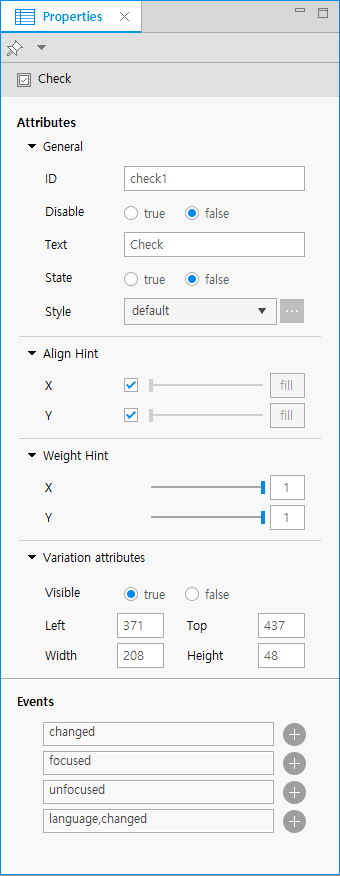
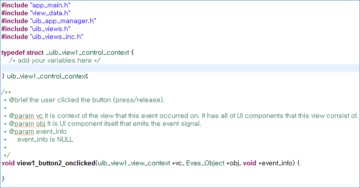

# Building UIs with Components
## Dependencies

- Tizen Studio 1.0 and Higher


The Tizen native UI Builder is a graphical user interface builder tool that simplifies the creation of Tizen native application UIs by allowing you to arrange UI components using drag-and-drop operations. You can also create [customized UI components](ui-builder-customcomponent.md) for application-specific purposes.

The native UI Builder is not only a UI layout code generating tool. It also supports an easy-to-use programming model, allows you to [support multiple screens](multiple-screen_n.md) within a single application, and makes it possible to [manage various data sources through databinding](ui-builder-databind-n.md). If you have an existing EFL UI project, you can [convert it to a UI Builder project](ui-builder-conversion-n.md) to ease the task of expanding the application and optimizing it to new devices.

## Designing a User Interface

The native UI Builder offers 2 ways to develop a native application UI with the UI editor toggle button in the top toolbar area:

-   You can use WYSIWYG editing in the **Design** editor.
-   You can use XML element editing in the **Source** editor.

The **Design** and **Source** editors are visible in the **Layout Editor** view. You can switch between the editors as needed.

### Editing the UI Layout in the WYSIWYG Mode

To create a UI layout:

1. Create a view.

    A Tizen native application is composed of multiple views through which the user navigates. The view is an editing unit in the native UI Builder.

   To add a new view in the **Outline** view, click the **Empty View** icon in the toolbar (marked by a red circle in the following figure), or right-click the **Outline** view area and select **Add** and the applicable view.

    

-    With the **Palette**:

   ​     You can add a view from the **Palette**. The **Ctxpopup** view and **Popup** view are available for mobile applications only.

   ​     To add a new view from the **Palette**, drag and drop the view from the **Palette** to the canvas.

   

   ​

2. Add a UI container to the view.

   Each view must have a root container as the topmost UI component on the canvas. To place the root container, use the components in the **UI containers** category of the **Palette** view. You can drag and drop the component from the **Palette** to the canvas.

   The following figure shows the **Outline** view after adding a grid root container from the **Palette** to the empty view.

   ​

   

   

3. Add a UI component.

   After placing the root container, you can place all other UI components you need.

4. Set the component styles.

   After placing the UI components, set their properties and bind event handlers for specific events in the **Properties** view.

   

#### Using EDJ for UI Design

In addition to the UI Builder, you can create a UI layout using the EDC script. If the built-in UI components are not enough, design the UI layout using the [EDC Editor](edc-editor-n.md). To include the EDC script (an EDJ file) in your application, add a layout UI component to the view, and set the EDJ file path and group name properly in the **Properties** view.

You can also create a new EDC script or edit an included EDC script directly from the WYSIWYG editor: Double-click the  icon in the layout component, and the selected EDJ opens for editing in the EDC Editor.

**Figure: EDC script**


#### Customizing the UI Component Style

You can edit and extend the existing styles of a UI component by using the [Component Designer](component-designer-n.md) from the UI Builder.

**Note:**This feature is available since the Tizen 3.0 platform.

To open the dialog for managing styles, click the  icon next to the style combo in the **Properties** view.

**Figure: Style management dialog**


The dialog displays a list of the UI component styles with the following markings:

- **(\*)**: Changed embedded style
- **[ ]**: New style
- No mark: Embedded style

Use the buttons in the dialog to manage the styles:

- **Delete**: Remove a user-created style which is enclosed in **[ ]**. Embedded styles cannot be removed.
- **Modify**: Change the details of the selected style with the Component Designer.
- **Extend**: Create a new style based on the selected style with the Component Designer.
- **Reset**: Restore the original embedded style. You can use this button only with styles marked with **(\*)**.

### Editing the UI Layout in the XML Mode

You can create the UI layout in the native UI Builder by using the XML editor in the **Source** editor to edit the layout file. For more information on the `layout.xml` file format and supported elements, see [Managing UI Component Attributes in layout.xml](component_attributes_n.htm).

While editing in the **Source** editor, you can preview the resulting layout in the preview pane.

**Figure: Source editor**


The native UI Builder provides content assist functionality, which helps you to write code faster and more efficiently. To use this functionality, type a few characters of the word and press **Ctrl + Space**.

If you select an element in the suggested list with content assist, the auto-complete feature automatically adds the end element.

If you move a focus to another UI component in the **Source** editor, the selection in the preview pane is automatically synchronized. Similarly, if you change the selection in the preview pane, the focus in the **Source** tab moves accordingly.

## Binding an Event Handler

An event handler is part of the application logic. It is called by the Tizen framework when any user interaction, such as a mouse click or touch, occurs. The event types vary between UI components, and the event information data depends on the UI component and event type.

You can add event handlers for UI component events in the **Properties** view. To [add view transition events between views](storyboard_n.htm), use the **Storyboard** in the **Layout Editor** view.

> **Note**  
> Since Tizen Studio 2.0, the top **Storyboard** tab has been removed and the storyboard feature has been included in the layout editor. The storyboard feature in the **Layout Editor** view gives you a natural understanding of the overall flow of views when you create a screen, and you can write application prototyping for planning and designing your application.


### Adding an Event Handler to a Specific UI Component

If you select a UI component in the **Design** editor, all available event types for the selected UI component are displayed in the **Event** section of the **Properties** view:

- To add an event handler for an event type, click  next to the event type. The area below the event is expanded, and a suggested event handler name is shown in gray color.
- To go to the event handler source, click .
- To remove the event handler, click .

**Figure: Adding an event handler**


### Coding the Event Handler Actions

When you click  in the **Properties** view, the C code editor opens the generated event handler code. The following figure shows an example of the automatically generated event handler stub.

**Figure: Event handler stub code**



The signature contains the following parameters:

```
void view1_button1_onclicked(uib_view1_view_context *vc, Evas_Object *obj, void *event_info)
```

- `vc`: View context related to the event. You can access the UI component in the view through this structure. The following code example shows a sample of the view context.`struct _uib_view1_view_context {    /* Parent evas_object which was a parameter of the create function */    Evas_Object *parent;    /* Root container UI component of this view */    Evas_Object* root_container;    /* View class name */    const char *view_name;    /* Control context to control this view */    struct _uib_view1_control_context *cc;    /* UI components in this view */    Evas_Object *grid1;    Evas_Object *button1;    Evas_Object *check1;};typedef struct _uib_view1_view_context;`
- `obj`: UI component where the event occurs.
- `event_info`: User data passed from the Tizen framework. The event type determines the available data.

The following example shows how to change the button text in the event handler code:

**Figure: Event handler code**

