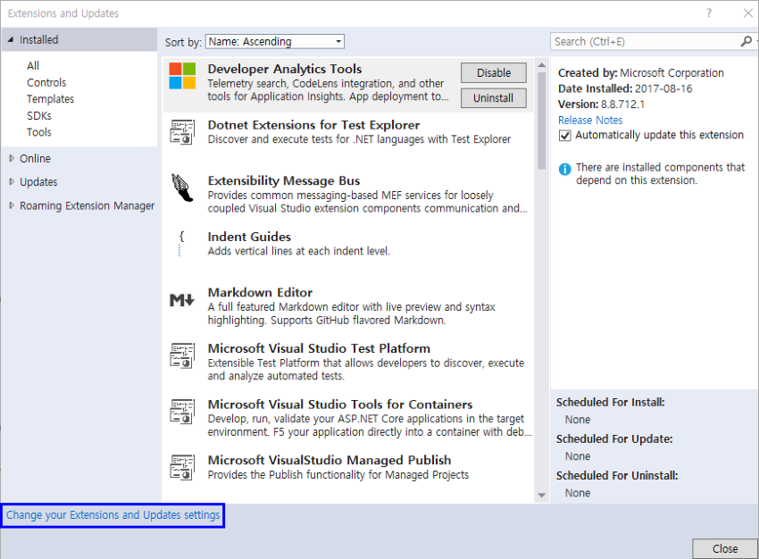
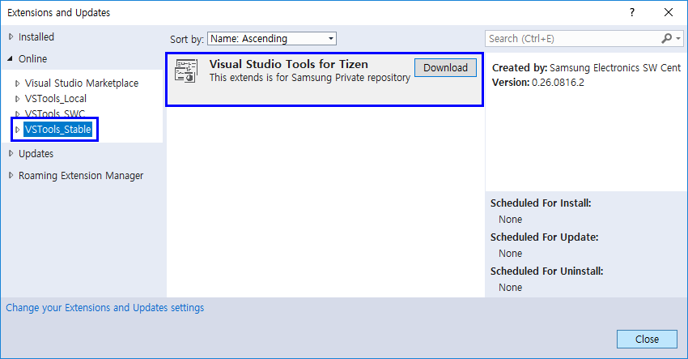
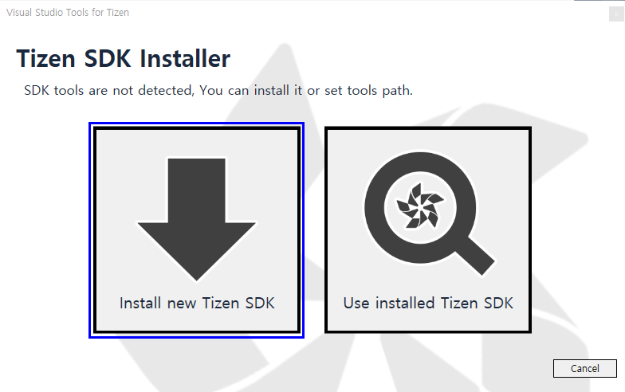
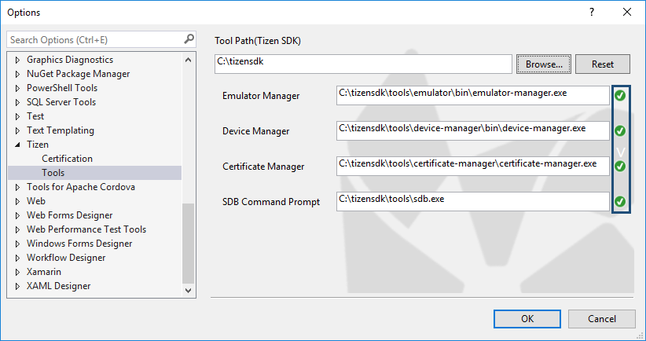

# Installing Visual Studio Tools for Tizen

You need the following components on top of Visual Studio to make Visual Studio Tools for Tizen work:

- VSIX: Visual Studio extension for Tizen packaging
- Tizen Baseline SDK  
The SDK is shared with the Tizen Studio, and it supports tools (such as Certificate Manager, Device Manager, Emulator, SDB, and on-demand rpm) for developing Tizen .NET applications.

## Prerequisites
To work with Visual Studio Tools for Tizen, your computer must have:

- At least 1.5 GB of available disk space
- Visual Studio 2017  
Visual Studio Tools for Tizen works with all Visual Studio variations, including Community. Installing or re-installing Visual Studio with .NET desktop development and .NET Core cross-platform development toolsets is recommended.
- .NET Core 2.0 SDK or higher  
SDK is needed to set the .NET development environment. For more information, see https://www.microsoft.com/net/download/core.
- Java Development Kit (JDK) 8 or higher  
JDK is needed to use the Tizen Baseline SDK. OpenJDK is not supported.

  Download the JDK from the official [Oracle Web site](http://www.oracle.com/technetwork/java/javase/downloads/index.html). Select the appropriate platform for your hardware architecture and Windows&reg; version. Run the downloaded executable file and follow the displayed instructions.

### Emulator Requirements

Tizen emulator for Visual Studio has the same requirements as the emulator in the Tizen Studio. To check the detailed hardware and software requirements for the Tizen emulator, see [Emulator Requirements](https://developer.tizen.org/development/tizen-studio/download/installing-tizen-studio/prerequisites#emulator).

- Intel&reg; Hardware Acceleration Execution Manager (Intel&reg; HAXM) is required to speed up the Tizen emulation on Intel-VT-enabled systems. Intel&reg; HAXM installation is started automatically as part of the Visual Studio Tools for Tizen installation. For more information, see [Hardware Accelerated Execution Manager](https://developer.tizen.org/development/tizen-studio/download/installing-tizen-studio/hardware-accelerated-execution-manager).
- Make sure Hyper-V is disabled (in Windows&reg; 8 or later):

   1. In the Start menu, select **Programs and Features**.

      

   2. Select **Turn Windows features on or off**.

   3. Disable **Hyper-V** and click **OK**.

      

   4. Reboot the computer.

## Visual Studio Tools for Tizen Installation

To install Visual Studio Tools for Tizen:

1. Set a private gallery for VSIX:

   1. Select **Tools &gt; Options &gt; Extensions and Updates &gt; Change your Extensions and Update settings** or **Tools &gt; Options &gt; Environment &gt; Extensions and Updates**.

      

   2. Under **Additional Extension Galleries**, click **Add** and enter the URL depending on the version:
      - For the stable version, use http://10.113.138.168/packages/vsext/vsix/content.xml.
      - For the developer version, use http://10.113.138.168/packages/vsext/vsix/content_swc.xml.

      

      > **Note**
      >
      > Make sure your firewall is open for the IP address 10.113.138.168 on ports 80 and 443.

   3. Click **OK**.

2. Install VSIX:

   1. Select **Tools &gt; Extensions and Updates**, and in the **Online** tab, select the private gallery you just added.

   2. Click **Download** for **Visual Studio Tools for Tizen**.

      

   3. Click **Modify** to agree to the license terms.

      

	  Visual Studio Tools for Tizen is installed after you close Visual Studio.

3. Set up the baseline SDK

   To use the Tizen SDK tools, you must install the baseline SDK. If the Tizen Studio is already installed in your computer, you can just set the tool path to the existing SDK instead of reinstalling it.

   - For use with Visual Studio, your Tizen Studio must be installed from the `tizen_studio` or `tizen_studio_2.0` distributions.

     You can check the installed package repository and distribution in **Package Manager &gt; Configuration**.

     

   - If the Tizen Studio is already installed:
     1. Launch a Tizen tool that is not yet installed (such as Emulator Manager or Package Manager). In the window that pops up, select **Use installed Tizen SDK**.

        
     2. Enter the root directory of your existing Tizen Studio installation.

        
     3. If the installer gives a warning about your Tizen Studio version being too low, update the Tizen Studio by using the Package Manager after setting the tool path.

   - If Tizen Studio is not installed:
     1. Launch a Tizen tool that is not yet installed (such as Emulator Manager or Package Manager). In the window that pops up, select **Install new Tizen SDK**.

        
     2. Follow the instructions given by the Install Wizard (Review the EULA and set the installation path).
     3. In the last step of the Install Wizard, click **Install**.

        The installer is downloaded and the baseline SDK is installed automatically.

        
     4. You can install additional packages (such as the TV Emulator image and SDK tools) through the Package Manager.

        

## Troubleshooting

If you encounter problems with the installation:

- To check whether VSIX is installed correctly:
  - Check the Visual Studio Tools for Tizen properties by selecting **Tools &gt; Extensions and Updates** and searching for "Tizen".

    

- To make sure the baseline Tizen SDK is installed correctly:
  - Check the tool path by selecting **Tools &gt; Options &gt; Tizen &gt; Tools**.

    

- To check whether Tizen Project properties have been copied correctly:
  - Make sure that the `Tizen.NET.ProjectType.props` and `Tizen.NET.ProjectType.targets` files are located in the `C:\Program Files (x86)\Microsoft Visual Studio\2017\Professional\MSBuild\Tizen\VisualStudio` folder.

     

- To check the Nuget server for build tasks:
  - Check the package server in **Tools &gt; Option &gt; NuGet Package Manager &gt; Package Sources &gt; https://tizen.myget.org/F/dotnet/api/v3/index.json**.

- If you cannot remove the Tizen extension:
  1. Shut down all instances of Visual Studio.
  1. Go to the Visual Studio directory and order by time in Explorer.
  1. After checking the folder, remove the Tizen extension by opening a command prompt as administrator and executing the `devenv /setup` command.
